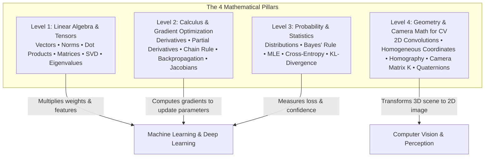

  

    
MATH_SYS // FOUNDATION_INDEX

    
TRACK_00 // 4 LEVELS // 28 TOPICS

  

  

    
📐

    

      
00. MATHEMATICAL FOUNDATIONS FOR AI & VISION

      
LINEAR ALGEBRA • CALCULUS & OPTIMIZATION • PROBABILITY & STATS • 3D CAMERA GEOMETRY

    

    

      

      

      

      

      

      

    

  

  

    SYS_ID: #00_MATH_CORE // LANGUAGE: INTUITIVE // PROOF_STYLE: VISUAL_NUMERICAL
    [ FOUNDATION LOADED ]
  

# Track 0: Mathematics for AI, Deep Learning & Computer Vision

  
💡

  

    <strong>No unnecessary theory. No academic fluff.</strong> This track is designed specifically for software engineers, ML practitioners, and computer vision developers. Every concept is explained with simple real-world analogies, concrete step-by-step numbers, graphical intuition, and immediate Python code.
  

  Track 0
  Prerequisite Core
  Essential Math

---

## Why Math Matters in Practice

In modern AI engineering:
* **Linear Algebra** is how data, images, and weights are stored and multiplied inside GPU tensor cores.
* **Calculus & Optimization** is how neural networks calculate mistakes and learn through backpropagation.
* **Probability & Statistics** is how models handle uncertainty, noise, classification confidence, and generative sampling.
* **Projective Geometry** is how 3D real-world objects map onto 2D camera pixels in robotics, self-driving cars, and OpenCV.

---

## Curriculum Overview

### [Level 1: Linear Algebra & Tensors](level-01-linear-algebra.md)
* **Scalars, Vectors, Matrices, and Tensors**: Definitions, dimensions, and visual memory layouts.
* **Vector Norms ($L_1$, $L_2$, $L_\infty$)**: Geometric distances, Manhattan vs. Euclidean, and regularization penalties.
* **The Dot Product & Cosine Similarity**: What dot products actually calculate (directional alignment).
* **Matrix Multiplication**: Mechanical row-by-column method, shape rules, and forward propagation in layers.
* **Transpose, Inversion & Identity**: Properties, and why singular matrices cannot be inverted.
* **Eigenvalues & Eigenvectors**: Intuitive geometric meaning ("stretching without rotating") and PCA.
* **Singular Value Decomposition (SVD)**: Decomposing matrices, image compression, and low-rank LoRA adapters.

---

### [Level 2: Calculus & Gradient Optimization](level-02-calculus-optimization.md)
* **Derivatives Intuition**: Instantaneous rate of change and slopes of curves.
* **Partial Derivatives**: Multi-feature functions and directional gradients.
* **The Gradient Vector ($\nabla f$)**: Direction of steepest ascent and why Gradient Descent subtracts the gradient.
* **The Chain Rule**: Step-by-step mechanical derivation of **Backpropagation** in neural networks.
* **The Jacobian & Hessian Matrices**: First-order and second-order multivariable derivatives.
* **Optimization Algorithms**: Batch GD vs. Stochastic GD vs. Mini-Batch GD vs. Adam.

---

### [Level 3: Probability, Statistics & Information Theory](level-03-probability-statistics.md)
* **Random Variables, Expectation & Variance**: Mean, spread, and standard deviation scaling ($Z$-score).
* **Key Distributions**: Uniform, Bernoulli, Binomial, and Gaussian (Normal) Distribution (the 68-95-99.7 rule).
* **Conditional Probability & Bayes' Theorem**: Prior probability, likelihood, and posterior calculation.
* **Maximum Likelihood Estimation (MLE)**: Why we minimize Cross-Entropy to maximize likelihood.
* **Information Theory**: Shannon Entropy (surprise), Cross-Entropy loss, and KL-Divergence.

---

### [Level 4: Geometry, Transforms & Camera Math for CV](level-04-geometry-vision.md)
* **2D Discrete Convolution**: Sliding window kernel multiplication (Sobel edge detectors, Gaussian blur).
* **Homogeneous Coordinates**: Why adding a 1 ($[x, y, 1]^T$) turns translation into matrix multiplication.
* **2D Affine Transformations**: Translation, rotation, scaling, and shearing matrices.
* **Perspective Warping & Homography ($3 \times 3$)**: Document scanning, perspective bird's-eye view road transformation.
* **Pinhole Camera Model & Intrinsics ($\mathbf{K}$)**: Focal lengths, optical center, and pixel projection.
* **3D Rotations & Quaternions**: Euler angles, $\text{SO}(3)$ rotation matrices, and avoiding gimbal lock.

---

  
🚀

  

    <strong>Ready to begin?</strong> Start with <strong>Level 1: Linear Algebra & Tensors</strong> to master the mathematical language used by PyTorch and NumPy!
  

