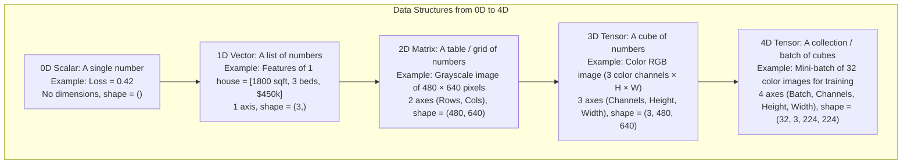
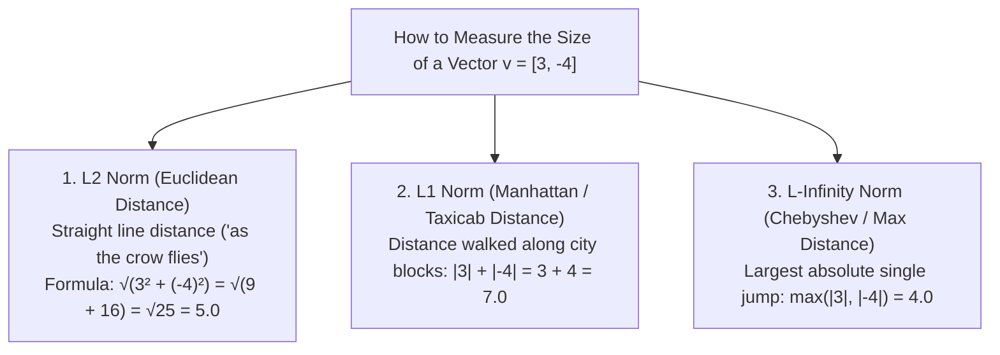
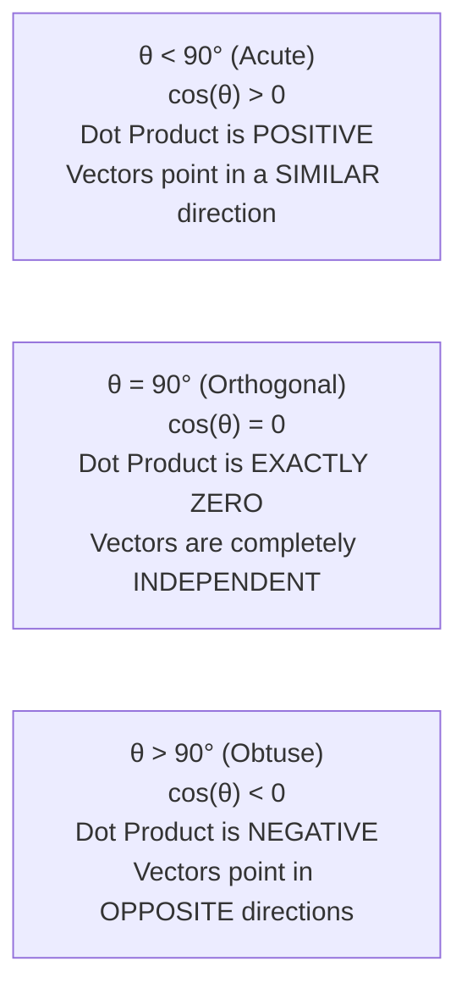
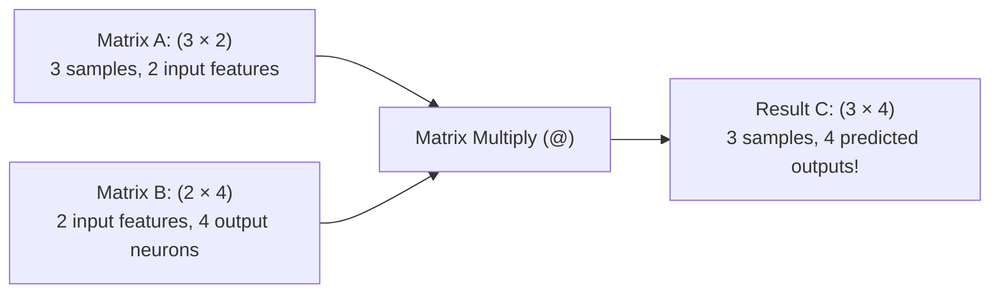
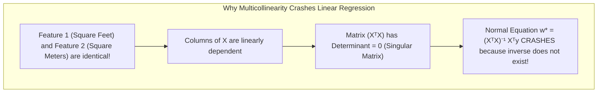
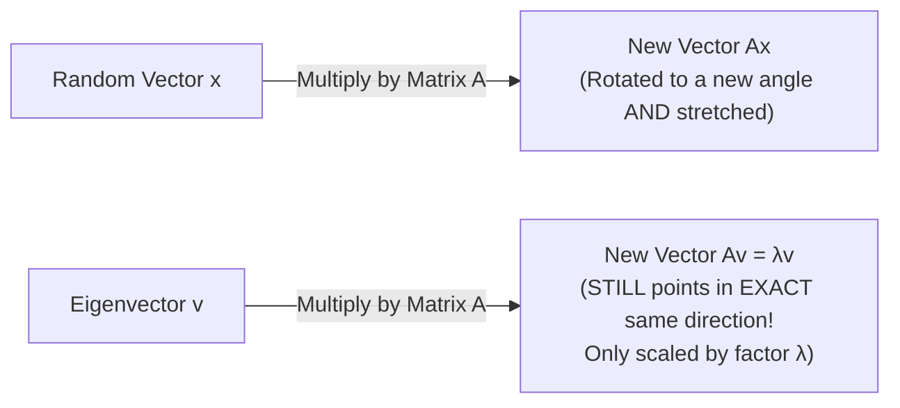
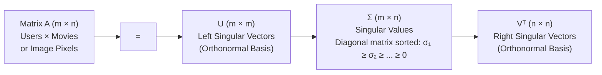

<div class="pixel-banner">
  <div class="pixel-hud-row">
    <div class="pixel-tag"><span class="pixel-indicator"></span>MATH_SYS // LINEAR_ALGEBRA</div>
    <div class="pixel-meta-right">LVL_01 // TENSORS_AND_SPACES</div>
  </div>
  <div class="pixel-main-content">
    <div class="pixel-avatar">🔢</div>
    <div class="pixel-headings">
      <div class="pixel-title-badge">LEVEL 01 // LINEAR ALGEBRA & TENSORS</div>
      <div class="pixel-subtitle">VECTORS • NORMS • DOT PRODUCTS • MATRIX MULTIPLICATION • EIGENVALUES • SVD</div>
    </div>
    <div class="pixel-sparklines">
      <div class="pixel-bar" style="--h: 90%"></div>
      <div class="pixel-bar" style="--h: 75%"></div>
      <div class="pixel-bar" style="--h: 60%"></div>
      <div class="pixel-bar" style="--h: 80%"></div>
      <div class="pixel-bar" style="--h: 45%"></div>
      <div class="pixel-bar" style="--h: 30%"></div>
    </div>
  </div>
  <div class="pixel-footer-row">
    <span class="pixel-coord">SYS_ID: #01_LIN_ALG // INTUITIVE_APPROACH // ZERO_JARGON</span>
    <span class="pixel-status-text">[ VERIFIED ]</span>
  </div>
</div>

# Level 1: Linear Algebra & Tensors

<div class="notion-callout">
  <div class="notion-callout-icon">💡</div>
  <div class="notion-callout-content">
    Linear algebra is the native language of computers and graphics cards (GPUs). Inside PyTorch, TensorFlow, and OpenCV, <strong>everything is a tensor</strong>. When you understand the geometric intuition behind vectors, matrix multiplication, and eigenvectors, advanced deep learning models like Vision Transformers, ResNets, and YOLO become intuitive, visual, and simple.
  </div>
</div>

<div class="notion-card-meta" style="margin-bottom: 2rem;">
  <span class="notion-tag notion-tag-purple">Level 1</span>
  <span class="notion-tag notion-tag-gray">Foundational Math</span>
  <span class="notion-tag notion-tag-blue">Linear Algebra & Tensors</span>
</div>

---

## 1. Scalars, Vectors, Matrices, and Tensors

Think of linear algebra containers as building blocks that expand into higher spatial dimensions:



### The Everyday Analogy
* **Scalar (0D):** A single grain of sand.
* **Vector (1D):** A line of grains of sand strung together like a necklace.
* **Matrix (2D):** A woven flat cloth of grains of sand (rows and columns).
* **3D Tensor:** A block or cube of woven cloth stacked on top of each other.
* **4D Tensor:** A warehouse shelf holding multiple cubes of cloth.

### Why Do GPUs Care About Tensors?
CPUs process numbers one by one using loops. For example, multiplying two lists of $10,000$ numbers in pure Python requires $10,000$ sequential iterations.

GPUs have thousands of small arithmetic units called **SIMD (Single Instruction, Multiple Data)** cores. By arranging numbers into tensors, a GPU can multiply millions of numbers **simultaneously in a single clock cycle**.

```python
import numpy as np
import torch

# 0D Scalar
scalar = torch.tensor(3.1415)
print("Scalar shape:", scalar.shape)  # torch.Size([])

# 1D Vector (e.g. 4 features of a house)
vector = torch.tensor([1500.0, 3.0, 2.0, 350000.0])
print("Vector shape:", vector.shape)  # torch.Size([4])

# 2D Matrix (e.g. 3 houses, each with 4 features)
matrix = torch.tensor([
    [1200.0, 2.0, 1.0, 250000.0],
    [1500.0, 3.0, 2.0, 350000.0],
    [2100.0, 4.0, 3.0, 520000.0]
])
print("Matrix shape:", matrix.shape)  # torch.Size([3, 4])

# 4D Batch Tensor (32 images, 3 RGB channels, 224 height, 224 width)
batch_images = torch.zeros((32, 3, 224, 224))
print("Batch shape:", batch_images.shape)  # torch.Size([32, 3, 224, 224])
```

---

## 2. Vector Addition and Linear Combinations

A vector has two defining properties:
1. **Magnitude** (how long it is).
2. **Direction** (where it points in space).

### Vector Addition: The "Tip-to-Tail" Walk
To add two vectors $\mathbf{u} = [u_1, u_2]$ and $\mathbf{v} = [v_1, v_2]$, you add their corresponding coordinates:

$$\mathbf{u} + \mathbf{v} = [u_1 + v_1, \; u_2 + v_2]$$

**Intuition:** Imagine walking $2$ miles East and $3$ miles North ($\mathbf{u} = [2, 3]$). Then from that spot, you walk another $4$ miles East and $1$ mile North ($\mathbf{v} = [4, 1]$). In total, you have walked:

$$[2 + 4, \; 3 + 1] = [6, 4]$$

### Scalar Multiplication: Stretching & Flipping
Multiplying a vector by a scalar number $c$ multiplies every component:

$$c \cdot \mathbf{v} = [c \cdot v_1, \; c \cdot v_2]$$

* If $c = 2$: The vector doubles in length (stretches).
* If $c = 0.5$: The vector shrinks to half length.
* If $c = -1$: The vector points in the **exact opposite direction** (flips $180^\circ$).

### What is a Linear Combination?
A **linear combination** is taking multiple vectors, multiplying each by a scalar weight, and adding them together:

$$\mathbf{y} = c_1 \mathbf{v}_1 + c_2 \mathbf{v}_2 + \dots + c_k \mathbf{v}_k$$

* **The Span of vectors:** The set of ALL possible points you can reach by adjusting the multipliers $c_1, c_2, \dots$.
* Two non-parallel 2D vectors span the entire 2D plane.
* **Why AI engineers care:** In a neural network layer, the output is simply a linear combination of input features weighted by learned parameters: $\hat{y} = w_1 x_1 + w_2 x_2 + b$.

---

## 3. Vector Norms: How to Measure Length and Distance

A **norm** (written with double vertical bars $\|\mathbf{v}\|$) is a mathematical ruler that measures the length or size of a vector.



### 1. The L2 Norm (Euclidean Distance)
This is standard geometry from school (the Pythagorean Theorem generalized to $n$ dimensions):

$$\|\mathbf{v}\|_2 = \sqrt{v_1^2 + v_2^2 + \dots + v_n^2}$$

* **Visual Intuition:** If you walk $3$ meters East and $4$ meters North, a drone flying directly to you from the start travels $\sqrt{3^2 + 4^2} = 5.0$ meters.
* **Where it is used in ML:**
  * **Ridge Regression ($L_2$ Regularization):** Adds $\lambda \|\mathbf{w}\|_2^2$ to the loss function to keep weights small and smooth.
  * **Weight Decay in PyTorch:** Directly penalizes large $L_2$ norms to prevent overfitting.
  * **K-Nearest Neighbors (KNN) & K-Means:** Measures physical Euclidean proximity between data points.

### 2. The L1 Norm (Manhattan / Taxicab Distance)
Imagine a taxi driving on the square street grid of Manhattan: the taxi cannot drive diagonally through buildings; it must drive along streets and avenues:

$$\|\mathbf{v}\|_1 = |v_1| + |v_2| + \dots + |v_n|$$

* **Visual Intuition:** If you travel $3$ blocks East and $4$ blocks North, the taxi drives $|3| + |4| = 7$ blocks.
* **Where it is used in ML:**
  * **Lasso Regression ($L_1$ Regularization):** Adds $\lambda \|\mathbf{w}\|_1$ to the loss function. Because the derivative of $|w|$ is a constant ($\pm 1$), it pulls unneeded weights all the way to **exact zero**, performing automatic feature selection!
  * **Mean Absolute Error (MAE):** Robust loss function that does not over-punish dirty outliers.

### 3. Visual Comparison of Unit Circles
If you draw all points where $\|\mathbf{v}\| = 1$:
* The $L_2$ unit shape is a smooth **Circle**.
* The $L_1$ unit shape is a sharp tilted **Diamond** (with sharp corners touching the axes).
* The $L_\infty$ unit shape is a square **Box**.

*(This diamond shape with sharp vertices on the coordinate axes is the exact mathematical reason why Lasso drives weights to exact zero!)*

```python
import numpy as np

v = np.array([3.0, -4.0])

print("L2 Norm (Euclidean):", np.linalg.norm(v, ord=2))  # 5.0
print("L1 Norm (Manhattan):", np.linalg.norm(v, ord=1))  # 7.0
print("L_inf Norm (Max):   ", np.linalg.norm(v, ord=np.inf))  # 4.0
```

---

## 4. The Dot Product & Cosine Similarity

The **dot product** takes two vectors and produces a single scalar number. It is the single most executed operation in all of artificial intelligence.

### Step-by-Step Calculation
Multiply matching components and add them all together:

$$\mathbf{a} \cdot \mathbf{b} = a_1 b_1 + a_2 b_2 + \dots + a_n b_n$$

**Concrete Example:**

$$\mathbf{a} = [2, 3], \quad \mathbf{b} = [4, 5]$$

$$\mathbf{a} \cdot \mathbf{b} = (2 \times 4) + (3 \times 5) = 8 + 15 = \mathbf{23}$$

### Geometric Intuition: Directional Alignment
The geometric formula for the dot product is:

$$\mathbf{a} \cdot \mathbf{b} = \|\mathbf{a}\| \|\mathbf{b}\| \cos(\theta)$$

Where $\theta$ is the angle between the two arrows:



### What is Cosine Similarity?
In text embeddings (like OpenAI embeddings) or face recognition embeddings (FaceNet), vector lengths can vary depending on document length or lighting.

To measure **pure direction and semantic similarity** without being fooled by vector length, we divide by the magnitudes:

$$\text{Cosine Similarity} = \frac{\mathbf{a} \cdot \mathbf{b}}{\|\mathbf{a}\|_2 \|\mathbf{b}\|_2} = \cos(\theta)$$

* Value ranges from $-1.0$ (complete opposites) to $+1.0$ (identical direction).
* Value of $0.0$ means completely unrelated/orthogonal.

```python
import numpy as np

# User A and User B movie ratings: [Action, Comedy, Romance]
user_a = np.array([5.0, 1.0, 0.0])  # Loves Action, hates Romance
user_b = np.array([4.0, 2.0, 0.0])  # Loves Action, likes Comedy
user_c = np.array([0.0, 1.0, 5.0])  # Hates Action, loves Romance

def cosine_sim(u, v):
    return np.dot(u, v) / (np.linalg.norm(u) * np.linalg.norm(v))

print("Similarity A & B (Both Action fans):", round(cosine_sim(user_a, user_b), 4))  # 0.9899 (Very high!)
print("Similarity A & C (Opposite tastes): ", round(cosine_sim(user_a, user_c), 4))  # 0.0385 (Near zero!)
```

---

## 5. Matrix Multiplication: The Engine of Neural Networks

In deep learning, every Linear layer $\mathbf{y} = \mathbf{X}\mathbf{W} + \mathbf{b}$ is a matrix multiplication.

### The Dimension Rule
You can multiply matrix $\mathbf{A}$ of shape $(m \times k)$ by matrix $\mathbf{B}$ of shape $(k \times n)$ **ONLY if the inner dimensions match ($k = k$)**:

$$(m \times \mathbf{k}) \cdot (\mathbf{k} \times n) \longrightarrow (m \times n)$$



### The Mechanical "Diving Board" Calculation
To calculate entry $(i, j)$ in the result, take **Row $i$ of matrix $\mathbf{A}$**, rotate it, and compute the dot product with **Column $j$ of matrix $\mathbf{B}$**:

$$\mathbf{A} = \begin{bmatrix} 1 & 2 \\ 3 & 4 \end{bmatrix}, \quad \mathbf{B} = \begin{bmatrix} 5 & 6 \\ 7 & 8 \end{bmatrix}$$

1. **Top-Left entry $C_{11}$:** Row 1 of $\mathbf{A}$ dot Column 1 of $\mathbf{B}$: $(1 \times 5) + (2 \times 7) = 5 + 14 = \mathbf{19}$
2. **Top-Right entry $C_{12}$:** Row 1 of $\mathbf{A}$ dot Column 2 of $\mathbf{B}$: $(1 \times 6) + (2 \times 8) = 6 + 16 = \mathbf{22}$
3. **Bottom-Left entry $C_{21}$:** Row 2 of $\mathbf{A}$ dot Column 1 of $\mathbf{B}$: $(3 \times 5) + (4 \times 7) = 15 + 28 = \mathbf{43}$
4. **Bottom-Right entry $C_{22}$:** Row 2 of $\mathbf{A}$ dot Column 2 of $\mathbf{B}$: $(3 \times 6) + (4 \times 8) = 18 + 32 = \mathbf{50}$

$$\mathbf{C} = \begin{bmatrix} 19 & 22 \\ 43 & 50 \end{bmatrix}$$

### Critical Rule: Order Matters! (AB ≠ BA)
Unlike standard numbers ($3 \times 5 = 5 \times 3$), matrix multiplication is **NOT commutative**:

$$\mathbf{A}\mathbf{B} \neq \mathbf{B}\mathbf{A}$$

In fact, if $\mathbf{A}$ is $(3 \times 2)$ and $\mathbf{B}$ is $(2 \times 4)$, you can compute $\mathbf{A}\mathbf{B}$ (result is $3 \times 4$), but attempting $\mathbf{B}\mathbf{A}$ throws a shape mismatch crash because inner dimensions $4 \neq 3$!

---

## 6. Transpose, Identity, and Inverses

### Matrix Transpose (Aᵀ)
Transposing flips a matrix across its main diagonal, turning rows into columns:

$$\mathbf{A} = \begin{bmatrix} 1 & 2 & 3 \\ 4 & 5 & 6 \end{bmatrix} \quad \implies \quad \mathbf{A}^T = \begin{bmatrix} 1 & 4 \\ 2 & 5 \\ 3 & 6 \end{bmatrix}$$

* If $\mathbf{A}$ has shape $(2, 3)$, $\mathbf{A}^T$ has shape $(3, 2)$.
* **Transpose Rule for Multiplication:** $(\mathbf{A}\mathbf{B})^T = \mathbf{B}^T \mathbf{A}^T$ (order reverses!).

### Identity Matrix (I)
The identity matrix is the matrix equivalent of the number $1$. It has $1$s on the diagonal and $0$s everywhere else:

$$\mathbf{I} = \begin{bmatrix} 1 & 0 & 0 \\ 0 & 1 & 0 \\ 0 & 0 & 1 \end{bmatrix}$$

For any matrix $\mathbf{A}$, multiplying by the identity leaves it completely unchanged:

$$\mathbf{A} \mathbf{I} = \mathbf{I} \mathbf{A} = \mathbf{A}$$

### Matrix Inverse (A⁻¹)
The inverse is the matrix equivalent of division ($x \times \frac{1}{x} = 1$):

$$\mathbf{A} \mathbf{A}^{-1} = \mathbf{I}$$

#### When Does a Matrix Have NO Inverse? (Singular Matrix)
Just as you cannot divide by zero in normal arithmetic ($5 / 0$ is undefined), **a matrix has no inverse if its Determinant is Zero**:

$$\det(\mathbf{A}) = 0$$

* **Geometric Meaning of Determinant:** The determinant measures how much the matrix scales area (in 2D) or volume (in 3D).
* If $\det(\mathbf{A}) = 2$: The matrix doubles the area of any shape.
* If $\det(\mathbf{A}) = 0$: The matrix completely squashes 2D space down into a flat 1D line (or a single 0D point), irreversibly destroying information. You cannot undo a squash to zero, so no inverse exists!



---

## 7. Eigenvalues and Eigenvectors: Directions That Never Rotate

When you multiply a square matrix $\mathbf{A}$ by a random vector $\mathbf{x}$, the vector usually changes **both its length and its direction**:



An **Eigenvector** $\mathbf{v}$ is a special vector that **only gets scaled, but NEVER rotates**:

$$\mathbf{A} \mathbf{v} = \lambda \mathbf{v}$$

* $\mathbf{v}$ is the **Eigenvector** (the invariant direction).
* $\lambda$ is the **Eigenvalue** (the scaling multiplier). If $\lambda = 3$, the vector stretches $3\times$. If $\lambda = 0.5$, it shrinks in half. If $\lambda = -1$, it flips directly backward along the same line.

### The Rubber Sheet Analogy
Imagine drawing a circle on a sheet of rubber. Grab the sheet by the corners and stretch it diagonally:
* Almost all lines on the circle rotate and tilt.
* But the line running directly along the direction you are pulling **does not rotate at all**—it only gets longer!
* That pull direction is the **Eigenvector**, and how much longer it got is the **Eigenvalue**.

### Real-World AI Application: Principal Component Analysis (PCA)
In machine learning, high-dimensional data (e.g. 500 features) is often hard to visualize and train on:
1. Compute the covariance matrix of your data.
2. The **eigenvectors** of the covariance matrix point in the directions of **maximum spread (variance)** of your data.
3. The **eigenvalue** tells you how much information is contained in that direction.
4. By keeping only the top 2 eigenvectors with the largest eigenvalues, you compress 500 features into a 2D scatter plot while retaining 90%+ of all information!

```python
import numpy as np

# A simple 2x2 matrix
A = np.array([
    [4.0, 2.0],
    [1.0, 3.0]
])

# Compute Eigenvalues and Eigenvectors
eigenvalues, eigenvectors = np.linalg.eig(A)

print("Eigenvalues: ", np.round(eigenvalues, 2))  # [5.0, 2.0]
print("Eigenvector 1:", np.round(eigenvectors[:, 0], 2))  # Direction for lambda = 5.0
print("Eigenvector 2:", np.round(eigenvectors[:, 1], 2))  # Direction for lambda = 2.0

# Verify: A @ v should equal lambda * v
v1 = eigenvectors[:, 0]
lambda1 = eigenvalues[0]

print("\nA @ v1:     ", np.round(A @ v1, 2))
print("lambda1 * v1:", np.round(lambda1 * v1, 2))
# Both outputs are identical!
```

---

## 8. Singular Value Decomposition (SVD): Universal Factorization

Eigenvalues only exist for square ($n \times n$) matrices. But real-world data matrices (e.g. $10,000$ users $\times 500$ movies) are rectangular ($m \times n$).

**SVD is the Swiss Army Knife of Linear Algebra:** it factorizes **ANY** matrix into three clean component matrices:

$$\mathbf{A} = \mathbf{U} \mathbf{\Sigma} \mathbf{V}^T$$



### The Three Operations of SVD
Geometrically, any linear transformation matrix $\mathbf{A}$ can be broken down into three simple spatial steps:
1. **Rotate** space (via $\mathbf{V}^T$).
2. **Scale** along coordinates (via singular values $\mathbf{\Sigma}$).
3. **Rotate** space again (via $\mathbf{U}$).

### Why AI Engineers Use SVD
1. **Low-Rank Image Compression:**
   The singular values in $\mathbf{\Sigma}$ are sorted from most important to least important. If an image is $(1000 \times 1000)$, you can keep only the top $20$ singular values and discard the remaining $980$. The reconstructed image retains $95\%$ of visual clarity while using only $2\%$ of memory!
2. **LoRA (Low-Rank Adaptation) in LLMs & Stable Diffusion:**
   Fine-tuning a 7-billion parameter language model takes massive GPU memory. LoRA factorizes the gigantic weight update matrix $\Delta \mathbf{W} \in \mathbb{R}^{d \times k}$ into two tiny rank-$r$ matrices $\mathbf{B} \mathbf{A}$ (where $r = 4$ or $8$), reducing trainable parameters by $99\%$!

```python
import numpy as np

# Create a sample 4x3 matrix
A = np.array([
    [1.0, 2.0, 3.0],
    [4.0, 5.0, 6.0],
    [7.0, 8.0, 9.0],
    [10.0, 11.0, 12.0]
])

# Perform SVD
U, S, Vt = np.linalg.svd(A)

print("U shape: ", U.shape)   # (4, 4)
print("S shape: ", S.shape)   # (3,) -> Singular values
print("Vt shape:", Vt.shape)  # (3, 3)

# Notice how singular values drop off:
print("Singular Values:", np.round(S, 2))
# First singular value contains over 99% of all energy!
```

---

<div class="notion-callout">
  <div class="notion-callout-icon">🎯</div>
  <div class="notion-callout-content">
    <strong>Level 1 Key Takeaway:</strong> Tensors are multi-dimensional grids that execute fast in parallel on GPU tensor cores. Vector norms measure physical length and drive regularization penalties. Dot products measure directional alignment and power attention. Matrix multiplication executes neural layers. Eigenvalues and SVD extract the principal axes of variance to compress data and models.
  </div>
</div>
