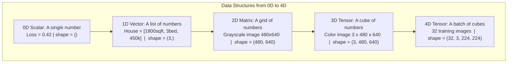
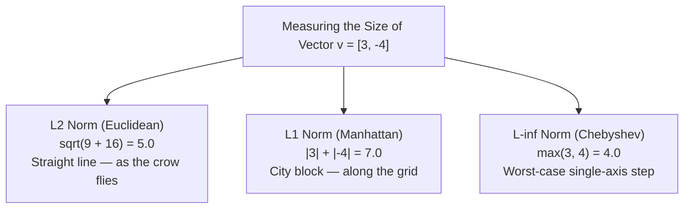
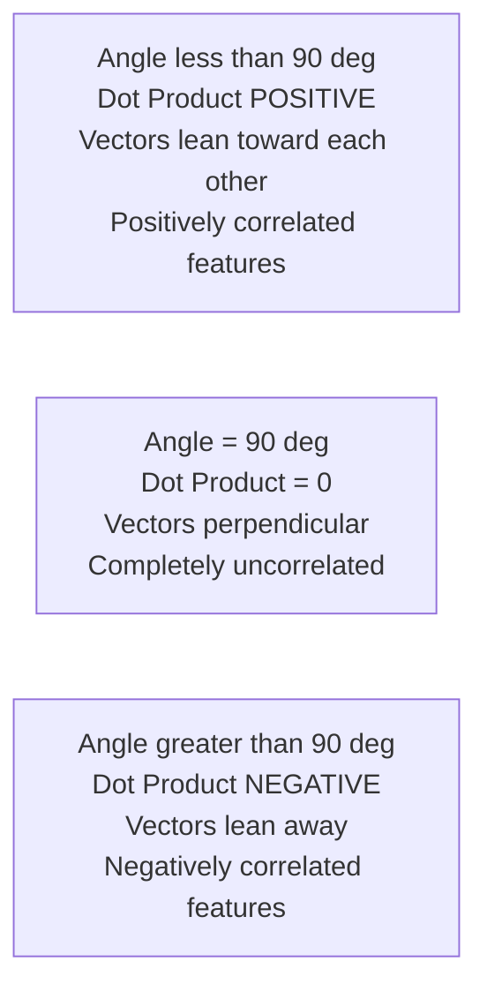
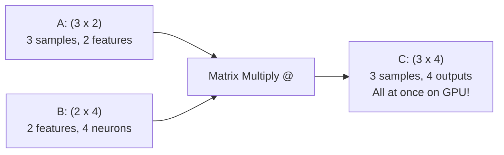
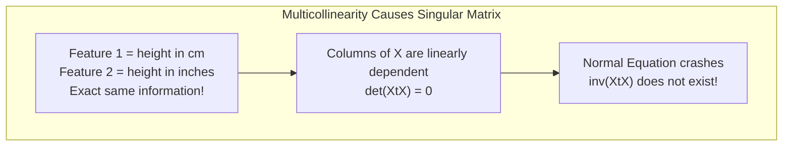
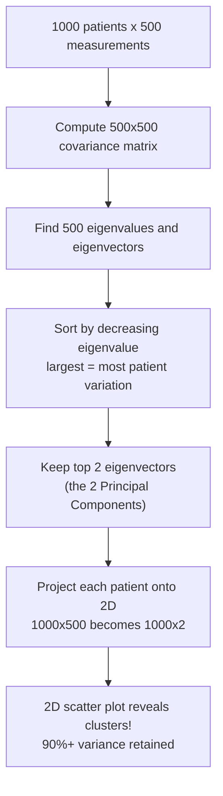
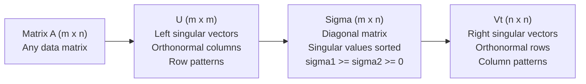

<div class="pixel-banner">
  <div class="pixel-hud-row">
    <div class="pixel-tag"><span class="pixel-indicator"></span>MATH_SYS // LINEAR_ALGEBRA</div>
    <div class="pixel-meta-right">LVL_01 // TENSORS_AND_SPACES</div>
  </div>
  <div class="pixel-main-content">
    <div class="pixel-avatar">🔢</div>
    <div class="pixel-headings">
      <div class="pixel-title-badge">LEVEL 01 // LINEAR ALGEBRA & TENSORS</div>
      <div class="pixel-subtitle">VECTORS • NORMS • DOT PRODUCTS • MATRIX MULTIPLICATION • EIGENVALUES • SVD</div>
    </div>
    <div class="pixel-sparklines">
      <div class="pixel-bar" style="--h: 90%"></div>
      <div class="pixel-bar" style="--h: 75%"></div>
      <div class="pixel-bar" style="--h: 60%"></div>
      <div class="pixel-bar" style="--h: 80%"></div>
      <div class="pixel-bar" style="--h: 45%"></div>
      <div class="pixel-bar" style="--h: 30%"></div>
    </div>
  </div>
  <div class="pixel-footer-row">
    <span class="pixel-coord">SYS_ID: #01_LIN_ALG // INTUITIVE_APPROACH // ZERO_JARGON</span>
    <span class="pixel-status-text">[ VERIFIED ]</span>
  </div>
</div>

# Level 1: Linear Algebra & Tensors

<div class="notion-callout">
  <div class="notion-callout-icon">💡</div>
  <div class="notion-callout-content">
    Linear algebra is the native language of GPUs. Inside PyTorch, TensorFlow, and OpenCV,
    <strong>everything is a tensor</strong>. Once you understand the geometry behind vectors,
    matrix multiplication, and eigenvectors, advanced models like Vision Transformers, ResNets,
    and YOLO stop being magic and start making perfect sense.
  </div>
</div>

<div class="notion-card-meta" style="margin-bottom: 2rem;">
  <span class="notion-tag notion-tag-purple">Level 1</span>
  <span class="notion-tag notion-tag-gray">Foundational Math</span>
  <span class="notion-tag notion-tag-blue">Linear Algebra & Tensors</span>
</div>

---

## 1. Scalars, Vectors, Matrices, and Tensors

Before doing any machine learning you need to understand how computers store and
organize numbers. Linear algebra gives four increasingly powerful containers.
Think of it like a warehouse: a single item, a shelf row, an aisle grid, and the
entire multi-floor building.



<figure style="text-align:center; background:var(--md-code-bg-color,#1e1e2e); border-radius:12px; padding:1rem; border:1px solid rgba(139,92,246,0.3); margin: 1.5rem 0;">
  
  <figcaption style="margin-top:0.6rem; font-size:0.85rem; color:#a0a0b0;">
    <strong>Fig 1.1</strong> — Scalar to Vector to Matrix to Tensor: each step adds one more dimension.
  </figcaption>
</figure>

<figure style="text-align:center; background:var(--md-code-bg-color,#1e1e2e); border-radius:12px; padding:1rem; border:1px solid rgba(139,92,246,0.3); margin: 1.5rem 0;">
  
  <figcaption style="margin-top:0.6rem; font-size:0.85rem; color:#a0a0b0;">
    <strong>Fig 1.2</strong> — Tensor dimensions from 1D (line) to 6D (stacked cubes of cubes).
  </figcaption>
</figure>

---

### 1.1 Scalar — A Single, Isolated Number

A **scalar** is the simplest mathematical object — just one number with no direction
attached. The word comes from the Latin *scala* (scale), because a scalar places a
value on a measuring scale.

Every single measurement in real life is a scalar: temperature right now, your age,
a model's accuracy, the learning rate you picked, the loss after one training epoch.
Scalars have **magnitude** (size) but absolutely **no direction**. You cannot ask
"which way does the number 5 point?" — it does not point anywhere.

In PyTorch a scalar has zero dimensions (`ndim = 0`) and shape `()` — an empty
tuple meaning no axes exist at all.

| Symbol | Real Example | Why it is a scalar |
|--------|-------------|---------------------|
| $x = 37$ | Body temperature 37 °C | One reading, no direction |
| $\alpha = 0.001$ | Neural network learning rate | One tuning knob |
| $\mathcal{L} = 0.42$ | Cross-entropy training loss | One score per epoch |
| $n = 50000$ | Number of training samples | One count |
| $p = 0.87$ | Model confidence on an image | One probability |

```python
import torch

temperature = torch.tensor(37.0)
loss        = torch.tensor(0.42)

print(temperature.shape)    # torch.Size([])  — zero dimensions
print(temperature.ndim)     # 0
print(temperature.item())   # 37.0  — extract raw Python float
```

---

### 1.2 Vector — Direction and Magnitude Combined into a List

A **vector** is an ordered list of numbers that simultaneously encodes two things:
a **magnitude** (how big it is) and a **direction** (where it points in space).

Imagine someone says "walk 3 blocks East and 4 blocks North." That instruction is
the vector $[3, 4]$. It has a magnitude (straight-line distance = 5 blocks) and a
direction (northeast). Neither piece of information makes sense without the other.

In machine learning, vectors describe data points. When you describe a house with
numbers — area, bedrooms, bathrooms, price — you create a **feature vector** that
positions that house as a unique point in a 4-dimensional space. Every house becomes
another point. The model learns patterns by studying the geometry of those points.

$$\mathbf{x}_{\text{house}} = \begin{bmatrix} 1500 \\ 3 \\ 2 \\ 350000 \end{bmatrix}
\quad = \quad
\begin{bmatrix} \text{area (sqft)} \\ \text{bedrooms} \\ \text{bathrooms} \\ \text{price (\$)} \end{bmatrix}$$

**Row vs Column vector.** The same numbers can be written horizontally (row) or
vertically (column). The transpose symbol $^T$ converts between them:

$$\text{Column (shape } 4 \times 1 \text{): }
\mathbf{x} = \begin{bmatrix}1500\\3\\2\\350000\end{bmatrix}
\qquad
\text{Row (shape } 1 \times 4 \text{): }
\mathbf{x}^T = \begin{bmatrix}1500 & 3 & 2 & 350000\end{bmatrix}$$

Getting the orientation wrong causes shape-mismatch crashes in PyTorch.

**Visual intuition in 2D.** The vector $[3, 4]$ is an arrow starting at the origin
$(0,0)$ with its tip at $(3, 4)$. The arrow's direction tells you *where*, and its
length tells you *how far*.

```python
import torch, numpy as np

house = torch.tensor([1500.0, 3.0, 2.0, 350000.0])
print("Shape:", house.shape)    # torch.Size([4])
print("Dims: ", house.ndim)     # 1

direction = np.array([3.0, 4.0])
length = np.linalg.norm(direction)   # sqrt(9 + 16) = 5.0
print("Arrow length:", length)        # 5.0
```

---

### 1.3 Matrix — A Grid That Holds Datasets and Transformations

A **matrix** is a 2D rectangular grid of numbers organized into rows and columns.
Shape is always written as **(rows x columns)**. Matrices are the core data structure
of machine learning: they hold datasets, weight parameters, image pixels, and
linear transformation operations.

Think of any spreadsheet. Rows are samples (one house, one customer, one image);
columns are features (area, price, colour). Loading a CSV with pandas and converting
to NumPy gives you a matrix.

$$\mathbf{X} = \begin{bmatrix}
1200 & 2 & 1 & 250000 \\
1500 & 3 & 2 & 350000 \\
2100 & 4 & 3 & 520000
\end{bmatrix} \quad \text{shape }(3 \times 4)$$

- **Row 1** = House 1's complete description.
- **Column 1** = Area of all houses. **Column 4** = Price of all houses.

A grayscale photo 480×640 is a $(480, 640)$ matrix where each number is a pixel
brightness 0–255.

Matrices also encode **linear transformations**: rotations, scalings, projections.
Multiplying a vector by a matrix moves it to a new position in space. This is
exactly what each neural-network layer does — it takes your input vector and
transforms it into a new representation.

```python
import torch

X = torch.tensor([
    [1200.0, 2.0, 1.0, 250000.0],
    [1500.0, 3.0, 2.0, 350000.0],
    [2100.0, 4.0, 3.0, 520000.0]
])
print("Shape:", X.shape)          # torch.Size([3, 4])
print("House 2:", X[1])           # tensor([1500., 3., 2., 350000.])
print("All prices:", X[:, 3])     # tensor([250000., 350000., 520000.])
```

---

### 1.4 Tensor — The Universal Multi-Dimensional Container

A **tensor** is the most general container. It extends scalars (0D), vectors (1D),
and matrices (2D) to **any number of dimensions**. In deep learning everything you
process — images, text, audio, video — must become a tensor before a neural network
can process it.

**Why we need 3D and 4D tensors.** A colour photograph has THREE colour channels
(Red, Green, Blue). Each channel is a 2D grid of pixel values, so stacking three
grids gives a 3D shape **(3, height, width)**. Batch 32 of those images for one
training step and you get **(32, 3, height, width)**.

| Dims | Shape | Real Example |
|------|-------|-------------|
| 0D | `()` | Loss `0.42` |
| 1D | `(784,)` | MNIST pixel row |
| 2D | `(28, 28)` | MNIST image |
| 3D | `(3, 224, 224)` | ImageNet colour image |
| 4D | `(32, 3, 224, 224)` | Training batch of 32 images |
| 5D | `(8, 16, 3, 224, 224)` | Batch of 8 video clips, 16 frames each |

**Understanding the channel axis.** For a `(3, 480, 640)` image:
- `image[0]` → Red channel grid, shape `(480, 640)`.
- `image[1]` → Green channel grid.
- `image[2]` → Blue channel grid.
- `image[:, 100, 200]` → All three channel values at pixel row=100, col=200.

```python
import torch

color_image = torch.zeros((3, 480, 640))
print("Shape:", color_image.shape)            # torch.Size([3, 480, 640])
print("Red channel:", color_image[0].shape)   # torch.Size([480, 640])
print("Pixel (100,200):", color_image[:, 100, 200])  # tensor([0., 0., 0.])

batch = torch.zeros((32, 3, 224, 224))
print("Batch shape:", batch.shape)    # torch.Size([32, 3, 224, 224])
```

**Why GPUs love tensors.** Python processes numbers one-by-one in loops.
An NVIDIA A100 GPU has 6,912 CUDA cores capable of 312 trillion operations per
second. With numbers organized as tensors of known shape, the GPU fires all
6,912 cores simultaneously — millions of additions per clock cycle instead of one.
That is why `model.cuda()` speeds up training 50–100x.

---

## 2. Vector Addition and Linear Combinations

### 2.1 Vector Addition — Adding Two Journeys Together

Vector addition combines two separate journeys into one final destination.
The rule is simple: **add the corresponding components element-by-element**.

$$\mathbf{u} + \mathbf{v} =
\begin{bmatrix} u_1 \\ u_2 \end{bmatrix} +
\begin{bmatrix} v_1 \\ v_2 \end{bmatrix} =
\begin{bmatrix} u_1 + v_1 \\ u_2 + v_2 \end{bmatrix}$$

**Worked example — delivery driver story.** First pickup: drive $[2, 3]$
(2 km East, 3 km North). Second delivery: another $[4, 1]$ (4 km East, 1 km North).
Total displacement:

$$\begin{bmatrix}2\\3\end{bmatrix} + \begin{bmatrix}4\\1\end{bmatrix}
= \begin{bmatrix}6\\4\end{bmatrix}$$

You end up 6 km East and 4 km North of your start. Geometrically you place the tail
of the second arrow at the tip of the first — the **"tip-to-tail" method**.

**In neural networks.** Adding a bias vector $\mathbf{b}$ to a layer output
$\mathbf{z} = \mathbf{X}\mathbf{W} + \mathbf{b}$ is vector addition. The bias
shifts every data point by the same amount in output space.

```python
import numpy as np

u = np.array([2.0, 3.0])
v = np.array([4.0, 1.0])
print("u + v =", u + v)   # [6. 4.]

outputs = np.array([1.2, -0.5, 3.1])
bias    = np.array([0.1,  0.2, 0.3])
print("After bias:", outputs + bias)   # [1.3, -0.3, 3.4]
```

---

### 2.2 Scalar Multiplication — Stretching, Shrinking, and Flipping

Multiplying vector $\mathbf{v}$ by scalar $c$ scales every component by $c$.
The result points in the same direction (or exactly opposite when $c < 0$) but
with a different length.

$$c \cdot \mathbf{v} = c \cdot \begin{bmatrix}v_1\\v_2\end{bmatrix}
= \begin{bmatrix}c v_1 \\ c v_2\end{bmatrix}$$

Think of a volume knob: the music's direction does not change, but you control
how loud it is — or play it in reverse if $c < 0$.

**All cases with $\mathbf{v} = [2, 3]$:**

| Scalar $c$ | Result | Geometric Effect |
|-----------|--------|-----------------|
| $c = 3$ | $[6, 9]$ | Stretches to **3x length** |
| $c = 1$ | $[2, 3]$ | Completely **unchanged** |
| $c = 0.5$ | $[1, 1.5]$ | Shrinks to **half length** |
| $c = 0$ | $[0, 0]$ | Collapses to **origin** |
| $c = -1$ | $[-2, -3]$ | **Flips 180°** — exactly opposite direction |
| $c = -2$ | $[-4, -6]$ | Flips AND stretches to 2x |

```python
v = np.array([2.0, 3.0])
print(3 * v)     # [6. 9.]   — stretched
print(0.5 * v)   # [1. 1.5]  — shrunk
print(-1 * v)    # [-2. -3.] — flipped

# Gradient descent update = scalar multiplication
gradient = np.array([0.4, -0.2, 0.8])
lr = 0.01
update = -lr * gradient    # move OPPOSITE to gradient
print("Update:", update)    # [-0.004  0.002 -0.008]
```

Every gradient-descent weight update is scalar multiplication: the gradient gives
the direction of steepest increase, $-\alpha$ (negative learning rate) scales and
flips it to give the direction of steepest decrease.

---

### 2.3 Linear Combination — The Core of Every Neural Layer

A **linear combination** takes multiple vectors, multiplies each by a scalar weight,
and sums the results. It is the single most important operation in all of machine
learning and deep learning.

$$\mathbf{y} = c_1 \mathbf{v}_1 + c_2 \mathbf{v}_2 + \dots + c_k \mathbf{v}_k$$

**Geometric example — 2D navigation.** Using East and North unit vectors:

$$\mathbf{e}_1 = \begin{bmatrix}1\\0\end{bmatrix}, \quad \mathbf{e}_2 = \begin{bmatrix}0\\1\end{bmatrix}$$

The point $(5, 3)$ is: $5 \mathbf{e}_1 + 3 \mathbf{e}_2$. By varying $c_1$ and
$c_2$ freely you can reach **every point on the 2D plane** — this is the **span**.

**A single neural network neuron is a linear combination:**

$$z = w_1 x_1 + w_2 x_2 + w_3 x_3 + b$$

Weights $w_i$ are the scalars. Inputs $x_i$ are the vector components. The neuron
takes a weighted vote of all its input signals. A weight of 0.9 means "input 1 is
very important." A weight of 0.01 means "input 3 barely matters."

```python
inputs  = np.array([0.5,  1.2, -0.3])   # x1, x2, x3
weights = np.array([0.8,  0.2,  0.9])   # w1, w2, w3
bias    = 0.1

output = np.dot(weights, inputs) + bias
print("Neuron output:", round(output, 4))  # 0.57
```

**The span — what regions are reachable?**

- Two non-parallel 2D vectors span the **entire 2D plane**.
- Two parallel vectors only span a **1D line** — limited reach.
- A vector that is a multiple of another adds **no new information** (linearly dependent).

Duplicate features in your dataset (height in cm AND in inches) are linearly
dependent — they add no new span, waste memory, and can crash Normal-Equation
solvers.

---

## 3. Vector Norms: Measuring Length and Distance

In everyday life we use rulers. In linear algebra we use **norms**. A norm is a
function that takes a vector and outputs one non-negative number representing its
"size." Formally, any norm must: be zero only for the zero vector, scale
proportionally with the vector, and satisfy the triangle inequality (direct path is
never longer than the detour).

The notation $\|\mathbf{v}\|_p$ specifies the type of norm by the subscript $p$.



---

### 3.1 L2 Norm (Euclidean Distance) — The Straight-Line Ruler

The **L2 norm** is what most people mean by "distance." It is the Pythagorean
theorem extended to $n$ dimensions: the straight-line length of the vector.

$$\|\mathbf{v}\|_2 = \sqrt{v_1^2 + v_2^2 + \dots + v_n^2}$$

**Step-by-step example with $\mathbf{v} = [3, -4]$:**

$$\|\mathbf{v}\|_2 = \sqrt{3^2 + (-4)^2} = \sqrt{9 + 16} = \sqrt{25} = 5.0$$

**Physical story.** Walk 3 km East and 4 km South. A helicopter flying directly from
start to end travels $\sqrt{9 + 16} = 5$ km. The minus sign on $-4$ disappears inside
the square: $(-4)^2 = 16$, same as $4^2 = 16$.

**3D example with $\mathbf{v} = [1, 2, 2]$:**

$$\|\mathbf{v}\|_2 = \sqrt{1 + 4 + 4} = \sqrt{9} = 3.0$$

The formula works for any number of dimensions — the computer just squares all
components, sums, and takes the square root.

**Where L2 appears in ML:**

**Ridge Regression (L2 Regularization):**

$$\mathcal{L}_{\text{Ridge}} = \text{MSE} + \lambda \|\mathbf{w}\|_2^2$$

The penalty grows **quadratically** — large weights are penalized heavily, small
weights are barely penalized. This smoothly pushes all weights toward zero without
zeroing any of them completely. Good when you believe all features contribute a
little.

**Weight Decay in PyTorch:**
```python
optimizer = torch.optim.Adam(model.parameters(), lr=0.001, weight_decay=1e-4)
```
`weight_decay=1e-4` adds $\lambda = 10^{-4}$ times the L2 penalty automatically
at every step.

**K-Nearest Neighbors / K-Means:** Use L2 distance to find which data points are
"close" to each other — deciding cluster assignments or nearest neighbours.

```python
import numpy as np, torch

v = np.array([3.0, -4.0])
l2 = np.linalg.norm(v, ord=2)
print(f"L2 Norm: {l2}")   # 5.0

# Unit vector: same direction, length exactly 1
v_unit = v / l2
print(f"Unit vector: {v_unit}")              # [-0.6  0.8]
print(f"L2 of unit: {np.linalg.norm(v_unit)}")  # 1.0
```

A **unit vector** has L2 norm exactly 1. Normalizing is the first step in computing
cosine similarity and in attention-mechanism key/query normalization.

---

### 3.2 L1 Norm (Manhattan Distance) — The City Block Counter

The **L1 norm** sums the absolute values of all components. Its "Manhattan" name
comes from New York's grid: you cannot cut diagonally through buildings, you must go
block by block horizontally and vertically.

$$\|\mathbf{v}\|_1 = |v_1| + |v_2| + \dots + |v_n|$$

**Step-by-step example with $\mathbf{v} = [3, -4]$:**

$$\|\mathbf{v}\|_1 = |3| + |-4| = 3 + 4 = 7.0$$

**Physical story.** Restaurant is 3 blocks East and 4 blocks South. No matter which
route you take on the grid, you always travel $3 + 4 = 7$ blocks total. The L2
crow-flies distance is only 5, but the taxi must travel 7.

The **absolute values are critical** — $|-4| = 4$, not $-4$. The L1 norm counts
total movement in all directions regardless of sign.

**Where L1 appears in ML:**

**Lasso Regression (L1 Regularization):**

$$\mathcal{L}_{\text{Lasso}} = \text{MSE} + \lambda \|\mathbf{w}\|_1 = \text{MSE} + \lambda \sum_i |w_i|$$

Unlike Ridge, Lasso drives many weights to **exact zero** — automatic feature
selection. Why? The derivative of $|w|$ is a constant $\pm 1$ regardless of how
small $w$ is. The gradient always pulls with the same constant force, eventually
pushing tiny weights all the way to zero and keeping them there. Ridge's derivative
is $2w$ — as $w$ shrinks the pull weakens, so weights approach zero asymptotically
but never arrive.

**Mean Absolute Error (MAE):**

$$\text{MAE} = \frac{1}{n}\sum_{i=1}^{n} |y_i - \hat{y}_i|$$

Each outlier contributes linearly — much more robust than MSE where outliers
contribute quadratically and dominate the loss.

```python
v = np.array([3.0, -4.0])
l1 = np.linalg.norm(v, ord=1)
print(f"L1 Norm: {l1}")    # 7.0

manual = abs(v[0]) + abs(v[1])
print(f"Manual: {manual}") # 7.0

y_true = np.array([3.0, 5.0, 2.5, 7.0])
y_pred = np.array([2.5, 5.5, 2.0, 8.0])
mae = np.mean(np.abs(y_true - y_pred))
print(f"MAE: {mae}")   # 0.5
```

---

### 3.3 L-Infinity Norm — The Worst-Case Single Step

The **L-infinity norm** answers one specific question: "What is the largest
movement in any single dimension?" It completely ignores all other dimensions and
focuses only on the biggest absolute value.

$$\|\mathbf{v}\|_\infty = \max(|v_1|, |v_2|, \dots, |v_n|)$$

**Example with $\mathbf{v} = [3, -4, 1]$:**

$$\|\mathbf{v}\|_\infty = \max(|3|, |-4|, |1|) = \max(3, 4, 1) = 4.0$$

**Chess-king analogy.** A king can move in any direction — horizontally, vertically,
or diagonally — one square per move. From $(0,0)$ to $(3, 4)$ the king needs
$\max(3, 4) = 4$ moves (it covers both axes simultaneously on diagonal steps).

**Used in adversarial ML:** Adversarial attacks perturb image pixels to fool
classifiers. L-infinity attacks constrain that no single pixel changes by more than
$\varepsilon$: $\|\delta\|_\infty \leq \varepsilon$. This keeps the perturbation
visually invisible while maximizing classification error.

---

### 3.4 Unit Ball Shapes — Why L1 Zeros Weights but L2 Does Not

Draw all vectors with norm exactly 1 (distance 1 from origin) in 2D:

| Norm | Shape | Key Feature |
|------|-------|------------|
| $L_2$ | Smooth **circle** | All edges curved, no corners |
| $L_1$ | Tilted **diamond** | Sharp corners sitting on coordinate axes |
| $L_\infty$ | **Square** aligned to axes | Corners on the diagonals |

Now draw an elliptical contour of the loss function (all weights giving the same
loss value). The regularized optimum is where the loss contour *just barely touches*
the constraint region (the unit ball).

For **L2 circle**: The loss ellipse meets a smooth curve. The meeting point is
almost never at a special location — both weights are nonzero.

For **L1 diamond**: The loss ellipse meets a diamond shape. The corners sit exactly
on the coordinate axes where one weight equals zero. The meeting point hits a corner
in the vast majority of cases — one weight goes to exactly zero.

This geometry is the mathematical reason Lasso produces sparse solutions.

```python
v = np.array([3.0, -4.0, 1.0])

print(f"L2  Norm: {np.linalg.norm(v, 2):.3f}")      # 5.099
print(f"L1  Norm: {np.linalg.norm(v, 1):.3f}")      # 8.000
print(f"Linf Norm: {np.linalg.norm(v, np.inf):.3f}") # 4.000
```

---

## 4. The Dot Product & Cosine Similarity

### 4.1 The Dot Product — Multiply Pairs and Sum Up

The **dot product** takes two equal-length vectors and produces one scalar.
It is the most frequently executed operation in all of AI — every neuron computes
one, every attention score is one, every similarity check uses one.

**Rule:** Multiply each pair of matching components, then add all products:

$$\mathbf{a} \cdot \mathbf{b} = \sum_{i=1}^n a_i b_i = a_1 b_1 + a_2 b_2 + \dots + a_n b_n$$

**Step-by-step with $\mathbf{a} = [2, 3, 1]$ and $\mathbf{b} = [4, 5, 2]$:**

$$\mathbf{a} \cdot \mathbf{b} = (2 \times 4) + (3 \times 5) + (1 \times 2) = 8 + 15 + 2 = 25$$

**Step-by-step house pricing example:**

Weight vector $\mathbf{w} = [0.0, 50, 20, -0.001]$ (dollars per unit of each
feature) applied to house $\mathbf{x} = [1500, 3, 2, 500000]$:

$$\hat{y} = 0 \times 1500 + 50 \times 3 + 20 \times 2 + (-0.001) \times 500000
= 0 + 150 + 40 - 500 = -310$$

This is exactly one neuron's forward pass — a dot product plus a bias.

```python
import numpy as np

a = np.array([2.0, 3.0, 1.0])
b = np.array([4.0, 5.0, 2.0])

print(np.dot(a, b))        # 25.0
print(a @ b)               # 25.0  — clean operator
print(sum(a * b))          # 25.0  — element-wise multiply then sum
```

---

### 4.2 Geometric Meaning — How Aligned Are Two Arrows?

The dot product has a second formula that reveals its geometry:

$$\mathbf{a} \cdot \mathbf{b} = \|\mathbf{a}\|_2 \cdot \|\mathbf{b}\|_2 \cdot \cos(\theta)$$

where $\theta$ is the angle between the two vectors when drawn from the same point.
This means the dot product equals the product of the two lengths multiplied by the
cosine of the angle between them.

**Three critical cases:**

**Angle = 0° (same direction):** $\cos(0) = 1$, so dot product = $\|\mathbf{a}\|\|\mathbf{b}\|$.
Maximum positive value. Vectors fully reinforce each other.

**Angle = 90° (perpendicular):** $\cos(90) = 0$, so dot product = 0 exactly.
Vectors share no common direction — called **orthogonal**. Completely uncorrelated.

**Angle = 180° (opposite):** $\cos(180) = -1$, so dot product = $-\|\mathbf{a}\|\|\mathbf{b}\|$.
Maximum negative. Vectors completely cancel each other.



**The dot product answers:** "How much of vector A's effort is pulling in vector B's
direction?" If both pull the same way, the answer is large positive. If they are
completely unrelated, zero. If they fight each other, large negative.

---

### 4.3 Cosine Similarity — Pure Directional Agreement, No Length Bias

**The problem.** A 1,000-word document naturally produces larger number values than
a 10-word document. Its raw dot product with any query will be larger, even if the
10-word document is more topically relevant. Raw dot products are biased by length.

**The solution — normalize by both lengths:**

$$\text{Cosine Similarity}(\mathbf{a}, \mathbf{b})
= \frac{\mathbf{a} \cdot \mathbf{b}}{\|\mathbf{a}\|_2 \cdot \|\mathbf{b}\|_2}
= \cos(\theta)$$

Dividing by the product of L2 norms cancels the length effect. The result is purely
the cosine of the angle — always between $-1$ and $+1$:

| Value | Meaning |
|-------|---------|
| $+1.0$ | Identical direction — same document copied |
| $0.8 - 0.99$ | Very similar — same topic |
| $0.5 - 0.8$ | Somewhat related |
| $0.0$ | Completely unrelated — orthogonal |
| $-0.5$ to $-1.0$ | Opposite meaning — positive vs negative review |

**Movie recommendation example.** Ratings for [Action, Comedy, Romance]:

| User | Action | Comedy | Romance |
|------|--------|--------|---------|
| Alice | 5 | 1 | 0 |
| Bob | 4 | 2 | 0 |
| Carol | 0 | 1 | 5 |

```python
import numpy as np

alice = np.array([5.0, 1.0, 0.0])
bob   = np.array([4.0, 2.0, 0.0])
carol = np.array([0.0, 1.0, 5.0])

def cosine_sim(u, v):
    return np.dot(u, v) / (np.linalg.norm(u) * np.linalg.norm(v))

print(f"Alice & Bob  (Action fans): {cosine_sim(alice, bob):.4f}")   # 0.9806
print(f"Alice & Carol (opposites):  {cosine_sim(alice, carol):.4f}") # 0.0385
```

Alice and Bob: similarity 0.98 — their taste vectors point almost the same way.
Alice and Carol: near zero — nearly perpendicular taste vectors.

**Powers real systems:**

- **Netflix / Spotify:** Find users with similar taste vectors; recommend what they liked.
- **Google Search:** Find documents whose embedding vector is closest to the query embedding.
- **Face Recognition (FaceNet):** Each face is a 128-dim vector; same person has cosine sim near 1.
- **ChatGPT RAG:** Find relevant passages by cosine similarity of text embeddings.

---

### 4.4 Self-Attention — Dot Products Running Language Models

Every GPT, BERT, and Vision Transformer is built on dot products. For each
word/patch we compute Query ($Q$), Key ($K$), Value ($V$) vectors. The attention
score between positions $i$ and $j$ is:

$$\text{score}(i, j) = \mathbf{q}_i \cdot \mathbf{k}_j$$

A high score means position $i$ should pay heavy attention to position $j$. The
full formula stacks everything into matrices:

$$\text{Attention}(Q, K, V) = \text{softmax}\!\left(\frac{QK^T}{\sqrt{d_k}}\right) V$$

$QK^T$ computes every query-key dot product simultaneously — a massive batch of
similarity scores telling each word how much to attend to every other word. GPT-4
runs 96 attention heads in parallel, each doing this on huge matrices. Linear
algebra powers the entire Transformer.

---

## 5. Matrix Multiplication: The Engine of Neural Networks

Matrix multiplication executes every neural network forward pass, every
backpropagation gradient, every convolutional filter application, and every
attention calculation. Understanding it deeply is non-negotiable.

### 5.1 The Dimension Rule — When Can Two Matrices Multiply?

Matrices $\mathbf{A}_{(m \times k)}$ and $\mathbf{B}_{(k \times n)}$ can be
multiplied **only when their inner dimensions match**:

$$(m \times \mathbf{k}) \times (\mathbf{k} \times n) \;\longrightarrow\; (m \times n)$$

The inner $k$ must be equal. The outer $m$ and $n$ become the result's shape.

**Memory trick.** Write shapes side by side: $(3 \times 2)(2 \times 4)$. The two
inner numbers must match. Cross them out. Remaining outer numbers give result
shape $(3 \times 4)$.

**Why this rule exists.** Each entry in the result is a dot product: row of $\mathbf{A}$
dotted with column of $\mathbf{B}$. For a dot product to work, both vectors must have
the same length — that length is $k$.



---

### 5.2 Step-by-Step Calculation — Every Entry is a Dot Product

Entry $(i, j)$ = **row $i$ of A** dotted with **column $j$ of B**:

$$\mathbf{A} = \begin{bmatrix}1&2\\3&4\end{bmatrix}, \quad
\mathbf{B} = \begin{bmatrix}5&6\\7&8\end{bmatrix}$$

**Entry $C_{11}$ (row 1 of A, col 1 of B):**

$$[1,2] \cdot [5,7] = (1 \times 5) + (2 \times 7) = 5 + 14 = 19$$

**Entry $C_{12}$ (row 1 of A, col 2 of B):**

$$[1,2] \cdot [6,8] = (1 \times 6) + (2 \times 8) = 6 + 16 = 22$$

**Entry $C_{21}$ (row 2 of A, col 1 of B):**

$$[3,4] \cdot [5,7] = (3 \times 5) + (4 \times 7) = 15 + 28 = 43$$

**Entry $C_{22}$ (row 2 of A, col 2 of B):**

$$[3,4] \cdot [6,8] = (3 \times 6) + (4 \times 8) = 18 + 32 = 50$$

$$\mathbf{C} = \begin{bmatrix}19&22\\43&50\end{bmatrix}$$

```python
import numpy as np

A = np.array([[1, 2], [3, 4]])
B = np.array([[5, 6], [7, 8]])
C = A @ B
print(C)
# [[19 22]
#  [43 50]]

# Verify entry C[0,0] manually
print("C[0,0]:", A[0] @ B[:, 0])   # 19
```

---

### 5.3 A Full Neural Network Forward Pass

One training step with 64 MNIST images through a 2-layer network:

```python
import torch

# 64 images, each flattened to 784 pixels
X  = torch.randn(64, 784)

# Layer 1: 784 -> 256
W1 = torch.randn(784, 256) * 0.01
b1 = torch.zeros(256)
H1 = torch.relu(X @ W1 + b1)      # (64,784)@(784,256) = (64,256)
print("H1:", H1.shape)              # torch.Size([64, 256])

# Layer 2: 256 -> 10
W2 = torch.randn(256, 10) * 0.01
b2 = torch.zeros(10)
logits = H1 @ W2 + b2              # (64,256)@(256,10) = (64,10)
print("Logits:", logits.shape)      # torch.Size([64, 10])
# 64 images * 10 class scores — all computed in two matrix multiplications!
```

The GPU executes each matrix multiplication in one kernel launch — all 64 images
processed simultaneously. That's why batching is so important for GPU efficiency.

---

### 5.4 Order Matters — AB is Not the Same as BA

Unlike normal numbers ($3 \times 5 = 5 \times 3$), matrix multiplication is NOT
commutative:

$$\mathbf{A}\mathbf{B} \neq \mathbf{B}\mathbf{A}$$

**Shape crash example.** $\mathbf{A}$ is $(3, 2)$, $\mathbf{B}$ is $(2, 5)$.
$\mathbf{A}\mathbf{B}$ works (inner dims $2=2$, result $3 \times 5$).
$\mathbf{B}\mathbf{A}$ requires inner dims $5 = 3$ — they do NOT match. Python
raises `ValueError: matmul: Input operand 1 has a mismatch in its core dimension 0`.

**Different result example.** Even when both $\mathbf{A}\mathbf{B}$ and
$\mathbf{B}\mathbf{A}$ have compatible shapes, they almost always produce different
matrices:

```python
A = np.array([[1, 2], [3, 4]])
B = np.array([[0, 1], [1, 0]])

print("AB:\n", A @ B)   # [[2 1], [4 3]]
print("BA:\n", B @ A)   # [[3 4], [1 2]]  — completely different!
```

**The transpose reversal rule.** When transposing a product, the order of factors
reverses: $(\mathbf{A}\mathbf{B})^T = \mathbf{B}^T\mathbf{A}^T$. This is used
constantly in backpropagation derivations.

---

## 6. Transpose, Identity, and Inverses

### 6.1 Matrix Transpose — Flipping Across the Main Diagonal

Transposing a matrix reflects it across its main diagonal. Every element at position
(row $i$, col $j$) moves to position (row $j$, col $i$). Rows become columns,
columns become rows.

$$\mathbf{A} = \begin{bmatrix}1&2&3\\4&5&6\end{bmatrix}_{(2 \times 3)}
\quad \xrightarrow{\text{transpose}} \quad
\mathbf{A}^T = \begin{bmatrix}1&4\\2&5\\3&6\end{bmatrix}_{(3 \times 2)}$$

Shape $(2, 3)$ becomes $(3, 2)$. Row 1 of $\mathbf{A}$ became column 1 of $\mathbf{A}^T$.

**Why transpose appears everywhere in ML:**

1. **Dot product notation:** $\mathbf{a} \cdot \mathbf{b} = \mathbf{a}^T \mathbf{b}$.
   Two column vectors need one transposed so dimensions align.
2. **Attention formula:** $QK^T$ — keys must be transposed for query-key dot products.
3. **Backpropagation:** If forward pass is $\mathbf{y} = \mathbf{W}\mathbf{x}$,
   then the gradient is $\nabla_{\mathbf{x}} = \mathbf{W}^T \nabla_{\mathbf{y}}$.
4. **Symmetric matrices:** $\mathbf{A}^T = \mathbf{A}$. Covariance matrices, kernel
   matrices, and Hessians are always symmetric.

```python
A = np.array([[1, 2, 3], [4, 5, 6]])
print("Shape:", A.shape)      # (2, 3)
print("AT shape:", A.T.shape) # (3, 2)
print(A.T)
# [[1 4]
#  [2 5]
#  [3 6]]

# Key rule: (AB)^T = B^T A^T
B = np.array([[1, 0], [0, 1], [1, 1]])   # (3, 2)
print(np.allclose((A @ B).T, B.T @ A.T))  # True
```

---

### 6.2 Identity Matrix — The "Do Nothing" Transformation

The identity matrix $\mathbf{I}$ has 1s on the main diagonal and 0s everywhere else.
Multiplying any matrix by $\mathbf{I}$ returns it completely unchanged — like
multiplying a number by 1.

$$\mathbf{I}_3 = \begin{bmatrix}1&0&0\\0&1&0\\0&0&1\end{bmatrix}
\qquad
\mathbf{A}\mathbf{I} = \mathbf{I}\mathbf{A} = \mathbf{A}$$

**Geometric meaning.** Applying $\mathbf{I}$ as a transformation leaves every vector
exactly where it is: no rotation, no scaling, no shearing. Every standard basis
vector maps to itself.

**Why it appears in ML:**

- **Correctness check:** After computing $\mathbf{A}^{-1}$, verify $\mathbf{A}\mathbf{A}^{-1} \approx \mathbf{I}$.
- **ResNets:** The residual shortcut $\mathbf{H} = F(\mathbf{x}) + \mathbf{x}$ adds an identity path that helps gradients flow during training.
- **Initialization:** Some schemes initialize weight matrices near identity to preserve signal scale.

---

### 6.3 Determinant — Measuring Space Expansion or Collapse

The **determinant** is a single number computed from a square matrix that answers:
"By what factor does this transformation multiply areas (in 2D) or volumes (in 3D)?"

For $2 \times 2$:

$$\det\!\begin{pmatrix}a&b\\c&d\end{pmatrix} = ad - bc$$

**Example:**

$$\det\!\begin{pmatrix}3&1\\2&4\end{pmatrix} = (3 \times 4) - (1 \times 2) = 10$$

A unit square transformed by this matrix has area 10. The matrix **expands
area by 10x**.

| Determinant | Geometric Effect |
|-------------|----------------|
| $> 1$ | Space **expands** |
| $= 1$ | Space **preserved** |
| $0 < \det < 1$ | Space **shrinks** |
| $< 0$ | Space **flips orientation** and scales |
| $= 0$ | Space **collapses to lower dimension** — irreversible! |

**When $\det = 0$**, two rows (or columns) are linearly dependent — one is a linear
combination of the others, carrying no new information. The transformation squashes
2D into a 1D line (or 3D into a 2D plane), permanently losing information.
You cannot un-squash a flat line back to a plane.

---

### 6.4 Matrix Inverse — Reversing a Linear Transformation

The inverse $\mathbf{A}^{-1}$ undoes whatever transformation $\mathbf{A}$ performed:

$$\mathbf{A}\mathbf{A}^{-1} = \mathbf{A}^{-1}\mathbf{A} = \mathbf{I}$$

If $\mathbf{A}$ rotates vectors 30°, $\mathbf{A}^{-1}$ rotates them $-30°$.
If $\mathbf{A}$ doubles everything, $\mathbf{A}^{-1}$ halves it.

**An inverse exists only when $\det(\mathbf{A}) \neq 0$.**

**Why multicollinearity crashes linear regression.** The Normal Equation gives the
exact optimal weights: $\hat{\mathbf{w}} = (\mathbf{X}^T\mathbf{X})^{-1}\mathbf{X}^T\mathbf{y}$.

If two features are linearly dependent (e.g. "height in cm" AND "height in inches"),
then $\mathbf{X}^T\mathbf{X}$ has $\det = 0$ and its inverse does not exist.
Python raises `LinAlgError: Singular matrix`. This is why correlated features must
be detected and removed.



```python
import numpy as np

A = np.array([[2.0, 3.0], [4.0, 5.0]])
A_inv = np.linalg.inv(A)
print("det:", np.linalg.det(A))        # -2.0 — nonzero
print("A @ A_inv:\n", np.round(A @ A_inv))  # Identity

B = np.array([[1.0, 2.0], [2.0, 4.0]])  # Row2 = 2 * Row1
print("det:", np.linalg.det(B))   # 0.0 — singular!
```

---

## 7. Eigenvalues and Eigenvectors: Directions That Never Rotate

### 7.1 The Big Idea — Finding the Rotation-Free Directions

When you multiply matrix $\mathbf{A}$ with a random vector $\mathbf{x}$, the result
$\mathbf{A}\mathbf{x}$ generally has a **different direction** AND a **different
length** from $\mathbf{x}$ — the vector was both rotated and stretched simultaneously.

Now imagine searching through all possible input vectors to find the special ones
where multiplication by $\mathbf{A}$ causes **no rotation at all** — where the
output points in exactly the same direction as the input. These are called
**eigenvectors**, and they only get scaled, never turned:

$$\mathbf{A}\mathbf{v} = \lambda\mathbf{v}$$

$\mathbf{v}$ is the **eigenvector** — the rotation-immune direction.
$\lambda$ (lambda) is the **eigenvalue** — how much that direction gets scaled.

| Eigenvalue | Effect on eigenvector |
|-----------|----------------------|
| $\lambda > 1$ | Stretches to longer than original |
| $\lambda = 1$ | Stays completely unchanged |
| $0 < \lambda < 1$ | Shrinks to shorter than original |
| $\lambda = 0$ | Collapses to the zero vector |
| $\lambda < 0$ | Flips to point in opposite direction (and may scale) |

Every square matrix has its own set of eigenvectors and eigenvalues. Together they
reveal the matrix's "skeleton" — its preferred stretching axes.

---

### 7.2 The Rubber Sheet Analogy — Seeing Eigenvectors Physically

Lay a rubber sheet on a table and draw a circle on it with arrows radiating from
the centre like a compass rose. Now grab two opposite corners and pull diagonally.

- **Most arrows**: both tilt (direction changes) and stretch (length changes).
  These are ordinary vectors — the transformation rotates AND scales them.

- **The arrow along your pull direction**: only gets longer, never tilts.
  That is the **eigenvector**. How much longer it grew is the **eigenvalue**.

The original circle on the sheet has become an ellipse. The long axis of the ellipse
aligns with the eigenvector whose eigenvalue is largest. The short axis aligns with
the eigenvector whose eigenvalue is smallest.

---

### 7.3 Full Step-by-Step Example

$$\mathbf{A} = \begin{bmatrix}4&2\\1&3\end{bmatrix}$$

**Step 1 — Eigenvalues.** Solve $\det(\mathbf{A} - \lambda\mathbf{I}) = 0$:

$$\det\begin{bmatrix}4-\lambda&2\\1&3-\lambda\end{bmatrix}
= (4-\lambda)(3-\lambda) - 2 = 0$$

$$\lambda^2 - 7\lambda + 10 = 0 \;\implies\; (\lambda-5)(\lambda-2) = 0$$

$$\lambda_1 = 5, \qquad \lambda_2 = 2$$

**Step 2 — Eigenvector for $\lambda_1 = 5$.** Solve $(\mathbf{A} - 5\mathbf{I})\mathbf{v} = \mathbf{0}$:

$$\begin{bmatrix}-1&2\\1&-2\end{bmatrix}\mathbf{v} = \mathbf{0}$$

Row 1: $-v_1 + 2v_2 = 0 \implies v_1 = 2v_2$. Choose $v_2 = 1$:

$$\mathbf{v}_1 = \begin{bmatrix}2\\1\end{bmatrix}$$

**Verification:**

$$\mathbf{A}\mathbf{v}_1 =
\begin{bmatrix}4&2\\1&3\end{bmatrix}\begin{bmatrix}2\\1\end{bmatrix}
= \begin{bmatrix}10\\5\end{bmatrix} = 5\begin{bmatrix}2\\1\end{bmatrix} \checkmark$$

Output = 5 times input, same direction — confirmed eigenvector.

```python
import numpy as np

A = np.array([[4.0, 2.0], [1.0, 3.0]])
eigenvalues, eigenvectors = np.linalg.eig(A)

print("Eigenvalues:", np.round(eigenvalues, 4))   # [5. 2.]

for i in range(len(eigenvalues)):
    v = eigenvectors[:, i]
    lam = eigenvalues[i]
    print(f"\nFor lambda={lam:.0f}:")
    print(f"  A @ v     = {np.round(A @ v, 4)}")
    print(f"  lambda*v  = {np.round(lam * v, 4)}")
    print(f"  Match?      {np.allclose(A @ v, lam * v)}")
```

---

### 7.4 PCA — Compressing 500 Features into 2D Using Eigenvectors

You collected medical data: 1,000 patients, 500 measurements each. You want to
visualize which patients cluster together. But 500 dimensions cannot be plotted.

**PCA finds the eigenvectors of the data's covariance matrix.** The covariance matrix
captures how measurements vary together. Its eigenvectors point in the directions of
maximum spread in the data. The largest eigenvalue corresponds to the direction where
patients differ most from each other — the most informative axis.

Projecting onto the top 2 eigenvectors gives a 2D plot that preserves as much
information as possible about patient differences.



```python
from sklearn.decomposition import PCA
import numpy as np

np.random.seed(42)
X = np.random.randn(1000, 500)   # 1000 patients, 500 measurements

pca = PCA(n_components=2)
X_2d = pca.fit_transform(X)

print("Original:", X.shape)    # (1000, 500)
print("Reduced: ", X_2d.shape) # (1000, 2)
print("Explained variance per component:", pca.explained_variance_ratio_[:2])
print("Total variance retained:", sum(pca.explained_variance_ratio_))
```

---

## 8. Singular Value Decomposition (SVD)

### 8.1 Why SVD — Eigenvalues Only Work for Square Matrices

Eigenvalue decomposition requires a **square** matrix. But real data is almost
always **rectangular**:

- Netflix: 180 million users × 10,000 movies.
- ImageNet dataset: 1.2 million images × 150,528 pixels each.
- GPT weight matrix: 4,096 × 4,096 (square, but we still use SVD ideas for LoRA).

SVD generalizes to **any matrix of any shape** — it is the most important matrix
decomposition in data science.

---

### 8.2 The SVD Formula — Three Matrices That Together Equal A

SVD decomposes any matrix into exactly three components:

$$\mathbf{A}_{(m \times n)} = \mathbf{U}_{(m \times m)} \;\; \boldsymbol{\Sigma}_{(m \times n)} \;\; \mathbf{V}^T_{(n \times n)}$$



**What each component means:**

**$\mathbf{U}$** — each column is a "left singular vector" describing a pattern in
the rows. In a user-movie matrix, each column is a latent taste archetype: "action
lover," "romance fan," "comedy fan."

**$\boldsymbol{\Sigma}$** — a diagonal matrix. The diagonal entries are **singular
values** in descending order ($\sigma_1 \geq \sigma_2 \geq \dots \geq 0$). A large
singular value means that pattern is very important; a small one means it barely
contributes to the data. Truncating to the top $k$ singular values gives the best
rank-$k$ approximation.

**$\mathbf{V}^T$** — each row is a "right singular vector" describing a pattern in
the columns. In the movie matrix, each row is a genre pattern: "action film,"
"romance film."

**Reconstruction formula:**

$$\mathbf{A} = \sigma_1\mathbf{u}_1\mathbf{v}_1^T + \sigma_2\mathbf{u}_2\mathbf{v}_2^T + \dots + \sigma_r\mathbf{u}_r\mathbf{v}_r^T$$

Each rank-1 term $\sigma_k\mathbf{u}_k\mathbf{v}_k^T$ is one "pattern" in the data,
weighted by its importance $\sigma_k$.

---

### 8.3 Geometric Meaning — Any Transformation = Rotate, Scale, Rotate

SVD proves that any linear transformation, no matter how complicated, is secretly
just three simple operations chained together:

1. **$\mathbf{V}^T$ — first rotation:** Rotate the coordinate system to align with
   the natural axes of the input data.
2. **$\boldsymbol{\Sigma}$ — scale:** Stretch each axis independently by the
   corresponding singular value.
3. **$\mathbf{U}$ — second rotation:** Rotate to the output coordinate system.

Any weird distortion, shearing, or projection of space can always be expressed as
"align, stretch, re-orient." SVD finds those three operations for any matrix.

---

### 8.4 Application 1 — Image Compression

Because singular values are sorted largest to smallest, the first few capture the
vast majority of the image's information ("energy"). Keeping only the top $k$
singular values gives the **best possible rank-$k$ approximation** — better than any
other way of choosing $k$ components.

For a $200 \times 300$ image ($60,000$ pixel values) with $k = 20$:
Storage = $20 \times (200 + 300 + 1) = 10,020$ values — only 16.7% of the original!
Yet the top 20 singular values typically capture more than 95% of the visual
information.

```python
import numpy as np

img = np.random.randint(50, 200, (200, 300)).astype(float)
U, S, Vt = np.linalg.svd(img, full_matrices=False)

print("Top 10 singular values:", np.round(S[:10], 1))
total_energy = np.sum(S**2)

for k in [5, 20, 50]:
    energy_k = np.sum(S[:k]**2) / total_energy * 100
    img_k    = (U[:, :k] * S[:k]) @ Vt[:k, :]
    mse      = np.mean((img - img_k)**2)
    storage  = k * (200 + 300 + 1) / img.size * 100
    print(f"k={k:3d}:  energy={energy_k:.1f}%  MSE={mse:.2f}  storage={storage:.1f}%")
```

---

### 8.5 Application 2 — LoRA: Fine-Tuning Giant Models on Small GPUs

Fine-tuning a 70-billion-parameter LLaMA model requires updating weight matrices
with hundreds of millions of entries. Storing the full gradients needs hundreds of
gigabytes of GPU VRAM — far beyond consumer hardware.

**LoRA (Low-Rank Adaptation)** uses the insight that the meaningful weight change
needed to adapt a model to a new task lies in a very low-dimensional subspace.
Instead of updating the full weight matrix $\Delta\mathbf{W}$ directly, parameterize
it as the product of two tiny matrices:

$$\Delta\mathbf{W} = \mathbf{B}\mathbf{A},
\quad \mathbf{B} \in \mathbb{R}^{d \times r},\; \mathbf{A} \in \mathbb{R}^{r \times k},
\quad r \ll \min(d, k)$$

With rank $r = 8$ on a $(4096 \times 4096)$ weight matrix:

| | Full fine-tuning | LoRA (r=8) | Reduction |
|--|--|--|--|
| Parameters | 16,777,216 | 65,536 | **256× fewer** |
| GPU memory | Huge | Small | Fits on one 24 GB GPU |

This is why you can fine-tune a 7B LLaMA model on a single RTX 3090 in a few hours.

---

### 8.6 Application 3 — Netflix Recommendations Through Matrix Factorization

The Netflix Prize ($1M award, 2009) was won with Matrix Factorization — SVD applied
to the user-movie rating matrix.

Netflix's rating matrix $\mathbf{R}$ has users as rows, movies as columns, and
ratings 1–5 as entries — but it is 99% empty because no user watches more than a
tiny fraction of all movies.

SVD factorizes $\mathbf{R}$ into user taste vectors and movie genre vectors. The dot
product of a user's taste vector with a movie's genre vector predicts how much that
user would enjoy that movie — **even for movies they have never seen**.

```python
import numpy as np

# 4 users, 5 movies — 0 means not yet watched
R = np.array([
    [5, 3, 0, 1, 0],
    [4, 0, 4, 0, 2],
    [1, 1, 0, 5, 0],
    [0, 0, 5, 4, 5]
], dtype=float)

U, S, Vt = np.linalg.svd(R, full_matrices=False)
print("Singular values:", np.round(S, 2))
# First value dominates — main shared taste pattern

# Low-rank approximation fills in the unwatched entries
k = 2
R_pred = (U[:, :k] * S[:k]) @ Vt[:k, :]
print("\nOriginal ratings (0 = not watched):\n", R.astype(int))
print("\nPredicted ratings (unwatched filled in):\n", np.round(R_pred, 1))
# Now every user has a predicted rating for every movie!
```

---

<div class="notion-callout">
  <div class="notion-callout-icon">🎯</div>
  <div class="notion-callout-content">
    <strong>Level 1 Complete Summary:</strong>
    <ul>
      <li><strong>Scalars to Tensors:</strong> Numbers organize into 0D scalars, 1D vectors, 2D matrices, and ND tensors. GPUs parallelize tensor operations across thousands of cores — the entire foundation of fast deep learning.</li>
      <li><strong>Vector Addition and Linear Combinations:</strong> Adding vectors combines journeys tip-to-tail. Scalar multiplication stretches, shrinks, or flips. Every neural layer computes a linear combination of inputs weighted by learned parameters.</li>
      <li><strong>Norms:</strong> L2 measures straight-line Euclidean distance and drives Ridge regression to keep weights small. L1 measures city-block Manhattan distance and drives Lasso to zero out unimportant features. L-infinity captures the worst-case single-dimension excursion.</li>
      <li><strong>Dot Product and Cosine Similarity:</strong> Multiplies matching components and sums them — measuring directional alignment. Every neuron computes a dot product. Cosine similarity divides by lengths to get pure directional agreement, powering search, recommendations, and face recognition.</li>
      <li><strong>Matrix Multiplication:</strong> Each result entry is a row-column dot product. Inner dimensions must match. The entire neural network forward pass is a few matrix multiplications executed simultaneously on GPU for a whole batch.</li>
      <li><strong>Transpose, Determinant, Inverse:</strong> Transpose flips rows and columns and reverses gradient formulas. The determinant measures space-scaling and is zero when information is irreversibly lost. The inverse undoes a transformation but only exists when the determinant is nonzero.</li>
      <li><strong>Eigenvalues and Eigenvectors:</strong> Special directions that a matrix only scales, never rotates. The largest eigenvalue direction carries the most data variance. PCA projects high-dimensional data onto the top eigenvectors to compress 500 features into a 2D visualization.</li>
      <li><strong>SVD:</strong> Decomposes any matrix of any shape into three components. Singular values rank patterns by importance. Keeping the top k singular values compresses images, enables LoRA fine-tuning of billion-parameter models, and predicts movie ratings for unseen films.</li>
    </ul>
  </div>
</div>
