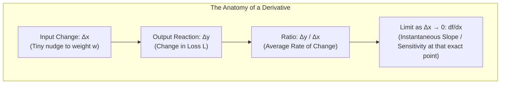
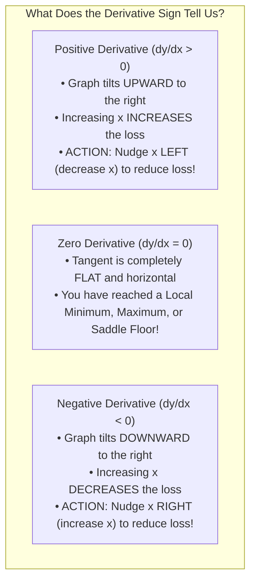
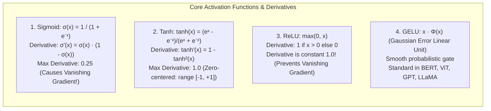
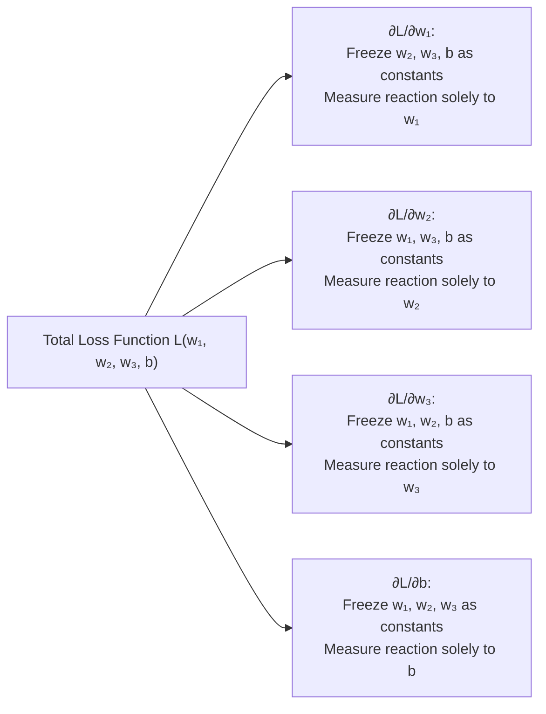
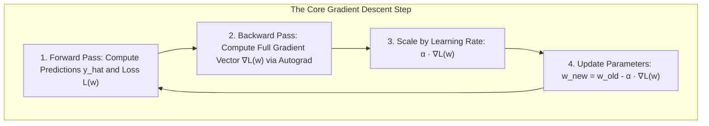
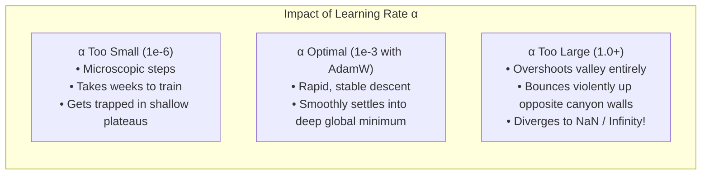
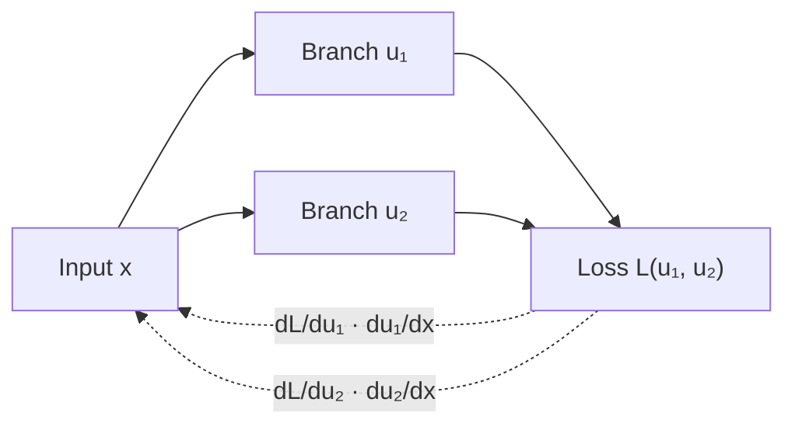
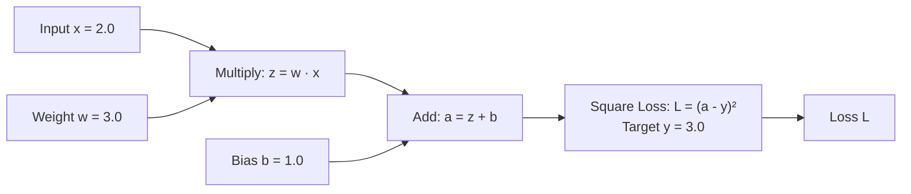
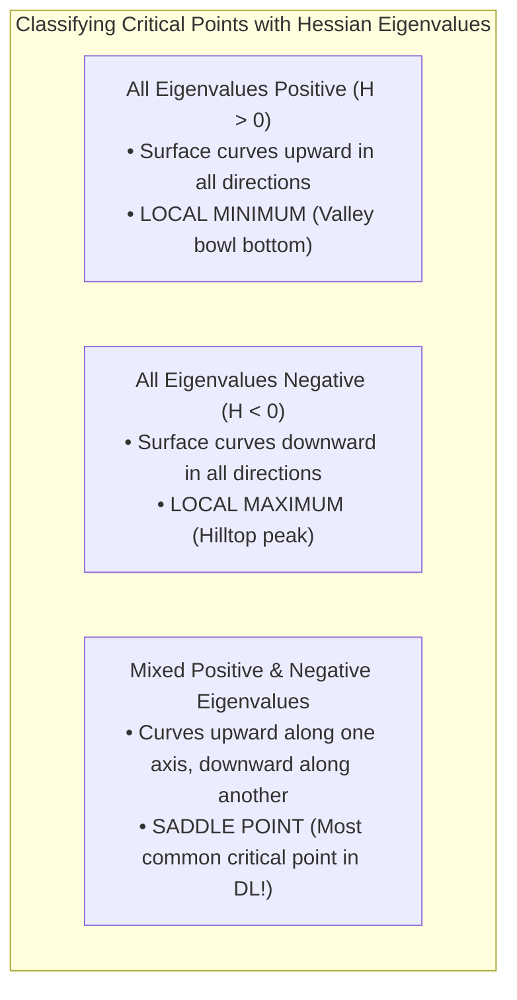
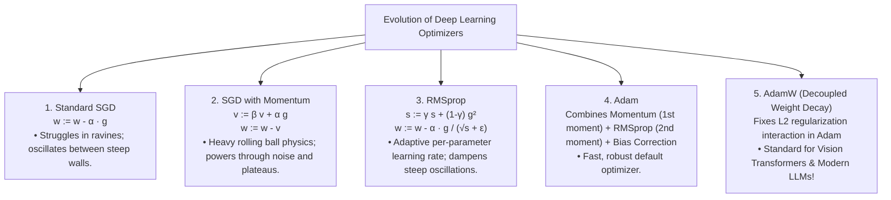

<div class="pixel-banner">
  <div class="pixel-hud-row">
    <div class="pixel-tag"><span class="pixel-indicator"></span>MATH_SYS // CALCULUS_CORE</div>
    <div class="pixel-meta-right">LVL_02 // OPTIMIZATION_DYNAMICS</div>
  </div>
  <div class="pixel-main-content">
    <div class="pixel-avatar">📉</div>
    <div class="pixel-headings">
      <div class="pixel-title-badge">LEVEL 02 // CALCULUS & OPTIMIZATION</div>
      <div class="pixel-subtitle">DERIVATIVES • GRADIENTS • CHAIN RULE • BACKPROPAGATION • LOSS FUNCTIONS • ADAMW</div>
    </div>
    <div class="pixel-sparklines">
      <div class="pixel-bar" style="--h: 92%"></div>
      <div class="pixel-bar" style="--h: 80%"></div>
      <div class="pixel-bar" style="--h: 68%"></div>
      <div class="pixel-bar" style="--h: 50%"></div>
      <div class="pixel-bar" style="--h: 35%"></div>
      <div class="pixel-bar" style="--h: 15%"></div>
    </div>
  </div>
  <div class="pixel-footer-row">
    <span class="pixel-coord">SYS_ID: #02_CALC // OPTIMIZER: ADAMW // LOSS_DESCENT: GLOBAL_MIN</span>
    <span class="pixel-status-text">[ ACTIVE ]</span>
  </div>
</div>

# Level 2: Calculus & Gradient Optimization

<div class="notion-callout">
  <div class="notion-callout-icon">💡</div>
  <div class="notion-callout-content">
    If linear algebra provides the static skeleton of neural networks, <strong>calculus provides the living nervous system and steering wheel</strong>. Calculus answers the single most important question in all of machine learning and computer vision: <em>"Our model just made a prediction error of $+3.84$ on this image. Out of 500 million parameters, which exact weights contributed to the mistake, and in which direction should we nudge each one to guarantee the prediction improves on the next iteration?"</em>
  </div>
</div>

<div class="notion-card-meta" style="margin-bottom: 2rem;">
  <span class="notion-tag notion-tag-purple">Level 2</span>
  <span class="notion-tag notion-tag-gray">Foundational Math</span>
  <span class="notion-tag notion-tag-blue">Calculus & Optimization</span>
</div>

---

## 1. The Intuitive Derivative: Slopes & Rates of Change

At its fundamental level, a **derivative** measures sensitivity and responsiveness: if you change the input to a system by a microscopic amount $\Delta x$, how much does the output $y = f(x)$ react?

$$\frac{df}{dx} = \lim_{\Delta x \to 0} \frac{f(x + \Delta x) - f(x)}{\Delta x}$$



---

### 1.1 What is a Derivative?
A derivative is the ratio comparing the change in output to a tiny change in input as the input step size shrinks toward zero. 

Geometrically, a function graphed on a 2D plane creates a curve. If you pick two points on the curve, the line connecting them is a **secant line** whose slope is $\frac{\Delta y}{\Delta x}$. As you slide the second point closer and closer to the first point until the distance between them $\Delta x \to 0$, the secant line rotates into a **tangent line**. 

The slope of this tangent line at that exact single coordinate is the **derivative**.

---

### 1.2 The Physical Speedometer vs. Average Trip Speed
To understand the difference between an average rate and an instantaneous derivative:

* If you drive **120 miles in 2 hours**, your **average speed** was $\frac{120}{2} = 60\text{ mph}$.
* But your speedometer did not stay at 60 mph the whole time. At a red light or toll booth, you were at **0 mph**. When passing a truck, you were at **78 mph**.
* The **derivative is your speedometer reading at one exact millisecond**: the instantaneous rate of change of position with respect to time $\frac{ds}{dt}$.

In machine learning:
* $x$ represents a weight parameter inside your network (like a multiplier knob).
* $f(x)$ represents the loss function (the error score).
* $\frac{df}{dx} = +4.0$ means: *"If you increase this weight by $0.01$, the error will shoot up by approximately $+0.04$."*
* $\frac{df}{dx} = -10.0$ means: *"If you increase this weight by $0.01$, the error will drop by approximately $-0.10$."*

---

### 1.3 Slope Sign and Optimization Action
The numerical sign of the derivative tells you which way the loss landscape is tilting:



| Slope $\frac{dy}{dx}$ | Visual Meaning | Effect of $+x$ | Optimization Action |
|---|---|---|---|
| **Large Positive ($+15.0$)** | Steep uphill to the right | Error rises fast | Subtract a large step from $x$ ($w \leftarrow w - \alpha \cdot 15$) |
| **Small Positive ($+0.1$)** | Gentle incline uphill | Error rises slowly | Subtract a small step from $x$ ($w \leftarrow w - \alpha \cdot 0.1$) |
| **Zero ($0.0$)** | Completely flat plateau or valley floor | No change | Stop or rely on momentum |
| **Small Negative ($-0.1$)** | Gentle decline downhill | Error drops slowly | Add a small step to $x$ ($w \leftarrow w - \alpha \cdot (-0.1)$) |
| **Large Negative ($-15.0$)** | Steep downhill to the right | Error drops fast | Add a large step to $x$ ($w \leftarrow w - \alpha \cdot (-15)$) |

---

### 1.4 Essential Derivative Rules (With Step-by-Step ML Explanations)

Every neural network loss function, no matter how complex, is broken down into elementary operations whose derivatives follow these foundational rules:

| Rule Name | Function $f(x)$ | Derivative $f'(x)$ | Why It Matters in Deep Learning |
| :--- | :--- | :--- | :--- |
| **Constant Rule** | $c$ (e.g. $7$) | $0$ | Fixed constants (like ground truth labels or frozen pretrained weights) produce zero gradient. |
| **Power Rule** | $x^n$ (e.g. $x^2$) | $n x^{n-1}$ ($2x$) | Powers Mean Squared Error (MSE) loss: $\frac{d}{de}(e^2) = 2e$. |
| **Sum Rule** | $f(x) + g(x)$ | $f'(x) + g'(x)$ | Total loss is the sum of task loss and regularization: $\nabla(L_{\text{task}} + \lambda L_{\text{reg}}) = \nabla L_{\text{task}} + \lambda \nabla L_{\text{reg}}$. |
| **Product Rule** | $f(x) \cdot g(x)$ | $f'(x)g(x) + f(x)g'(x)$ | Used when differentiating gated attention mechanisms (e.g., $Q \cdot K^T$), Swish activations, and residual branches. |
| **Quotient Rule** | $\frac{f(x)}{g(x)}$ | $\frac{f'(x)g(x) - f(x)g'(x)}{(g(x))^2}$ | Essential for deriving the derivative of Sigmoid $\sigma(x) = \frac{1}{1 + e^{-x}}$ and Softmax. |
| **Exponential** | $e^x$ | $e^x$ | Natural growth base. The derivative equals the function itself. Powers Softmax probabilities and Gaussian distributions. |
| **Natural Logarithm** | $\ln(x)$ | $\frac{1}{x}$ | Standard derivative used in Cross-Entropy Loss optimization: $\frac{d}{dp}(-\ln p) = -\frac{1}{p}$. |

```python
import sympy as sp

# Symbolic verification of fundamental calculus rules
x = sp.Symbol('x')

# 1. MSE loss derivative
mse_loss = (x - 5)**2
print("d(MSE)/dx:         ", sp.diff(mse_loss, x))  # 2*(x - 5)

# 2. Cross-entropy log loss derivative
ce_term = -sp.log(x)
print("d(-ln x)/dx:       ", sp.diff(ce_term, x))   # -1/x

# 3. Product rule on Swish / SiLU activation: x * sigmoid(x)
sigmoid_x = 1 / (1 + sp.exp(-x))
swish = x * sigmoid_x
print("d(Swish)/dx:       ", sp.simplify(sp.diff(swish, x)))
```

---

### 1.5 Activation Functions & Their Exact Derivatives

Neural networks can only learn complex non-linear patterns (such as edges, textures, faces, and syntax) because of non-linear **activation functions**. Computing their exact derivatives is required for backpropagation:



#### Detailed Mathematical Derivation of Sigmoid Derivative
Let $\sigma(x) = \frac{1}{1 + e^{-x}} = (1 + e^{-x})^{-1}$.

Using the Power Rule and Chain Rule:

$$\frac{d\sigma}{dx} = -1(1 + e^{-x})^{-2} \cdot \frac{d}{dx}(1 + e^{-x})$$

$$\frac{d\sigma}{dx} = -(1 + e^{-x})^{-2} \cdot (-e^{-x}) = \frac{e^{-x}}{(1 + e^{-x})^2}$$

Rewrite the numerator by adding and subtracting $1$: $e^{-x} = (1 + e^{-x}) - 1$:

$$\frac{d\sigma}{dx} = \frac{(1 + e^{-x}) - 1}{(1 + e^{-x})^2} = \frac{1 + e^{-x}}{(1 + e^{-x})^2} - \frac{1}{(1 + e^{-x})^2} = \frac{1}{1 + e^{-x}} - \left(\frac{1}{1 + e^{-x}}\right)^2$$

Substituting $\sigma(x) = \frac{1}{1 + e^{-x}}$:

$$\mathbf{\sigma'(x) = \sigma(x)(1 - \sigma(x))}$$

#### Why ReLU Solved the Vanishing Gradient Crisis
Look closely at the maximum value of $\sigma'(x)$:
* $\sigma(x)$ outputs values between $0.0$ and $1.0$.
* The peak of $\sigma(x)(1 - \sigma(x))$ occurs at $x = 0$, where $\sigma(0) = 0.5$.
* $\sigma'(0) = 0.5 \times (1 - 0.5) = \mathbf{0.25}$.

If you stack **10 layers** with Sigmoid activations, the backward pass multiplies these derivatives across all 10 layers:

$$0.25^{10} = \mathbf{0.000000953}$$

By the time the error signal reaches Layer 1, the gradient is practically zero. The earliest layers receive no learning signal and remain frozen.

**How ReLU fixes this:**
For all positive activations ($x > 0$), $\text{ReLU}'(x) = \mathbf{1.0}$.
Multiplying $1.0 \times 1.0 \times 1.0 \dots = \mathbf{1.0}$, enabling networks with hundreds of layers (like ResNet-152) to train smoothly without gradient attenuation.

```python
import numpy as np

def sigmoid(x):
    return 1.0 / (1.0 + np.exp(-x))

def sigmoid_grad(x):
    s = sigmoid(x)
    return s * (1.0 - s)

def relu(x):
    return np.maximum(0, x)

def relu_grad(x):
    return (x > 0).astype(float)

def leaky_relu(x, alpha=0.01):
    return np.where(x > 0, x, alpha * x)

def leaky_relu_grad(x, alpha=0.01):
    return np.where(x > 0, 1.0, alpha)

# Evaluate across typical activations
x_vals = np.array([-3.0, -0.5, 0.0, 0.5, 3.0])
print("Inputs:           ", x_vals)
print("Sigmoid Gradients:", np.round(sigmoid_grad(x_vals), 4))
print("ReLU Gradients:   ", relu_grad(x_vals))
print("Leaky ReLU Grads: ", leaky_relu_grad(x_vals))
```

---

## 2. Partial Derivatives: Multiple Knobs on a Dashboard

In deep learning models, you never optimize just one single parameter $x$. You optimize matrices and tensors containing millions of distinct weights $w_1, w_2, \dots, w_n$ and biases $b$.

A **partial derivative** $\frac{\partial f}{\partial w_i}$ measures how the final output reacts when you adjust **one single parameter knob**, while **holding all other parameters strictly frozen in place**:



---

### 2.1 The Formal Definition of Partial Derivatives
For a 2-variable function $f(x, y)$, the partial derivative with respect to $x$ is defined by holding $y$ constant and taking the 1D limit:

$$\frac{\partial f}{\partial x} = \lim_{h \to 0} \frac{f(x + h, y) - f(x, y)}{h}$$

Similarly, the partial derivative with respect to $y$ holds $x$ constant:

$$\frac{\partial f}{\partial y} = \lim_{h \to 0} \frac{f(x, y + h) - f(x, y)}{h}$$

---

### 2.2 Concrete Step-by-Step Multivariable Calculations

Let's compute the partial derivatives for a representative multivariable function:

$$f(x, y, z) = 3x^2 y + 2y z^3 - 5x z + \ln(y) + 7$$

#### Step 1: Compute $\frac{\partial f}{\partial x}$ (Treat $y$ and $z$ like fixed constant numbers such as $4$ and $9$)
* $3x^2 y \implies 3y \cdot \frac{d}{dx}(x^2) = 3y(2x) = \mathbf{6xy}$
* $2y z^3 \implies$ Contains no $x$ variable at all $\implies$ derivative is $\mathbf{0}$
* $-5xz \implies -5z \cdot \frac{d}{dx}(x) = \mathbf{-5z}$
* $\ln(y) + 7 \implies$ No $x$ present $\implies$ derivative is $\mathbf{0}$
* **Result:** $\frac{\partial f}{\partial x} = \mathbf{6xy - 5z}$

#### Step 2: Compute $\frac{\partial f}{\partial y}$ (Treat $x$ and $z$ like fixed constants)
* $3x^2 y \implies 3x^2 \cdot \frac{d}{dy}(y) = \mathbf{3x^2}$
* $2y z^3 \implies 2z^3 \cdot \frac{d}{dy}(y) = \mathbf{2z^3}$
* $-5xz \implies$ No $y$ present $\implies \mathbf{0}$
* $\ln(y) \implies \mathbf{\frac{1}{y}}$
* $+7 \implies \mathbf{0}$
* **Result:** $\frac{\partial f}{\partial y} = \mathbf{3x^2 + 2z^3 + \frac{1}{y}}$

#### Step 3: Compute $\frac{\partial f}{\partial z}$ (Treat $x$ and $y$ like fixed constants)
* $3x^2 y \implies$ No $z$ present $\implies \mathbf{0}$
* $2y z^3 \implies 2y \cdot \frac{d}{dz}(z^3) = 2y(3z^2) = \mathbf{6yz^2}$
* $-5xz \implies -5x \cdot \frac{d}{dz}(z) = \mathbf{-5x}$
* $\ln(y) + 7 \implies$ No $z$ present $\implies \mathbf{0}$
* **Result:** $\frac{\partial f}{\partial z} = \mathbf{6yz^2 - 5x}$

```python
import torch

# Evaluate at point x=2.0, y=4.0, z=1.0
x = torch.tensor(2.0, requires_grad=True)
y = torch.tensor(4.0, requires_grad=True)
z = torch.tensor(1.0, requires_grad=True)

f = 3*x**2 * y + 2*y * z**3 - 5*x*z + torch.log(y) + 7
f.backward()

# Manual calculations:
# df/dx = 6(2)(4) - 5(1) = 48 - 5 = 43.0
# df/dy = 3(2^2) + 2(1^3) + 1/4 = 12 + 2 + 0.25 = 14.25
# df/dz = 6(4)(1^2) - 5(2) = 24 - 10 = 14.0

print("Manual df/dx = 43.00 | PyTorch:", x.grad.item())
print("Manual df/dy = 14.25 | PyTorch:", y.grad.item())
print("Manual df/dz = 14.00 | PyTorch:", z.grad.item())
assert np.isclose(x.grad.item(), 43.0)
assert np.isclose(y.grad.item(), 14.25)
assert np.isclose(z.grad.item(), 14.0)
```

---

### 2.3 Directional Derivatives: Moving in Arbitrary Directions
A partial derivative only tells you what happens if you move strictly parallel to one coordinate axis ($X$, $Y$, or $Z$). What if you step along a diagonal vector $\mathbf{v} = [v_1, v_2]^T$?

The **Directional Derivative** $D_{\mathbf{u}} f$ measures the rate of change when moving in the direction of a normalized unit vector $\mathbf{u} = \frac{\mathbf{v}}{\|\mathbf{v}\|}$:

$$D_{\mathbf{u}} f = \nabla f \cdot \mathbf{u} = \frac{\partial f}{\partial x} u_x + \frac{\partial f}{\partial y} u_y$$

This brings us directly to the definition and power of the **Gradient Vector**.

---

## 3. The Gradient Vector (∇f): The Optimization Compass

When you assemble all the individual partial derivatives into a single column vector, you obtain the **Gradient** (denoted with the nabla symbol $\nabla f$):

$$\nabla f(\mathbf{w}) = \begin{bmatrix}
\frac{\partial f}{\partial w_1} \\[4pt]
\frac{\partial f}{\partial w_2} \\[4pt]
\vdots \\[4pt]
\frac{\partial f}{\partial w_n}
\end{bmatrix}$$

---

### 3.1 The Fundamental Laws of the Gradient Vector

1. **Direction of Steepest Ascent:** $\nabla f(\mathbf{w})$ points in the exact direction in parameter space that produces the fastest increase in output loss.
2. **Magnitude is Steepness:** $\|\nabla f\| = \sqrt{\sum_{i} \left(\frac{\partial f}{\partial w_i}\right)^2}$ gives the exact rate of maximum slope.
3. **Direction of Steepest Descent:** $-\nabla f(\mathbf{w})$ points in the exact opposite direction — the fastest way downhill to minimize loss.
4. **Orthogonal to Contour Lines:** The gradient vector is always perpendicular (at $90^{\circ}$) to the level curves / contour lines of the loss surface.



---

### 3.2 Mathematical Proof: Why $-\nabla f$ is Guaranteed to be Steepest Descent

Let $\mathbf{u}$ be any unit direction vector in parameter space (such that $\|\mathbf{u}\| = 1$). The rate of change in direction $\mathbf{u}$ is given by the dot product:

$$D_{\mathbf{u}} f = \nabla f \cdot \mathbf{u} = \|\nabla f\| \|\mathbf{u}\| \cos(\theta) = \|\nabla f\| \cos(\theta)$$

Where $\theta$ is the angle between the step direction $\mathbf{u}$ and the gradient vector $\nabla f$:

* **To maximize rate of increase (Steepest Ascent):**
  Set $\cos(\theta) = +1 \implies \theta = 0^{\circ} \implies \mathbf{u} = +\frac{\nabla f}{\|\nabla f\|}$.
* **To minimize rate of change (Steepest Descent / Maximum Error Drop):**
  Set $\cos(\theta) = -1 \implies \theta = 180^{\circ} \implies \mathbf{u} = -\frac{\nabla f}{\|\nabla f\|}$.

This proves that stepping in the negative gradient direction $-\nabla f$ is mathematically guaranteed to provide the fastest instantaneous reduction in loss!

---

### 3.3 A Worked Numerical Example of Gradient Descent
Let's minimize a 2D quadratic loss function:

$$L(w_1, w_2) = w_1^2 + 4w_2^2$$

The gradient vector is:

$$\nabla L = \begin{bmatrix} \frac{\partial L}{\partial w_1} \\[4pt] \frac{\partial L}{\partial w_2} \end{bmatrix} = \begin{bmatrix} 2w_1 \\[4pt] 8w_2 \end{bmatrix}$$

Let's start at initial point $\mathbf{w}_0 = (4.0, 2.0)$ with learning rate $\alpha = 0.1$:

#### Iteration 1:
1. Current position: $\mathbf{w}_0 = [4.0, 2.0]^T$, Loss $L = 4^2 + 4(2^2) = 16 + 16 = \mathbf{32.0}$
2. Gradient at $\mathbf{w}_0$: $\nabla L = [2(4.0), 8(2.0)]^T = [8.0, 16.0]^T$
3. Update step:
   $$w_1 = 4.0 - 0.1(8.0) = 4.0 - 0.8 = \mathbf{3.2}$$
   $$w_2 = 2.0 - 0.1(16.0) = 2.0 - 1.6 = \mathbf{0.4}$$
4. New position: $\mathbf{w}_1 = [3.2, 0.4]^T$, New Loss $L = 3.2^2 + 4(0.4^2) = 10.24 + 0.64 = \mathbf{10.88}$ (Loss dropped from 32.0 to 10.88!)

#### Iteration 2:
1. Gradient at $\mathbf{w}_1$: $\nabla L = [2(3.2), 8(0.4)]^T = [6.4, 3.2]^T$
2. Update step:
   $$w_1 = 3.2 - 0.1(6.4) = 3.2 - 0.64 = \mathbf{2.56}$$
   $$w_2 = 0.4 - 0.1(3.2) = 0.4 - 0.32 = \mathbf{0.08}$$
3. New position: $\mathbf{w}_2 = [2.56, 0.08]^T$, New Loss $L = 2.56^2 + 4(0.08^2) = 6.55 + 0.026 = \mathbf{6.58}$

Notice how rapidly the parameters converge toward the optimal minimum at $(0.0, 0.0)$ where $L = 0$.

```python
import numpy as np

# Simulate 20 iterations of Gradient Descent
w = np.array([4.0, 2.0])
alpha = 0.1

for step in range(1, 6):
    grad = np.array([2 * w[0], 8 * w[1]])
    w = w - alpha * grad
    loss = w[0]**2 + 4 * w[1]**2
    print(f"Step {step}: w = [{w[0]:.4f}, {w[1]:.4f}] | Loss = {loss:.4f}")
```

---

### 3.4 The Critical Impact of Learning Rate ($\alpha$)



| Regime | Value | Behavior | Symptoms |
|---|---|---|---|
| **Too Small** | $10^{-6}$ | Takes millions of epochs to make tiny progress; easily freezes in flat regions. | Loss curve is a completely flat horizontal line. |
| **Optimal** | $10^{-3}$ | Rapid early progress that smoothly decelerates into the global basin. | Steady, monotonic decline in training loss. |
| **Too Large** | $0.8$ | Overshoots the valley bottom and climbs higher on the opposite slope. | Loss oscillates wildly ($2.1 \to 14.5 \to 89.0 \to \text{NaN}$). |

---

## 4. The Chain Rule: The Engine of Backpropagation

A modern deep neural network is a chain of composite functions:

$$\mathbf{x} \xrightarrow{\text{Layer 1}} \mathbf{h}_1 \xrightarrow{\text{Layer 2}} \mathbf{h}_2 \xrightarrow{\dots} \hat{\mathbf{y}} \xrightarrow{\text{Loss}} \mathcal{L}$$

How does an error at the final output $\mathcal{L}$ reach all the way back through 50 layers to adjust weight $w_1$ inside the very first layer? **Through the Chain Rule!**

---

### 4.1 The Single-Variable Chain Rule & Gear Analogy

If $y = f(u)$ and $u = g(x)$, then:

$$\frac{dy}{dx} = \frac{dy}{du} \cdot \frac{du}{dx}$$

Think of three interlocking mechanical gears $A, B, C$:
* If turning Gear $A$ by $1$ rotation spins Gear $B$ by **$3$ rotations** ($\frac{dB}{dA} = 3$),
* And turning Gear $B$ by $1$ rotation spins Gear $C$ by **$4$ rotations** ($\frac{dC}{dB} = 4$),
* How many rotations does Gear $C$ make when you turn Gear $A$ once?

$$\frac{dC}{dA} = \frac{dC}{dB} \times \frac{dB}{dA} = 4 \times 3 = \mathbf{12\text{ rotations!}}$$

The intermediate rates of change multiply together sequentially.

---

### 4.2 The Multivariate Chain Rule: Summing Across Multiple Computational Paths
When an input $x$ influences the final loss through **multiple distinct intermediate routes** (for example, in residual connections or branching networks):

$$\frac{\partial \mathcal{L}}{\partial x} = \sum_{k} \frac{\partial \mathcal{L}}{\partial u_k} \frac{\partial u_k}{\partial x}$$



Every parallel path delivers its own contribution to the total gradient, and the total sensitivity is their **sum**.

---

### 4.3 Full End-to-End Hand-Worked Backpropagation Trace

Let's trace a small neural network end-to-end with explicit numbers through both the **Forward Pass** and the **Backward Pass**:



#### Step 1: Forward Pass
1. $z = w \cdot x = 3.0 \times 2.0 = \mathbf{6.0}$
2. $a = z + b = 6.0 + 1.0 = \mathbf{7.0}$
3. Prediction error: $e = a - y = 7.0 - 3.0 = \mathbf{4.0}$
4. Loss: $L = e^2 = 4.0^2 = \mathbf{16.0}$

#### Step 2: Backward Pass (Flowing Gradients via Chain Rule)
We work strictly backwards from the loss $L$ to find $\frac{\partial L}{\partial w}$ and $\frac{\partial L}{\partial b}$:

1. **How does loss $L$ react to $a$?**
   $$\frac{\partial L}{\partial a} = \frac{d}{da}((a - 3.0)^2) = 2(a - 3.0) = 2(7.0 - 3.0) = \mathbf{8.0}$$

2. **How does $a$ react to $z$?**
   $$a = z + b \implies \frac{\partial a}{\partial z} = \mathbf{1.0}$$

3. **How does loss $L$ react to $z$ (Chain Rule)?**
   $$\frac{\partial L}{\partial z} = \frac{\partial L}{\partial a} \cdot \frac{\partial a}{\partial z} = 8.0 \times 1.0 = \mathbf{8.0}$$

4. **How does $z$ react to weight $w$?**
   $$z = w \cdot x \implies \frac{\partial z}{\partial w} = x = \mathbf{2.0}$$

5. **Final Gradient for Weight $w$:**
   $$\frac{\partial L}{\partial w} = \frac{\partial L}{\partial z} \cdot \frac{\partial z}{\partial w} = 8.0 \times 2.0 = \mathbf{16.0}$$

6. **Final Gradient for Bias $b$:**
   $$\frac{\partial L}{\partial b} = \frac{\partial L}{\partial a} \cdot \frac{\partial a}{\partial b} = 8.0 \times 1.0 = \mathbf{8.0}$$

#### Step 3: Parameter Updates
With learning rate $\alpha = 0.05$:

$$w_{\text{new}} = w_{\text{old}} - \alpha \frac{\partial L}{\partial w} = 3.0 - (0.05 \times 16.0) = 3.0 - 0.8 = \mathbf{2.20}$$

$$b_{\text{new}} = b_{\text{old}} - \alpha \frac{\partial L}{\partial b} = 1.0 - (0.05 \times 8.0) = 1.0 - 0.4 = \mathbf{0.60}$$

Let's test this in PyTorch:

```python
import torch

# Initialize parameters with gradient tracking
w = torch.tensor(3.0, requires_grad=True)
b = torch.tensor(1.0, requires_grad=True)
x = torch.tensor(2.0)
y_target = torch.tensor(3.0)

# Forward pass
z = w * x
a = z + b
loss = (a - y_target) ** 2

# Backward pass
loss.backward()

print("Manual dL/dw = 16.0 | PyTorch w.grad:", w.grad.item())
print("Manual dL/db =  8.0 | PyTorch b.grad:", b.grad.item())
assert abs(w.grad.item() - 16.0) < 1e-6
assert abs(b.grad.item() - 8.0) < 1e-6
```

---

### 4.4 How ResNet Skip Connections Protect Deep Gradients

In standard sequential networks without residual connections:

$$\frac{\partial \mathcal{L}}{\partial \mathbf{x}_1} = \frac{\partial \mathcal{L}}{\partial \mathbf{x}_L} \cdot \prod_{l=1}^{L-1} \mathbf{W}_l$$

If weight norms are slightly $< 1.0$, multiplying 100 layer matrices causes exponential decay toward $0.0$ (Vanishing Gradient).

**The ResNet Solution:**

$$\mathbf{x}_{l+1} = \mathbf{x}_l + \mathcal{F}(\mathbf{x}_l, \mathbf{W}_l)$$

Taking the derivative with respect to $\mathbf{x}_l$:

$$\frac{\partial \mathbf{x}_{l+1}}{\partial \mathbf{x}_l} = \mathbf{I} + \frac{\partial \mathcal{F}}{\partial \mathbf{x}_l}$$

The presence of the identity matrix $\mathbf{I}$ guarantees that the gradient $\frac{\partial \mathcal{L}}{\partial \mathbf{x}}$ has a clean, uninterrupted gradient highway to flow directly back to the earliest layers with a baseline scale of $1.0$, enabling stable training of **1,000+ layer deep models**.

---

## 5. Common Loss Functions & Their Exact Derivatives

Every computer vision and deep learning architecture relies on a specialized loss function tailored to its task (regression, classification, object detection). Here is how their derivatives behave:

---

### 5.1 Mean Squared Error (MSE) — Regression
Used for bounding box regression, depth estimation, and keypoint prediction:

$$L_{\text{MSE}} = \frac{1}{2}(y - \hat{y})^2$$

$$\frac{\partial L}{\text{MSE}}{\partial \hat{y}} = (\hat{y} - y)$$

* **Behavior:** The gradient is proportional to the prediction error. Large errors produce huge gradients; small errors produce tiny gradients.
* **Sensitivity:** Sensitive to outliers because squaring an extreme error ($100^2 = 10,000$) dominates the entire gradient step.

---

### 5.2 Binary Cross-Entropy (BCE) with Sigmoid — Binary Classification
Used for binary classification (e.g., Cat vs. Dog, Defect vs. Normal):

$$L_{\text{BCE}} = -\left[y \ln(\hat{y}) + (1 - y) \ln(1 - \hat{y})\right], \quad \text{where } \hat{y} = \sigma(z) = \frac{1}{1 + e^{-z}}$$

Let's compute the derivative with respect to the raw logit $z$:

$$\frac{\partial L}{\partial z} = \frac{\partial L}{\partial \hat{y}} \cdot \frac{\partial \hat{y}}{\partial z}$$

1. $\frac{\partial L}{\partial \hat{y}} = -\frac{y}{\hat{y}} + \frac{1 - y}{1 - \hat{y}} = \frac{\hat{y} - y}{\hat{y}(1 - \hat{y})}$
2. $\frac{\partial \hat{y}}{\partial z} = \hat{y}(1 - \hat{y})$ (the Sigmoid derivative)

Multiplying them together via the Chain Rule:

$$\frac{\partial L}{\partial z} = \frac{\hat{y} - y}{\hat{y}(1 - \hat{y})} \cdot \hat{y}(1 - \hat{y}) = \mathbf{\hat{y} - y}$$

The non-linear denominator cancels out the Sigmoid saturation derivative! Even if the Sigmoid saturates, the combined gradient is simply:

$$\mathbf{\nabla_z L = \hat{y} - y \quad (\text{Predicted Probability } - \text{ Target Label})}$$

---

### 5.3 Categorical Cross-Entropy with Softmax — Multi-Class Classification
For a $K$-class classification problem (e.g., ImageNet 1,000 classes):

$$p_i = \frac{e^{z_i}}{\sum_{j=1}^K e^{z_j}}, \quad L_{\text{CE}} = -\sum_{i=1}^K y_i \ln(p_i)$$

The derivative of Cross-Entropy with respect to each raw output logit $z_i$ reduces to:

$$\mathbf{\frac{\partial L}{\partial z_i} = p_i - y_i}$$

| Target $y_i$ | Model Probability $p_i$ | Gradient $\frac{\partial L}{\partial z_i}$ | Meaning |
|---|---|---|---|
| **$1.0$ (True class)** | $0.95$ (High confidence) | $0.95 - 1.0 = \mathbf{-0.05}$ | Very small negative gradient; logit nudged slightly upward. |
| **$1.0$ (True class)** | $0.10$ (Wrong prediction!) | $0.10 - 1.0 = \mathbf{-0.90}$ | Massive negative gradient; strongly pushes logit upward. |
| **$0.0$ (Wrong class)**| $0.80$ (False alarm!) | $0.80 - 0.0 = \mathbf{+0.80}$ | Massive positive gradient; strongly suppresses logit downward. |

---

### 5.4 Smooth L1 (Huber) Loss — Robust Bounding Box Regression
Used in YOLO, Faster R-CNN, and SSD for object detection bounding boxes:

$$L_{\text{SmoothL1}}(e) = \begin{cases}
0.5 e^2 & \text{if } |e| < 1.0 \\
|e| - 0.5 & \text{otherwise}
\end{cases}$$

* For small errors ($|e| < 1$): Acts like $L_2$ (MSE) with smooth parabolic gradients ($e$).
* For huge errors ($|e| \ge 1$): Acts like $L_1$ (linear) with capped constant gradients ($\pm 1.0$).
* **Benefit:** Outlier bounding boxes cannot cause gradient explosions!

---

## 6. Jacobians, Hessians & Higher-Order Calculus

When optimizing multi-dimensional vector transformations:

### 6.1 The Jacobian Matrix ($\mathbf{J}$)

When a function maps an input vector of $n$ dimensions to an output vector of $m$ dimensions:

$$\mathbf{f}: \mathbb{R}^n \to \mathbb{R}^m, \quad \mathbf{y} = \mathbf{f}(\mathbf{x})$$

The **Jacobian** is the $(m \times n)$ matrix collecting all first-order partial derivatives:

$$\mathbf{J} = \begin{bmatrix}
\frac{\partial y_1}{\partial x_1} & \frac{\partial y_1}{\partial x_2} & \dots & \frac{\partial y_1}{\partial x_n} \\[6pt]
\frac{\partial y_2}{\partial x_1} & \frac{\partial y_2}{\partial x_2} & \dots & \frac{\partial y_2}{\partial x_n} \\[6pt]
\vdots & \vdots & \ddots & \vdots \\[6pt]
\frac{\partial y_m}{\partial x_1} & \frac{\partial y_m}{\partial x_2} & \dots & \frac{\partial y_m}{\partial x_n}
\end{bmatrix}$$

#### Major Use Cases:
1. **Softmax Layer Gradient:** Computing the full Jacobian of Softmax probabilities with respect to logits: $J_{ii} = p_i(1 - p_i)$, $J_{ij} = -p_i p_j$.
2. **Generative Modeling & Normalizing Flows:** The determinant $|\det(\mathbf{J})|$ tracks how probability volume compresses or expands during latent coordinate changes.
3. **Lucas-Kanade Optical Flow (OpenCV):** Solves a $2 \times 2$ image spatial gradient Jacobian system to estimate pixel motion velocities.

---

### 6.2 The Hessian Matrix ($\mathbf{H}$): Measuring Curvature & Acceleration

While the **Gradient** measures slope (**speed**), the **Hessian** measures second-order partial derivatives (**curvature and acceleration**):

$$\mathbf{H}_{ij} = \frac{\partial^2 f}{\partial w_i \partial w_j}$$

$$\mathbf{H} = \begin{bmatrix}
\frac{\partial^2 f}{\partial w_1^2} & \frac{\partial^2 f}{\partial w_1 \partial w_2} & \dots & \frac{\partial^2 f}{\partial w_1 \partial w_n} \\[6pt]
\frac{\partial^2 f}{\partial w_2 \partial w_1} & \frac{\partial^2 f}{\partial w_2^2} & \dots & \frac{\partial^2 f}{\partial w_2 \partial w_n} \\[6pt]
\vdots & \vdots & \ddots & \vdots \\[6pt]
\frac{\partial^2 f}{\partial w_n \partial w_1} & \frac{\partial^2 f}{\partial w_n \partial w_2} & \dots & \frac{\partial^2 f}{\partial w_n^2}
\end{bmatrix}$$



#### Why Don't We Use Second-Order Newton Methods in Deep Learning?
Newton's optimization method uses curvature to jump directly to the bottom of the bowl:

$$\mathbf{w}_{t+1} = \mathbf{w}_t - \mathbf{H}^{-1} \nabla f(\mathbf{w}_t)$$

While it converges in very few iterations for simple convex problems, it is completely intractable for deep learning:
* For a model with $N = 100\text{ million}$ weights, $\mathbf{H}$ has $N^2 = 10^{16}$ entries.
* Storing $10^{16}$ numbers requires **40,000 Terabytes of RAM**.
* Inverting an $(N \times N)$ matrix requires $O(N^3) = 10^{24}$ operations.

For this reason, all modern deep learning is powered by **first-order gradient methods with momentum** (SGD, AdamW).

---

## 7. Modern Optimizers: From SGD to AdamW

Navigating deep neural network loss surfaces is like guiding a blind hiker down a foggy, high-dimensional mountain range with steep ravines, saddle points, and plateaus.



---

### 7.1 Stochastic Gradient Descent (SGD) with Momentum

Standard SGD updates weights using a single mini-batch gradient $\mathbf{g}_t$:

$$\mathbf{w}_{t+1} = \mathbf{w}_t - \alpha \mathbf{g}_t$$

In narrow ravines, SGD oscillates wildly between steep side walls while making almost zero progress down the gentle valley floor.

**Momentum adds a rolling velocity vector $\mathbf{v}_t$:**

$$\mathbf{v}_t = \beta \mathbf{v}_{t-1} + (1 - \beta) \mathbf{g}_t$$

$$\mathbf{w}_{t+1} = \mathbf{w}_t - \alpha \mathbf{v}_t$$

* $\beta$ (typically $0.9$) represents friction / momentum retention.
* Gradients oscillating across the canyon walls cancel each other out ($+10, -10, +10 \implies \text{sum} \approx 0$).
* Consistent gradients down the valley floor accumulate velocity, accelerating convergence by **$5\times$ to $10\times$**.

---

### 7.2 RMSprop (Adaptive Gradient Scaling)

In large models, some parameters receive massive gradients while others receive tiny gradients. A single global learning rate either causes large parameters to explode or small parameters to stall.

**RMSprop** maintains an exponential moving average of squared gradients $\mathbf{s}_t$:

$$\mathbf{s}_t = \gamma \mathbf{s}_{t-1} + (1 - \gamma) \mathbf{g}_t^2$$

$$\mathbf{w}_{t+1} = \mathbf{w}_t - \frac{\alpha}{\sqrt{\mathbf{s}_t + \epsilon}} \odot \mathbf{g}_t$$

* Parameters with **massive gradients**: $\sqrt{\mathbf{s}_t}$ is large $\implies$ Step size is automatically dampened.
* Parameters with **tiny, infrequent gradients**: $\sqrt{\mathbf{s}_t}$ is small $\implies$ Step size is automatically boosted.

---

### 7.3 Adam (Adaptive Moment Estimation)

Adam combines the momentum of SGD with the adaptive scaling of RMSprop, and introduces **bias correction** to prevent erratic jumps during early training steps:

$$m_t = \beta_1 m_{t-1} + (1 - \beta_1) g_t \quad (\text{First Moment: Mean Gradient})$$

$$v_t = \beta_2 v_{t-1} + (1 - \beta_2) g_t^2 \quad (\text{Second Moment: Uncentered Variance})$$

$$\hat{m}_t = \frac{m_t}{1 - \beta_1^t}, \quad \hat{v}_t = \frac{v_t}{1 - \beta_2^t} \quad (\text{Bias Correction for Step } t)$$

$$\mathbf{w}_{t+1} = \mathbf{w}_t - \frac{\alpha}{\sqrt{\hat{v}_t} + \epsilon} \hat{m}_t$$

* Standard defaults: $\alpha = 10^{-3}$, $\beta_1 = 0.9$, $\beta_2 = 0.999$, $\epsilon = 10^{-8}$.

---

### 7.4 AdamW: The Industry Standard for Modern AI

In standard Adam with $L_2$ regularization, the weight penalty gets divided by $\sqrt{\hat{v}_t}$. As a result:
* Weights with large historical gradients receive **less** weight decay penalty.
* Weights with small gradients receive **more** penalty.
* This completely breaks the purpose of $L_2$ regularization!

**AdamW decouples weight decay directly from gradient scaling:**

$$\mathbf{w}_{t+1} = \mathbf{w}_t - \alpha \lambda \mathbf{w}_t - \frac{\alpha}{\sqrt{\hat{v}_t} + \epsilon} \hat{m}_t$$

Today, **AdamW is the default optimizer** used for training Vision Transformers (ViT), CLIP, DINOv2, YOLOv8/v9, Diffusion Models, and Large Language Models (LLaMA, GPT-4).

```python
import torch
import torch.nn as nn
import torch.optim as optim

# Production setup for Vision Transformer / ConvNet training
model = nn.Sequential(
    nn.Linear(512, 256),
    nn.LayerNorm(256),
    nn.GELU(),
    nn.Linear(256, 10)
)

optimizer = optim.AdamW(
    model.parameters(),
    lr=1e-3,            # Base learning rate
    betas=(0.9, 0.999), # Exponential decay for 1st & 2nd moments
    eps=1e-8,           # Numerical stability epsilon
    weight_decay=0.01   # Decoupled weight decay regularization
)

# Optional: Cosine Annealing Learning Rate Schedule
scheduler = optim.lr_scheduler.CosineAnnealingLR(optimizer, T_max=100)
```

---

## 8. Optimizer Comparison Cheat Sheet

| Optimizer | Memory Overhead | Best Suited For | Key Hyperparameters | Typical Failure Mode |
|---|---|---|---|---|
| **SGD** | $0\times$ extra (0 state) | Simple convex baselines | `lr=0.01` | Trapped in saddle points / ravines |
| **SGD+Momentum** | $1\times$ extra (stores $\mathbf{v}$) | High-accuracy ResNet/ConvNet training | `lr=0.1`, `momentum=0.9` | Sensitive to learning rate schedule |
| **RMSprop** | $1\times$ extra (stores $\mathbf{s}$) | RNNs, Reinforcement Learning | `lr=0.001`, `alpha=0.99` | Premature decay in non-stationary tasks |
| **Adam** | $2\times$ extra (stores $\mathbf{m}, \mathbf{v}$) | Quick prototyping across all tasks | `lr=1e-3`, `betas=(0.9, 0.999)` | Suboptimal generalization with $L_2$ decay |
| **AdamW** | $2\times$ extra (stores $\mathbf{m}, \mathbf{v}$) | **Vision Transformers, ViT, LLMs, Diffusion Models** | `lr=1e-3`, `weight_decay=0.01` | Requires memory for 2 state tensors per param |

---

<div class="notion-callout">
  <div class="notion-callout-icon">🎯</div>
  <div class="notion-callout-content">
    <strong>Level 2 Complete Summary:</strong>
    <ul>
      <li><strong>Derivatives:</strong> Measure the instantaneous reaction of loss to an infinitesimal parameter nudge.</li>
      <li><strong>Activation Functions:</strong> Non-linear transforms. ReLU prevents vanishing gradients by maintaining a constant derivative of 1.0 for positive activations.</li>
      <li><strong>Partial Derivatives & Gradients:</strong> $\nabla L$ collects all partial derivatives into the direction of steepest loss ascent. Gradient descent steps along $-\nabla L$.</li>
      <li><strong>Chain Rule & Backpropagation:</strong> Computes the backward product of local derivatives, allowing error signals from the output loss to update any parameter across hundreds of layers.</li>
      <li><strong>Common Losses:</strong> Cross-entropy combined with Softmax / Sigmoid yields the intuitive gradient $\hat{y} - y$ (predicted probability minus target label).</li>
      <li><strong>Jacobians & Hessians:</strong> First-order matrices for vector mappings and second-order matrices for curvature. Second-order Newton methods are computationally intractable for billion-parameter models.</li>
      <li><strong>AdamW:</strong> The modern optimizer of choice, fusing momentum (smooth direction) with adaptive gradient scaling (per-parameter step size) and decoupled weight decay.</li>
    </ul>
  </div>
</div>
