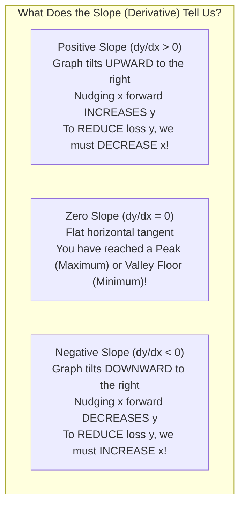
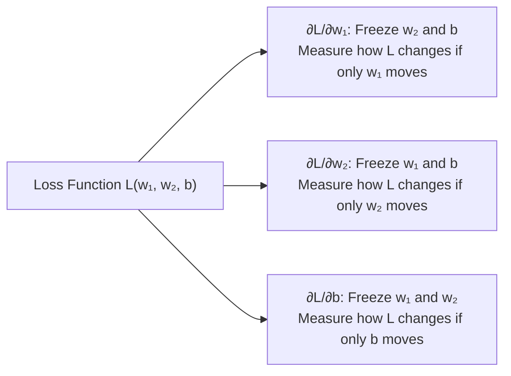
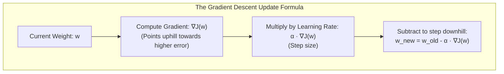
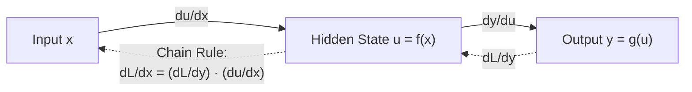
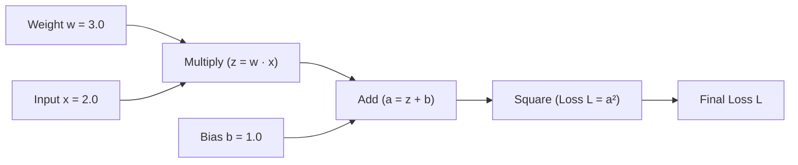
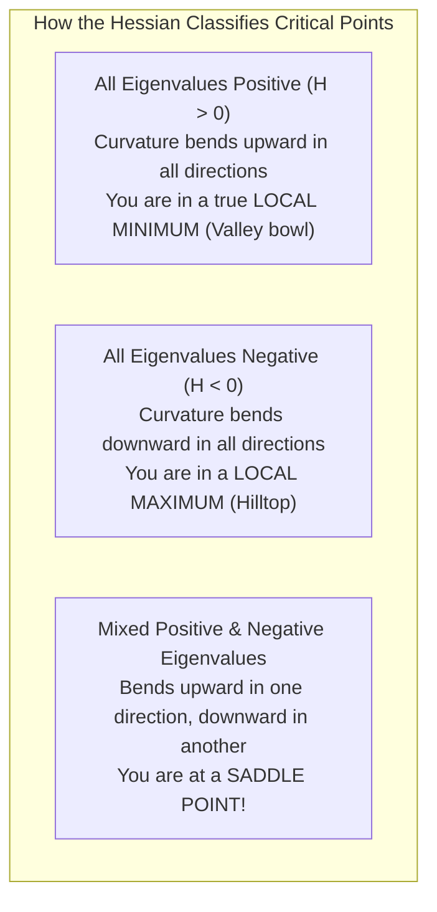
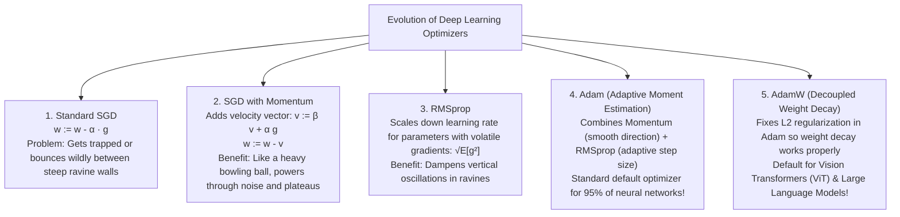

<div class="pixel-banner">
  <div class="pixel-hud-row">
    <div class="pixel-tag"><span class="pixel-indicator"></span>MATH_SYS // CALCULUS_CORE</div>
    <div class="pixel-meta-right">LVL_02 // OPTIMIZATION_DYNAMICS</div>
  </div>
  <div class="pixel-main-content">
    <div class="pixel-avatar">📉</div>
    <div class="pixel-headings">
      <div class="pixel-title-badge">LEVEL 02 // CALCULUS & OPTIMIZATION</div>
      <div class="pixel-subtitle">DERIVATIVES • GRADIENTS • CHAIN RULE • BACKPROPAGATION • JACOBIANS • ADAM</div>
    </div>
    <div class="pixel-sparklines">
      <div class="pixel-bar" style="--h: 92%"></div>
      <div class="pixel-bar" style="--h: 80%"></div>
      <div class="pixel-bar" style="--h: 68%"></div>
      <div class="pixel-bar" style="--h: 50%"></div>
      <div class="pixel-bar" style="--h: 35%"></div>
      <div class="pixel-bar" style="--h: 15%"></div>
    </div>
  </div>
  <div class="pixel-footer-row">
    <span class="pixel-coord">SYS_ID: #02_CALC // OPTIMIZER: ADAMW // LOSS_DESCENT: GLOBAL_MIN</span>
    <span class="pixel-status-text">[ ACTIVE ]</span>
  </div>
</div>

# Level 2: Calculus & Gradient Optimization

<div class="notion-callout">
  <div class="notion-callout-icon">💡</div>
  <div class="notion-callout-content">
    If linear algebra is the skeleton of neural networks, <strong>calculus is the nervous system</strong>. Calculus answers the fundamental question of machine learning: <em>"If our model made a prediction error of $+2.4$, which of our 50 million weights was responsible, and in which direction should we nudge each weight to make the error smaller next time?"</em>
  </div>
</div>

<div class="notion-card-meta" style="margin-bottom: 2rem;">
  <span class="notion-tag notion-tag-purple">Level 2</span>
  <span class="notion-tag notion-tag-gray">Foundational Math</span>
  <span class="notion-tag notion-tag-blue">Calculus & Optimization</span>
</div>

---

## 1. The Intuitive Derivative: Slopes & Rates of Change

A **derivative** measures the sensitivity of a function: if you nudge the input $x$ by a microscopic amount $\Delta x$, how much does the output $y$ react?

$$\frac{dy}{dx} = \lim_{\Delta x \to 0} \frac{f(x + \Delta x) - f(x)}{\Delta x}$$

### The Car Speedometer Analogy
* If you drive $120$ miles in $2$ hours, your **average speed** was $60$ mph.
* But at any specific second on the highway, your speedometer might read $72$ mph or $0$ mph at a toll booth.
* The **derivative is your speedometer reading right now**: the instantaneous rate of change at one exact point in time.



### Essential Derivative Rules (Explained Simply)

| Rule Name | Function $f(x)$ | Derivative $f'(x)$ | Intuition & Example |
| :--- | :--- | :--- | :--- |
| **Constant Rule** | $c$ (e.g. $5$) | $0$ | A flat horizontal line has zero slope. A constant never changes. |
| **Power Rule** | $x^n$ (e.g. $x^3$) | $n x^{n-1}$ ($3x^2$) | Bring the power to the front, subtract 1 from exponent. |
| **Sum Rule** | $f(x) + g(x)$ | $f'(x) + g'(x)$ | Differentiate each piece separately: $(x^2 + 5x)' = 2x + 5$. |
| **Exponential** | $e^x$ | $e^x$ | Natural growth rate: the only function whose slope equals its value! |
| **Logarithm** | $\ln(x)$ | $\frac{1}{x}$ | Standard derivative used in Cross-Entropy Loss optimization. |

---

## 2. Partial Derivatives: Multiple Knobs on a Dashboard

In a real neural network, you don't have just one parameter $x$; you have millions of weights $w_1, w_2, \dots, w_n$ and biases $b$.

A **partial derivative** $\frac{\partial f}{\partial x}$ measures how the output changes when you turn **one single knob**, while **holding all other knobs completely frozen**:



### Concrete Step-by-Step Calculation
Let's find the partial derivatives of the function:

$$f(x, y) = 3x^2 y + 4y^3$$

1. **Calculate $\frac{\partial f}{\partial x}$ (Treat $y$ like an ordinary number like $7$):**
   * The derivative of $3x^2$ is $6x$. The frozen $y$ just tags along: $6xy$.
   * The term $4y^3$ has no $x$ in it at all, so it acts like a pure constant: derivative is $0$.
   * Result: $\frac{\partial f}{\partial x} = 6xy$

2. **Calculate $\frac{\partial f}{\partial y}$ (Treat $x$ like an ordinary number like $5$):**
   * In $3x^2 y$, the derivative of $y$ is $1$, leaving $3x^2$.
   * In $4y^3$, power rule gives $12y^2$.
   * Result: $\frac{\partial f}{\partial y} = 3x^2 + 12y^2$

---

## 3. The Gradient Vector (∇f): The Compass of Optimization

When you collect all the partial derivatives into a single vector, you get the **Gradient** (written with the nabla symbol $\nabla f$):

$$\nabla f(\mathbf{w}) = \begin{bmatrix} \frac{\partial f}{\partial w_1} \\ \frac{\partial f}{\partial w_2} \\ \vdots \\ \frac{\partial f}{\partial w_n} \end{bmatrix}$$

### The Universal Law of Gradients
* **$\nabla f$ always points in the direction of STEEPEST ASCENT** (the fastest way uphill to maximum error).
* **$-\nabla f$ always points in the direction of STEEPEST DESCENT** (the fastest way downhill to minimum error).



### The Impact of Learning Rate (α)
* **$\alpha$ Too Small ($10^{-6}$):** The model takes microscopic baby steps. Training takes weeks and can get stuck on flat plateaus.
* **$\alpha$ Too Large ($10.0$):** The step overshoots the valley entirely, bounces up the opposite wall, oscillates violently, and diverges to `NaN` or Infinity!
* **$\alpha$ Well-Tuned ($10^{-3}$):** Steady, rapid convergence down to the minimum loss bowl.

---

## 4. The Chain Rule: The Secret Behind Backpropagation

Deep neural networks are built by stacking layers:

$$\text{Input } x \xrightarrow{\text{Layer 1}} h \xrightarrow{\text{Layer 2}} \hat{y} \xrightarrow{\text{Loss}} L$$

How does an error at the final loss $L$ reach all the way back to adjust weight $w_1$ inside the very first layer? **Through the Chain Rule!**

### The Intuitive Meaning of the Chain Rule
* If gear $C$ rotates **$2\times$** as fast as gear $B$,
* And gear $B$ rotates **$3\times$** as fast as gear $A$,
* Then gear $C$ rotates **$2 \times 3 = 6\times$** as fast as gear $A$!

$$\frac{dy}{dx} = \frac{dy}{du} \cdot \frac{du}{dx}$$



---

### Step-by-Step Backpropagation with Real Numbers

Let's trace a toy neural network with actual numbers through both the **Forward Pass** and the **Backward Pass**:



#### Step 1: Forward Pass (Compute Output & Loss)
1. $z = w \cdot x = 3.0 \times 2.0 = \mathbf{6.0}$
2. $a = z + b = 6.0 + 1.0 = \mathbf{7.0}$
3. $L = a^2 = 7.0^2 = \mathbf{49.0}$ (Current loss is 49.0)

#### Step 2: Backward Pass (Compute Gradients via Chain Rule)
Now we flow backward from loss $L$ to find $\frac{\partial L}{\partial w}$:

1. **How does $L$ react to $a$?** $\frac{\partial L}{\partial a} = \frac{d}{da}(a^2) = 2a = 2 \times 7.0 = \mathbf{14.0}$
2. **How does $a$ react to $z$?** $a = z + b \implies \frac{\partial a}{\partial z} = 1.0$
3. **How does $L$ react to $z$ (Chain Rule)?** $\frac{\partial L}{\partial z} = \frac{\partial L}{\partial a} \cdot \frac{\partial a}{\partial z} = 14.0 \times 1.0 = \mathbf{14.0}$
4. **How does $z$ react to weight $w$?** $z = w \cdot x \implies \frac{\partial z}{\partial w} = x = \mathbf{2.0}$
5. **Final Gradient: How does $L$ react to weight $w$?** $\frac{\partial L}{\partial w} = \frac{\partial L}{\partial z} \cdot \frac{\partial z}{\partial w} = 14.0 \times 2.0 = \mathbf{28.0}$

#### Step 3: Gradient Descent Update
If learning rate $\alpha = 0.01$:

$$w_{\text{new}} = w_{\text{old}} - \alpha \frac{\partial L}{\partial w} = 3.0 - (0.01 \times 28.0) = 3.0 - 0.28 = \mathbf{2.72}$$

Let's test this in Python with PyTorch to prove that PyTorch's `loss.backward()` does this exact math!

```python
import torch

# Initialize weight with requires_grad=True
w = torch.tensor(3.0, requires_grad=True)
x = torch.tensor(2.0)
b = torch.tensor(1.0)

# Forward pass
z = w * x
a = z + b
L = a ** 2

# Backward pass
L.backward()

print("Our Hand-Calculated dL/dw:", 28.0)
print("PyTorch Autograd dL/dw:   ", w.grad.item())
# Exact Match: 28.0!
```

---

## 5. Jacobians and Hessians

When dealing with functions that take vectors and output vectors:

### The Jacobian Matrix (J)
When a neural network layer takes an input vector $\mathbf{x} = [x_1, \dots, x_n]^T$ and outputs an entire vector $\mathbf{y} = [y_1, \dots, y_m]^T$ (like a Softmax classification layer):

The **Jacobian** is the $(m \times n)$ matrix collecting all first-order partial derivatives:

$$
\mathbf{J} = \begin{bmatrix}
\frac{\partial y_1}{\partial x_1} & \frac{\partial y_1}{\partial x_2} & \dots & \frac{\partial y_1}{\partial x_n} \\
\frac{\partial y_2}{\partial x_1} & \frac{\partial y_2}{\partial x_2} & \dots & \frac{\partial y_2}{\partial x_n} \\
\vdots & \vdots & \ddots & \vdots \\
\frac{\partial y_m}{\partial x_1} & \frac{\partial y_m}{\partial x_2} & \dots & \frac{\partial y_m}{\partial x_n}
\end{bmatrix}
$$

* **Where it is used:** Computing the gradients of Softmax outputs, batch normalization layers, and 3D optical flow tracking in OpenCV.

---

### The Hessian Matrix (H): Measuring Curvature
While the gradient measures **slope (speed)**, the second derivative measures **curvature (acceleration)**.

The **Hessian** is the square matrix of all second-order partial derivatives:

$$\mathbf{H}_{ij} = \frac{\partial^2 f}{\partial w_i \partial w_j}$$



#### Why Don't We Use the Hessian in Deep Learning?
Second-order optimization (like Newton's method) converges in far fewer steps by using curvature. However:
* If a model has $100$ million weights ($N = 10^8$), the Hessian contains $N^2 = 10^{16}$ numbers!
* Storing a $10^{16}$ matrix requires **40,000 Terabytes of RAM**, and inverting it takes $O(N^3)$ operations.
* Therefore, modern deep learning exclusively relies on **first-order gradient methods** (SGD, Adam) that only require storing $O(N)$ memory.

---

## 6. Modern Optimizers: From SGD to AdamW



```python
import torch.nn as nn
import torch.optim as optim

model = nn.Linear(10, 1)

# In modern PyTorch, AdamW is the gold standard optimizer:
optimizer = optim.AdamW(
    model.parameters(),
    lr=1e-3,          # Learning rate
    betas=(0.9, 0.999), # Exponential decay for 1st & 2nd moments
    weight_decay=1e-2 # Mathematically decoupled L2 weight penalty
)
```

---

<div class="notion-callout">
  <div class="notion-callout-icon">🎯</div>
  <div class="notion-callout-content">
    <strong>Level 2 Key Takeaway:</strong> Derivatives give the instantaneous slope. The gradient points in the direction of steepest loss increase, so gradient descent steps in the negative direction. The Chain Rule powers Backpropagation by multiplying local gradients backwards from loss to weights. Modern optimizers like AdamW use momentum and adaptive variance scaling to navigate complex loss landscapes safely.
  </div>
</div>
