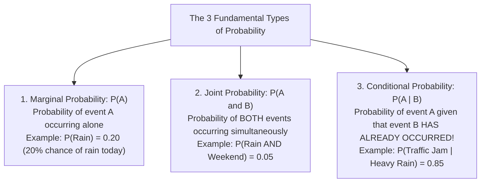
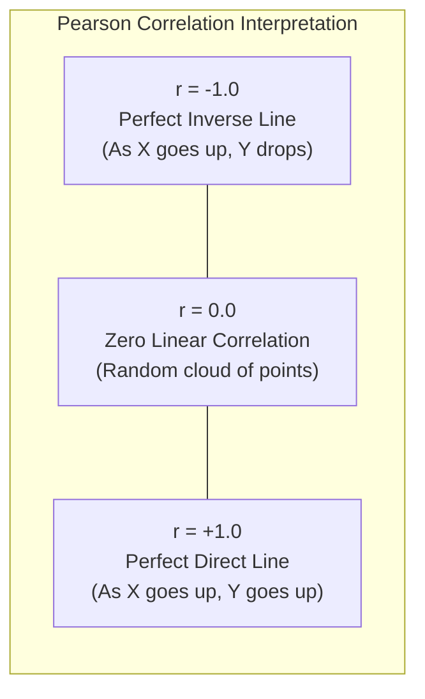
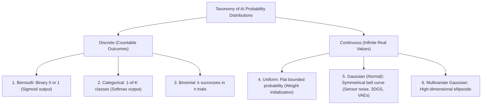
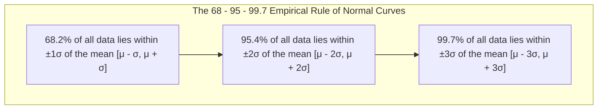
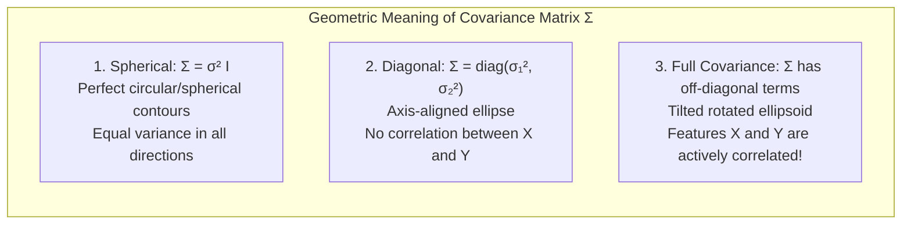
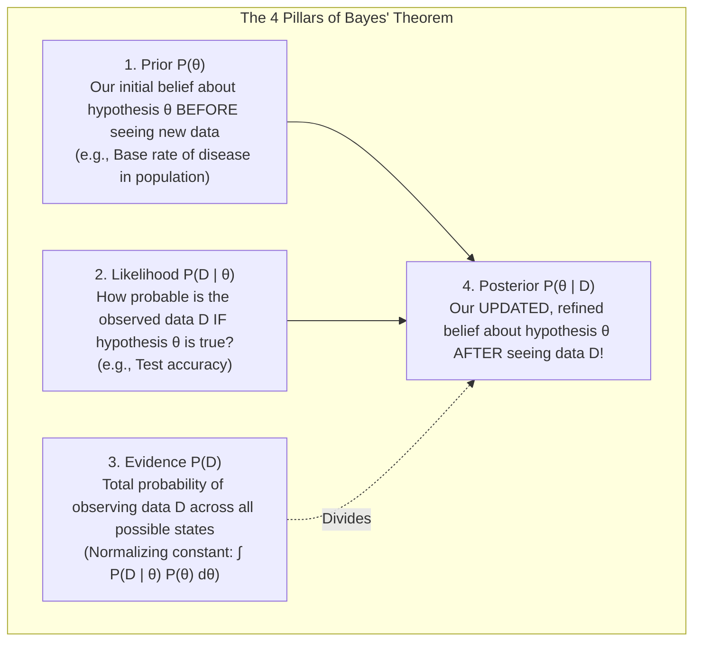
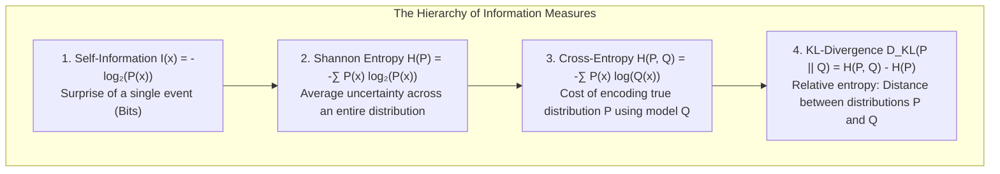
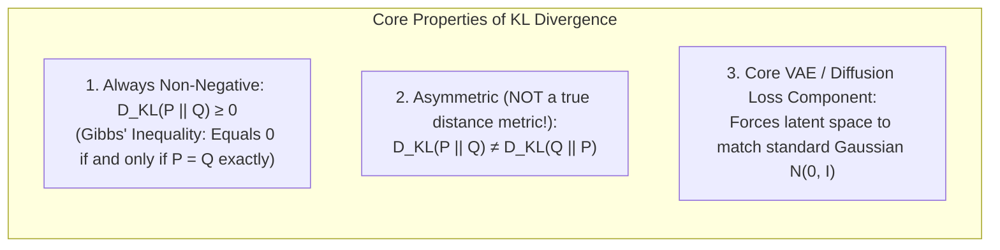

<div class="pixel-banner">
  <div class="pixel-hud-row">
    <div class="pixel-tag"><span class="pixel-indicator"></span>MATH_SYS // PROBABILITY_STATS</div>
    <div class="pixel-meta-right">LVL_03 // UNCERTAINTY_AND_ENTROPY</div>
  </div>
  <div class="pixel-main-content">
    <div class="pixel-avatar">🎲</div>
    <div class="pixel-headings">
      <div class="pixel-title-badge">LEVEL 03 // PROBABILITY & STATISTICS</div>
      <div class="pixel-subtitle">EXPECTATION • GAUSSIAN BELL CURVES • BAYES' THEOREM • MLE • CROSS-ENTROPY • KL-DIVERGENCE</div>
    </div>
    <div class="pixel-sparklines">
      <div class="pixel-bar" style="--h: 88%"></div>
      <div class="pixel-bar" style="--h: 94%"></div>
      <div class="pixel-bar" style="--h: 72%"></div>
      <div class="pixel-bar" style="--h: 60%"></div>
      <div class="pixel-bar" style="--h: 42%"></div>
      <div class="pixel-bar" style="--h: 25%"></div>
    </div>
  </div>
  <div class="pixel-footer-row">
    <span class="pixel-coord">SYS_ID: #03_PROB // DISTRIBUTION: GAUSSIAN_NORMAL // LOSS: CROSS_ENTROPY</span>
    <span class="pixel-status-text">[ STABLE ]</span>
  </div>
</div>

# Level 3: Probability, Statistics & Information Theory

<div class="notion-callout">
  <div class="notion-callout-icon">💡</div>
  <div class="notion-callout-content">
    In the real world, data is never clean or deterministic. Camera sensors produce thermal electronic noise, ambient lighting fluctuates, self-driving LiDAR beams scatter in fog and rain, and medical scans are inherently ambiguous. <strong>Probability, statistics, and information theory provide the mathematical language to quantify uncertainty, evaluate model confidence, and rigorously derive foundational loss functions like Cross-Entropy and Mean Squared Error.</strong>
  </div>
</div>

<div class="notion-card-meta" style="margin-bottom: 2rem;">
  <span class="notion-tag notion-tag-purple">Level 3</span>
  <span class="notion-tag notion-tag-gray">Foundational Math</span>
  <span class="notion-tag notion-tag-blue">Probability & Statistics</span>
</div>

---

## 1. Probability Fundamentals: The Rules of Chance & Uncertainty

A **probability** is a real number between $0.0$ ($0\%$, completely impossible) and $1.0$ ($100\%$, absolute certainty) measuring how likely an event is to happen.



---

### 1.1 Sample Spaces, Events, and Random Variables

* **Sample Space ($\Omega$):** The set of all possible outcomes. For a 6-sided die, $\Omega = \{1, 2, 3, 4, 5, 6\}$. For an 8-bit grayscale pixel, $\Omega = \{0, 1, 2, \dots, 255\}$.
* **Event ($E$):** Any subset of the sample space. Example: "Rolling an even number" $\implies E = \{2, 4, 6\}$, so $P(E) = \frac{3}{6} = 0.50$.
* **Random Variable ($X$):** A mathematical function that maps random real-world outcomes to numerical values. 
  * *Discrete Random Variable:* Takes countable values (e.g., predicted object class index $\in \{0, 1, \dots, 999\}$).
  * *Continuous Random Variable:* Takes any real number on an interval (e.g., bounding box coordinate $x \in [0.0, 1920.0]$, vehicle speed, depth in meters).

---

### 1.2 Conditional Probability & The Law of Total Probability

**Conditional Probability** measures how our belief about event $A$ updates once we are given new evidence $B$:

$$P(A \mid B) = \frac{P(A \cap B)}{P(B)}, \quad \text{provided } P(B) > 0$$

#### The Concrete Umbrella & Rain Example
Suppose on any random day in Seattle:
* Probability it rains: $P(\text{Rain}) = 0.30$ ($30\%$).
* Probability a person carries an umbrella AND it rains: $P(\text{Umbrella} \cap \text{Rain}) = 0.24$.
* What is the probability a person is carrying an umbrella **given that you see it raining outside**?

$$P(\text{Umbrella} \mid \text{Rain}) = \frac{P(\text{Umbrella} \cap \text{Rain})}{P(\text{Rain})} = \frac{0.24}{0.30} = \mathbf{0.80} \quad (80\%)$$

Knowing that it is raining dramatically updates our expectation that people carry umbrellas from a general baseline to $80\%$.

---

### 1.3 Independence vs. Mutual Exclusivity

| Concept | Definition | Mathematical Condition | Real-World Example |
|---|---|---|---|
| **Independent Events** | Knowing $B$ gives zero new information about $A$. | $P(A \mid B) = P(A) \iff P(A \cap B) = P(A) \cdot P(B)$ | Flipping two separate coins; RGB sensor noise on two distant pixels. |
| **Mutually Exclusive** | Events $A$ and $B$ cannot possibly happen at the same time. | $P(A \cap B) = 0 \iff P(A \cup B) = P(A) + P(B)$ | An image is either a "Cat" or a "Dog" in single-label classification. |

---

### 1.4 The Chain Rule of Probability: Powering Generative AI
By rearranging conditional probability, we get the product rule: $P(A \cap B) = P(A \mid B) P(B)$.

Extending this to $n$ variables gives the **Chain Rule of Probability**:

$$P(X_1, X_2, X_3, \dots, X_n) = P(X_1) \cdot P(X_2 \mid X_1) \cdot P(X_3 \mid X_1, X_2) \cdots P(X_n \mid X_1, \dots, X_{n-1})$$

$$\mathbf{P(X_1, \dots, X_n) = \prod_{i=1}^n P(X_i \mid X_1, \dots, X_{i-1})}$$

**Why this matters in Modern AI:**
This exact formula powers **Autoregressive Large Language Models (LLMs like GPT-4, LLaMA)** and **Autoregressive Image Generators (PixelCNN)**! The probability of generating a complete paragraph is calculated word-by-word by predicting the next token conditioned on all previously generated tokens.

```python
import numpy as np

# Simulating independent vs conditional joint probabilities
p_rain = 0.30
p_umbrella_given_rain = 0.80
p_umbrella_given_sun = 0.05

# Total probability of observing an umbrella
p_umbrella = (p_umbrella_given_rain * p_rain) + (p_umbrella_given_sun * (1 - p_rain))
print(f"Overall probability of seeing an umbrella: {p_umbrella:.3f}")  # 0.275
```

---

## 2. Summary Statistics: Center, Spread, and Normalization

When inspecting raw image pixels, latent feature embeddings, or model weights, we summarize high-dimensional distributions using two primary metrics: **the center (Expected Value / Mean)** and **the spread (Variance / Standard Deviation)**.

---

### 2.1 Expected Value ($\mathbb{E}[X]$ or $\mu$)

The **Expected Value** is the probability-weighted average value you expect to observe over an infinite number of repeated trials.

* **For Discrete Random Variables:**
  $$\mathbb{E}[X] = \sum_{i} x_i P(X = x_i)$$

* **For Continuous Random Variables:**
  $$\mathbb{E}[X] = \int_{-\infty}^{\infty} x f(x) \, dx$$

#### Worked Example: Rolling a Fair 6-Sided Die
Each face $\{1, 2, 3, 4, 5, 6\}$ has an equal probability of $P(x) = \frac{1}{6}$:

$$\mathbb{E}[X] = \left(1 \times \frac{1}{6}\right) + \left(2 \times \frac{1}{6}\right) + \left(3 \times \frac{1}{6}\right) + \left(4 \times \frac{1}{6}\right) + \left(5 \times \frac{1}{6}\right) + \left(6 \times \frac{1}{6}\right) = \frac{21}{6} = \mathbf{3.5}$$

Notice that the expected value $3.5$ is not even a possible outcome on a single die roll! It is the mathematical center of gravity / long-term balance point.

#### Fundamental Property: Linearity of Expectation
For any random variables $X$ and $Y$ (even if they are dependent!) and constants $a, b$:

$$\mathbb{E}[aX + bY] = a\mathbb{E}[X] + b\mathbb{E}[Y]$$

---

### 2.2 Variance ($\sigma^2$) and Standard Deviation ($\sigma$)

While the mean tells you where the distribution is centered, **Variance** measures **how widely dispersed or clustered** the values are around that center. It is defined as the expected squared deviation from the mean:

$$\sigma^2 = \text{Var}(X) = \mathbb{E}\left[(X - \mu)^2\right] = \mathbb{E}[X^2] - (\mathbb{E}[X])^2$$

For a sample of $N$ observed data points:

$$s^2 = \frac{1}{N - 1} \sum_{i=1}^N (x_i - \bar{x})^2$$

#### Why Divide by $N-1$ Instead of $N$? (Bessel's Correction)
When calculating variance from a sample rather than the entire population, using the sample mean $\bar{x}$ slightly underestimates the true spread because the data points are naturally closer to their own sample average than to the true population mean $\mu$. Dividing by $N - 1$ provides an **unbiased estimator** of population variance.

#### Standard Deviation ($\sigma$)
Because variance squares the original units (turning pixel intensities into $\text{intensity}^2$ or dollars into $\text{dollars}^2$), we take the square root to return to the original interpretable units:

$$\sigma = \sqrt{\text{Var}(X)}$$

---

### 2.3 Covariance and the Correlation Matrix

When analyzing two different features $X$ and $Y$ (e.g., House Area vs. Price, or Height vs. Weight):

**Covariance** measures whether two variables change together:

$$\text{Cov}(X, Y) = \mathbb{E}\left[(X - \mu_X)(Y - \mu_Y)\right] = \frac{1}{N-1}\sum_{i=1}^N (x_i - \bar{x})(y_i - \bar{y})$$

* $\text{Cov}(X, Y) > 0$: When $X$ increases, $Y$ tends to increase (Positive relationship).
* $\text{Cov}(X, Y) < 0$: When $X$ increases, $Y$ tends to decrease (Negative relationship).
* $\text{Cov}(X, Y) = 0$: No linear relationship.

**Pearson Correlation Coefficient ($r$ or $\rho$):**
Because covariance depends on the scale of the data, we normalize it by standard deviations to get a unitless score strictly between $-1.0$ and $+1.0$:

$$\rho_{X, Y} = \frac{\text{Cov}(X, Y)}{\sigma_X \sigma_Y} \in [-1.0, +1.0]$$



---

### 2.4 Data Normalization & LayerNorm / BatchNorm

In deep neural networks, unnormalized inputs cause exploding or vanishing gradients because some feature dimensions dwarf others.

#### 1. Z-Score Standardization (StandardScaler)
Transforms any feature distribution to have $\text{Mean} = 0.0$ and $\text{Std} = 1.0$:

$$z = \frac{x - \mu}{\sigma}$$

* A $z$-score of $+2.5$ means: *"This sample is 2.5 standard deviations above the average."*

#### 2. Batch Normalization & Layer Normalization in PyTorch
During deep network training, `BatchNorm2d` normalizes activations across the mini-batch dimension, while `LayerNorm` normalizes across channel/feature dimensions:

$$\hat{x}_i = \frac{x_i - \mu_{\mathcal{B}}}{\sqrt{\sigma_{\mathcal{B}}^2 + \epsilon}}, \quad y_i = \gamma \hat{x}_i + \beta$$

Where $\gamma$ (scale) and $\beta$ (shift) are learnable parameters that allow the network to adaptively restore representational power if needed.

```python
import torch
import torch.nn as nn

# Demonstrate Batch Normalization normalization mechanics
x = torch.randn(16, 64, 32, 32) * 5.0 + 12.0  # Batch of 16 feature maps with mean=12, std=5
bn = nn.BatchNorm2d(num_features=64)

out = bn(x)
print("Before BN - Mean:", round(x.mean().item(), 2), "Std:", round(x.std().item(), 2))
print("After BN  - Mean:", round(out.mean().item(), 2), "Std:", round(out.std().item(), 2))
# Output Mean is ~0.0 and Std is ~1.0!
```

---

## 3. Core Probability Distributions in Modern AI & Computer Vision



---

### 3.1 Bernoulli & Categorical Distributions (Classification)

#### Bernoulli Distribution $\text{Bernoulli}(p)$
Models a single trial with binary outcome: Success ($x = 1$) with probability $p$, or Failure ($x = 0$) with probability $1 - p$.

* **Probability Mass Function (PMF):**
  $$P(X = x) = p^x (1 - p)^{1 - x}, \quad x \in \{0, 1\}$$
* **Mean:** $\mathbb{E}[X] = p$
* **Variance:** $\text{Var}(X) = p(1 - p)$ (Maximized at $p = 0.5$ where $\sigma^2 = 0.25$).
* **Role in AI:** The output of every Sigmoid binary classifier is the parameter $p$ of a Bernoulli distribution!

#### Categorical Distribution $\text{Cat}(\mathbf{p})$
Generalizes Bernoulli to $K$ mutually exclusive categories (e.g., identifying 1,000 ImageNet classes).

* **PMF:** $P(X = k) = p_k$ where $\sum_{k=1}^K p_k = 1.0$.
* **Role in AI:** The output vector of every Softmax layer represents the class probabilities $\mathbf{p} = [p_1, p_2, \dots, p_K]^T$.

---

### 3.2 The Gaussian (Normal) Distribution $\mathcal{N}(\mu, \sigma^2)$

The **Gaussian distribution** (or Bell Curve) is the single most ubiquitous continuous distribution in mathematics, physical sciences, and AI.

#### Probability Density Function (PDF):
$$f(x) = \frac{1}{\sigma \sqrt{2\pi}} \exp\left(-\frac{(x - \mu)^2}{2\sigma^2}\right)$$



#### Why Does Everything in Nature Follow a Gaussian? (Central Limit Theorem)
The **Central Limit Theorem (CLT)** states that when you sum or average a large number of independent random variables—**regardless of what distribution each original variable came from**—their normalized sum always converges to a Gaussian distribution!

* Camera sensor noise is the sum of billions of microscopic thermal electron collisions $\implies$ Gaussian!
* Measurement errors across LiDAR lasers and depth sensors $\implies$ Gaussian!
* Residual modeling errors in regression $\implies$ Gaussian!

---

### 3.3 Multivariate Gaussian & 3D Gaussian Splatting (3DGS)

In $D$-dimensional space, a Gaussian is defined by a mean center vector $\boldsymbol{\mu} \in \mathbb{R}^D$ and a symmetric $(D \times D)$ **Covariance Matrix** $\mathbf{\Sigma}$:

$$f(\mathbf{x}) = \frac{1}{(2\pi)^{D/2} |\mathbf{\Sigma}|^{1/2}} \exp\left(-\frac{1}{2}(\mathbf{x} - \boldsymbol{\mu})^T \mathbf{\Sigma}^{-1} (\mathbf{x} - \boldsymbol{\mu})\right)$$

The term $d_M = \sqrt{(\mathbf{x} - \boldsymbol{\mu})^T \mathbf{\Sigma}^{-1} (\mathbf{x} - \boldsymbol{\mu})}$ is the **Mahalanobis Distance**—a scale-invariant distance metric that accounts for directional variance.



#### Groundbreaking Computer Vision Application: 3D Gaussian Splatting (3DGS)
In 2023, 3D Gaussian Splatting revolutionized real-time novel-view synthesis. Instead of querying a slow neural network millions of times (like NeRF), 3DGS models an entire 3D scene as millions of learnable 3D Multivariate Gaussians:

* Center position $\boldsymbol{\mu} = (x, y, z)$.
* 3D Covariance $\mathbf{\Sigma} = \mathbf{R} \mathbf{S} \mathbf{S}^T \mathbf{R}^T$ parameterized by a rotation quaternion $\mathbf{R}$ and 3D scaling vector $\mathbf{S}$.
* Color (Spherical Harmonics) and opacity $\alpha$.
* Rendering projects these 3D Gaussians into 2D camera pixel splats using Jacobian projection $\mathbf{\Sigma}' = \mathbf{J} \mathbf{\Sigma} \mathbf{J}^T$ in real-time at **150+ FPS**!

```python
import numpy as np

# Evaluating a 2D Gaussian distribution
mu = np.array([0.0, 0.0])
Sigma = np.array([[2.0, 0.5], 
                  [0.5, 1.0]])  # Positive covariance = tilted ellipse

def multivariate_gaussian_pdf(x, mu, Sigma):
    d = len(mu)
    diff = x - mu
    inv_sigma = np.linalg.inv(Sigma)
    det_sigma = np.linalg.det(Sigma)
    norm_const = 1.0 / (np.power(2 * np.pi, d / 2.0) * np.sqrt(det_sigma))
    exponent = -0.5 * diff.T @ inv_sigma @ diff
    return norm_const * np.exp(exponent)

sample_point = np.array([1.0, 0.5])
density = multivariate_gaussian_pdf(sample_point, mu, Sigma)
print(f"Probability density at (1.0, 0.5): {density:.4f}")
```

---

## 4. Bayes' Theorem: The Mathematics of Updating Beliefs

**Bayes' Theorem** provides the principled mathematical framework for updating our prior beliefs when confronted with new evidence or observed data:

$$P(\theta \mid D) = \frac{P(D \mid \theta) \, P(\theta)}{P(D)}$$



---

### 4.1 Step-by-Step Worked Example: The Rare Disease Medical Paradox

Suppose a rare medical condition affects **$1$ in $1,000$ people** in the general population ($0.1\%$).
A diagnostic test has a **$99\%$ true positive rate** (sensitivity) and a **$5\%$ false positive rate**:

* **Prior:** $P(\text{Disease}) = 0.001 \implies P(\text{Healthy}) = 0.999$
* **Likelihood:** $P(\text{Positive} \mid \text{Disease}) = 0.99$
* **False Positive:** $P(\text{Positive} \mid \text{Healthy}) = 0.05$

**Question:** If a random patient tests POSITIVE, what is the actual probability they have the disease?

#### Step 1: Compute the Total Evidence $P(\text{Positive})$
Using the Law of Total Probability:

$$P(\text{Positive}) = P(\text{Positive} \mid \text{Disease})P(\text{Disease}) + P(\text{Positive} \mid \text{Healthy})P(\text{Healthy})$$

$$P(\text{Positive}) = (0.99 \times 0.001) + (0.05 \times 0.999) = 0.00099 + 0.04995 = \mathbf{0.05094}$$

#### Step 2: Compute Posterior $P(\text{Disease} \mid \text{Positive})$ via Bayes' Theorem

$$P(\text{Disease} \mid \text{Positive}) = \frac{P(\text{Positive} \mid \text{Disease}) \cdot P(\text{Disease})}{P(\text{Positive})} = \frac{0.00099}{0.05094} \approx \mathbf{0.0194} \quad (\mathbf{1.94\%}!)$$

Even with a $99\%$ accurate test, a positive test result only means a **$1.94\%$ chance** of actually having the condition! Why? Because healthy people outnumber sick people 999 to 1, so false positives heavily dominate the total positive test pool.

---

### 4.2 Maximum Likelihood (MLE) vs. Maximum A Posteriori (MAP)

When training machine learning models with parameters $\mathbf{w}$ on dataset $\mathcal{D}$:

* **Maximum Likelihood Estimation (MLE):** Assumes all parameter values are equally likely *a priori* (flat prior). Picks parameters that maximize likelihood of observed data:
  $$\mathbf{w}_{\text{MLE}} = \arg\max_{\mathbf{w}} P(\mathcal{D} \mid \mathbf{w})$$

* **Maximum A Posteriori (MAP):** Incorporates a **Prior distribution** over the weights $P(\mathbf{w})$:
  $$\mathbf{w}_{\text{MAP}} = \arg\max_{\mathbf{w}} P(\mathbf{w} \mid \mathcal{D}) = \arg\max_{\mathbf{w}} \left[ \ln P(\mathcal{D} \mid \mathbf{w}) + \ln P(\mathbf{w}) \right]$$

#### The Profound Connection to Deep Learning Regularization:
* If you set a **Gaussian Prior** $P(\mathbf{w}) \sim \mathcal{N}(0, \sigma_w^2)$, then $\ln P(\mathbf{w}) \propto -\frac{\lambda}{2}\|\mathbf{w}\|_2^2$.
  **$\implies$ MAP estimation with a Gaussian prior mathematically DERIVES $L_2$ Regularization (Weight Decay / Ridge)!**
* If you set a **Laplace Prior** $P(\mathbf{w}) \sim \text{Laplace}(0, b)$, then $\ln P(\mathbf{w}) \propto -\lambda \|\mathbf{w}\|_1$.
  **$\implies$ MAP estimation with a Laplace prior mathematically DERIVES $L_1$ Regularization (Lasso / Sparsity)!**

---

## 5. Maximum Likelihood Estimation (MLE): How Loss Functions Are Born

Loss functions in deep learning (like Mean Squared Error and Cross-Entropy) were not invented arbitrarily—**they are direct mathematical consequences of Maximum Likelihood Estimation under specific noise distributions!**

---

### 5.1 Why We Optimize Negative Log-Likelihood (NLL)

Given a dataset of $N$ independent training samples $\mathcal{D} = \{(\mathbf{x}_1, y_1), \dots, (\mathbf{x}_N, y_N)\}$, the joint likelihood is the product of individual probabilities:

$$\mathcal{L}(\boldsymbol{\theta}) = \prod_{i=1}^N P(y_i \mid \mathbf{x}_i; \boldsymbol{\theta})$$

Multiplying thousands of probabilities ($0.01 \times 0.005 \times \dots$) results in floating-point underflow (values rounding to $0.0$). 

By taking the natural logarithm, products turn into convenient sums:

$$\ln \mathcal{L}(\boldsymbol{\theta}) = \sum_{i=1}^N \ln P(y_i \mid \mathbf{x}_i; \boldsymbol{\theta})$$

Since standard optimizers minimize rather than maximize, we negate the formula to get **Negative Log-Likelihood (NLL)**:

$$\mathbf{\text{NLL}(\boldsymbol{\theta}) = -\sum_{i=1}^N \ln P(y_i \mid \mathbf{x}_i; \boldsymbol{\theta})}$$

---

### 5.2 Mathematical Proof: Deriving Mean Squared Error (MSE) from Gaussian MLE

Assume our model prediction $\hat{y}_i = f(\mathbf{x}_i; \mathbf{w})$ is corrupted by zero-mean additive Gaussian noise:

$$y_i = \hat{y}_i + \epsilon_i, \quad \epsilon_i \sim \mathcal{N}(0, \sigma^2)$$

This means the conditional probability of the target $y_i$ is Gaussian:

$$P(y_i \mid \mathbf{x}_i; \mathbf{w}) = \frac{1}{\sigma \sqrt{2\pi}} \exp\left(-\frac{(y_i - \hat{y}_i)^2}{2\sigma^2}\right)$$

Now compute the Negative Log-Likelihood:

$$\text{NLL}(\mathbf{w}) = -\sum_{i=1}^N \ln \left[ \frac{1}{\sigma \sqrt{2\pi}} \exp\left(-\frac{(y_i - \hat{y}_i)^2}{2\sigma^2}\right) \right]$$

$$\text{NLL}(\mathbf{w}) = \sum_{i=1}^N \left[ \ln(\sigma\sqrt{2\pi}) + \frac{(y_i - \hat{y}_i)^2}{2\sigma^2} \right]$$

Dropping the constant term $\ln(\sigma\sqrt{2\pi})$ and scaling by constant $2\sigma^2$, minimizing NLL reduces exactly to:

$$\mathbf{\min_{\mathbf{w}} \frac{1}{2} \sum_{i=1}^N (y_i - \hat{y}_i)^2 \quad (\text{Mean Squared Error!})}$$

**Conclusion:** Minimizing MSE loss is mathematically identical to finding the Maximum Likelihood Estimate under the assumption of Gaussian noise!

---

### 5.3 Mathematical Proof: Deriving Cross-Entropy from Bernoulli MLE

For binary classification ($y_i \in \{0, 1\}$), model output $\hat{y}_i = \sigma(z_i) \in [0, 1]$ represents the Bernoulli probability $P(y_i = 1 \mid \mathbf{x}_i) = \hat{y}_i$.

The Bernoulli PMF for sample $i$ is:

$$P(y_i \mid \mathbf{x}_i) = \hat{y}_i^{y_i} (1 - \hat{y}_i)^{1 - y_i}$$

Taking the Negative Log-Likelihood across all $N$ samples:

$$\text{NLL} = -\sum_{i=1}^N \ln\left( \hat{y}_i^{y_i} (1 - \hat{y}_i)^{1 - y_i} \right)$$

$$\mathbf{\text{NLL} = -\sum_{i=1}^N \left[ y_i \ln(\hat{y}_i) + (1 - y_i) \ln(1 - \hat{y}_i) \right] \quad (\text{Binary Cross-Entropy!})}$$

**Conclusion:** Binary Cross-Entropy is the exact Negative Log-Likelihood of a Bernoulli distribution!

---

## 6. Information Theory: Measuring Uncertainty, Surprise & Entropy

Information theory, pioneered by Claude Shannon in 1948, quantifies how much information, surprise, and uncertainty are contained in signals, probability distributions, and neural network predictions.



---

### 6.1 Self-Information (Surprise)

The **Self-Information** (or surprise) of observing an event $x$ with probability $P(x)$ is:

$$I(x) = -\log_2 P(x) \quad (\text{in units of Bits})$$

* **Intuition:**
  * Hearing *"The sun rose this morning in Tokyo"* ($P \approx 1.0$) conveys **$0$ bits** of information—zero surprise.
  * Hearing *"It snowed in the Sahara Desert today"* ($P = 0.00001$) conveys **massive information**—extreme surprise!
  * Flipping a fair coin and getting Heads ($P = 0.5$): $I(\text{Heads}) = -\log_2(0.5) = \mathbf{1.0\text{ Bit}}$.

---

### 6.2 Shannon Entropy $H(P)$: Average Uncertainty

**Entropy** measures the expected surprise (or chaos/unpredictability) of an entire probability distribution:

$$H(P) = -\sum_{i=1}^K P(x_i) \log_2 P(x_i)$$

#### Coin Flip Entropy Comparison:
* **Fair Coin ($P(\text{Heads}) = 0.5, P(\text{Tails}) = 0.5$):**
  $$H(P) = -(0.5 \log_2 0.5 + 0.5 \log_2 0.5) = -(0.5(-1) + 0.5(-1)) = \mathbf{1.0\text{ Bit}} \quad (\text{Maximum Uncertainty})$$
* **Biased Coin ($P(\text{Heads}) = 0.99, P(\text{Tails}) = 0.01$):**
  $$H(P) = -(0.99 \log_2 0.99 + 0.01 \log_2 0.01) \approx -(0.99(-0.014) + 0.01(-6.64)) \approx \mathbf{0.08\text{ Bits}} \quad (\text{Almost Certain})$$
* **Deterministic ($P(\text{Heads}) = 1.0$):**
  $$H(P) = \mathbf{0.0\text{ Bits}} \quad (\text{Zero Uncertainty})$$

---

### 6.3 Cross-Entropy $H(P, Q)$

In classification, let $P$ be the true ground-truth distribution (a one-hot vector where $P(\text{Cat}) = 1.0$) and $Q$ be the model's predicted probability distribution ($Q(\text{Cat}) = 0.85$):

$$H(P, Q) = -\sum_{i=1}^K P(x_i) \ln Q(x_i)$$

Cross-entropy measures the average number of nats/bits needed to encode events from distribution $P$ using the model's estimated codebook $Q$. **When the model's predictions perfectly match reality ($Q = P$), Cross-Entropy achieves its minimum possible value equal to the true entropy $H(P)$!**

---

### 6.4 Kullback-Leibler (KL) Divergence: Distance Between Distributions

The **KL-Divergence** (also called Relative Entropy) measures how much information is lost when approximating a true distribution $P$ with model distribution $Q$:

$$D_{\text{KL}}(P \parallel Q) = \sum_{i=1}^K P(x_i) \ln\left(\frac{P(x_i)}{Q(x_i)}\right) = H(P, Q) - H(P)$$



#### Major Deep Learning Application: Variational Autoencoders (VAEs)
In a VAE, an encoder network outputs latent parameters $\boldsymbol{\mu}$ and $\boldsymbol{\sigma}$. To ensure the latent space is smooth and continuous for generating new images, the loss includes an analytical KL-Divergence term that forces the latent distribution $q(\mathbf{z} \mid \mathbf{x}) = \mathcal{N}(\boldsymbol{\mu}, \text{diag}(\boldsymbol{\sigma}^2))$ to match a standard normal prior $p(\mathbf{z}) = \mathcal{N}(\mathbf{0}, \mathbf{I})$:

$$\mathcal{L}_{\text{KL}} = -\frac{1}{2} \sum_{j=1}^d \left( 1 + \ln(\sigma_j^2) - \mu_j^2 - \sigma_j^2 \right)$$

```python
import torch
import torch.nn.functional as F

# Compute KL Divergence between true one-hot target and model prediction
p_true = torch.tensor([1.0, 0.0, 0.0])  # Class 0 is True (Cat)
logits = torch.tensor([2.5, 0.1, -1.2]) # Raw logits from neural net
q_pred = F.softmax(logits, dim=0)

# Cross-entropy calculation
ce_loss = -torch.sum(p_true * torch.log(q_pred))
print("Model Probabilities:", np.round(q_pred.numpy(), 4))
print("Cross-Entropy Loss: ", round(ce_loss.item(), 4))

# VAE Latent KL Loss implementation
mu = torch.tensor([0.2, -0.1])
log_var = torch.tensor([0.1, -0.2])  # log(sigma^2)
kl_vae = -0.5 * torch.sum(1 + log_var - mu.pow(2) - log_var.exp())
print("VAE Latent KL Loss: ", round(kl_vae.item(), 4))
```

---

<div class="notion-callout">
  <div class="notion-callout-icon">🎯</div>
  <div class="notion-callout-content">
    <strong>Level 3 Complete Summary:</strong>
    <ul>
      <li><strong>Probability Rules:</strong> Marginal $P(A)$, Joint $P(A \cap B)$, and Conditional $P(A \mid B)$. The Chain Rule of Probability decomposes complex joint distributions into sequential steps powering modern Autoregressive LLMs (GPT).</li>
      <li><strong>Summary Metrics:</strong> Expected value $\mathbb{E}[X]$ gives the distribution center, while Variance $\sigma^2$ measures dispersion. Z-score scaling ($z = \frac{x - \mu}{\sigma}$) powers BatchNorm and LayerNorm.</li>
      <li><strong>Distributions:</strong> Discrete Bernoulli and Categorical distributions model binary and multi-class classification. The Central Limit Theorem guarantees that continuous sensor noise and real-world sums follow Gaussian bell curves. Multivariate Gaussians power 3D Gaussian Splatting (3DGS) for real-time 150+ FPS novel view rendering.</li>
      <li><strong>Bayes' Theorem & MAP:</strong> Updates prior beliefs with data likelihood. MAP estimation under a Gaussian prior mathematically derives $L_2$ weight decay; MAP under a Laplace prior derives $L_1$ Lasso regularization.</li>
      <li><strong>Maximum Likelihood Estimation (MLE):</strong> Minimizing Negative Log-Likelihood under Gaussian assumptions derives Mean Squared Error (MSE); under Bernoulli assumptions it derives Binary Cross-Entropy.</li>
      <li><strong>Information Theory & Entropy:</strong> Shannon Entropy measures inherent uncertainty. Cross-Entropy measures encoding cost between truth $P$ and model $Q$. KL-Divergence $D_{\text{KL}}(P \parallel Q)$ measures the statistical distance between distributions, forming the core regularization engine for Variational Autoencoders (VAEs) and Diffusion Models.</li>
    </ul>
  </div>
</div>
