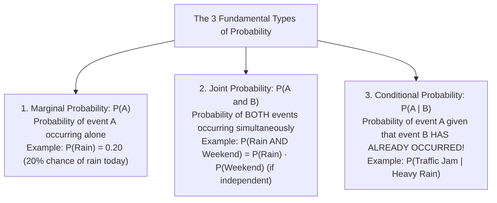
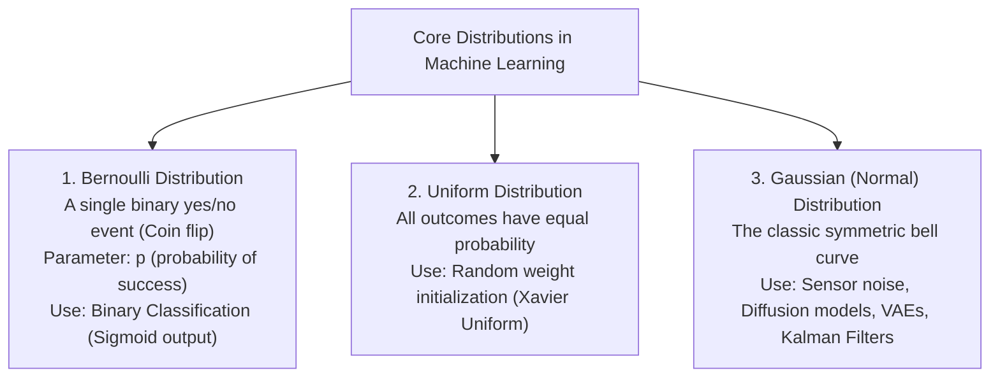
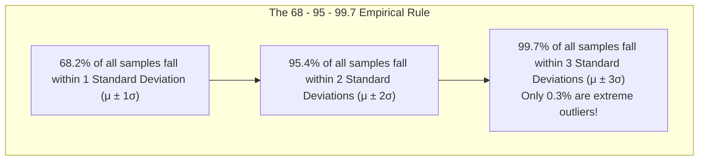
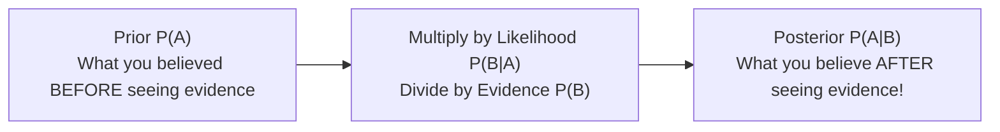
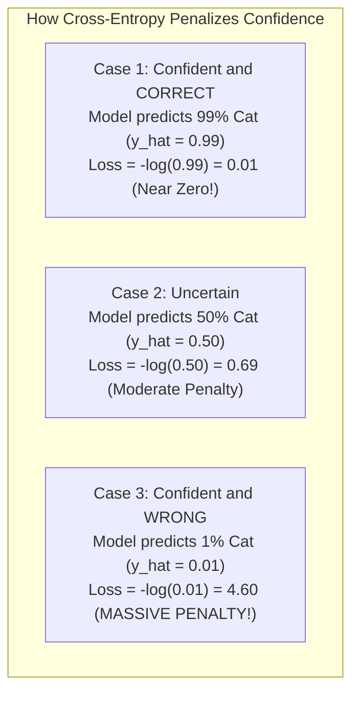

<div class="pixel-banner">
  <div class="pixel-hud-row">
    <div class="pixel-tag"><span class="pixel-indicator"></span>MATH_SYS // PROBABILITY_STATS</div>
    <div class="pixel-meta-right">LVL_03 // UNCERTAINTY_AND_ENTROPY</div>
  </div>
  <div class="pixel-main-content">
    <div class="pixel-avatar">🎲</div>
    <div class="pixel-headings">
      <div class="pixel-title-badge">LEVEL 03 // PROBABILITY & STATISTICS</div>
      <div class="pixel-subtitle">EXPECTATION • GAUSSIAN BELL CURVE • BAYES' THEOREM • MLE • CROSS-ENTROPY • KL-DIV</div>
    </div>
    <div class="pixel-sparklines">
      <div class="pixel-bar" style="--h: 88%"></div>
      <div class="pixel-bar" style="--h: 94%"></div>
      <div class="pixel-bar" style="--h: 72%"></div>
      <div class="pixel-bar" style="--h: 60%"></div>
      <div class="pixel-bar" style="--h: 42%"></div>
      <div class="pixel-bar" style="--h: 25%"></div>
    </div>
  </div>
  <div class="pixel-footer-row">
    <span class="pixel-coord">SYS_ID: #03_PROB // DISTRIBUTION: GAUSSIAN_NORMAL // LOSS: CROSS_ENTROPY</span>
    <span class="pixel-status-text">[ STABLE ]</span>
  </div>
</div>

# Level 3: Probability, Statistics & Information Theory

<div class="notion-callout">
  <div class="notion-callout-icon">💡</div>
  <div class="notion-callout-content">
    In the real world, data is never clean. Camera sensors have thermal noise, speech audio has background static, and self-driving LiDAR beams scatter in the rain. <strong>Probability and statistics provide the tools to reason under uncertainty</strong>, quantify model confidence, and derive classification loss functions like Cross-Entropy.
  </div>
</div>

<div class="notion-card-meta" style="margin-bottom: 2rem;">
  <span class="notion-tag notion-tag-purple">Level 3</span>
  <span class="notion-tag notion-tag-gray">Foundational Math</span>
  <span class="notion-tag notion-tag-blue">Probability & Statistics</span>
</div>

---

## 1. Probability Fundamentals: Rules of the Game

A **probability** is simply a number between $0.0$ ($0\%$, completely impossible) and $1.0$ ($100\%$, absolute certainty) measuring how likely an event is to happen.



### The Sum Rule and Product Rule
1. **Union Rule (OR):** Probability that either $A$ or $B$ occurs: $P(A \cup B) = P(A) + P(B) - P(A \cap B)$ *(we subtract the overlap $P(A \cap B)$ so it isn't double-counted)*.
2. **Independent Events:** Two events are independent if knowing one tells you nothing about the other (e.g. flipping two separate coins): $P(A \text{ and } B) = P(A) \cdot P(B)$

---

## 2. Mean, Variance, and Standard Deviation

When inspecting data features or model outputs, we summarize them using two core numbers: **the center (Mean)** and **the spread (Variance)**.

### 1. Mean and Expected Value (μ or E[X])
The weighted average value you expect to observe over many trials.

* **For observed data points:** $\mu = \frac{1}{N} \sum_{i=1}^N x_i$
* **Step-by-step example with a fair 6-sided die:** $\mathbb{E}[X] = (1 \times \frac{1}{6}) + (2 \times \frac{1}{6}) + (3 \times \frac{1}{6}) + (4 \times \frac{1}{6}) + (5 \times \frac{1}{6}) + (6 \times \frac{1}{6}) = \frac{21}{6} = \mathbf{3.5}$
  *(Notice: The expected value $3.5$ doesn't have to be a possible single roll! It is the long-term balance point).*

### 2. Variance (σ²)
Measures **how spread out** the numbers are around the mean. It is the average *squared* distance from the mean:

$$\sigma^2 = \frac{1}{N} \sum_{i=1}^N (x_i - \mu)^2$$

### 3. Standard Deviation (σ)
Because variance squares the numbers (turning dollars into $\text{dollars}^2$), we take the square root to return to the original units:

$$\sigma = \sqrt{\sigma^2}$$

### The Z-Score Normalization Formula (StandardScaler)
To convert any feature so its mean is $0.0$ and standard deviation is $1.0$:

$$z = \frac{x - \mu}{\sigma}$$

* A $z$-score of $+2.0$ means *"this data point is 2 standard deviations above the average"*.
* This is the exact formula used by `StandardScaler` in Scikit-Learn, `BatchNorm`, and `LayerNorm` in PyTorch!

---

## 3. Common Probability Distributions in AI

A **probability distribution** is a mathematical formula that describes how probabilities are distributed across all possible outcomes.



### The Gaussian (Normal) Distribution N(μ, σ²)

$$P(x) = \frac{1}{\sigma \sqrt{2\pi}} e^{-\frac{1}{2} \left(\frac{x - \mu}{\sigma}\right)^2}$$



### Why is the Gaussian Everywhere? (The Central Limit Theorem)
The **Central Limit Theorem (CLT)** states that if you take independent random variables from *ANY* distribution (even wild, skewed distributions) and add them together, **their sum always forms a Gaussian bell curve!**

* **Practical Example:** An image pixel's brightness is affected by sensor temperature, photon arrival jitter, and electrical resistance. Because all these tiny independent noise sources add together, **camera image noise is almost perfectly Gaussian**.
* **AI Applications:**
  * **Diffusion Models (Stable Diffusion):** Start with an image and add Gaussian noise $\mathcal{N}(0, \mathbf{I})$ step-by-step until it becomes pure static, then train a U-Net to reverse the process!
  * **Variational Autoencoders (VAEs):** Compress images into a latent space modeled as a standard Gaussian distribution.

---

## 4. Conditional Probability & Bayes' Theorem

**Bayes' Theorem** is the mathematical formula for updating your beliefs when you receive new evidence.

### The Formula

$$P(A \mid B) = \frac{P(B \mid A) \cdot P(A)}{P(B)}$$



### Concrete Worked Example: The Spam Email Filter
Suppose we want to know if an incoming email is **Spam** given that it contains the word **"Lottery"**:

1. **Prior Probabilities (from historical email statistics):**
   * $P(\text{Spam}) = 0.20$ (20% of all emails are spam).
   * $P(\text{Normal}) = 0.80$ (80% of all emails are regular).
2. **Likelihoods (how often the word 'Lottery' appears):**
   * $P(\text{"Lottery"} \mid \text{Spam}) = 0.70$ (70% of spam emails mention lottery).
   * $P(\text{"Lottery"} \mid \text{Normal}) = 0.01$ (Only 1% of normal emails mention lottery).
3. **Total Probability of seeing the word 'Lottery' ($P(B)$):** $P(\text{"Lottery"}) = (0.70 \times 0.20) + (0.01 \times 0.80) = 0.14 + 0.008 = \mathbf{0.148}$
4. **Posterior Probability via Bayes' Rule:** $P(\text{Spam} \mid \text{"Lottery"}) = \frac{0.70 \times 0.20}{0.148} = \frac{0.140}{0.148} \approx \mathbf{94.6\%}$

Before seeing the word, there was only a $20\%$ chance the email was spam. After seeing the word "Lottery", our belief jumps to **$94.6\%$**! This is the core principle behind Naive Bayes classifiers and Bayesian visual tracking (Kalman filters).

---

## 5. Maximum Likelihood Estimation (MLE)

In machine learning, we don't know the true parameters $\theta$ (weights) of the world; we only have our training data. **Maximum Likelihood Estimation asks:**

> *"Which parameter values $\theta$ make the dataset we actually observed most likely to happen?"*

### The Coin Flip Example
Suppose you flip a mystery coin $10$ times and observe:

$$\text{Data} = [H, H, H, H, H, H, H, T, T, T] \quad (7 \text{ Heads}, 3 \text{ Tails})$$

The **Likelihood function** for parameter $p$ (probability of heads) is:

$$L(p) = p^7 \cdot (1 - p)^3$$

* If $p = 0.1 \implies L(0.1) = 0.1^7 \times 0.9^3 = 7.29 \times 10^{-8}$ (Very unlikely!)
* If $p = 0.5 \implies L(0.5) = 0.5^{10} = 0.00097$
* If $p = 0.7 \implies L(0.7) = 0.7^7 \times 0.3^3 = \mathbf{0.00222}$ (The Maximum!)

### The Log-Likelihood Trick
Multiplying thousands of small probabilities produces floating-point underflow ($0.00000000000\dots$). Taking the natural logarithm ($\ln$) converts multiplications into additions:

$$\log L(\theta) = \sum_{i=1}^N \log P(y_i \mid x_i; \theta)$$

To turn maximization into a loss minimization problem for gradient descent, we negate it to get the **Negative Log-Likelihood (NLL)**:

$$\text{Loss} = - \sum_{i=1}^N \log P(y_i \mid x_i; \theta)$$

> **The Major AI Connection:** For classification tasks, Negative Log-Likelihood is mathematically identical to **Cross-Entropy Loss**!

---

## 6. Information Theory: Entropy & Cross-Entropy

Information theory measures the amount of **surprise, uncertainty, or information** in an event.

### 1. Shannon Entropy H(P)
Entropy measures the average uncertainty of a probability distribution:

$$H(P) = - \sum_{i} P(x_i) \log_2 P(x_i)$$

* **A coin with 100% Heads:** $\text{Entropy} = 0$ bits. Zero uncertainty, zero surprise (you always know it lands on heads).
* **A fair 50/50 coin:** $\text{Entropy} = - (0.5 \log_2 0.5 + 0.5 \log_2 0.5) = \mathbf{1.0}$ bit. Maximum possible uncertainty!
* **Where it is used:** Decision Trees use **Information Gain (Entropy reduction)** to decide which feature to split on at each node.

---

### 2. Cross-Entropy Loss
In classification, we have:
* The **True Label ($P$)**: One-hot encoded vector (e.g. $[1, 0, 0]$ for Cat).
* The **Model's Softmax Prediction ($Q$)**: Probability vector (e.g. $[0.80, 0.15, 0.05]$).

The **Cross-Entropy Loss** measures how poorly the predicted probabilities match the true label:

$$L_{\text{Cross-Entropy}} = - \sum_{k=1}^K y_k \log(\hat{y}_k) = - \log(\hat{y}_{\text{true class}})$$



---

### 3. Kullback-Leibler (KL) Divergence
KL-Divergence measures the statistical distance between two probability distributions $P$ and $Q$:

$$D_{\text{KL}}(P \parallel Q) = \sum_x P(x) \log\left(\frac{P(x)}{Q(x)}\right)$$

* If distribution $P$ and distribution $Q$ are identical: $D_{\text{KL}} = 0$.
* **Where it is used in Deep Learning:** In **Variational Autoencoders (VAEs)**, the loss function consists of two parts:
  1. Reconstruction Loss (MSE or Cross-Entropy to reconstruct image).
  2. **KL-Divergence Loss:** Penalizes the latent vector distribution whenever it drifts away from a clean standard normal distribution $\mathcal{N}(0, \mathbf{I})$.

```python
import torch
import torch.nn.functional as F

# True class: index 0 (e.g. "Cat")
target = torch.tensor([0])

# Model output logits from final layer (unnormalized scores)
logits = torch.tensor([[3.2, -1.5, 0.4]])

# PyTorch CrossEntropyLoss computes Softmax + NLL internally:
loss = F.cross_entropy(logits, target)
probs = F.softmax(logits, dim=-1)

print("Class Probabilities: [Cat, Dog, Bird] =", torch.round(probs, decimals=3).tolist())
print(f"Computed Cross-Entropy Loss: {loss.item():.4f}")
```

---

<div class="notion-callout">
  <div class="notion-callout-icon">🎯</div>
  <div class="notion-callout-content">
    <strong>Level 3 Key Takeaway:</strong> Probability quantifies real-world uncertainty. The Gaussian distribution models noise and provides the foundation for VAEs and Diffusion models. Bayes' theorem enables dynamic belief updating. Maximum Likelihood Estimation provides the theoretical foundation for training models, directly deriving the Cross-Entropy loss used across modern deep learning.
  </div>
</div>
