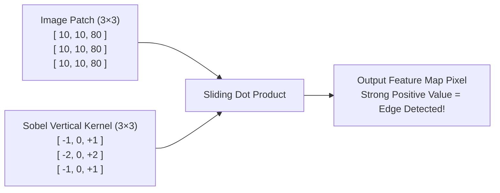
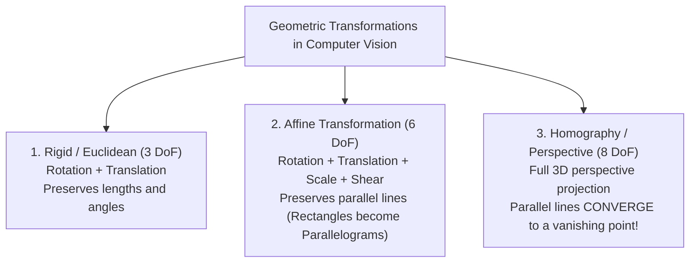
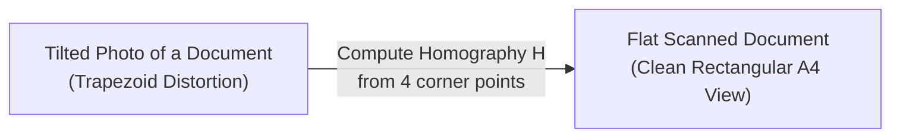
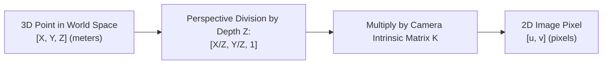
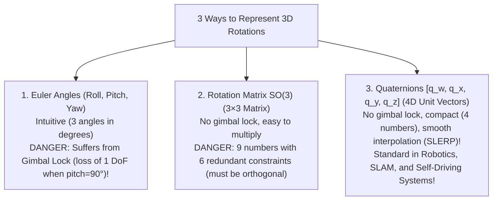

<div class="pixel-banner">
  <div class="pixel-hud-row">
    <div class="pixel-tag"><span class="pixel-indicator"></span>MATH_SYS // VISION_GEOMETRY</div>
    <div class="pixel-meta-right">LVL_04 // 3D_TO_2D_PROJECTION</div>
  </div>
  <div class="pixel-main-content">
    <div class="pixel-avatar">📷</div>
    <div class="pixel-headings">
      <div class="pixel-title-badge">LEVEL 04 // GEOMETRY & CAMERA MATH FOR CV</div>
      <div class="pixel-subtitle">2D CONVOLUTIONS • HOMOGENEOUS COORDS • HOMOGRAPHY • CAMERA MATRIX K • QUATERNIONS</div>
    </div>
    <div class="pixel-sparklines">
      <div class="pixel-bar" style="--h: 96%"></div>
      <div class="pixel-bar" style="--h: 84%"></div>
      <div class="pixel-bar" style="--h: 70%"></div>
      <div class="pixel-bar" style="--h: 90%"></div>
      <div class="pixel-bar" style="--h: 55%"></div>
      <div class="pixel-bar" style="--h: 30%"></div>
    </div>
  </div>
  <div class="pixel-footer-row">
    <span class="pixel-coord">SYS_ID: #04_GEOMETRY // PROJECTION: PINHOLE_K // ROTATION: QUATERNIONS_SO3</span>
    <span class="pixel-status-text">[ CALIBRATED ]</span>
  </div>
</div>

# Level 4: Geometry, Transforms & Camera Math for CV

<div class="notion-callout">
  <div class="notion-callout-icon">💡</div>
  <div class="notion-callout-content">
    Computer vision bridges the gap between the <strong>3D physical world</strong> and <strong>2D pixel sensor arrays</strong>. This level covers the spatial and projective mathematics needed to understand how images are filtered, how perspective transformations work, how cameras project 3D objects onto pixels, and how 3D rotations are represented without gimbal lock.
  </div>
</div>

<div class="notion-card-meta" style="margin-bottom: 2rem;">
  <span class="notion-tag notion-tag-purple">Level 4</span>
  <span class="notion-tag notion-tag-gray">Foundational Math</span>
  <span class="notion-tag notion-tag-blue">Geometry & Vision Math</span>
</div>

---

## 1. 2D Discrete Convolution: The Mechanics of Image Filtering

To a computer, a digital image is not a picture—it is a 2D matrix of numbers representing pixel brightness values ($0 = \text{black}$, $255 = \text{white}$).

A **convolution** slides a small matrix of weights called a **kernel (or filter)** across the image. At every step, it calculates the dot product between the kernel and the image patch directly underneath it.



### Concrete Step-by-Step Calculation
Let's filter a $3 \times 3$ image patch with a vertical Sobel edge detector kernel:

$$\text{Image Patch} = \begin{bmatrix} 10 & 10 & 90 \\ 10 & 10 & 90 \\ 10 & 10 & 90 \end{bmatrix}, \quad \mathbf{K} = \begin{bmatrix} -1 & 0 & +1 \\ -2 & 0 & +2 \\ -1 & 0 & +1 \end{bmatrix}$$

Notice there is a strong brightness jump between column 2 ($10$) and column 3 ($90$):

$$\text{Pixel Output} = (-1 \times 10) + (0 \times 10) + (+1 \times 90) + (-2 \times 10) + (0 \times 10) + (+2 \times 90) + (-1 \times 10) + (0 \times 10) + (+1 \times 90)$$

$$\text{Pixel Output} = (-10 + 90) + (-20 + 180) + (-10 + 90) = 80 + 160 + 80 = \mathbf{320}$$

The kernel outputs a large positive number ($320$), signaling: *"There is a sharp vertical edge here!"*

### Why CNNs in Deep Learning Use Convolutions
In a standard fully connected layer, a $1000 \times 1000$ image would require $1,000,000$ weights per neuron.
* In a Convolutional Neural Network (CNN), a $3 \times 3$ kernel has **only 9 weights**!
* Those same 9 weights slide across every pixel in the image (**Weight Sharing**), providing **Translation Invariance**: a cat detected in the top-left corner triggers the exact same feature detector as a cat in the bottom-right corner!

---

## 2. Homogeneous Coordinates: The Trick of Projective Math

In standard 2D Cartesian coordinates $(x, y)$:
* **Scaling** is a matrix multiplication: $\begin{bmatrix} s_x & 0 \\ 0 & s_y \end{bmatrix} \begin{bmatrix} x \\ y \end{bmatrix} = \begin{bmatrix} s_x x \\ s_y y \end{bmatrix}$
* **Rotation** is a matrix multiplication: $\begin{bmatrix} \cos\theta & -\sin\theta \\ \sin\theta & \cos\theta \end{bmatrix} \begin{bmatrix} x \\ y \end{bmatrix}$
* But **Translation** (moving a point by $t_x, t_y$) requires **vector addition**: $\begin{bmatrix} x \\ y \end{bmatrix} + \begin{bmatrix} t_x \\ t_y \end{bmatrix}$!

Because translation was an addition, you could not combine translation, rotation, and scaling into a single composite matrix.

### The Brilliant Solution: Append a "1"
By appending a dummy dimension $1$, we convert 2D coordinates into **Homogeneous Coordinates**:

$$\tilde{\mathbf{x}} = \begin{bmatrix} x \\ y \\ 1 \end{bmatrix}$$

Now, **Translation becomes a standard matrix multiplication!**

$$\begin{bmatrix} 1 & 0 & t_x \\ 0 & 1 & t_y \\ 0 & 0 & 1 \end{bmatrix} \begin{bmatrix} x \\ y \\ 1 \end{bmatrix} = \begin{bmatrix} x + t_x \\ y + t_y \\ 1 \end{bmatrix}$$

### How to Convert Back to 2D Cartesian Coordinates
If matrix multiplication yields $[X, Y, W]^T$:

$$x = \frac{X}{W}, \quad y = \frac{Y}{W}$$

This division by $W$ is called **Perspective Division**, and it is the exact mathematical reason why objects far away in the real world appear smaller on camera sensors!

---

## 3. 2D Affine & Perspective Transformations (Homography)



### What is a Homography (3x3 Matrix H)?
A **Homography** maps any flat surface viewed from one camera perspective to another flat perspective:

$$\begin{bmatrix} u \\ v \\ 1 \end{bmatrix} \sim \begin{bmatrix} h_{11} & h_{12} & h_{13} \\ h_{21} & h_{22} & h_{23} \\ h_{31} & h_{32} & h_{33} \end{bmatrix} \begin{bmatrix} x \\ y \\ 1 \end{bmatrix}$$

Because the matrix has $8$ Degrees of Freedom (DoF), you only need **4 point pairs** to calculate the entire transformation matrix!



### Real-World Vision Application: Bird's-Eye View (BEV)
In autonomous driving (e.g. Tesla Autopilot, Waymo), cameras mounted behind the windshield look forward at the road. A homography transforms the camera's perspective road view into a flat, top-down **Bird's-Eye View** where road lane markings are perfectly parallel, allowing trajectory planners to steer safely.

---

## 4. The Pinhole Camera Model & Intrinsic Matrix (K)

How does a 3D point in the physical world $(X, Y, Z)$ (measured in meters) turn into a 2D pixel coordinate $(u, v)$ on a camera sensor?



### The Camera Intrinsic Matrix (K)

$$\mathbf{K} = \begin{bmatrix} f_x & 0 & c_x \\ 0 & f_y & c_y \\ 0 & 0 & 1 \end{bmatrix}$$

* **$f_x, f_y$ (Focal Lengths in pixels):** Determines camera lens magnification. Longer focal lengths zoom into distant objects.
* **$c_x, c_y$ (Principal Point / Optical Center):** The exact pixel coordinates where the camera's optical lens axis pierces the digital sensor (typically near the image center, e.g. $(960, 540)$ for a $1920 \times 1080$ frame).

### The Complete 3D-to-2D Projection Equation

$$\begin{bmatrix} u \\ v \\ 1 \end{bmatrix} \sim \mathbf{K} \begin{bmatrix} \mathbf{R} & \mathbf{t} \end{bmatrix} \begin{bmatrix} X_w \\ Y_w \\ Z_w \\ 1 \end{bmatrix}$$

* $\mathbf{K}$ is the **Intrinsic Matrix** (internal optics: focal length and sensor center).
* $[\mathbf{R} \mid \mathbf{t}]$ is the **Extrinsic Matrix** (external camera position: 3D rotation $\mathbf{R}$ and 3D translation $\mathbf{t}$ relative to the world coordinate frame).

---

## 5. 3D Rotations & Quaternions

Representing 3D rotation in computer vision, robotics, and self-driving vehicles requires careful mathematical formulation.



### What is a Quaternion?
A unit quaternion represents a 3D rotation of angle $\theta$ around an arbitrary 3D axis vector $\mathbf{u} = [u_x, u_y, u_z]$:

$$\mathbf{q} = \left[ \cos\left(\frac{\theta}{2}\right), \; u_x \sin\left(\frac{\theta}{2}\right), \; u_y \sin\left(\frac{\theta}{2}\right), \; u_z \sin\left(\frac{\theta}{2}\right) \right]$$

* **Why perception engineers love Quaternions:**
  1. No mathematical singularities or gimbal lock.
  2. Smooth spherical interpolation (**SLERP**) between camera frames in visual odometry and SLAM.
  3. Uses only 4 numbers instead of 9 numbers in a matrix.

---

## 6. Practical OpenCV Python Example: Document Warping via Homography

```python
import numpy as np
import cv2

# 4 Corner points of a tilted document in an image (x, y)
src_pts = np.float32([
    [100, 150],   # Top-left
    [450, 120],   # Top-right
    [520, 500],   # Bottom-right
    [80,  460]    # Bottom-left
])

# Desired flat output coordinates (e.g. 500x700 rectangle)
width, height = 500, 700
dst_pts = np.float32([
    [0, 0],
    [width, 0],
    [width, height],
    [0, height]
])

# Compute the 3x3 Homography Matrix H
H = cv2.getPerspectiveTransform(src_pts, dst_pts)
print("Computed 3x3 Homography Matrix H:\n", np.round(H, 4))

# In production vision applications:
# flat_doc = cv2.warpPerspective(raw_image, H, (width, height))
```

---

<div class="notion-callout">
  <div class="notion-callout-icon">🎯</div>
  <div class="notion-callout-content">
    <strong>Level 4 Key Takeaway:</strong> 2D convolutions slide feature-extracting kernels across pixels. Homogeneous coordinates unify translation and rotation into matrix multiplications. Homography maps planar surfaces across camera views. The Pinhole Camera matrix $\mathbf{K}$ projects 3D space into 2D pixels, while Quaternions represent 3D orientations smoothly without gimbal lock.
  </div>
</div>
