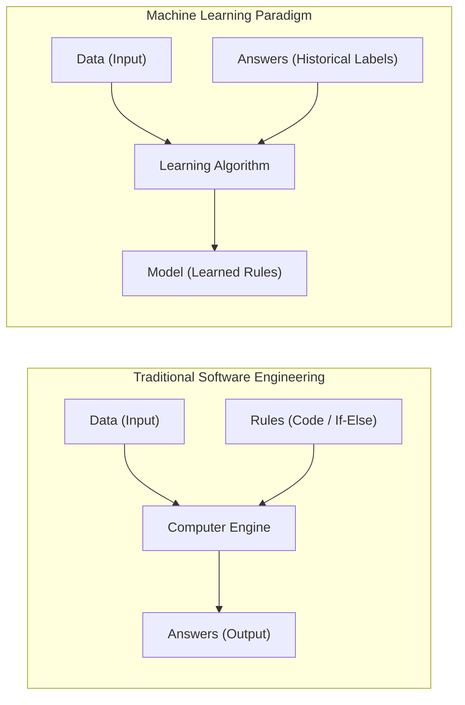
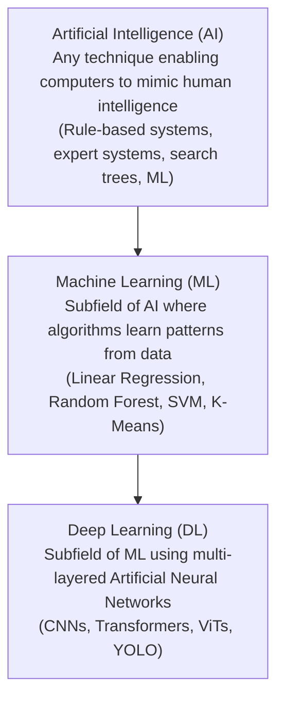
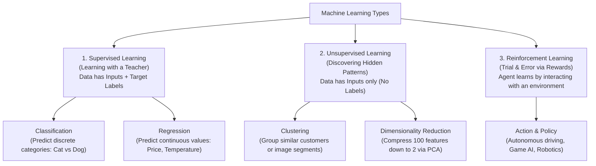
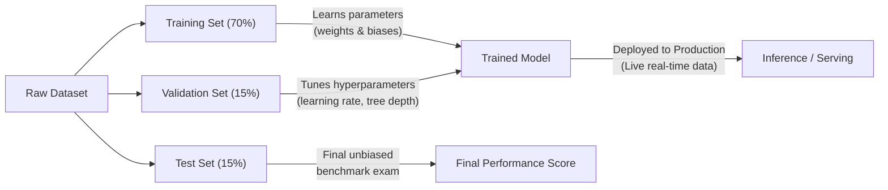
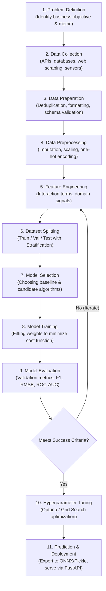

<div class="pixel-banner">
  <div class="pixel-hud-row">
    <div class="pixel-tag"><span class="pixel-indicator"></span>ML_SYS // TENSOR_CORE</div>
    <div class="pixel-meta-right">LVL_01 // FOUNDATIONS</div>
  </div>
  <div class="pixel-main-content">
    <div class="pixel-avatar">🧠</div>
    <div class="pixel-headings">
      <div class="pixel-title-badge">LEVEL 01 // ML FUNDAMENTALS</div>
      <div class="pixel-subtitle">PARADIGMS • SUPERVISED • UNSUPERVISED • TRAIN / VAL / TEST WORKFLOW</div>
    </div>
    <div class="pixel-sparklines">
      <div class="pixel-bar" style="--h: 30%"></div>
      <div class="pixel-bar" style="--h: 50%"></div>
      <div class="pixel-bar" style="--h: 70%"></div>
      <div class="pixel-bar" style="--h: 85%"></div>
      <div class="pixel-bar" style="--h: 60%"></div>
      <div class="pixel-bar" style="--h: 95%"></div>
    </div>
  </div>
  <div class="pixel-footer-row">
    <span class="pixel-coord">SYS_ID: #01_INTRO // PARADIGMS: 3 // DATA_PIPELINE: ACTIVE</span>
    <span class="pixel-status-text">[ ACTIVE ]</span>
  </div>
</div>

# Level 1: Machine Learning Fundamentals

<div class="notion-callout">
  <div class="notion-callout-icon">💡</div>
  <div class="notion-callout-content">
    <strong>Big Picture Intuition:</strong> In traditional software engineering, humans write rules (code) that process data to produce answers. In <strong>Machine Learning</strong>, we feed data and answers into an algorithm, and the computer <em>learns the rules automatically</em>.
  </div>
</div>

<div class="notion-card-meta" style="margin-bottom: 2rem;">
  <span class="notion-tag notion-tag-blue">Level 1</span>
  <span class="notion-tag notion-tag-gray">Foundational Concepts</span>
  <span class="notion-tag notion-tag-green">Topics 1 & 2</span>
</div>

---

## 1. Introduction to Machine Learning

### Traditional Programming vs. Machine Learning

To truly understand Machine Learning, compare it with how classic software works:



* **Traditional Programming:** You write the rules manually. Example: `"IF pixel_intensity > 200 THEN label = white"`. If conditions get complicated (e.g. recognizing a face in different lighting), humans cannot write enough `if-else` statements.
* **Machine Learning:** The computer examines thousands of examples, adjusts internal parameters, and discovers the underlying mathematical mapping $f(x) \approx y$ on its own.

---

### AI vs. Machine Learning vs. Deep Learning

These terms are often used interchangeably, but they represent nested subsets:



| Term | Scope | Real-World Example |
| :--- | :--- | :--- |
| **Artificial Intelligence (AI)** | The broad vision of creating machines that exhibit intelligent behavior. | Chess-playing computer (Minimax algorithm), rule-based expert systems. |
| **Machine Learning (ML)** | Statistical algorithms that learn patterns from structured/tabular data. | Predicting house prices from square footage, detecting spam emails. |
| **Deep Learning (DL)** | Neural networks with many layers that automatically extract raw spatial/temporal features. | YOLO detecting pedestrians in real-time video, ChatGPT processing natural language. |

---

### The Three Main Types of Machine Learning

Machine Learning problems fall into three primary learning paradigms:



#### 1. Supervised Learning (Labeled Data)
* **How it works:** You give the algorithm pairs of inputs and ground-truth answers: $(x_i, y_i)$.
* **Goal:** Learn a mapping function $\hat{y} = f(x)$ that accurately predicts the target on unseen data.
* **Sub-types:**
  * **Classification:** Predicting discrete labels (e.g., *Is this medical scan healthy or malignant?*, *Is this email Spam or Not Spam?*).
  * **Regression:** Predicting continuous quantities (e.g., *What is the estimated market price of this car?*, *How many milliseconds of latency will this pipeline take?*).

#### 2. Unsupervised Learning (Unlabeled Data)
* **How it works:** You only provide inputs $x_i$ without any target labels $y_i$.
* **Goal:** Discover intrinsic geometric structures, clusters, or lower-dimensional representations.
* **Sub-types:**
  * **Clustering:** Grouping similar data points together (e.g., Customer segmentation, segmenting pixel groups in image analysis).
  * **Dimensionality Reduction:** Compressing high-dimensional data while retaining essential variance (e.g., PCA, t-SNE).

#### 3. Reinforcement Learning (Reward-Based)
* **How it works:** An **Agent** operates inside an **Environment**, takes actions, receives positive rewards or negative penalties, and updates its policy to maximize cumulative reward over time.
* **Examples:** Self-driving vehicle steering policies, robotics arm manipulation, AlphaGo.

---

### The 4 Operational Stages: Train, Val, Test, Inference

A machine learning model goes through distinct lifecycle stages:



1. **Training:** The model looks at training samples and adjusts its internal parameters (weights) to minimize prediction error.
2. **Validation:** Used during experimentation to compare different models and tune hyperparameters without biasing the test set.
3. **Testing:** The final "unseen exam". Evaluates how well the model generalizes to completely new data before shipping.
4. **Inference (Production):** The model is deployed into an application (e.g., on a webcam stream or REST API) and generates real-time predictions for new incoming inputs.

---

### Anatomy of a Dataset: Samples, Features, and Targets

In tabular and classical machine learning, data is represented as an input matrix $X$ and a target vector $y$:

```
                  FEATURES (Columns: X)
             x₁             x₂             x₃             TARGET (y)
         [ Area (sqft) | Bedrooms | Distance to City ]  [ Price ($) ]
Sample 1 [    1500     |    3     |       5.2        ]    [ 350,000 ]
Sample 2 [     850     |    1     |       2.1        ]    [ 220,000 ]
Sample 3 [    2400     |    4     |      12.0        ]    [ 510,000 ]
Sample 4 [    1100     |    2     |       8.5        ]    [ 290,000 ]
              ▲
              └────── SAMPLES (Rows: m data points)
```

* **Sample (Observation / Row):** A single individual instance in your dataset (e.g., one house, one patient, one image).
* **Feature (Input Variable / Column):** An attribute or measurable property used to make a prediction (e.g., `area`, `pixel values`, `speed`).
* **Label / Target ($y$):** The ground-truth answer you want the model to learn to predict.

---

### Model vs. Parameters vs. Hyperparameters

| Concept | What is it? | Who sets it? | Concrete Example |
| :--- | :--- | :--- | :--- |
| **Model** | The mathematical structure or algorithm chosen to solve the task. | The Engineer | Linear Regression, Decision Tree, ResNet |
| **Parameters** | Internal variables learned from data during training. | **Learned by algorithm** | Weights ($w$) and Bias ($b$) in $y = wx + b$ |
| **Hyperparameters** | Configuration knobs set *before* training starts that govern how the model learns. | **Chosen by Engineer / Tuner** | Learning rate ($\alpha$), number of trees in Random Forest (`n_estimators`), max tree depth |

---

## 2. The Complete Machine Learning Workflow

Building a robust, real-world machine learning system follows an **11-step engineering lifecycle**:



### Deep Dive into the 11 Steps:

1. **Problem Definition:** 
   * Formulate the practical question: Is this a classification, regression, or clustering problem? What is the core business metric (e.g., false alarms vs missed detections)?
2. **Data Collection:**
   * Sourcing data from SQL databases, camera streams, CSV exports, or public datasets.
3. **Data Preparation:**
   * Auditing the dataset: verifying data types, checking row counts, resolving encoding errors, removing duplicate entries.
4. **Data Preprocessing:**
   * Handling missing/null values (mean/median/KNN imputation).
   * Feature scaling: Normalization ($[0, 1]$) or Standardization ($\mu = 0, \sigma = 1$).
   * Categorical encoding: Converting strings to numbers via One-Hot Encoding or Label Encoding.
5. **Feature Engineering:**
   * Creating new, highly informative features from existing ones (e.g., combining `distance` and `time` into `speed`, or extracting day-of-week from timestamps).
6. **Dataset Splitting:**
   * Partitioning data into Train (e.g. 70%), Validation (15%), and Test (15%). Always fit preprocessors **only** on the training split to avoid **data leakage**!
7. **Model Selection:**
   * Starting with a simple baseline (e.g., Logistic Regression or Decision Tree) before advancing to complex ensembles (Random Forest, XGBoost) or neural networks.
8. **Model Training:**
   * Executing the optimization algorithm (e.g., Gradient Descent) to compute the optimal parameter weights that minimize the objective loss function.
9. **Model Evaluation:**
   * Benchmarking model performance using relevant metrics (MAE, RMSE for regression; Accuracy, Precision, Recall, F1 for classification).
10. **Hyperparameter Tuning:**
    * Systematically exploring hyperparameter combinations (e.g. tree depth, learning rate) using Grid Search, Random Search, or Bayesian Optimization (Optuna).
11. **Prediction & Deployment:**
    * Serializing the trained pipeline (e.g., using `joblib`), wrapping it in an API endpoint, and running real-time predictions on production inputs.

---

### Hands-On Code Example: End-to-End Workflow in Scikit-Learn

Here is an end-to-end Python implementation demonstrating the core concepts learned in Level 1:

```python
import numpy as np
from sklearn.datasets import load_iris
from sklearn.model_selection import train_test_split
from sklearn.preprocessing import StandardScaler
from sklearn.ensemble import RandomForestClassifier
from sklearn.metrics import classification_report, accuracy_score

# 1. Problem & Data: Predict iris flower species from physical measurements
data = load_iris()
X = data.data    # Features: [sepal length, sepal width, petal length, petal width]
y = data.target  # Target labels: 0 (Setosa), 1 (Versicolor), 2 (Virginica)

print(f"Dataset shape: {X.shape[0]} samples, {X.shape[1]} features")

# 2. Dataset Splitting: 80% Train, 20% Test (Stratified to maintain class balance)
X_train, X_test, y_train, y_test = train_test_split(
    X, y, test_size=0.20, random_state=42, stratify=y
)

# 3. Preprocessing: Fit scaler ONLY on train set, transform both
scaler = StandardScaler()
X_train_scaled = scaler.fit_transform(X_train)
X_test_scaled = scaler.transform(X_test)

# 4. Model Selection & Hyperparameters: Random Forest with 100 trees
model = RandomForestClassifier(
    n_estimators=100,      # Hyperparameter: number of trees
    max_depth=4,           # Hyperparameter: limit tree depth to prevent overfitting
    random_state=42
)

# 5. Training: Model learns internal parameters from training data
model.fit(X_train_scaled, y_train)

# 6. Inference: Predict on unseen test data
y_pred = model.predict(X_test_scaled)

# 7. Evaluation: Unbiased score calculation
accuracy = accuracy_score(y_test, y_pred)
print(f"\nTest Set Accuracy: {accuracy * 100:.2f}%\n")
print("Classification Report:")
print(classification_report(y_test, y_pred, target_names=data.target_names))
```

---

<div class="notion-callout">
  <div class="notion-callout-icon">🎯</div>
  <div class="notion-callout-content">
    <strong>Level 1 Key Takeaway:</strong> Machine Learning is the systematic discipline of transforming raw data into predictive decision rules. Mastering the differences between parameters vs hyperparameters, training vs inference, and avoiding data leakage sets the bedrock for all advanced Computer Vision and Deep Learning.
  </div>
</div>
