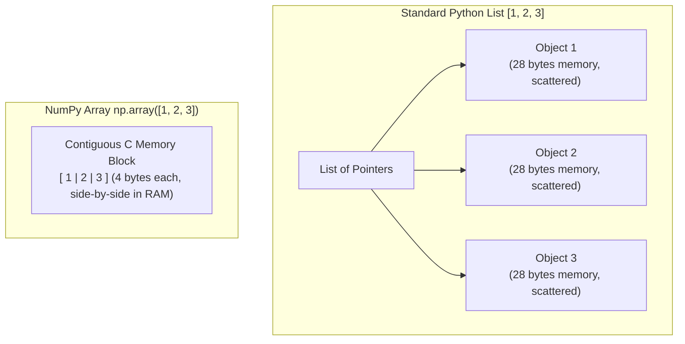
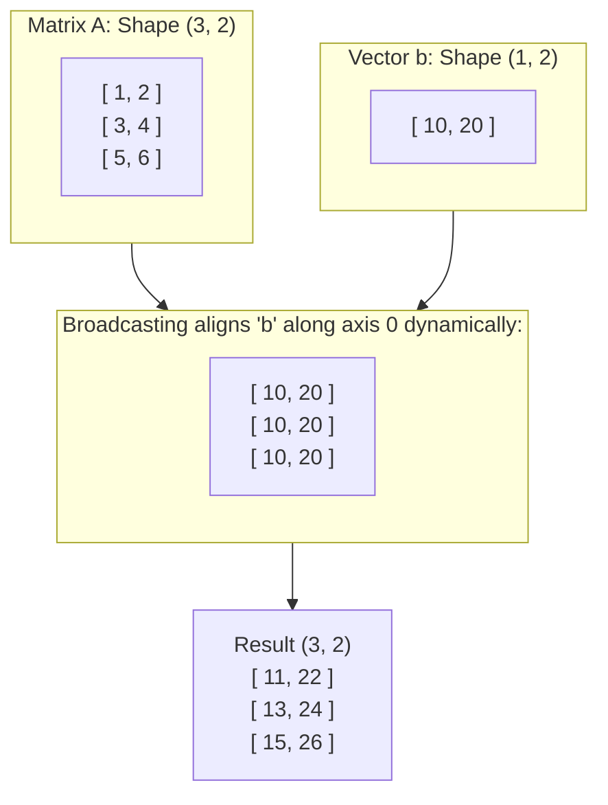
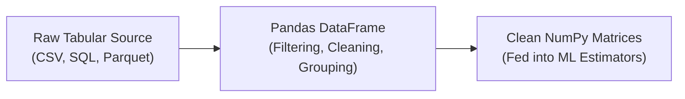
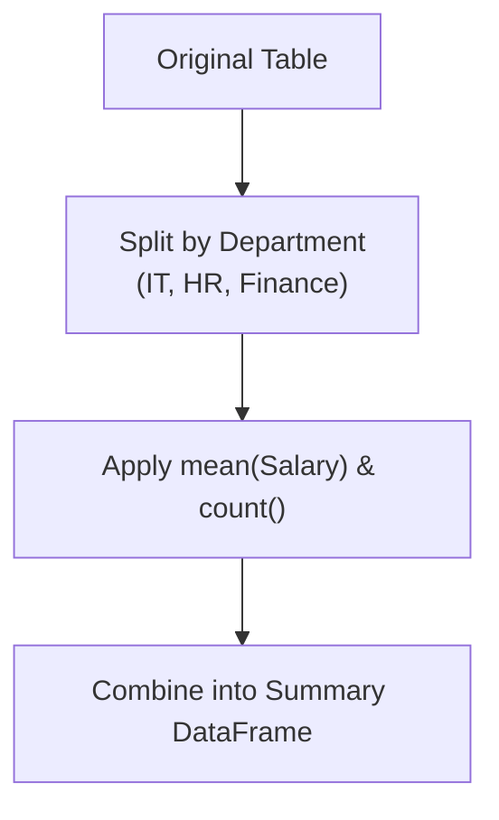
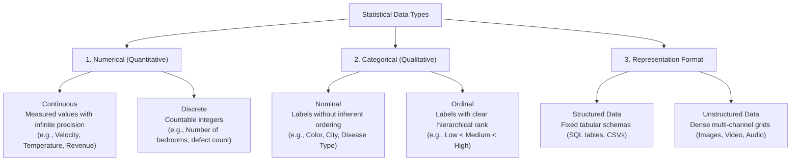

<div class="pixel-banner">
  <div class="pixel-hud-row">
    <div class="pixel-tag"><span class="pixel-indicator"></span>ML_SYS // TENSOR_CORE</div>
    <div class="pixel-meta-right">LVL_02 // NUMPY_PANDAS</div>
  </div>
  <div class="pixel-main-content">
    <div class="pixel-avatar">📊</div>
    <div class="pixel-headings">
      <div class="pixel-title-badge">LEVEL 02 // DATA HANDLING</div>
      <div class="pixel-subtitle">NUMPY NDARRAY • VECTORIZATION • BROADCASTING • PANDAS DATASETS</div>
    </div>
    <div class="pixel-sparklines">
      <div class="pixel-bar" style="--h: 45%"></div>
      <div class="pixel-bar" style="--h: 60%"></div>
      <div class="pixel-bar" style="--h: 80%"></div>
      <div class="pixel-bar" style="--h: 65%"></div>
      <div class="pixel-bar" style="--h: 90%"></div>
      <div class="pixel-bar" style="--h: 100%"></div>
    </div>
  </div>
  <div class="pixel-footer-row">
    <span class="pixel-coord">SYS_ID: #02_DATA // STRIDES: C_CONTIGUOUS // VECTORIZED: TRUE</span>
    <span class="pixel-status-text">[ ACTIVE ]</span>
  </div>
</div>

# Level 2: Data Handling

<div class="notion-callout">
  <div class="notion-callout-icon">💡</div>
  <div class="notion-callout-content">
    Machine learning models require mathematical operations executed over millions of data points simultaneously. While native Python lists store references to scattered memory addresses, NumPy and Pandas provide contiguous, cache-friendly memory structures that run at compiled C speeds.
  </div>
</div>

<div class="notion-card-meta" style="margin-bottom: 2rem;">
  <span class="notion-tag notion-tag-green">Level 2</span>
  <span class="notion-tag notion-tag-gray">Foundational Skills</span>
  <span class="notion-tag notion-tag-blue">NumPy & Pandas</span>
</div>

---

## 3. NumPy Fundamentals

NumPy (**Numerical Python**) forms the computational foundation for virtually all machine learning frameworks, including Scikit-Learn, PyTorch, and OpenCV.

In pure Python, a list is an array of pointers where each number is an independent object scattered across memory (often 28 bytes per integer). NumPy bypasses this overhead by allocating **contiguous blocks of homogeneous memory**, allowing the CPU cache to stream values directly into SIMD (Single Instruction, Multiple Data) vector registers. This architecture makes vector operations 50x to 100x faster than traditional Python loops.



---

### Arrays, Dimensions & Shapes

Machine learning algorithms express learning objectives as linear algebra operations (such as $XW + b$). To perform these calculations, every dataset must be represented in a structured grid:

* **1D Arrays (Vectors):** A sequence with a single axis, commonly representing the target output vector $y$ with shape `(m,)`.
* **2D Arrays (Matrices):** A two-axis table representing samples and features $X$ with shape `(samples, features)`.
* **3D+ Arrays (Tensors):** Multi-channel structures, such as images with shape `(height, width, channels)` or video sequences with shape `(frames, height, width, channels)`.

```python
import numpy as np

# 1D Target Vector (e.g., target house prices)
y = np.array([300000, 450000, 280000])
print("Shape:", y.shape)  # (3,) -> 3 samples
print("Dimensions:", y.ndim)   # 1

# 2D Feature Matrix (e.g., [area, bedrooms])
X = np.array([[1200, 2],
              [1800, 3],
              [1000, 1]])
print("Shape:", X.shape)  # (3, 2) -> 3 rows, 2 columns
print("Dimensions:", X.ndim)   # 2
```

---

### Indexing & Slicing

Data preparation frequently requires isolating specific sub-matrices, such as separating features from labels, pulling out mini-batches, or cropping bounding boxes from images.

NumPy slicing creates a **view** into the original memory buffer rather than allocating a duplicate array in RAM. Modifying a slice directly updates the underlying array unless explicitly copied with `.copy()`.

```python
data = np.array([
    [10, 20, 30, 40],
    [50, 60, 70, 80],
    [90, 100, 110, 120]
])

# Extract single element: row index 1, column index 2
print(data[1, 2])  # 70

# Separate feature columns from the final target column
X_features = data[:, 0:3]  # All rows, columns 0, 1, 2
y_target = data[:, 3]      # All rows, column 3 only

# Extract the first two samples (Mini-batch)
batch = data[0:2, :]
```

---

### Reshaping & Dimension Manipulation

Different machine learning algorithms impose strict requirements on input dimensionality. For instance, Scikit-Learn estimators require a 2D matrix of shape `(n_samples, n_features)`. Passing a flat 1D vector of shape `(n_samples,)` triggers an error. Similarly, images often arrive as flattened byte streams that must be reconstituted into 2D or 3D visual grids.

Using `-1` instructs NumPy to deduce the missing dimension size automatically based on the total number of elements:

```python
raw_stream = np.arange(12)  # [0, 1, 2, ..., 11]

# Reshape into a 2D matrix (3 samples, 4 features)
matrix_2d = raw_stream.reshape(3, 4)

# Infer rows automatically while fixing columns to 2
auto_shaped = raw_stream.reshape(-1, 2)  # Resulting shape: (6, 2)

# Flatten a matrix back to a 1D vector (zero-copy view)
flattened = matrix_2d.ravel()
```

---

### Broadcasting Rules

Broadcasting solves an important efficiency challenge: how to perform arithmetic operations between arrays of differing dimensions without duplicating data in RAM.

For example, when normalizing an image ($1920 \times 1080 \times 3$) by subtracting a 3-element channel mean vector `[103.9, 116.7, 123.6]`, manually replicating that vector across every pixel would consume excessive memory. Broadcasting dynamically matches the smaller array across the larger array along axes of size 1:



```python
A = np.array([[1, 2], 
              [3, 4], 
              [5, 6]])  # Shape: (3, 2)
b = np.array([10, 20])   # Shape: (2,)

# b is broadcasted across each row of A
result = A + b
# [[11, 22],
#  [13, 24],
#  [15, 26]]
```

---

### Vectorized Operations vs. Matrix Operations

A common source of errors in neural network implementation is confusing element-wise multiplication with true linear algebraic matrix multiplication:

* **Element-Wise Operations (`*`):** Multiplies corresponding elements at matching positions. Both arrays must share identical shapes or be broadcastable.
* **Matrix Dot Product (`@` or `np.matmul`):** Computes the dot product of rows and columns, forming the mathematical basis of dense and convolutional neural network layers. The number of columns in the first matrix must match the number of rows in the second matrix: $(m \times k) \times (k \times n) \rightarrow (m \times n)$.

```python
A = np.array([[1, 2], 
              [3, 4]])
B = np.array([[10, 20], 
              [30, 40]])

# 1. Element-wise multiplication (Hadamard product)
print("Element-wise:\n", A * B)
# [[10,  40],
#  [90, 160]]

# 2. Linear algebraic matrix multiplication
print("Dot product:\n", A @ B)
# [[1*10 + 2*30, 1*20 + 2*40],
#  [3*10 + 4*30, 3*20 + 4*40]] -> [[70, 100], [150, 220]]
```

---

### Random Numbers & Reproducibility

Stochastic processes appear throughout machine learning: random weight initialization, mini-batch shuffling, and train-validation splits. Without fixing the pseudo-random generator state, identical code produces divergent outputs on every run, making hyperparameter comparison and debugging impossible.

* **`np.random.seed(42)`**: Locks the random seed for reproducible execution across environments.
* **`np.random.rand(d0, d1)`**: Samples from a uniform distribution $[0, 1)$.
* **`np.random.randn(d0, d1)`**: Samples from a standard normal (Gaussian) distribution with mean $\mu=0$ and variance $\sigma=1$, the standard choice for initializing neural network weights.
* **`np.random.randint(low, high, size)`**: Draws discrete integers from a specified range.

---

## 4. Pandas Fundamentals

While NumPy manages homogeneous numerical buffers, real-world data arrives with diverse column types: text categories, financial figures, timestamps, and missing values. Pandas bridges this gap by providing high-level spreadsheet structures with SQL-like query and transformation capabilities.



---

### Core Data Structures: Series & DataFrames

* **Series:** A one-dimensional labeled array capable of holding any data type. Each individual column in a DataFrame is an instance of a Series sharing an index.
* **DataFrame:** A two-dimensional tabular data structure with labeled axes (rows and columns).

```python
import pandas as pd

# Creating a DataFrame from a dictionary
data = {
    'Name': ['Alice', 'Bob', 'Charlie', 'David', 'Eva'],
    'Age': [25, 30, np.nan, 35, 28],
    'Salary': [70000, 85000, 62000, 110000, 75000],
    'Department': ['IT', 'HR', 'IT', 'Finance', 'HR']
}
df = pd.DataFrame(data)
```

---

### Loading & Saving Data

Input/output performance varies significantly across file formats:

* **CSV (`pd.read_csv`):** Universal, human-readable format. Slower for massive datasets because it stores uncompressed plain text that must be parsed line-by-line.
* **Parquet (`pd.read_parquet`):** Columnar, binary storage with built-in Snappy compression. Loads 5x to 10x faster and consumes significantly less disk space, making it standard in modern data lakes.
* **Exporting (`df.to_csv('clean.csv', index=False)`):** Persisting cleaned data back to disk. Setting `index=False` prevents Pandas from writing an unwanted unnamed index column.

---

### Selecting Data: `loc` vs. `iloc`

Ambiguities arise when an index contains integer labels (such as customer IDs `1001, 1002`). Writing `df[1001]` creates uncertainty over whether you intend to fetch the 1001st row position or the row with index label 1001. Pandas resolves this with explicit accessors:

* **`loc` (Label-Based):** Queries by row and column labels. It includes both the start and end values specified in slices.
* **`iloc` (Position-Based):** Queries by 0-indexed integer positions in memory. Slices exclude the end boundary, matching standard Python slice conventions.

```python
# Select the first two rows and the first two columns by integer position
subset_pos = df.iloc[0:2, 0:2]

# Select rows matching a condition, returning only the 'Salary' column
subset_lbl = df.loc[df['Department'] == 'IT', ['Salary']]
```

---

### Filtering with Boolean Masks

Rather than using explicit Python loops to check conditions row-by-row, Pandas uses vectorized boolean indexing. The condition evaluates across all rows in C, producing a boolean Series mask that retrieves matching records in a single operation:

```python
# Evaluating conditions generates a boolean Series: [False, True, False, True, False]
condition_mask = (df['Salary'] > 75000) & (df['Department'] != 'IT')

# Apply mask to retrieve filtered rows
filtered_df = df[condition_mask]
```

---

### Sorting, Grouping & Aggregation

Summarizing patterns across categories relies on the **Split-Apply-Combine** pattern:

1. **Split:** Segregates rows into distinct groups based on category keys (e.g., Department).
2. **Apply:** Computes statistical functions (mean, sum, median) on each group independently.
3. **Combine:** Merges individual group summaries into a structured output table.



```python
# Sort records by salary in descending order
sorted_df = df.sort_values(by='Salary', ascending=False)

# Group by department and compute average salary and team size
summary = df.groupby('Department').agg(
    avg_salary=('Salary', 'mean'),
    headcount=('Name', 'count')
)
```

---

### Merging & Joining

Real-world systems store records across multiple relational tables (such as customer demographics and transaction logs). Merging joins records using common key columns:

* **Inner Join:** Retains only rows where key values exist in both tables.
* **Left Join:** Retains all records from the primary table, populating unmatched right-table columns with `NaN`.
* **Outer Join:** Retains all records from both tables, filling missing intersections with `NaN`.

```python
departments = pd.DataFrame({
    'Department': ['IT', 'HR', 'Finance'],
    'Floor': [3, 2, 4]
})

# Combine employee records with department floor information
merged = pd.merge(df, departments, on='Department', how='left')
```

---

### Missing Values & Duplicate Records

Duplicate records artificially skew loss calculations by overweighting repeated observations, while missing values (`NaN`) cause machine learning estimators to fail during training:

```python
# Quantify missing values per feature
missing_counts = df.isna().sum()

# Impute missing numerical values using the median
df['Age'] = df['Age'].fillna(df['Age'].median())

# Remove duplicate entries
df = df.drop_duplicates()
```

---

## 5. Statistical Data Types

A machine learning model treats inputs purely as numbers. However, the statistical nature of a feature dictates how it must be prepared:



### Treatment Across Machine Learning Models

* **Continuous Variables:** Must be scaled using standardization or normalization when working with gradient-based or distance-based algorithms, preventing large numerical ranges from dominating smaller ones.
* **Discrete Variables:** Handled directly as numbers, but frequently binned into categories when extreme values create long-tail skew.
* **Nominal Variables:** Must be transformed via One-Hot Encoding. Assigning sequential integers ($0, 1, 2$) creates a false mathematical ranking that misleads algorithms into assuming Category 2 is larger than Category 1.
* **Ordinal Variables:** Transformed via Ordinal Encoding ($0, 1, 2$) to preserve meaningful hierarchical order ($Low < Medium < High$).
* **Structured vs. Unstructured Data:** Structured data uses classical machine learning models (Random Forests, XGBoost, Scikit-Learn pipelines). Unstructured data (images, audio) relies on deep neural networks (CNNs, Vision Transformers) that automatically learn spatial and temporal representations.

---

<div class="notion-callout">
  <div class="notion-callout-icon">🎯</div>
  <div class="notion-callout-content">
    <strong>Level 2 Key Takeaway:</strong> NumPy provides the computational engine through contiguous memory and vectorization; Pandas provides the tabular interface to clean, slice, group, and merge datasets. Identifying whether a feature is Continuous, Discrete, Nominal, or Ordinal determines every preprocessing step that follows in Level 3.
  </div>
</div>
