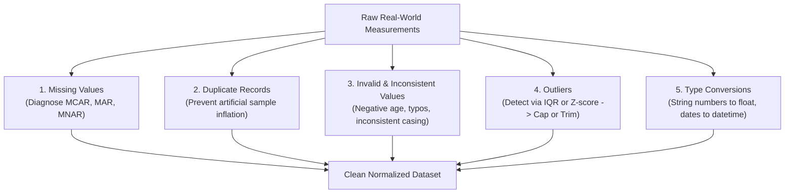
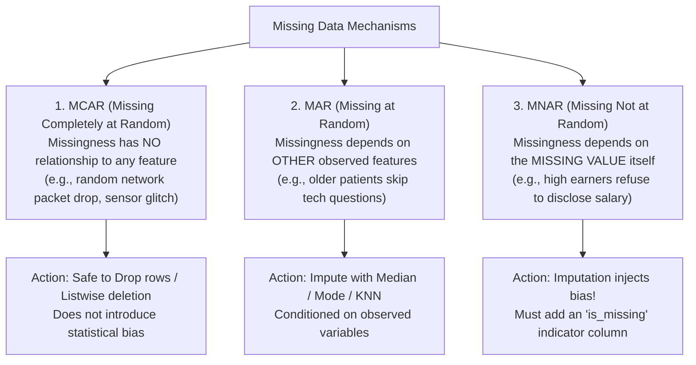
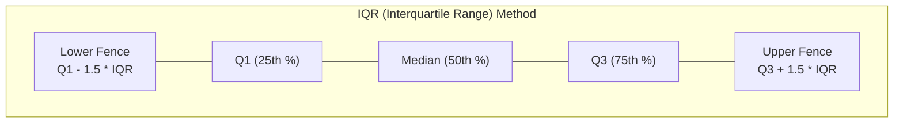
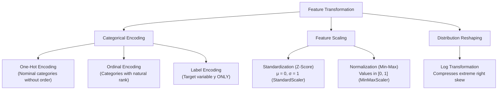
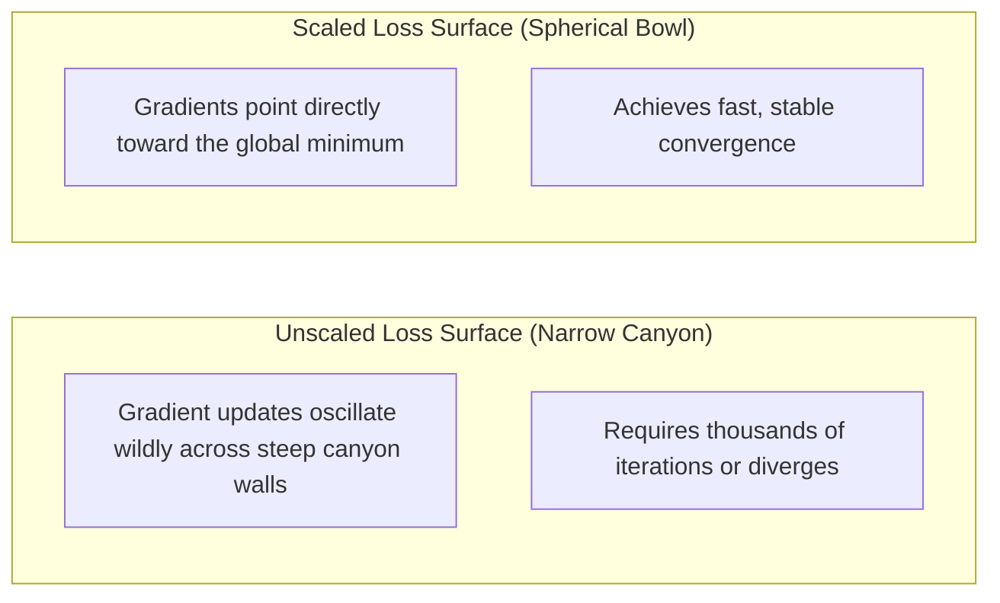
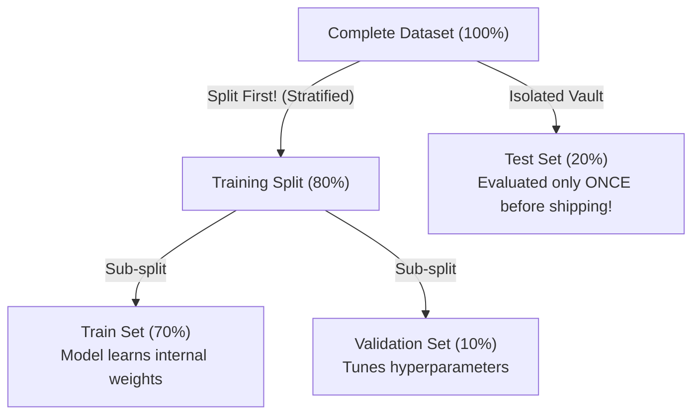
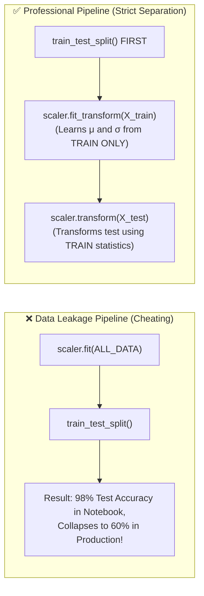

<div class="pixel-banner">
  <div class="pixel-hud-row">
    <div class="pixel-tag"><span class="pixel-indicator"></span>ML_SYS // TENSOR_CORE</div>
    <div class="pixel-meta-right">LVL_03 // PREPROCESSING</div>
  </div>
  <div class="pixel-main-content">
    <div class="pixel-avatar">🧹</div>
    <div class="pixel-headings">
      <div class="pixel-title-badge">LEVEL 03 // DATA PREPROCESSING</div>
      <div class="pixel-subtitle">MCAR • MAR • MNAR • SCALING • ENCODING • ZERO DATA LEAKAGE</div>
    </div>
    <div class="pixel-sparklines">
      <div class="pixel-bar" style="--h: 50%"></div>
      <div class="pixel-bar" style="--h: 70%"></div>
      <div class="pixel-bar" style="--h: 60%"></div>
      <div class="pixel-bar" style="--h: 85%"></div>
      <div class="pixel-bar" style="--h: 90%"></div>
      <div class="pixel-bar" style="--h: 100%"></div>
    </div>
  </div>
  <div class="pixel-footer-row">
    <span class="pixel-coord">SYS_ID: #03_CLEAN // IMPUTATION: ROBUST // LEAK_DETECTION: 0.00%</span>
    <span class="pixel-status-text">[ ACTIVE ]</span>
  </div>
</div>

# Level 3: Data Preprocessing

<div class="notion-callout">
  <div class="notion-callout-icon">💡</div>
  <div class="notion-callout-content">
    Raw measurements collected from real-world sensors, web forms, and databases contain missing entries, inconsistent string formats, extreme outliers, and mismatched numerical scales. Preprocessing transforms these messy inputs into clean, standardized numerical matrices required for stable algorithmic convergence.
  </div>
</div>

<div class="notion-card-meta" style="margin-bottom: 2rem;">
  <span class="notion-tag notion-tag-red">Level 3</span>
  <span class="notion-tag notion-tag-gray">Data Engineering</span>
  <span class="notion-tag notion-tag-yellow">Cleaning & Transformation</span>
</div>

---

## 6. Data Cleaning

Data cleaning systematically audits and rectifies errors, missing values, anomalies, and inconsistencies across the dataset before any model training occurs.



---

### Missing Values & Missingness Mechanisms

Real-world datasets frequently contain null, NaN, or blank entries. Simply dropping every row with missing values (`df.dropna()`) is rarely feasible: in a dataset of 50 features where each feature has just 2% missing values scattered randomly, row deletion will eliminate over 60% of all observations.

Effective imputation requires diagnosing the underlying **mechanism of missingness**:



| Mechanism | Cause | Real-World Example | Impact of Mishandling | Treatment |
| :--- | :--- | :--- | :--- | :--- |
| **MCAR** *(Missing Completely at Random)* | Pure chance or random failure. | A laboratory test tube accidentally slips and shatters. | Dropping records reduces sample size but introduces zero demographic bias. | Drop rows if $<5\%$, or impute with median/mode. |
| **MAR** *(Missing at Random)* | Systematic relationship with *other* observed features in the dataset. | Older survey respondents skip smartphone-related questions. | Dropping records introduces systematic demographic bias. | Impute using **Median/Mode** or **KNNImputer** conditioned on related variables. |
| **MNAR** *(Missing Not at Random)* | Directly tied to the unobserved value itself. | High-income earners decline to reveal salaries; cameras fail in sub-zero cold. | Filling with average values erases the critical pattern that missingness itself indicates an extreme state. | **Add an `is_missing` binary indicator column** to preserve the predictive signal, then impute. |

#### Imputation Strategies

When imputing numerical features, the **Median** is generally preferred over the **Mean**. If 9 workers earn $\$50,000$ and one executive earns $\$1,000,000$, the mean salary jumps to $\$145,000$, heavily distorting any imputed values. The median remains $\$50,000$, resisting outlier distortion.

```python
import pandas as pd
import numpy as np
from sklearn.impute import SimpleImputer

df = pd.DataFrame({
    'age': [25, 30, np.nan, 45, 50],
    'income': [50000, np.nan, 75000, 120000, np.nan]
})

# For MNAR: Create a binary flag preserving the missingness signal
df['income_is_missing'] = df['income'].isna().astype(int)

# Safely impute the numerical column with the median
num_imputer = SimpleImputer(strategy='median')
df['income_imputed'] = num_imputer.fit_transform(df[['income']])
```

---

### Duplicate, Invalid & Inconsistent Data

* **Duplicate Records:** Redundant entries artificially inflate sample weights, leading the model to memorize repeated observations rather than learning generalized boundaries.
* **Invalid Domain Values:** Impossible measurements (e.g., an age of `-5` or `999`) severely skew gradient updates and regression fits.
* **Inconsistent Categories:** Variations in string formatting (`'USA'`, `'usa'`, `'U.S.A.'`) will be interpreted as three distinct categories by encoding tools, fragmenting the data.

```python
# 1. Eliminate duplicate entries
df = df.drop_duplicates()

# 2. Filter out values violating domain bounds
df = df[(df['age'] >= 0) & (df['age'] <= 120)]

# 3. Standardize string casing and remove whitespace
df['country'] = df['country'].str.strip().str.upper().replace({'U.S.A.': 'USA'})

# 4. Cast data types explicitly
df['price'] = df['price'].astype(float)
df['timestamp'] = pd.to_datetime(df['timestamp'])
```

---

### Outlier Detection & Handling

Outliers are observations that deviate drastically from the main distribution. In algorithms using Mean Squared Error (MSE) loss, the penalty grows quadratically with error:

$$\text{Loss} = (y - \hat{y})^2$$

An error of $2$ produces a penalty of $4$, whereas an outlier error of $100$ produces a penalty of $10,000$. The optimizer will aggressively distort the decision boundary to minimize that single outlier's error, compromising overall accuracy.



#### Detection Methods

1. **IQR Rule (Non-Parametric):**
   * $\text{IQR} = Q_3 - Q_1$
   * Lower Bound: $Q_1 - 1.5 \times \text{IQR}$
   * Upper Bound: $Q_3 + 1.5 \times \text{IQR}$
2. **Z-Score Rule (Gaussian Distributions):**
   * Computes standard deviations from the mean: $Z = \frac{x - \mu}{\sigma}$. Observations with $|Z| > 3$ are flagged as outliers.

#### Handling: Capping (Winsorization) vs. Trimming

Trimming outright drops rows, which risks losing valuable real-world samples. Capping (Winsorization) clamps values exceeding the fences back to the threshold limits, neutralizing extreme penalties while preserving sample counts:

```python
Q1 = df['income'].quantile(0.25)
Q3 = df['income'].quantile(0.75)
IQR = Q3 - Q1

lower_limit = Q1 - 1.5 * IQR
upper_limit = Q3 + 1.5 * IQR

# Cap outliers at the boundaries (Winsorization)
df['income_capped'] = np.clip(df['income'], lower_limit, upper_limit)
```

---

## 7. Feature Transformation

Machine learning algorithms require clean numerical representations and behave unpredictably when features operate on vastly different scales.



---

### Categorical Encoding

Algorithms cannot process string values directly. However, assigning arbitrary integer codes to nominal features (`Red=1, Green=2, Blue=3`) creates a false mathematical relationship:

$$\text{Blue} (3) > \text{Red} (1) \quad \text{and} \quad \text{Green} (2) = \frac{\text{Red} (1) + \text{Blue} (3)}{2}$$

The model is misled into searching for a gradient along categories where none exists.

* **One-Hot Encoding (`OneHotEncoder`):** Creates separate binary indicator columns ($0$ or $1$) for each category, treating them as orthogonal dimensions.
* **The Dummy Variable Trap:** If a sample is not Red and not Green, it must be Blue. Keeping all three columns introduces perfect multicollinearity ($x_1 + x_2 + x_3 = 1$), causing matrix inversion to fail in linear regression. Setting `drop='first'` prevents this issue.
* **Ordinal Encoding (`OrdinalEncoder`):** Used strictly when categories possess an authentic hierarchy ($Low < Medium < High$), mapping them to sequential integers to preserve rank.
* **Label Encoding (`LabelEncoder`):** Reserved exclusively for the target vector $y$, encoding string targets (e.g. `'Cat'`, `'Dog'`) into index classes (`0, 1`).

```python
from sklearn.preprocessing import OneHotEncoder, OrdinalEncoder

# One-Hot Encoding nominal categories with dummy trap prevention
ohe = OneHotEncoder(drop='first', sparse_output=False)
city_encoded = ohe.fit_transform(df[['city']])

# Ordinal Encoding preserving rank
size_order = [['Small', 'Medium', 'Large']]
ord_encoder = OrdinalEncoder(categories=size_order)
df['size_code'] = ord_encoder.fit_transform(df[['size']])
```

---

### Feature Scaling: Standardization vs. Normalization

When features operate on vastly different magnitudes—such as `Salary` ($50,000$ to $200,000$) and `Experience` ($1$ to $15$ years)—unscaled inputs cause severe algorithmic failures:



1. **Gradient Descent Oscillations:** The loss surface of unscaled features forms a narrow, steep-sided elliptical canyon. Gradients bounce erratically across the walls, requiring thousands of steps to make progress. Scaling rounds the contours into a spherical bowl, enabling gradients to point directly toward the minimum.
2. **Distance-Based Distortion (KNN, SVM, K-Means):** In Euclidean distance calculations:
   
   $$\text{Distance} = \sqrt{(\Delta \text{Salary})^2 + (\Delta \text{Experience})^2}$$
   
   A $\$1,000$ salary difference dominates a $10$-year experience difference ($1,000^2 = 1,000,000$ vs $10^2 = 100$). The model becomes effectively blind to experience.

*(Note: Tree-based architectures such as Decision Trees and Random Forests are split based on order rather than distance, making them invariant to monotonic scaling.)*

* **Standardization (`StandardScaler`):** Rescales data to have a mean of $\mu = 0$ and unit variance $\sigma = 1$:
  
  $$Z = \frac{x - \mu}{\sigma}$$
  
  Preferred for most models because it handles moderate outliers without bounding the distribution.
* **Normalization (`MinMaxScaler`):** Compresses values into a bounded range $[0, 1]$:
  
  $$X_{\text{norm}} = \frac{x - x_{\min}}{x_{\max} - x_{\min}}$$
  
  Required when values must remain strictly bounded (such as image pixel intensities $0–255$ scaled to $0.0–1.0$).

```python
from sklearn.preprocessing import StandardScaler, MinMaxScaler

# Standardize to zero mean and unit variance
scaler = StandardScaler()
X_standardized = scaler.fit_transform(X_train)

# Normalize strictly between 0 and 1
minmax = MinMaxScaler()
X_normalized = minmax.fit_transform(X_train)
```

---

### Log Transformation

Variables governed by multiplicative growth or power-law distributions (such as incomes, web traffic, and transaction amounts) exhibit extreme right-skew: the vast majority of observations cluster at low values while a tiny tail extends into millions.

Linear models assume residuals follow a Gaussian distribution. Applying a natural logarithm compresses the extended tail and expands dense lower regions, converting skewed data into a symmetric bell curve:

$$y_{\text{transformed}} = \log(1 + x)$$

```python
# Apply log(1 + x) to handle zero values safely
df['income_log'] = np.log1p(df['income'])
```

---

## 8. Dataset Splitting & Data Leakage Prevention



### Dataset Partitions

1. **Training Set (70%):** The primary data used by the optimization algorithm to adjust internal weights and parameters.
2. **Validation Set (15%):** Used during development to evaluate multiple model candidates, select optimal architectures, tune hyperparameters, and monitor for overfitting.
3. **Test Set (15%):** Kept completely isolated until modeling is completed, providing an unbiased estimate of generalization performance on unseen real-world data.

### Random vs. Stratified Splitting

* **Random Splitting:** Randomly assigns observations to splits. In imbalanced datasets (e.g., a fraud detection dataset with 99% normal transactions and 1% fraud), random chance can leave the test set with almost zero fraud cases.
* **Stratified Splitting (`stratify=y`):** Preserves the exact class proportion across both training and test partitions, ensuring realistic benchmark conditions.

---

### Data Leakage Mechanics & Mitigation

<div class="notion-callout">
  <div class="notion-callout-icon">⚠️</div>
  <div class="notion-callout-content">
    <strong>Data Leakage:</strong> The accidental incorporation of test or validation data statistics into the training process. In production, future test data does not exist at training time. If a scaler or imputer computes summary metrics using the entire dataset, the model is evaluated on data it has effectively already seen.
  </div>
</div>



```python
from sklearn.model_selection import train_test_split
from sklearn.preprocessing import StandardScaler

# 1. Split the dataset before applying any transformation
X_train, X_test, y_train, y_test = train_test_split(
    X, y, test_size=0.20, random_state=42, stratify=y
)

# 2. Fit the scaler ONLY on training data
scaler = StandardScaler()
X_train_scaled = scaler.fit_transform(X_train)

# 3. Transform test data using the statistics learned from training data
# Never call .fit() or .fit_transform() on test data
X_test_scaled = scaler.transform(X_test)
```

---

<div class="notion-callout">
  <div class="notion-callout-icon">🎯</div>
  <div class="notion-callout-content">
    <strong>Level 3 Key Takeaway:</strong> Clean data and careful transformations are foundational to machine learning success. Diagnosing missingness mechanisms (MCAR, MAR, MNAR) dictates imputation strategy, encoding maps categories without false rankings, feature scaling stabilizes gradient descent, and strict dataset splitting guarantees that benchmark results reflect genuine real-world performance.
  </div>
</div>
