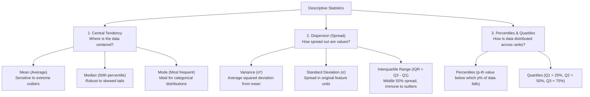
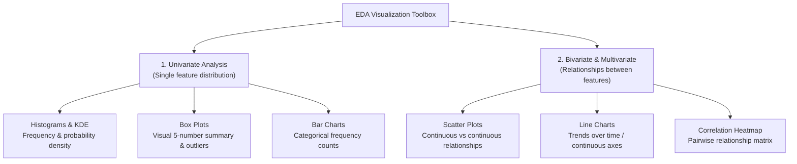
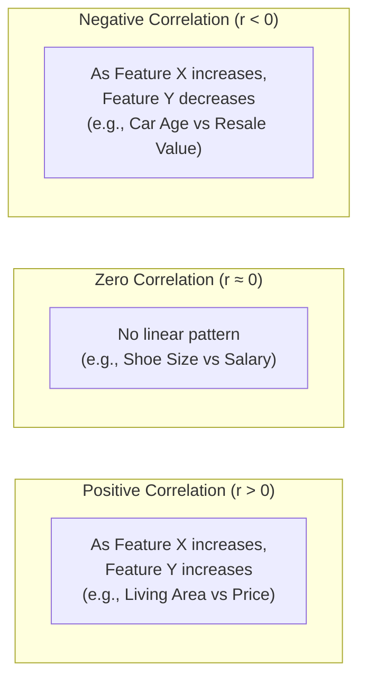

<div class="pixel-banner">
  <div class="pixel-hud-row">
    <div class="pixel-tag"><span class="pixel-indicator"></span>ML_SYS // TENSOR_CORE</div>
    <div class="pixel-meta-right">LVL_04 // STATISTICAL_EDA</div>
  </div>
  <div class="pixel-main-content">
    <div class="pixel-avatar">📈</div>
    <div class="pixel-headings">
      <div class="pixel-title-badge">LEVEL 04 // EXPLORATORY DATA ANALYSIS</div>
      <div class="pixel-subtitle">DISTRIBUTIONS • SKEWNESS • CORRELATION MATRICES • OUTLIER DIAGNOSTICS</div>
    </div>
    <div class="pixel-sparklines">
      <div class="pixel-bar" style="--h: 60%"></div>
      <div class="pixel-bar" style="--h: 40%"></div>
      <div class="pixel-bar" style="--h: 80%"></div>
      <div class="pixel-bar" style="--h: 95%"></div>
      <div class="pixel-bar" style="--h: 70%"></div>
      <div class="pixel-bar" style="--h: 85%"></div>
    </div>
  </div>
  <div class="pixel-footer-row">
    <span class="pixel-coord">SYS_ID: #04_EDA // CORR_MAX: 0.88 // PAIRPLOT: GENERATED</span>
    <span class="pixel-status-text">[ ACTIVE ]</span>
  </div>
</div>

# Level 4: Exploratory Data Analysis (EDA)

<div class="notion-callout">
  <div class="notion-callout-icon">💡</div>
  <div class="notion-callout-content">
    Exploratory Data Analysis is the investigative phase where you interrogate data before choosing models or writing training loops. It uncovers underlying distributions, detects anomalies and skewness, maps feature correlations, and exposes multicollinearity that would destabilize linear models.
  </div>
</div>

<div class="notion-card-meta" style="margin-bottom: 2rem;">
  <span class="notion-tag notion-tag-blue">Level 4</span>
  <span class="notion-tag notion-tag-gray">Data Investigation</span>
  <span class="notion-tag notion-tag-green">Statistics & Visualization</span>
</div>

---

## 9. Descriptive Statistics

Descriptive statistics condense thousands of raw data points into concise numerical summaries that describe a feature's center, dispersion, and shape.



---

### Central Tendency: Mean vs. Median vs. Mode

* **Mean ($\mu$):** The arithmetic balance point:

    $$\mu = \frac{1}{N} \sum_{i=1}^N x_i$$

    Because every value contributes proportionally, a single extreme number (such as a $\$50,000,000$ outlier in property data) drastically pulls the mean away from the bulk of observations.
* **Median ($Q_2$):** The physical midpoint when values are sorted. It divides the population into two equal halves. In right-skewed or contaminated distributions, the median provides a significantly more reliable measure of typical values.
* **Mode:** The value that appears with the highest frequency. This is the only central metric applicable to nominal categorical features.

```python
import numpy as np
import pandas as pd
from scipy import stats

values = np.array([45, 50, 52, 55, 58, 60, 62, 500])  # Contains extreme outlier (500)

print("Mean:", np.mean(values))       # 102.75 (Heavily distorted)
print("Median:", np.median(values))   # 56.5   (Accurately reflects center)
print("Mode:", stats.mode(values).mode)
```

---

### Dispersion: Variance, Standard Deviation & IQR

Measuring central tendency alone is incomplete: two groups of students can both have an average exam score of $75$, but in Group A all scores range between $70$ and $80$, while in Group B scores range between $20$ and $100$.

* **Variance ($\sigma^2$):** The average squared distance of each observation from the mean:

    $$\sigma^2 = \frac{1}{N} \sum_{i=1}^N (x_i - \mu)^2$$

    Squaring amplifies distant values and converts units into squared terms (e.g., $\text{dollars}^2$), making direct physical interpretation difficult.

* **Standard Deviation ($\sigma$):** The square root of variance:

    $$\sigma = \sqrt{\sigma^2}$$

    This restores spread into the original units of measurement. In a Gaussian distribution, the **Empirical Rule** states:
    * $\approx 68.2\%$ of observations fall within $\mu \pm 1\sigma$
    * $\approx 95.4\%$ of observations fall within $\mu \pm 2\sigma$
    * $\approx 99.7\%$ of observations fall within $\mu \pm 3\sigma$

* **Interquartile Range (IQR):** Spans the middle $50\%$ of observations:

    $$\text{IQR} = Q_3 - Q_1$$

    Unlike variance and standard deviation, the IQR is completely unaffected by values at the tails, making it the preferred dispersion metric for skewed or outlier-heavy distributions.

---

## 10. Data Visualization

Visualization transforms tabular rows into geometric patterns, allowing you to instantly identify clusters, multimodality, skewness, and non-linear boundaries.



---

### Visualization Selection & Application

* **Histograms & Distribution Plots (KDE):** Reveal whether a feature follows a normal bell curve, exhibits bi-modal peaks (indicating two distinct sub-populations, such as weekend vs weekday web traffic), or suffers from heavy skewness requiring log transformation.
* **Box Plots:** Graphically render the five-number summary: Minimum, $Q_1$, Median, $Q_3$, and Maximum, with outlier observations plotted as isolated dots beyond the fences.
* **Scatter Plots:** Map pairs of continuous features on Cartesian axes. They reveal linear correlations, exponential curves, heteroscedastic fan shapes, and cluster separations.
* **Bar Charts vs. Line Charts:** Bar charts compare discrete categorical counts, whereas line charts track continuous sequential trends (such as model loss over training epochs).
* **Correlation Heatmaps:** Color-coded matrices displaying pairwise correlation coefficients across all numerical columns, instantly highlighting predictive signals and redundant collinear features.

```python
import matplotlib.pyplot as plt
import seaborn as sns

# Set visual style
sns.set_theme(style="whitegrid")
fig, axes = plt.subplots(1, 2, figsize=(14, 5))

# 1. Distribution Plot (Histogram + KDE curve)
sns.histplot(df['income'], kde=True, ax=axes[0], color='royalblue')
axes[0].set_title("Distribution of Income (Checking Skewness)")

# 2. Boxplot (Outlier detection)
sns.boxplot(x=df['department'], y=df['income'], ax=axes[1], palette="Set2")
axes[1].set_title("Income Distribution by Department")

plt.tight_layout()
plt.show()
```

---

## 11. Correlation & Multicollinearity

Feature interactions govern predictive modeling: some features hold strong predictive associations with target variables, while others provide redundant duplicates of existing inputs.



---

### Covariance vs. Correlation

* **Covariance ($\text{Cov}(X, Y)$):** Measures the directional joint variability of two variables:

    $$\text{Cov}(X, Y) = \frac{1}{N} \sum_{i=1}^N (x_i - \mu_x)(y_i - \mu_y)$$

    If large values of $X$ match large values of $Y$, covariance is positive. However, covariance is unscaled: multiplying property areas by $1,000$ multiplies covariance by $1,000$, making it impossible to determine the true strength of a relationship from covariance alone.

* **Pearson Correlation Coefficient ($r$):** Normalizes covariance by the product of both standard deviations, bounding values strictly between $-1.0$ and $+1.0$:

    $$r = \frac{\text{Cov}(X, Y)}{\sigma_x \cdot \sigma_y}$$

    * $r = +1.0$: Perfect positive linear correlation.
    * $r = 0.0$: No linear relationship.
    * $r = -1.0$: Perfect negative linear correlation.
* **Spearman Rank Correlation ($\rho$):** Computes Pearson correlation on the **ranks** of data rather than raw values. It detects monotonic relationships (e.g., $y = e^x$), even when non-linear, and resists outlier distortion.

```python
# Correlation matrix calculation
pearson_corr = df.corr(method='pearson', numeric_only=True)
spearman_corr = df.corr(method='spearman', numeric_only=True)

# Visualize with a heatmap
plt.figure(figsize=(8, 6))
sns.heatmap(pearson_corr, annot=True, cmap='coolwarm', fmt=".2f", vmin=-1, vmax=1)
plt.title("Pearson Correlation Matrix")
plt.show()
```

---

### Multicollinearity: The Hidden Model Destroyer

Multicollinearity occurs when two or more input features are strongly correlated with each other (e.g., including both `Area_in_sqft` and `Area_in_sq_meters`).

While tree-based models handle collinearity smoothly, linear models (Linear Regression, Logistic Regression) calculate weights using matrix inversion:

$$W = (X^T X)^{-1} X^T y$$

When two columns are collinear, $(X^T X)$ becomes nearly singular (non-invertible). This causes:
1. Weight estimates to explode to extreme, erratic values.
2. Inability to interpret feature importance (the model cannot determine which feature is driving the prediction).
3. Minor changes in training data to cause wild swings in model coefficients.

#### Detecting Multicollinearity with Variance Inflation Factor (VIF)

The Variance Inflation Factor measures how much the variance of an estimated regression coefficient increases due to collinearity with other features:

$$\text{VIF}_j = \frac{1}{1 - R_j^2}$$

* $\text{VIF} = 1$: Completely independent.
* $\text{VIF} > 5$: Moderate collinearity requiring investigation.
* $\text{VIF} > 10$: Severe multicollinearity; one of the collinear features should be removed.

```python
from statsmodels.stats.outliers_influence import variance_inflation_factor

# Calculate VIF for each feature
X_numeric = df.select_dtypes(include=[np.number]).dropna()
vif_data = pd.DataFrame()
vif_data["feature"] = X_numeric.columns
vif_data["VIF"] = [
    variance_inflation_factor(X_numeric.values, i) 
    for i in range(X_numeric.shape[1])
]
print(vif_data)
```

---

<div class="notion-callout">
  <div class="notion-callout-icon">🎯</div>
  <div class="notion-callout-content">
    <strong>Level 4 Key Takeaway:</strong> Exploratory Data Analysis reveals the true shape of your data before modeling begins. Checking mean vs median exposes skewness, histograms and boxplots identify transform needs and outlier fences, and correlation heatmaps paired with VIF protect linear algorithms against destructive multicollinearity.
  </div>
</div>
