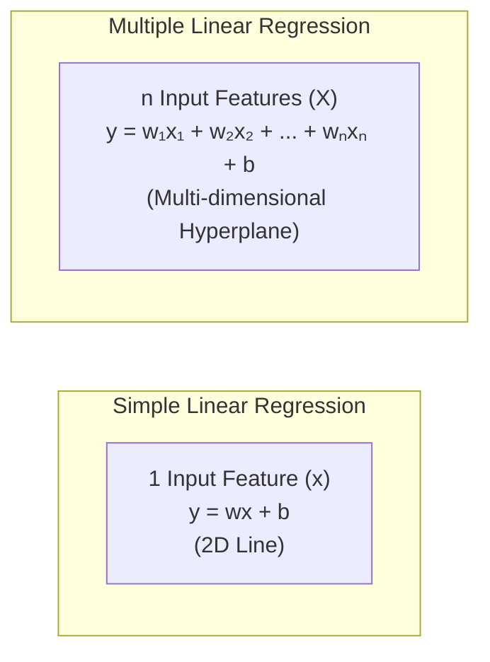
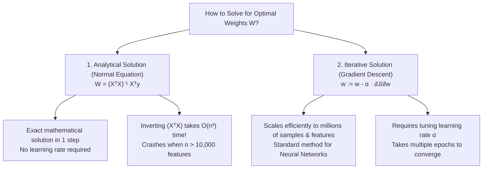
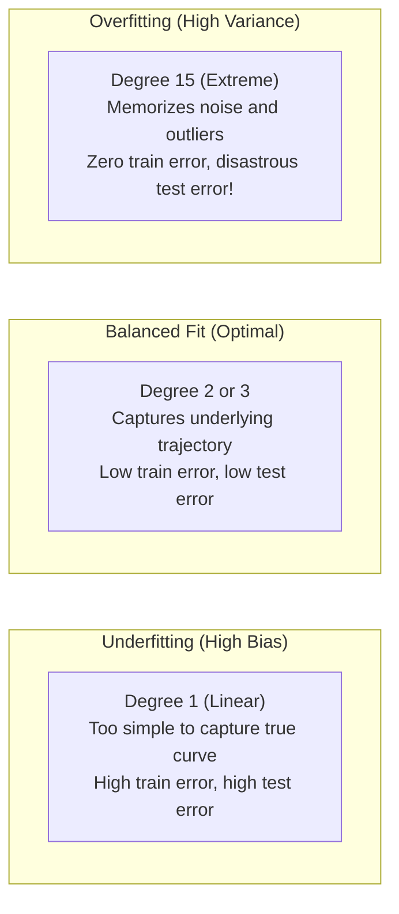
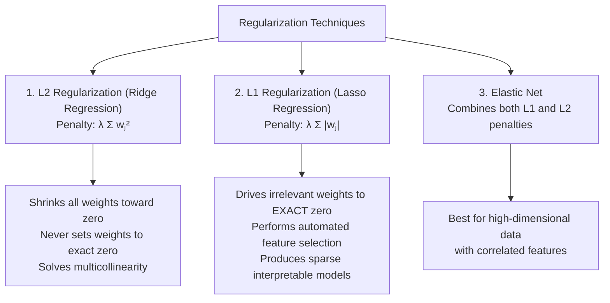

<div class="pixel-banner">
  <div class="pixel-hud-row">
    <div class="pixel-tag"><span class="pixel-indicator"></span>ML_SYS // TENSOR_CORE</div>
    <div class="pixel-meta-right">LVL_05 // CONTINUOUS_PREDICTION</div>
  </div>
  <div class="pixel-main-content">
    <div class="pixel-avatar">📉</div>
    <div class="pixel-headings">
      <div class="pixel-title-badge">LEVEL 05 // REGRESSION & REGULARIZATION</div>
      <div class="pixel-subtitle">OLS • GRADIENT DESCENT • RIDGE L2 • LASSO L1 • ELASTICNET</div>
    </div>
    <div class="pixel-sparklines">
      <div class="pixel-bar" style="--h: 90%"></div>
      <div class="pixel-bar" style="--h: 75%"></div>
      <div class="pixel-bar" style="--h: 55%"></div>
      <div class="pixel-bar" style="--h: 40%"></div>
      <div class="pixel-bar" style="--h: 25%"></div>
      <div class="pixel-bar" style="--h: 15%"></div>
    </div>
  </div>
  <div class="pixel-footer-row">
    <span class="pixel-coord">SYS_ID: #05_REGRESS // LOSS_CONVERGENCE: MSE // ALPHA_TUNING: OK</span>
    <span class="pixel-status-text">[ CONVERGED ]</span>
  </div>
</div>

# Level 5: Regression & Regularization

<div class="notion-callout">
  <div class="notion-callout-icon">💡</div>
  <div class="notion-callout-content">
    Regression algorithms predict continuous numerical quantities—such as property valuations, object bounding box coordinates, or processing latency. Understanding how linear models fit weights, how polynomial expansions capture non-linear curves, and how L1/L2 penalties prevent overfitting establishes the mathematical foundation for deep neural networks.
  </div>
</div>

<div class="notion-card-meta" style="margin-bottom: 2rem;">
  <span class="notion-tag notion-tag-purple">Level 5</span>
  <span class="notion-tag notion-tag-gray">Continuous Prediction</span>
  <span class="notion-tag notion-tag-blue">Linear & Regularized Models</span>
</div>

---

## 12. Linear Regression

Linear Regression models the relationship between an independent feature vector $X$ and a continuous dependent target $y$ by fitting an optimal straight line (or hyper-plane).



---

### The Mathematical Formulation

The linear prediction equation is expressed as:

$$\hat{y} = w_1 x_1 + w_2 x_2 + \dots + w_n x_n + b = XW + b$$

* **Weights ($W = [w_1, w_2, \dots, w_n]^T$):** The learned parameters that quantify the rate of change in target $y$ per unit change in each feature.
* **Bias ($b$):** The intercept term indicating the predicted baseline value when all input features equal zero.

---

### The Cost Function: Mean Squared Error (MSE)

To measure how well the line fits the data, we compute the average squared difference between actual target values $y$ and model predictions $\hat{y}$:

$$J(W, b) = \frac{1}{2m} \sum_{i=1}^m \left( \hat{y}^{(i)} - y^{(i)} \right)^2$$

*(The constant $\frac{1}{2}$ is included for mathematical convenience, cancelling out cleanly when taking derivatives during gradient descent).*

Squaring the residuals ensures that:
1. Positive and negative errors do not cancel each other out.
2. Large errors are penalized much more severely than small ones.

---

### Optimizing Weights: Normal Equation vs. Gradient Descent



#### Gradient Descent Weight Updates

Gradient descent iteratively updates parameters in the opposite direction of the cost function's gradient:

$$w_j := w_j - \alpha \frac{\partial J}{\partial w_j} = w_j - \alpha \frac{1}{m} \sum_{i=1}^m \left( \hat{y}^{(i)} - y^{(i)} \right) x_j^{(i)}$$

$$b := b - \alpha \frac{\partial J}{\partial b} = b - \alpha \frac{1}{m} \sum_{i=1}^m \left( \hat{y}^{(i)} - y^{(i)} \right)$$

* **Learning Rate ($\alpha$):** Governs step size. If $\alpha$ is too small, convergence takes thousands of iterations; if $\alpha$ is too large, the updates overshoot and diverge.

```python
import numpy as np
from sklearn.linear_model import LinearRegression
from sklearn.metrics import mean_squared_error, r2_score

# Sample feature matrix X (Area, Bedrooms) and Target y (Price)
X = np.array([[1200, 2], [1500, 3], [1800, 3], [2400, 4], [3000, 5]])
y = np.array([250000, 310000, 360000, 470000, 580000])

# Fit Ordinary Least Squares model
model = LinearRegression()
model.fit(X, y)

print("Learned Weights (Coefficients):", model.coef_)
print("Learned Bias (Intercept):", model.intercept_)

# Predict and evaluate
predictions = model.predict(X)
print("MSE:", mean_squared_error(y, predictions))
print("R² Score:", r2_score(y, predictions))
```

---

## 13. Polynomial Regression

Real-world relationships are rarely strictly linear. When targets exhibit parabolic curves, wave patterns, or saturating thresholds, standard linear models underfit.

Polynomial regression introduces non-linear capacity by generating higher-degree powers and cross-product interaction terms from existing features:

$$\hat{y} = w_1 x + w_2 x^2 + w_3 x^3 + \dots + b$$

Crucially, because the equation remains **linear with respect to the weights $W$**, we can still optimize it using standard linear regression solvers.



```python
from sklearn.preprocessing import PolynomialFeatures
from sklearn.pipeline import make_pipeline

# Transform feature [x] into [x, x²]
poly_pipeline = make_pipeline(
    PolynomialFeatures(degree=2, include_bias=False),
    LinearRegression()
)
poly_pipeline.fit(X, y)
```

---

## 14. Regularization: Ridge, Lasso & Elastic Net

As model complexity grows (especially with higher-degree polynomial features), weights often balloon to astronomical positive and negative numbers that cancel each other out on training points but produce wild swings on new inputs.

**Regularization** prevents overfitting by adding a mathematical penalty on large weights directly to the cost function:



---

### Ridge Regression (L2 Regularization)

Ridge adds the sum of squared weights to the loss function:

$$J_{\text{Ridge}}(W) = \text{MSE} + \alpha \sum_{j=1}^n w_j^2$$

* **How it works:** Squaring the weights exerts a proportional pulling force back toward zero. The larger a weight becomes, the harder Ridge pulls it down.
* **Key characteristic:** Ridge shrinks weights close to zero but **never forces them to exactly zero**. It is particularly effective at stabilizing models suffering from multicollinearity.

---

### Lasso Regression (L1 Regularization)

Lasso (**Least Absolute Shrinkage and Selection Operator**) adds the sum of absolute weight values:

$$J_{\text{Lasso}}(W) = \text{MSE} + \alpha \sum_{j=1}^n |w_j|$$

* **How it works:** The derivative of $|w|$ is a constant ($\pm 1$). Unlike L2 which eases off as weights shrink, L1 pulls with constant strength all the way to zero.
* **Key characteristic:** Lasso drives non-essential weights to **exactly zero**, acting as a built-in automated **feature selector**.

---

### Elastic Net

When features are highly correlated, Lasso tends to select one arbitrary feature from the group and set the rest to zero, while Ridge shares weight across all of them. Elastic Net balances both worlds:

$$J_{\text{ElasticNet}}(W) = \text{MSE} + \alpha \left( \rho \sum_{j=1}^n |w_j| + \frac{1 - \rho}{2} \sum_{j=1}^n w_j^2 \right)$$

where $\rho$ (`l1_ratio`) controls the balance between L1 and L2 penalties.

```python
from sklearn.linear_model import Ridge, Lasso, ElasticNet

# 1. Ridge Regression (L2)
ridge = Ridge(alpha=1.0)
ridge.fit(X, y)
print("Ridge weights:", ridge.coef_)

# 2. Lasso Regression (L1 - forces zero weights)
lasso = Lasso(alpha=0.1)
lasso.fit(X, y)
print("Lasso weights (notice zeroes):", lasso.coef_)

# 3. Elastic Net (Hybrid L1 + L2)
elastic = ElasticNet(alpha=0.1, l1_ratio=0.5)
elastic.fit(X, y)
```

---

<div class="notion-callout">
  <div class="notion-callout-icon">🎯</div>
  <div class="notion-callout-content">
    <strong>Level 5 Key Takeaway:</strong> Linear regression minimizes squared residual errors using analytical or gradient-based methods. Adding polynomial terms expands model capacity to fit curves, while L1 (Lasso) and L2 (Ridge) regularization prevent overfitting by penalizing inflated weights.
  </div>
</div>
