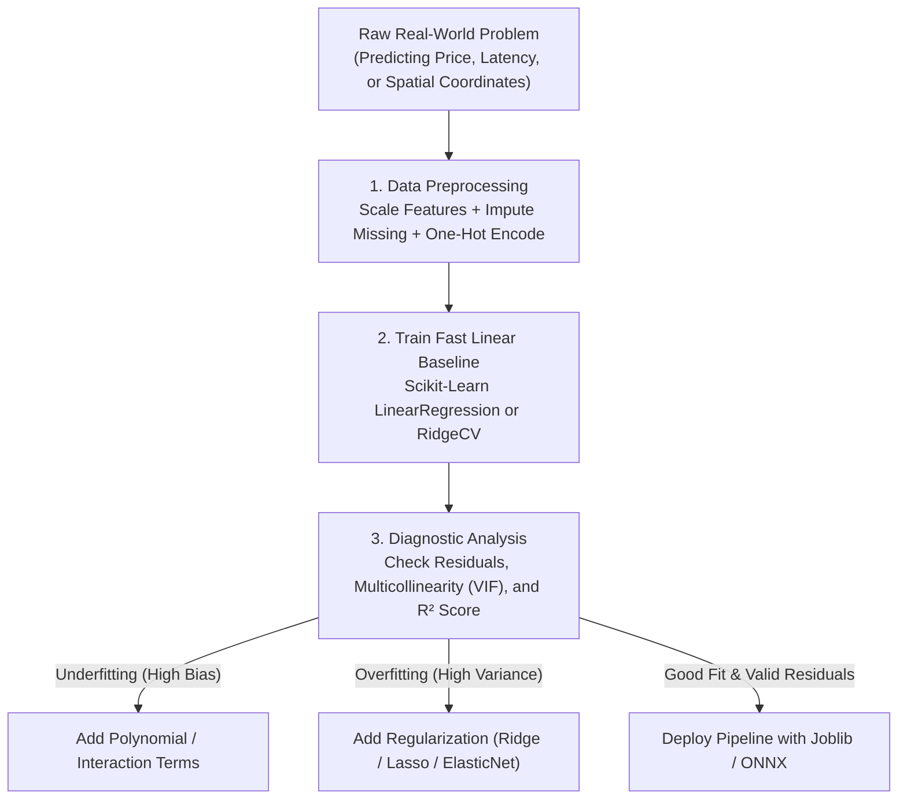
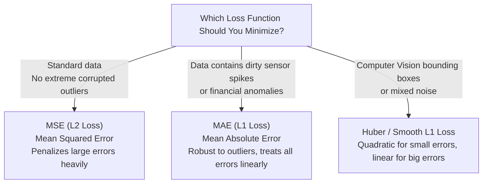
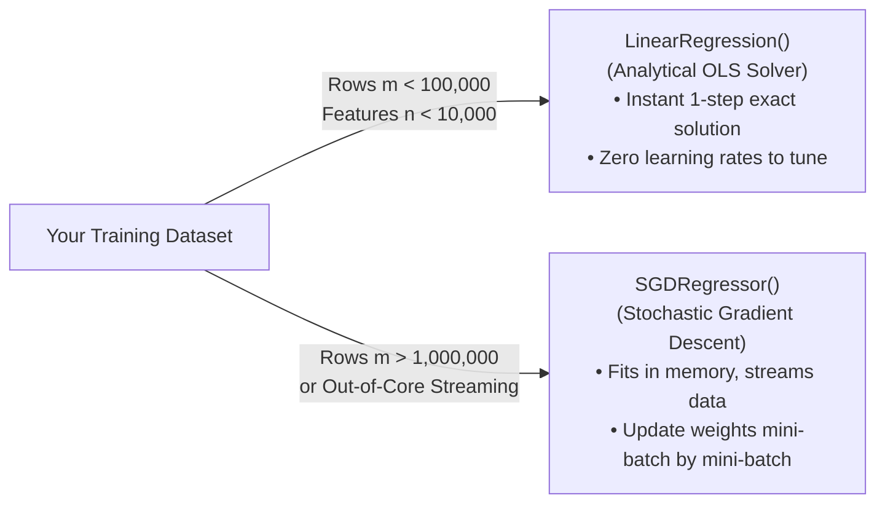
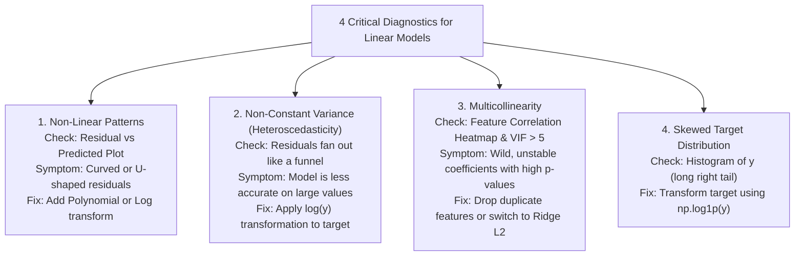
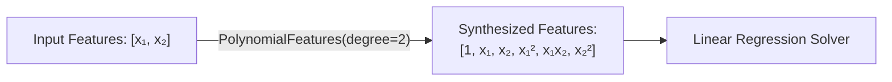
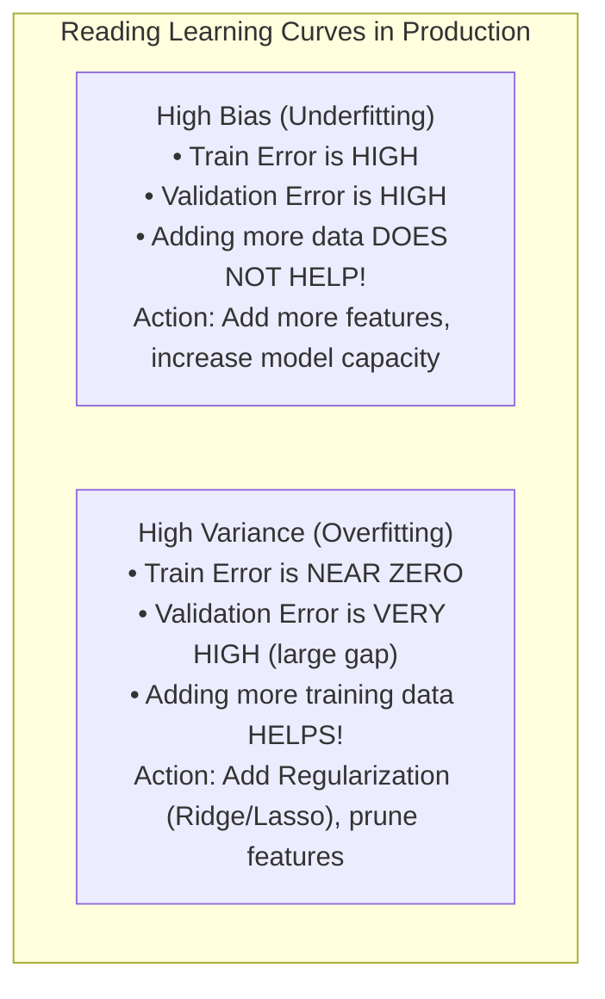
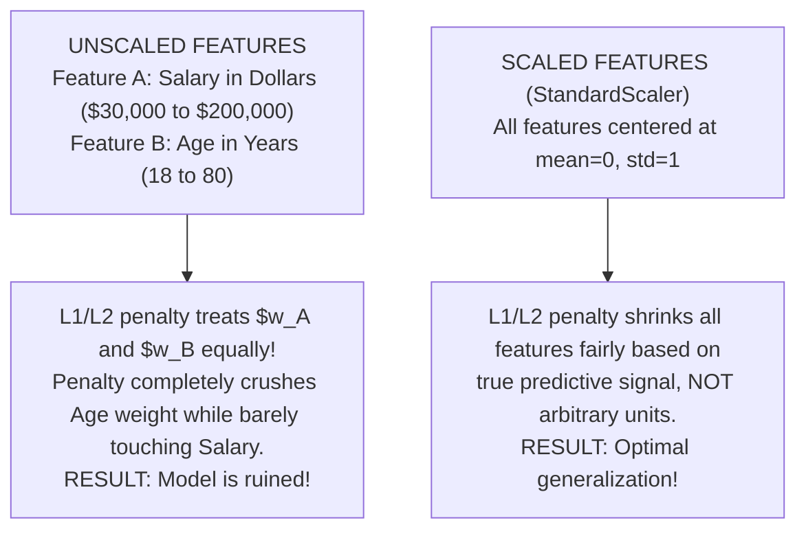
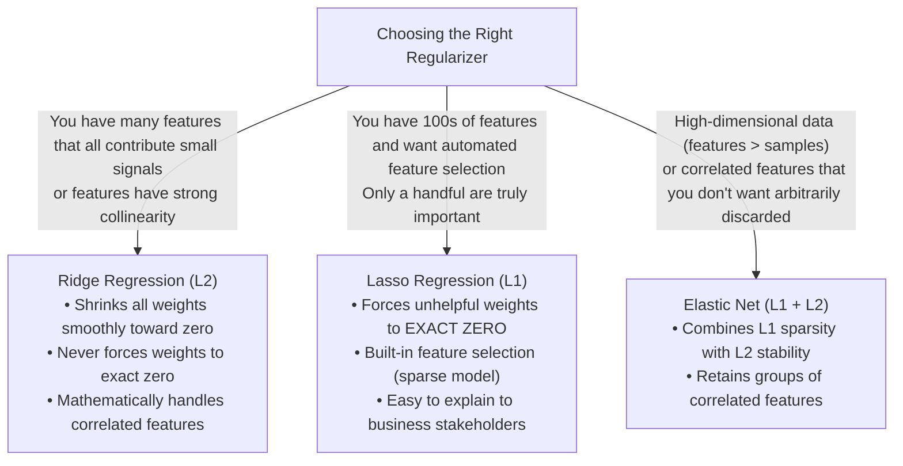
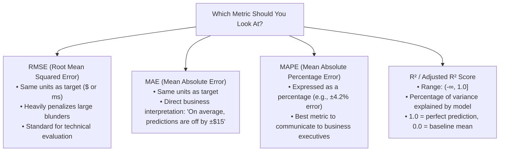
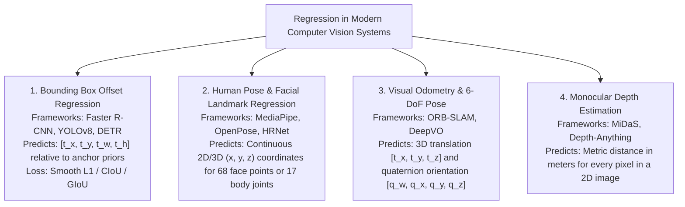

<div class="pixel-banner">
  <div class="pixel-hud-row">
    <div class="pixel-tag"><span class="pixel-indicator"></span>ML_SYS // TENSOR_CORE</div>
    <div class="pixel-meta-right">LVL_05 // PRACTICAL_PREDICTION</div>
  </div>
  <div class="pixel-main-content">
    <div class="pixel-avatar">📉</div>
    <div class="pixel-headings">
      <div class="pixel-title-badge">LEVEL 05 // PRACTICAL REGRESSION & REGULARIZATION</div>
      <div class="pixel-subtitle">PRODUCTION WORKFLOWS • SCALING • FEATURE IMPORTANCE • RIDGECV • LASSOCV</div>
    </div>
    <div class="pixel-sparklines">
      <div class="pixel-bar" style="--h: 90%"></div>
      <div class="pixel-bar" style="--h: 75%"></div>
      <div class="pixel-bar" style="--h: 58%"></div>
      <div class="pixel-bar" style="--h: 42%"></div>
      <div class="pixel-bar" style="--h: 28%"></div>
      <div class="pixel-bar" style="--h: 15%"></div>
    </div>
  </div>
  <div class="pixel-footer-row">
    <span class="pixel-coord">SYS_ID: #05_REGRESS // TARGET_METRIC: RMSE_R2 // PIPELINE: PREPROCESSED</span>
    <span class="pixel-status-text">[ PRODUCTION READY ]</span>
  </div>
</div>

# Level 5: Regression & Regularization

<div class="notion-callout">
  <div class="notion-callout-icon">💡</div>
  <div class="notion-callout-content">
    In machine learning practice, regression is about predicting <strong>continuous numerical quantities</strong>: estimating house prices, forecasting server inference latency, determining camera depth in autonomous driving, or predicting bounding box coordinates $[x, y, w, h]$ in object detection. This level focuses on how to actually build, scale, diagnose, tune, and deploy linear and regularized models in real-world ML systems.
  </div>
</div>

<div class="notion-card-meta" style="margin-bottom: 2rem;">
  <span class="notion-tag notion-tag-purple">Level 5</span>
  <span class="notion-tag notion-tag-gray">Hands-On ML Engineering</span>
  <span class="notion-tag notion-tag-blue">Linear & Regularized Models</span>
</div>

---

## 12. Linear Regression in Practice

Linear regression is the foundational baseline for continuous prediction. In production, its extreme speed (sub-millisecond inference), low compute footprint, and transparent interpretability make it the first model you should train before attempting complex gradient boosted trees or deep networks.



---

### The Working Equation

A regression model makes predictions by calculating a weighted sum of the input features, plus a bias constant (intercept):

$$\hat{y} = w_1 x_1 + w_2 x_2 + \dots + w_n x_n + b$$

In vectorized production code (using NumPy or Scikit-Learn):

$$\hat{\mathbf{y}} = \mathbf{X} \mathbf{w} + b$$

* **Feature Values ($x_j$):** The numeric measurements (e.g., square footage, number of CPU cores, past 7-day average temperature).
* **Weights ($w_j$):** The model's learned sensitivity multipliers. If $w_{\text{cores}} = +12.4$, every additional CPU core increases the predicted system throughput by $12.4$ units, holding all other features fixed.
* **Bias ($b$):** The baseline prediction when all inputs $x$ are zero.

---

### Choosing the Right Loss Function for Your Business Metric

When training your model, the choice of loss function directly determines how your model behaves in production:



#### Real-World Loss Comparison Table

| Metric | Scikit-Learn Class / Parameter | Outlier Behavior | Practical Use Case |
| :--- | :--- | :--- | :--- |
| **MSE ($L_2$)** | `LinearRegression()`, `SGDRegressor(loss='squared_error')` | Heavily penalized (errors are squared). A single bad outlier can derail the whole model. | Default for clean tabular data, latency forecasting. |
| **MAE ($L_1$)** | `SGDRegressor(loss='epsilon_insensitive')`, `QuantileRegressor` | Robust and steady. Treats an error of 100 as 10x an error of 10. | Real estate valuation, dirty operational logs. |
| **Huber Loss** | `SGDRegressor(loss='huber', epsilon=1.35)` | Best of both worlds: smooth at the center, linear for distant outliers. | Object detection bounding box regressions (YOLO / Faster R-CNN). |

---

### Closed-Form vs. Iterative Solvers: What to Pick in Production

When using Scikit-Learn, you have two primary ways to fit a linear model:



* **`LinearRegression()` (Analytical OLS):** Uses LAPACK's Singular Value Decomposition (SVD). Best for small-to-medium datasets that easily fit in RAM.
* **`SGDRegressor()` (Iterative Gradient Descent):** Fits models by processing instances in batches. Mandatory when working with millions of samples or out-of-core streaming datasets.

```python
import numpy as np
from sklearn.linear_model import LinearRegression, SGDRegressor
from sklearn.preprocessing import StandardScaler
from sklearn.pipeline import make_pipeline

# 1. Standard Analytical OLS (Best for standard datasets)
ols_model = LinearRegression()

# 2. Gradient Descent SGD (Best for massive or streaming data)
# NOTE: Feature scaling is MANDATORY for SGD convergence!
sgd_model = make_pipeline(
    StandardScaler(),
    SGDRegressor(max_iter=1000, tol=1e-3, eta0=0.01, learning_rate="adaptive")
)
```

---

## 13. Practical Diagnostics: Assumptions & Failure Modes

Before deploying a linear model, professional ML engineers run **diagnostics** to confirm whether linear assumptions hold or whether the model is silently misleading.



### 1. How to Handle Skewed Targets in Practice (`TransformedTargetRegressor`)

In real-world data (such as housing prices, click-through rates, or server request latencies), target values are heavily **right-skewed** (most values are small, but a few are huge). Training directly on skewed targets produces poor fits.

The professional ML pattern is to train on $\log(y)$ and automatically exponentiate predictions:

```python
import numpy as np
from sklearn.compose import TransformedTargetRegressor
from sklearn.linear_model import Ridge

# Automatically applies log1p(y) before training and expm1(y) during predict()!
model = TransformedTargetRegressor(
    regressor=Ridge(alpha=1.0),
    func=np.log1p,
    inverse_func=np.expm1
)
```

---

### 2. Detecting Multicollinearity with Variance Inflation Factor (VIF)

When two features are almost identical (e.g., `area_sq_ft` and `area_sq_meters`, or `RAM_GB` and `RAM_MB`), the model cannot determine which feature is truly responsible. The weights swing wildly between $+10,000$ and $-10,000$.

```python
import pandas as pd
from statsmodels.stats.outliers_influence import variance_inflation_factor

def compute_vif(df_features):
    vif_data = pd.DataFrame()
    vif_data["Feature"] = df_features.columns
    vif_data["VIF"] = [
        variance_inflation_factor(df_features.values, i)
        for i in range(df_features.shape[1])
    ]
    return vif_data.sort_values(by="VIF", ascending=False)

# Rule of Thumb:
# VIF < 5:  Healthy, no action needed.
# VIF > 10: Severe multicollinearity! Drop one feature or use Ridge regression.
```

---

## 14. Polynomial Regression & The Bias-Variance Tradeoff

When relationships are curved (e.g., crop yield vs. fertilizer amount, or sensor response curves), simple lines underfit. We generate non-linear capacity by synthesizing polynomial combinations and interaction features using `PolynomialFeatures`.



### The Production Danger: Dimensionality Explosion

As you increase polynomial degree, the number of features explodes exponentially according to the combination formula $\binom{n+d}{d}$:

| Original Features ($n$) | Degree $d=1$ (Linear) | Degree $d=2$ (Quadratic) | Degree $d=3$ (Cubic) | Degree $d=5$ |
| :---: | :---: | :---: | :---: | :---: |
| **5** | 5 | 20 | 55 | 251 |
| **20** | 20 | 230 | 1,770 | 53,129 |
| **100** | 100 | 5,150 | 176,850 | ~96 Million! |

* **Engineering Rule:** Never blindly apply high-degree polynomials ($d \ge 3$) on datasets with $> 10$ features without immediate regularized feature selection (`LassoCV` or `ElasticNetCV`).

---

### Diagnosing Underfitting vs. Overfitting with Learning Curves

To diagnose whether your model suffers from high bias (underfitting) or high variance (overfitting), plot its **learning curves** as training data size increases:



```python
from sklearn.model_selection import learning_curve
import numpy as np

train_sizes, train_scores, val_scores = learning_curve(
    estimator=model,
    X=X_train,
    y=y_train,
    cv=5,
    scoring="neg_root_mean_squared_error",
    train_sizes=np.linspace(0.1, 1.0, 10)
)

train_rmse = -np.mean(train_scores, axis=1)
val_rmse = -np.mean(val_scores, axis=1)
```

---

## 15. Regularization in Practice: Ridge, Lasso & Elastic Net

When polynomial expansions or large feature sets cause overfitting, weights inflate to unnatural extremes. Regularization adds a penalty term that forces weights to remain small and well-behaved.

### The #1 Golden Rule of Regularization: MUST SCALE FEATURES!



> **IMPORTANT:** Always bundle `StandardScaler` together with your regularized model inside a Scikit-Learn `Pipeline`. Never scale your test data separately (this prevents data leakage).

---

### Which Regularizer Should You Pick?



#### Detailed Practical Comparison

| Property | Ridge ($L_2$) | Lasso ($L_1$) | Elastic Net ($L_1 + L_2$) |
| :--- | :--- | :--- | :--- |
| **Scikit-Learn Class** | `RidgeCV(alphas=...)` | `LassoCV(alphas=...)` | `ElasticNetCV(alphas=..., l1_ratio=...)` |
| **Mathematical Penalty** | $\lambda \sum w_j^2$ | $\lambda \sum \|w_j\|$ | $\lambda \left( \rho \sum \|w_j\| + \frac{1-\rho}{2} \sum w_j^2 \right)$ |
| **Weight Effect** | Smooth shrinkage, small weights | Sparse shrinkage, exact zeroes | Hybrid shrinkage, grouped zeroes |
| **Feature Selection** | No (retains all features) | **Yes (discards useless features)** | **Yes (discards useless feature groups)** |
| **Collinear Features** | Shares weight evenly across all | Arbitrarily picks one and zeros the rest | Keeps and shrinks the whole group |
| **Production Speed** | Extremely fast (closed-form available) | Fast (coordinate descent) | Fast (coordinate descent) |

---

### How to Tune Regularization Strength (α) with Cross-Validation

Never guess the regularization strength $\alpha$ (`alpha`). Always use logarithmic spacing across multiple orders of magnitude with Scikit-Learn's built-in CV estimators:

```python
import numpy as np
from sklearn.linear_model import RidgeCV, LassoCV, ElasticNetCV

# Search across 6 orders of magnitude: 0.001, 0.01, 0.1, 1.0, 10.0, 100.0, 1000.0
alphas = np.logspace(-3, 3, 50)

# 1. RidgeCV (Built-in efficient Generalized Cross-Validation)
ridge_cv = RidgeCV(alphas=alphas, cv=5, scoring="neg_root_mean_squared_error")

# 2. LassoCV (Uses coordinate descent path)
lasso_cv = LassoCV(alphas=alphas, cv=5, max_iter=10000, random_state=42)

# 3. ElasticNetCV (Searches both alpha and L1/L2 ratio)
elastic_cv = ElasticNetCV(
    alphas=alphas,
    l1_ratio=[0.1, 0.5, 0.7, 0.9, 0.99],
    cv=5,
    max_iter=10000,
    random_state=42
)
```

---

## 16. Practical Regression Metrics: What to Report to Stakeholders

When evaluating a regression model, different metrics answer different business questions:



### Why You Must Use Adjusted R² in Multiple Regression
Standard $R^2$ has a dangerous mathematical property: **it never decreases when you add new features**, even if those features are pure random noise!

**Adjusted $R^2$** penalizes the inclusion of useless features:

$$R_{\text{adj}}^2 = 1 - \left[ \frac{(1 - R^2)(m - 1)}{m - p - 1} \right]$$

Where $m$ is the number of samples and $p$ is the number of features. If you add a new feature that does not improve predictive signal beyond random chance, Adjusted $R^2$ drops.

---

## 17. End-to-End Production Pipeline (Complete Implementation)

Here is a full, real-world regression pipeline demonstrating data synthesis with mixed numeric and categorical features, imputation, one-hot encoding, feature scaling, automated regularized tuning, feature importance extraction, and pipeline export.

```python
import numpy as np
import pandas as pd
import joblib

from sklearn.model_selection import train_test_split
from sklearn.compose import ColumnTransformer
from sklearn.pipeline import Pipeline
from sklearn.impute import SimpleImputer
from sklearn.preprocessing import StandardScaler, OneHotEncoder
from sklearn.linear_model import RidgeCV, LassoCV
from sklearn.metrics import mean_squared_error, mean_absolute_error, r2_score

# --------------------------------------------------------------------------
# 1. Create Realistic Tabular Dataset (Numeric + Categorical + Missing Values)
# --------------------------------------------------------------------------
np.random.seed(42)
n_samples = 1000

data = pd.DataFrame({
    "area_sqft": np.random.normal(1800, 500, n_samples).clip(600, 4500),
    "bedrooms": np.random.choice([1, 2, 3, 4, 5], n_samples),
    "age_years": np.random.uniform(0, 50, n_samples),
    "distance_to_metro_km": np.random.exponential(4, n_samples),
    "neighborhood": np.random.choice(["Downtown", "Suburbs", "Uptown", "Rural"], n_samples),
    "noise_feature": np.random.normal(0, 1, n_samples)  # Irrelevant noise
})

# Synthesize true price with noise
true_price = (
    data["area_sqft"] * 180 +
    data["bedrooms"] * 12000 -
    data["age_years"] * 800 -
    data["distance_to_metro_km"] * 3500 +
    data["neighborhood"].map({"Downtown": 50000, "Uptown": 30000, "Suburbs": 10000, "Rural": -20000}) +
    np.random.normal(0, 15000, n_samples)
)
data["price"] = true_price

# Introduce 3% realistic missing values
data.loc[np.random.choice(n_samples, 30), "distance_to_metro_km"] = np.nan

# --------------------------------------------------------------------------
# 2. Train / Test Split
# --------------------------------------------------------------------------
X = data.drop(columns=["price"])
y = data["price"]

X_train, X_test, y_train, y_test = train_test_split(
    X, y, test_size=0.2, random_state=42
)

# --------------------------------------------------------------------------
# 3. Construct Production Preprocessing Pipeline
# --------------------------------------------------------------------------
numeric_features = ["area_sqft", "bedrooms", "age_years", "distance_to_metro_km", "noise_feature"]
categorical_features = ["neighborhood"]

numeric_transformer = Pipeline([
    ("imputer", SimpleImputer(strategy="median")),
    ("scaler", StandardScaler())  # Essential for regularization!
])

categorical_transformer = Pipeline([
    ("imputer", SimpleImputer(strategy="constant", fill_value="missing")),
    ("onehot", OneHotEncoder(drop="first", sparse_output=False, handle_unknown="ignore"))
])

preprocessor = ColumnTransformer(
    transformers=[
        ("num", numeric_transformer, numeric_features),
        ("cat", categorical_transformer, categorical_features)
    ]
)

# --------------------------------------------------------------------------
# 4. Fit LassoCV Pipeline (Automated Feature Selection + Regularization)
# --------------------------------------------------------------------------
alphas = np.logspace(-2, 4, 50)
lasso_pipeline = Pipeline([
    ("preprocessor", preprocessor),
    ("regressor", LassoCV(alphas=alphas, cv=5, max_iter=10000, random_state=42))
])

lasso_pipeline.fit(X_train, y_train)

# --------------------------------------------------------------------------
# 5. Evaluate Performance on Unseen Test Set
# --------------------------------------------------------------------------
y_pred = lasso_pipeline.predict(X_test)

rmse = np.sqrt(mean_squared_error(y_test, y_pred))
mae = mean_absolute_error(y_test, y_pred)
r2 = r2_score(y_test, y_pred)

print("=" * 50)
print("PRODUCTION MODEL EVALUATION")
print("=" * 50)
print(f"Optimal Alpha: {lasso_pipeline.named_steps['regressor'].alpha_:.4f}")
print(f"Test RMSE:     ${rmse:,.2f}")
print(f"Test MAE:      ${mae:,.2f}")
print(f"Test R² Score: {r2:.4f}")

# --------------------------------------------------------------------------
# 6. Extract Feature Importance & Verify Zeroed-Out Weights
# --------------------------------------------------------------------------
# Retrieve encoded feature names from preprocessor
encoded_cat_names = lasso_pipeline.named_steps["preprocessor"] \
    .named_transformers_["cat"].named_steps["onehot"] \
    .get_feature_names_out(categorical_features)
all_feature_names = numeric_features + list(encoded_cat_names)

coefficients = lasso_pipeline.named_steps["regressor"].coef_

importance_df = pd.DataFrame({
    "Feature": all_feature_names,
    "Standardized_Weight": coefficients
}).sort_values(by="Standardized_Weight", key=abs, ascending=False)

print("\nLEARNED FEATURE IMPORTANCES:")
print(importance_df.to_string(index=False))

# --------------------------------------------------------------------------
# 7. Export Pipeline for Production Deployment
# --------------------------------------------------------------------------
joblib.dump(lasso_pipeline, "production_regression_pipeline.joblib")
print("\n[OK] Production pipeline exported cleanly via joblib!")
```

---

## 18. Common Real-World Pitfalls & Debugging Checklist

When building regression models in production, watch out for these six frequent failure modes:

| # | Trap / Pitfall | Why It Causes Failure | The Direct Fix |
| :---: | :--- | :--- | :--- |
| **1** | **Fitting scaler on entire dataset before train/test split** | Causes **data leakage**: test set mean and standard deviation leak into training. | Fit scaler *only* on `X_train` using Scikit-Learn `Pipeline`. |
| **2** | **Applying Ridge / Lasso without scaling** | Features with large numerical ranges dominate the penalty, while small-range features are crushed. | Always wrap in `Pipeline([('scaler', StandardScaler()), ('reg', RidgeCV())])`. |
| **3** | **Forgetting dummy variable trap in One-Hot Encoding** | Keeping all dummy columns creates exact linear dependency ($x_1 + x_2 + x_3 = 1$), causing collinearity. | Set `OneHotEncoder(drop='first')` when using unregularized linear models. |
| **4** | **Extrapolating outside training distribution** | Linear models continue predicting straight lines to $\pm\infty$. A model trained on 1,000–3,000 sq ft will give absurd predictions for a 50,000 sq ft stadium. | Set min/max clipping boundaries on inputs or model predictions in production. |
| **5** | **Over-relying on $R^2$ with uncleaned outliers** | A single massive outlier can inflate $R^2$ to 0.99 while the model performs terribly on 95% of normal data. | Always inspect median absolute error and plot residual histograms. |
| **6** | **Using high-degree polynomials without regularization** | Degree 4+ polynomials explode feature counts and produce wild boundary oscillations. | Pair polynomials with `LassoCV` or `ElasticNetCV`. |

---

## 19. Computer Vision & Perception Engineering Connections

Regression extends far beyond tabular data. In computer vision and perception stacks, regression algorithms solve continuous geometric estimation:



### Why Perception Networks Use Smooth L1 (Huber) Loss
In object detection networks (e.g., YOLO or Faster R-CNN), predicting bounding box coordinates using standard $L_2$ (MSE) loss causes gradients to explode when initial anchor boxes are far away from ground-truth objects ($|y - \hat{y}| \gg 1$).

Perception engineers use **Smooth $L_1$ (Huber) Loss**:

$$\text{Smooth}_{L_1}(x) = \begin{cases} 0.5 x^2 & \text{if } |x| < 1 \\ |x| - 0.5 & \text{otherwise} \end{cases}$$

* For small residual errors ($< 1$ pixel), it behaves quadratically like MSE for smooth, stable convergence.
* For large errors ($> 1$ pixel), its gradient is capped at $\pm 1$, preventing gradient explosions during backpropagation.

---

<div class="notion-callout">
  <div class="notion-callout-icon">🎯</div>
  <div class="notion-callout-content">
    <strong>Level 5 Key Practical Takeaway:</strong> In production ML, start with a scaled Ridge baseline. Use Lasso when you need automated feature pruning and interpretability. Always verify target skewness (using log transforms when needed), inspect residual plots, bundle preprocessing into Scikit-Learn Pipelines to prevent data leakage, and tune $\alpha$ using cross-validation over logarithmic grids.
  </div>
</div>
