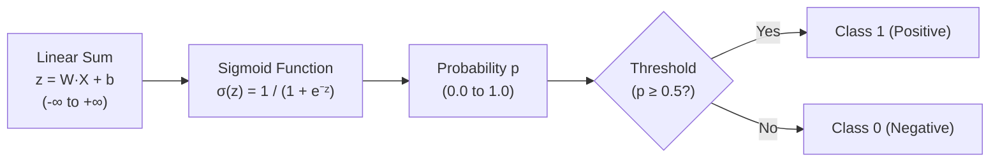
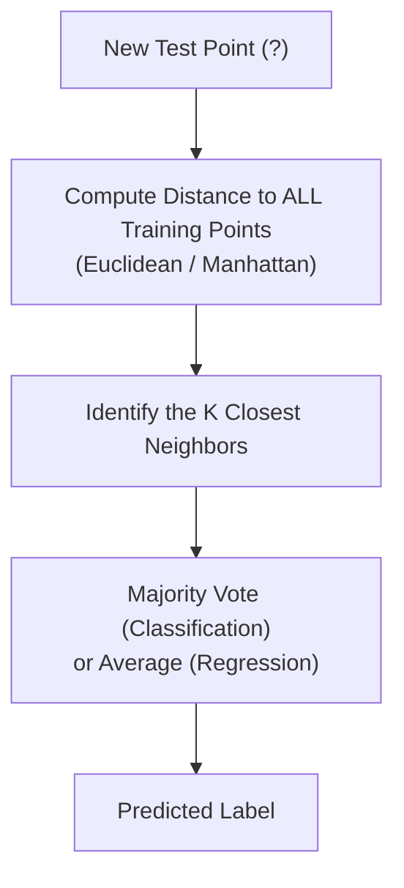
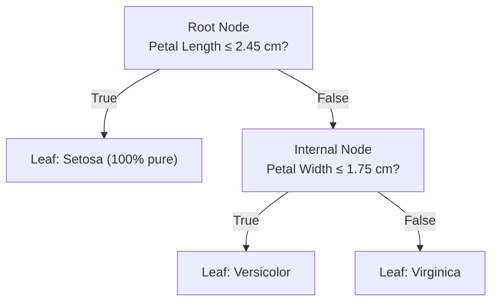
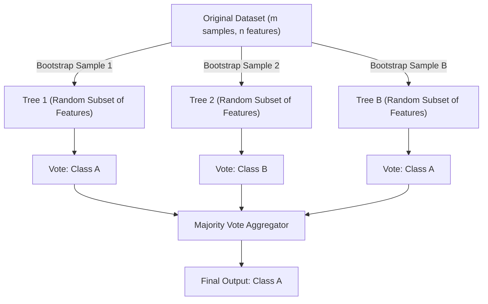
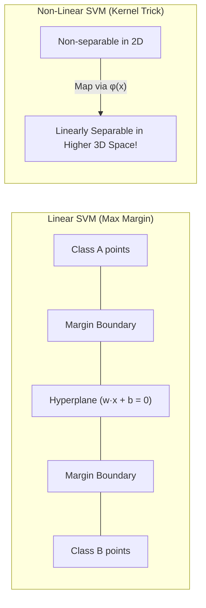

<div class="pixel-banner">
  <div class="pixel-hud-row">
    <div class="pixel-tag"><span class="pixel-indicator"></span>ML_SYS // TENSOR_CORE</div>
    <div class="pixel-meta-right">LVL_06 // DISCRETE_PREDICTION</div>
  </div>
  <div class="pixel-main-content">
    <div class="pixel-avatar">🎯</div>
    <div class="pixel-headings">
      <div class="pixel-title-badge">LEVEL 06 // CLASSIFICATION</div>
      <div class="pixel-subtitle">LOGISTIC • KNN • DECISION TREES • RANDOM FORESTS • SVM • NAIVE BAYES</div>
    </div>
    <div class="pixel-sparklines">
      <div class="pixel-bar" style="--h: 40%"></div>
      <div class="pixel-bar" style="--h: 75%"></div>
      <div class="pixel-bar" style="--h: 55%"></div>
      <div class="pixel-bar" style="--h: 90%"></div>
      <div class="pixel-bar" style="--h: 65%"></div>
      <div class="pixel-bar" style="--h: 100%"></div>
    </div>
  </div>
  <div class="pixel-footer-row">
    <span class="pixel-coord">SYS_ID: #06_CLASSIFY // CONF: 99.4% // MULTI-CLASS</span>
    <span class="pixel-status-text">[ ACTIVE ]</span>
  </div>
</div>

# Level 6: Classification

<div class="notion-callout">
  <div class="notion-callout-icon">💡</div>
  <div class="notion-callout-content">
    Classification algorithms map input features into discrete categories—such as diagnosing diseases, detecting fraudulent transactions, or identifying object classes in computer vision. Unlike regression, classification models output class probabilities and establish decision boundaries separating categorical spaces.
  </div>
</div>

<div class="notion-card-meta" style="margin-bottom: 2rem;">
  <span class="notion-tag notion-tag-yellow">Level 6</span>
  <span class="notion-tag notion-tag-gray">Discrete Prediction</span>
  <span class="notion-tag notion-tag-red">Core Classifiers</span>
</div>

---

## 15. Logistic Regression

Despite its name, Logistic Regression is a **classification algorithm**, not a regression model. It models the probability that a given observation belongs to a specific class.



---

### The Sigmoid Function & Decision Boundary

Standard linear regression outputs values anywhere from $-\infty$ to $+\infty$, which is invalid for probabilities. Logistic regression wraps the linear equation inside the **Sigmoid (logistic) function**, compressing all outputs strictly into the $[0, 1]$ interval:

$$\sigma(z) = \frac{1}{1 + e^{-z}}, \quad \text{where } z = XW + b$$

* If $z \gg 0$, $\sigma(z) \rightarrow 1.0$ (High confidence positive class).
* If $z = 0$, $\sigma(z) = 0.5$ (The exact decision boundary).
* If $z \ll 0$, $\sigma(z) \rightarrow 0.0$ (High confidence negative class).

---

### Log Loss (Binary Cross-Entropy)

We cannot use Mean Squared Error (MSE) for logistic regression because the non-linear sigmoid causes the MSE cost function to become non-convex, trapping gradient descent in local minima.

Instead, we use **Log Loss (Binary Cross-Entropy)**:

$$J(W, b) = -\frac{1}{m} \sum_{i=1}^m \left[ y^{(i)} \log(\hat{y}^{(i)}) + (1 - y^{(i)}) \log(1 - \hat{y}^{(i)}) \right]$$

* When the true label $y = 1$: the loss simplifies to $-\log(\hat{y})$. If the model predicts $\hat{y} = 1$, loss is $0$; if it predicts $\hat{y} \rightarrow 0$, loss approaches $+\infty$!
* When the true label $y = 0$: the loss simplifies to $-\log(1 - \hat{y})$, penalizing confident false alarms heavily.

---

### Multiclass Classification: One-vs-Rest & Softmax

To classify more than two classes (e.g. Cat, Dog, Horse):
1. **One-vs-Rest (OvR):** Trains $K$ separate binary classifiers (e.g., Cat vs Not-Cat, Dog vs Not-Dog) and picks the class with the highest probability.
2. **Softmax Regression (Multinomial):** Generalizes the sigmoid to normalize outputs across all $K$ classes so their probabilities sum to exactly $1.0$:

    $$P(y = k \mid x) = \frac{e^{z_k}}{\sum_{j=1}^K e^{z_j}}$$

---

## 16. K-Nearest Neighbors (KNN)

KNN is an intuitive, instance-based **lazy learning** algorithm. It makes zero assumptions about underlying data distributions and performs no training phase: it simply memorizes all training samples in memory.



* **Distance Metrics:**
  * Euclidean Distance ($L_2$ norm): $d(p, q) = \sqrt{\sum (p_i - q_i)^2}$
  * Manhattan Distance ($L_1$ norm): $d(p, q) = \sum |p_i - q_i|$
* **Choosing $K$:**
  * If $K = 1$: Highly sensitive to noise and outliers (severe overfitting, complex boundary).
  * If $K$ is too large (e.g., $K = 100$ on 150 points): Underfitting; simply predicts the majority class.
  * Best practice: Use an odd number to break ties, tuned using cross-validation.
* **The Curse of Dimensionality:** In 100+ dimensions, the volume of the space grows exponentially and all points become equidistant from one another, degrading KNN performance.

---

## 17. Decision Trees

Decision Trees split the feature space into rectangular regions using a sequence of simple binary `if-else` questions, structured like an upside-down tree:



---

### Splitting Criteria: Gini Impurity vs. Entropy

At each node, the tree evaluates every feature and every possible threshold value, choosing the split that maximizes purity:

* **Entropy ($H(S)$):** Measures information disorder:

    $$H(S) = -\sum_{i=1}^C p_i \log_2(p_i)$$

    Pure node (all one class): $H = 0$. Maximum disorder (50/50 split): $H = 1.0$.

* **Information Gain:** The reduction in entropy achieved after splitting on feature $A$:

    $$\text{Gain}(S, A) = H(S) - \sum \frac{|S_v|}{|S|} H(S_v)$$

* **Gini Impurity ($G$):** Default in Scikit-Learn:

    $$G = 1 - \sum_{i=1}^C p_i^2$$

    Computationally faster than entropy because it avoids calculating logarithms while yielding nearly identical tree structures.

* **Preventing Overfitting (Pruning):** Without constraints, a decision tree will continue splitting until every leaf contains a single sample (100% training accuracy, zero test generalization). Regularize by limiting `max_depth`, setting `min_samples_split`, or `min_samples_leaf`.

---

## 18. Random Forest (Ensemble Learning)

A single decision tree has high variance and overfits easily. Random Forest solves this using **Bagging (Bootstrap Aggregating)**: training hundreds of diverse decision trees and averaging their votes.



### The Two Sources of Randomness:
1. **Bootstrap Sampling (Row sampling):** Each tree trains on a random sample of rows drawn with replacement (some rows repeated, ~37% left out as Out-of-Bag samples).
2. **Random Feature Subspace (Column sampling):** At every split, each tree only considers a random subset of features (typically $\sqrt{n}$ features). This decorrelates the trees, preventing a single dominant feature from dictating all decision branches.

---

## 19. Support Vector Machines (SVM)

SVM finds the optimal decision hyperplane that maximizes the **margin**—the physical distance between the boundary and the closest data points of any class (**Support Vectors**).



* **Hard Margin vs. Soft Margin ($C$ parameter):**
  * Small $C$: Tolerates margin violations, producing a wider, softer margin (higher bias, lower variance).
  * Large $C$: Strictly penalizes misclassifications, producing a narrower margin (lower bias, higher risk of overfitting).
* **The Kernel Trick:** What if data is non-linearly separable (e.g. concentric circles)? Computing high-dimensional coordinate mappings $\phi(x)$ directly is computationally expensive. Kernel functions compute the inner product in higher-dimensional space without ever calculating coordinates:
  * **Linear Kernel:** $K(x, x') = x^T x'$
  * **RBF (Radial Basis Function / Gaussian Kernel):** $K(x, x') = \exp(-\gamma ||x - x'||^2)$, capable of fitting complex boundary contours.

---

## 20. Naive Bayes

Naive Bayes is a fast probabilistic classifier grounded in **Bayes' Theorem**:

$$P(y \mid X) = \frac{P(X \mid y) \cdot P(y)}{P(X)}$$

* **The "Naive" Assumption:** Assumes all features are strictly conditionally independent given the class label. Even though this assumption is rarely true in real life, Naive Bayes performs surprisingly well for high-dimensional text classification (e.g., Spam filtering).
* **Gaussian Naive Bayes:** Assumes continuous features follow a normal Gaussian distribution within each class.
* **Multinomial Naive Bayes:** Designed for discrete frequency counts (e.g., word count vectors in document classification).

---

### Comparative Implementation: Running the Classifiers

```python
from sklearn.datasets import load_breast_cancer
from sklearn.model_selection import train_test_split
from sklearn.preprocessing import StandardScaler
from sklearn.linear_model import LogisticRegression
from sklearn.neighbors import KNeighborsClassifier
from sklearn.tree import DecisionTreeClassifier
from sklearn.ensemble import RandomForestClassifier
from sklearn.svm import SVC
from sklearn.naive_bayes import GaussianNB
from sklearn.metrics import accuracy_score

# Load benchmark classification dataset
X, y = load_breast_cancer(return_X_y=True)
X_train, X_test, y_train, y_test = train_test_split(X, y, test_size=0.2, random_state=42, stratify=y)

# Preprocessing (Essential for Logistic Regression, KNN, and SVM)
scaler = StandardScaler()
X_train_sc = scaler.fit_transform(X_train)
X_test_sc = scaler.transform(X_test)

# Compare Classifiers
classifiers = {
    "Logistic Regression": LogisticRegression(),
    "K-Nearest Neighbors (K=5)": KNeighborsClassifier(n_neighbors=5),
    "Decision Tree (Depth=4)": DecisionTreeClassifier(max_depth=4, random_state=42),
    "Random Forest (100 Trees)": RandomForestClassifier(n_estimators=100, random_state=42),
    "SVM (RBF Kernel)": SVC(kernel='rbf', C=1.0),
    "Gaussian Naive Bayes": GaussianNB()
}

print("Classifier Benchmark:")
for name, clf in classifiers.items():
    clf.fit(X_train_sc, y_train)
    acc = accuracy_score(y_test, clf.predict(X_test_sc))
    print(f"{name:25}: {acc * 100:.2f}% Accuracy")
```

---

<div class="notion-callout">
  <div class="notion-callout-icon">🎯</div>
  <div class="notion-callout-content">
    <strong>Level 6 Key Takeaway:</strong> Logistic Regression establishes linear probabilistic baselines, KNN provides instance-based lookups, Decision Trees create interpretable rule splits, Random Forests eliminate tree variance through bagging, SVM maximizes margins using kernel geometry, and Naive Bayes enables rapid probabilistic filtering.
  </div>
</div>
