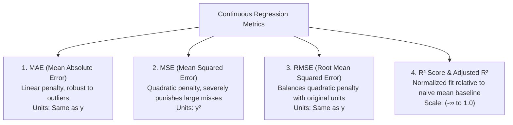
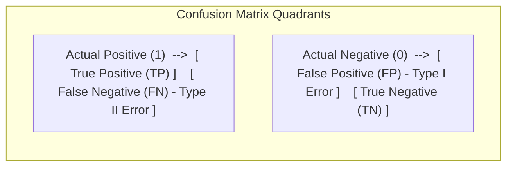
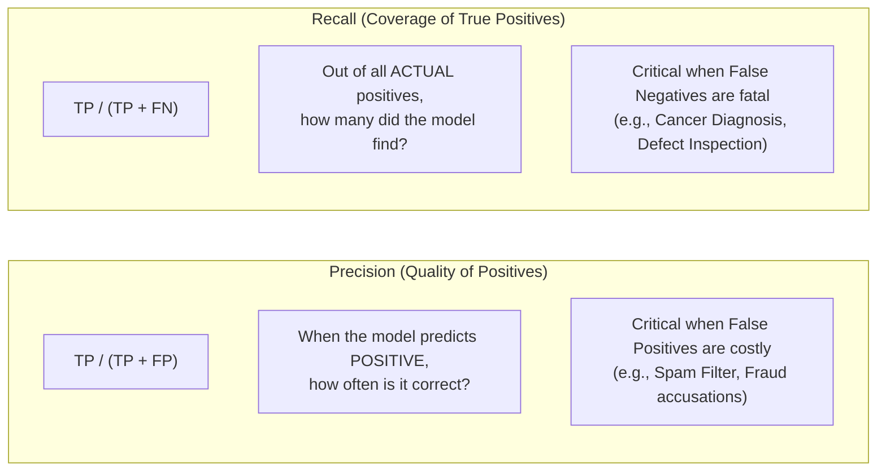
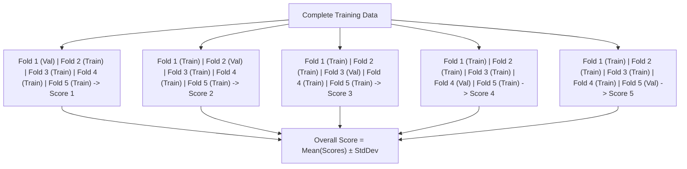
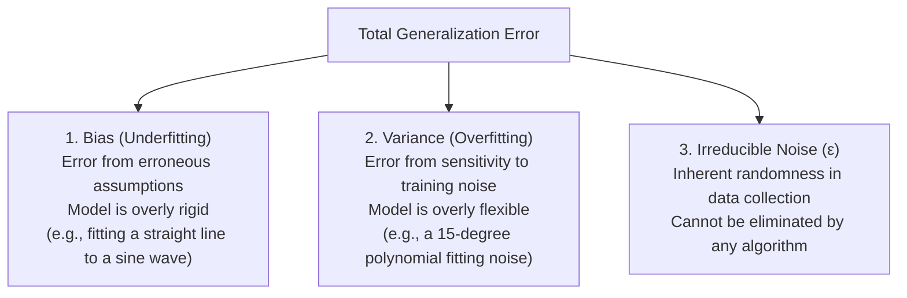
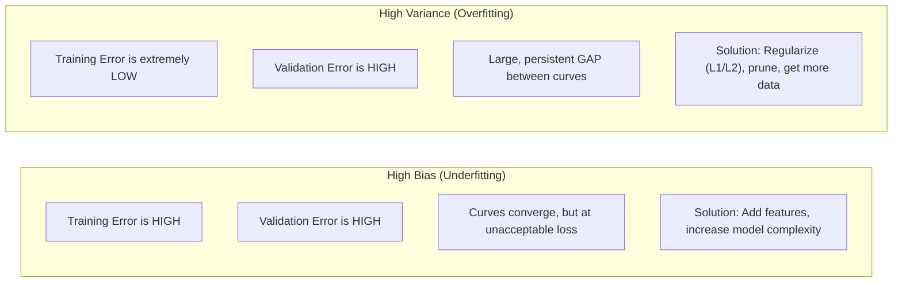

<div class="pixel-banner">
  <div class="pixel-hud-row">
    <div class="pixel-tag"><span class="pixel-indicator"></span>ML_SYS // TENSOR_CORE</div>
    <div class="pixel-meta-right">LVL_07 // VALIDATION_METRICS</div>
  </div>
  <div class="pixel-main-content">
    <div class="pixel-avatar">⚖️</div>
    <div class="pixel-headings">
      <div class="pixel-title-badge">LEVEL 07 // MODEL EVALUATION</div>
      <div class="pixel-subtitle">CONFUSION MATRIX • ROC-AUC • PRECISION / RECALL • K-FOLD CROSS-VALIDATION</div>
    </div>
    <div class="pixel-sparklines">
      <div class="pixel-bar" style="--h: 70%"></div>
      <div class="pixel-bar" style="--h: 85%"></div>
      <div class="pixel-bar" style="--h: 90%"></div>
      <div class="pixel-bar" style="--h: 95%"></div>
      <div class="pixel-bar" style="--h: 88%"></div>
      <div class="pixel-bar" style="--h: 99%"></div>
    </div>
  </div>
  <div class="pixel-footer-row">
    <span class="pixel-coord">SYS_ID: #07_METRICS // ROC_AUC: 0.984 // F1_SCORE: 0.962</span>
    <span class="pixel-status-text">[ OPTIMAL ]</span>
  </div>
</div>

# Level 7: Model Evaluation

<div class="notion-callout">
  <div class="notion-callout-icon">💡</div>
  <div class="notion-callout-content">
    A machine learning model is only as good as the metric used to judge it. Accuracy can dangerously mislead on imbalanced data, mean squared error can be distorted by a single rogue outlier, and cross-validation is the only reliable shield against overfitting to a lucky random split.
  </div>
</div>

<div class="notion-card-meta" style="margin-bottom: 2rem;">
  <span class="notion-tag notion-tag-red">Level 7</span>
  <span class="notion-tag notion-tag-gray">Diagnostics & Validation</span>
  <span class="notion-tag notion-tag-blue">Metrics & Cross-Validation</span>
</div>

---

## 21. Regression Metrics

Evaluating continuous predictions requires quantifying the deviation between the predicted curve $\hat{y}$ and true ground truth values $y$.



---

### Mean Absolute Error (MAE)
Computes the average absolute magnitude of the errors without considering their direction:

$$\text{MAE} = \frac{1}{m} \sum_{i=1}^m |y^{(i)} - \hat{y}^{(i)}|$$

* **Why we use it:** Treats all errors linearly. An error of $10$ is penalized exactly twice as much as an error of $5$. It is robust against extreme outliers.

---

### Mean Squared Error (MSE) & Root Mean Squared Error (RMSE)
MSE squares the residual deviations before averaging:

$$\text{MSE} = \frac{1}{m} \sum_{i=1}^m (y^{(i)} - \hat{y}^{(i)})^2$$

$$\text{RMSE} = \sqrt{\text{MSE}} = \sqrt{\frac{1}{m} \sum_{i=1}^m (y^{(i)} - \hat{y}^{(i)})^2}$$

* **Why we use RMSE:** Squaring penalizes large blunders exponentially. In autonomous driving or robotics, being off by $10$ meters is much more than twice as dangerous as being off by $5$ meters. RMSE preserves this penalty while returning the metric to the original units of $y$ (e.g. meters instead of $\text{meters}^2$).

---

### R² Score (Coefficient of Determination) & Adjusted R²
$R^2$ measures the proportion of variance in the target variable that is explained by the model:

$$R^2 = 1 - \frac{\text{SS}_{\text{res}}}{\text{SS}_{\text{tot}}} = 1 - \frac{\sum (y^{(i)} - \hat{y}^{(i)})^2}{\sum (y^{(i)} - \bar{y})^2}$$

* $R^2 = 1.0$: Perfect predictions.
* $R^2 = 0.0$: The model performs no better than simply predicting the mean $\bar{y}$ for every sample.
* $R^2 < 0.0$: The model performs worse than a horizontal line predicting the average!

* **The Flaw of Standard $R^2$:** Adding completely useless, random features to a model will mathematically never decrease $R^2$, encouraging feature bloating.
* **Adjusted $R^2$:** Penalizes the score for every redundant feature added:

$$\text{Adjusted } R^2 = 1 - \left[ \frac{(1 - R^2)(m - 1)}{m - p - 1} \right]$$

where $m$ is the sample count and $p$ is the number of features.

```python
from sklearn.metrics import mean_absolute_error, mean_squared_error, r2_score
import numpy as np

# True vs Predicted continuous values
y_true = np.array([100, 150, 200, 250, 300])
y_pred = np.array([110, 140, 205, 240, 350])

mae = mean_absolute_error(y_true, y_pred)
mse = mean_squared_error(y_true, y_pred)
rmse = np.sqrt(mse)
r2 = r2_score(y_true, y_pred)

print(f"MAE: {mae:.2f}, RMSE: {rmse:.2f}, R²: {r2:.3f}")
```

---

## 22. Classification Metrics

Evaluating discrete classification decisions begins with the **Confusion Matrix**, mapping predictions against true outcomes:



---

### The Accuracy Paradox

$$\text{Accuracy} = \frac{\text{TP} + \text{TN}}{\text{TP} + \text{TN} + \text{FP} + \text{FN}}$$

Consider a medical dataset of $10,000$ patients where only $50$ have a rare cancer ($0.5\%$ positive class). A trivial dummy model that blindly predicts "Healthy" for every single person achieves **99.5% accuracy** while missing every single cancer patient! 

In real-world applications with imbalanced classes, accuracy is dangerously deceptive.

---

### Precision, Recall & F1-Score



* **F1-Score:** The harmonic mean of precision and recall:

    $$F_1 = 2 \cdot \frac{\text{Precision} \cdot \text{Recall}}{\text{Precision} + \text{Recall}}$$

    Unlike an arithmetic mean, the harmonic mean punishes extreme imbalances: if Precision is $0.99$ but Recall is $0.01$, the arithmetic mean is $0.50$, but the $F_1$-score plummets to $0.02$.

* **Specificity (True Negative Rate):** Measures the proportion of actual negatives accurately identified:

    $$\text{Specificity} = \frac{\text{TN}}{\text{TN} + \text{FP}}$$

---

### ROC Curve & ROC-AUC vs. PR-AUC

A classifier outputs probabilities $[0, 1]$. By default, a threshold of $0.5$ is applied, but you can choose to make the model conservative ($0.8$) or aggressive ($0.2$).

* **ROC Curve (Receiver Operating Characteristic):** Plots True Positive Rate (Recall) vs False Positive Rate ($1 - \text{Specificity}$) across **all possible classification thresholds** from $0.0$ to $1.0$.
* **ROC-AUC (Area Under the ROC Curve):** Measures the probability that the classifier will rank a randomly chosen positive sample higher than a randomly chosen negative sample:
  * $\text{AUC} = 1.0$: Flawless discrimination.
  * $\text{AUC} = 0.5$: Completely random coin toss.
* **PR-AUC (Precision-Recall Curve):** In heavily imbalanced datasets (e.g. 1 positive per 10,000 negatives), the large number of True Negatives can make the ROC curve look deceptively optimistic. **PR-AUC** focuses exclusively on positive predictions, providing an honest benchmark on imbalanced problems.

```python
from sklearn.metrics import confusion_matrix, classification_report, roc_auc_score

# Generate full classification diagnostic report
cm = confusion_matrix(y_test, y_pred)
report = classification_report(y_test, y_pred)
auc = roc_auc_score(y_test, y_probs)

print("Confusion Matrix:\n", cm)
print("\nClassification Report:\n", report)
print(f"ROC-AUC Score: {auc:.3f}")
```

---

## 23. Cross-Validation

A single train/test split poses a significant risk: by sheer luck or misfortune, the test set might happen to be unusually easy or unusually difficult, leading to miscalibrated confidence.

**K-Fold Cross-Validation** eliminates split bias by rotating validation subsets across the entire dataset:



### Cross-Validation Strategies

* **Standard K-Fold:** Splits data randomly into $K$ equal partitions. Best for balanced, independent tabular data.
* **Stratified K-Fold:** Guarantees that each individual fold contains the exact same class distribution as the complete dataset. **Mandatory for classification**.
* **Leave-One-Out (LOOCV):** An extreme case where $K = m$ (each fold validates on exactly 1 sample and trains on $m-1$). Exhaustive, but computationally impractical for large datasets.

```python
from sklearn.model_selection import StratifiedKFold, cross_val_score
from sklearn.ensemble import RandomForestClassifier

# 5-Fold Stratified Cross Validation
cv = StratifiedKFold(n_splits=5, shuffle=True, random_state=42)
scores = cross_val_score(RandomForestClassifier(), X, y, cv=cv, scoring='f1')

print(f"5-Fold F1 Scores: {scores}")
print(f"Mean F1: {scores.mean():.3f} (± {scores.std():.3f})")
```

---

## 24. The Bias-Variance Tradeoff

The total expected error of any machine learning model decomposes into three distinct components:

$$\text{Total Error} = \text{Bias}^2 + \text{Variance} + \text{Irreducible Noise}$$



### Diagnosing via Learning Curves

Plotting training error versus validation error as training size increases reveals the exact bottleneck:



---

<div class="notion-callout">
  <div class="notion-callout-icon">🎯</div>
  <div class="notion-callout-content">
    <strong>Level 7 Key Takeaway:</strong> Model evaluation is the compass of machine learning. Use RMSE and Adjusted $R^2$ for continuous regression, navigate the precision-recall tradeoff on imbalanced classification, validate with Stratified K-Fold to prevent random split luck, and inspect learning curves to diagnose whether you suffer from high bias or high variance.
  </div>
</div>
