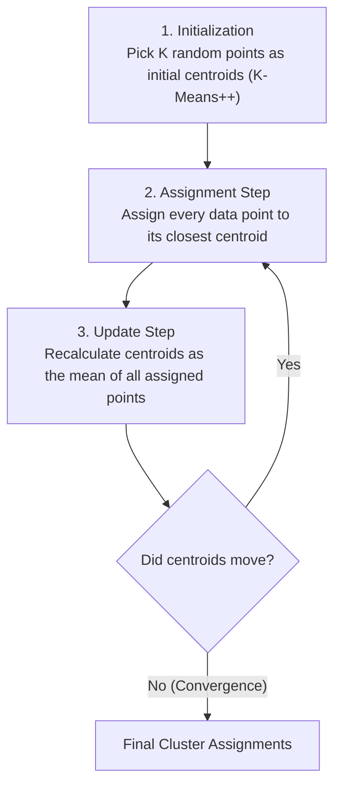
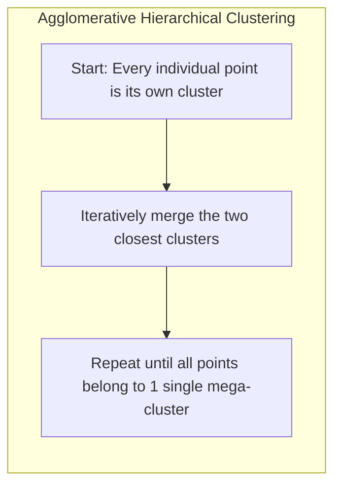
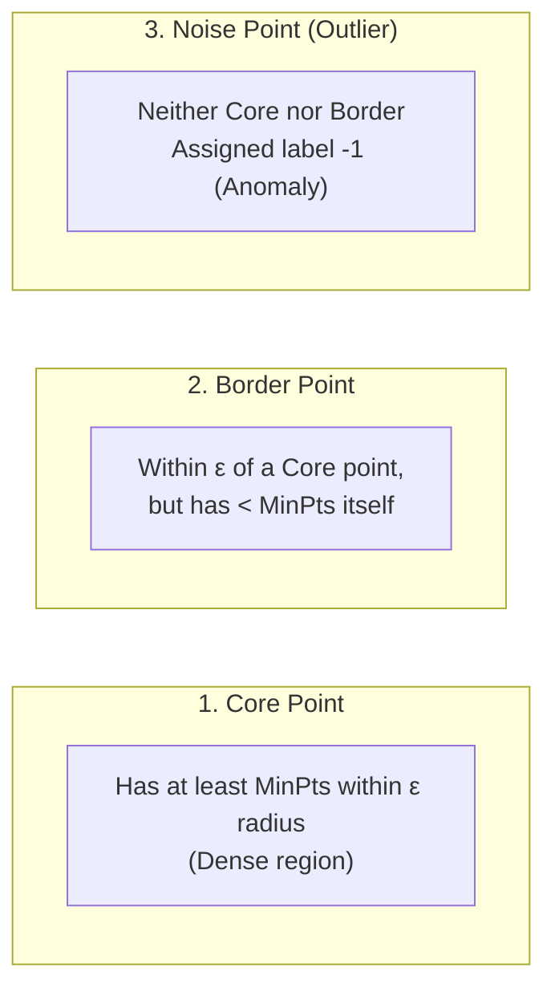
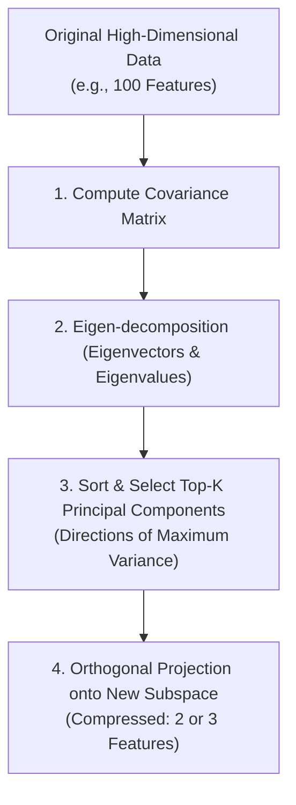

<div class="pixel-banner">
  <div class="pixel-hud-row">
    <div class="pixel-tag"><span class="pixel-indicator"></span>ML_SYS // TENSOR_CORE</div>
    <div class="pixel-meta-right">LVL_08 // CLUSTERING_PCA</div>
  </div>
  <div class="pixel-main-content">
    <div class="pixel-avatar">🧩</div>
    <div class="pixel-headings">
      <div class="pixel-title-badge">LEVEL 08 // UNSUPERVISED LEARNING</div>
      <div class="pixel-subtitle">K-MEANS • HIERARCHICAL • DBSCAN • PRINCIPAL COMPONENT ANALYSIS (PCA)</div>
    </div>
    <div class="pixel-sparklines">
      <div class="pixel-bar" style="--h: 55%"></div>
      <div class="pixel-bar" style="--h: 75%"></div>
      <div class="pixel-bar" style="--h: 40%"></div>
      <div class="pixel-bar" style="--h: 85%"></div>
      <div class="pixel-bar" style="--h: 65%"></div>
      <div class="pixel-bar" style="--h: 90%"></div>
    </div>
  </div>
  <div class="pixel-footer-row">
    <span class="pixel-coord">SYS_ID: #08_CLUSTERING // K_CLUSTERS: OPTIMAL // PCA_VARIANCE: 94.2%</span>
    <span class="pixel-status-text">[ CLUSTERED ]</span>
  </div>
</div>

# Level 8: Unsupervised Learning

<div class="notion-callout">
  <div class="notion-callout-icon">💡</div>
  <div class="notion-callout-content">
    In the real world, 90% of data is unlabeled. Unsupervised learning discovers hidden geometric structures, customer clusters, and compressed representations without human annotations, while dimensionality reduction eliminates the curse of dimensionality and allows high-dimensional feature spaces to be visualized in 2D or 3D.
  </div>
</div>

<div class="notion-card-meta" style="margin-bottom: 2rem;">
  <span class="notion-tag notion-tag-blue">Level 8</span>
  <span class="notion-tag notion-tag-gray">Unlabeled Discovery</span>
  <span class="notion-tag notion-tag-green">Clustering & PCA</span>
</div>

---

## 25. K-Means Clustering

K-Means partitions an unlabeled dataset into $K$ distinct, non-overlapping clusters where each data point belongs to the cluster with the nearest centroid (mean vector).



---

### Inertia & Choosing Optimal K

* **Inertia (Within-Cluster Sum of Squares - WCSS):** Measures the internal cohesion of clusters:

    $$\text{Inertia} = \sum_{k=1}^K \sum_{x \in C_k} ||x - \mu_k||^2$$

    As $K$ increases, inertia automatically decreases toward $0$ (if $K = m$, every point is its own centroid and inertia is zero).
* **The Elbow Method:** Plots Inertia vs $K$. The point where the rate of decrease abruptly bends (the "elbow") indicates the optimal tradeoff between compactness and cluster count.
* **Silhouette Score:** Evaluates how similar an object is to its own cluster compared to other clusters (ranges from $-1.0$ to $+1.0$). A score near $+1.0$ indicates well-separated, dense clusters.

```python
from sklearn.cluster import KMeans
from sklearn.metrics import silhouette_score
import matplotlib.pyplot as plt

# Fit K-Means with K-Means++ smart initialization
kmeans = KMeans(n_clusters=3, init='k-means++', random_state=42)
cluster_labels = kmeans.fit_predict(X)

print("Cluster Centroids:\n", kmeans.cluster_centers_)
print(f"Inertia: {kmeans.inertia_:.2f}")
print(f"Silhouette Score: {silhouette_score(X, cluster_labels):.3f}")
```

---

## 26. Hierarchical Clustering

Hierarchical clustering constructs a tree-like hierarchy of clusters without requiring the user to specify $K$ in advance.



---

### The Dendrogram & Linkage Criteria

* **The Dendrogram:** A tree visualization displaying the exact sequence of merges. Cutting the tree horizontally at a specific Euclidean distance threshold yields a chosen number of clusters.
* **Linkage Criteria (How distance between clusters is defined):**
  * **Ward Linkage (Default):** Minimizes the total within-cluster variance. Produces compact, spherical clusters.
  * **Complete Linkage:** Measures the distance between the two *farthest* points in clusters. Resists chaining effects.
  * **Single Linkage:** Measures the distance between the two *closest* points. Capable of finding non-elliptical shapes, but vulnerable to noise chaining.
  * **Average Linkage:** Measures the average distance between all pairs of points.

```python
from scipy.cluster.hierarchy import dendrogram, linkage
import matplotlib.pyplot as plt

# Compute hierarchical linkage matrix using Ward's method
Z = linkage(X, method='ward')

# Plot Dendrogram
plt.figure(figsize=(10, 5))
dendrogram(Z)
plt.title("Hierarchical Clustering Dendrogram")
plt.xlabel("Sample Index")
plt.ylabel("Euclidean Distance")
plt.show()
```

---

## 27. DBSCAN (Density-Based Spatial Clustering)

K-Means and Hierarchical Clustering assume clusters are convex (spherical) and struggle with noise. **DBSCAN** (**Density-Based Spatial Clustering of Applications with Noise**) discovers clusters of arbitrary shapes and isolates anomalous noise points.



* **Key Hyperparameters:**
  * **Epsilon ($\epsilon$):** The maximum radius neighborhood around a point.
  * **MinPts:** The minimum number of points required within $\epsilon$ to form a dense core.
* **Advantages over K-Means:**
  1. Does **not** require specifying the number of clusters $K$ upfront.
  2. Capable of discovering complex, non-globular shapes (e.g. interlocking rings, crescent moons).
  3. Built-in outlier detection (points in low-density regions receive label `-1`).

```python
from sklearn.cluster import DBSCAN

# Fit DBSCAN
dbscan = DBSCAN(eps=0.5, min_samples=5)
labels = dbscan.fit_predict(X)

# Points with label -1 are flagged as outliers/noise
n_clusters = len(set(labels)) - (1 if -1 in labels else 0)
n_noise = list(labels).count(-1)
print(f"Discovered Clusters: {n_clusters}, Noise points: {n_noise}")
```

---

## 28. Principal Component Analysis (PCA)

High-dimensional data suffers from the **Curse of Dimensionality**: volume expands exponentially, data points become sparse, and distance metrics degrade.

**PCA** is an orthogonal linear transformation technique that compresses high-dimensional data into a lower-dimensional subspace while preserving maximal variance.



---

### Explained Variance Ratio & Scree Plot

* **Principal Components:** Orthogonal (uncorrelated) vectors that point in the directions of greatest variance.
  * $PC_1$ captures the largest possible fraction of total variance.
  * $PC_2$ is strictly orthogonal (at a 90° angle) to $PC_1$ and captures the next largest fraction.
* **Explained Variance Ratio:** The percentage of total dataset variance retained by each principal component.

```python
from sklearn.decomposition import PCA

# Compress 30 features down to 2 principal components for visualization
pca = PCA(n_components=2)
X_pca = pca.fit_transform(X_scaled)

print("Explained variance per component:", pca.explained_variance_ratio_)
print(f"Total variance retained: {pca.explained_variance_ratio_.sum() * 100:.2f}%")

# Scatter plot of the 2D projection
plt.figure(figsize=(7, 5))
plt.scatter(X_pca[:, 0], X_pca[:, 1], c=y, cmap='viridis', edgecolors='k')
plt.xlabel("Principal Component 1")
plt.ylabel("Principal Component 2")
plt.title("2D Projection via PCA")
plt.colorbar(label="Class Label")
plt.show()
```

---

<div class="notion-callout">
  <div class="notion-callout-icon">🎯</div>
  <div class="notion-callout-content">
    <strong>Level 8 Key Takeaway:</strong> K-Means partitions data into compact spherical clusters using distance to centroids; Hierarchical clustering exposes tree dendrogram structures; DBSCAN finds arbitrary density shapes while filtering out noise; and PCA compresses high-dimensional feature spaces into orthogonal vectors of maximum variance.
  </div>
</div>
