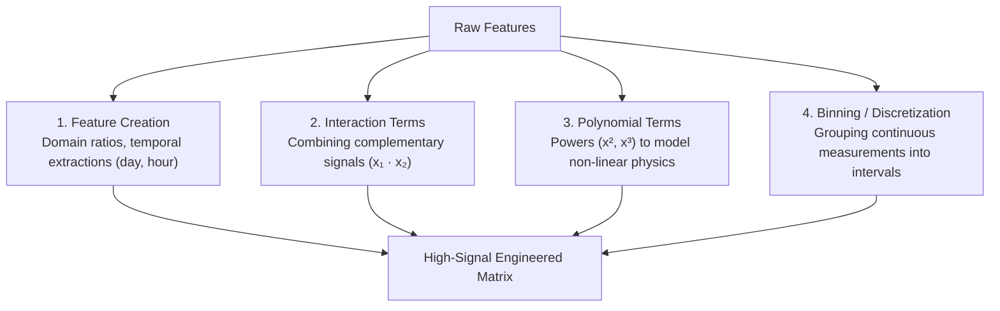
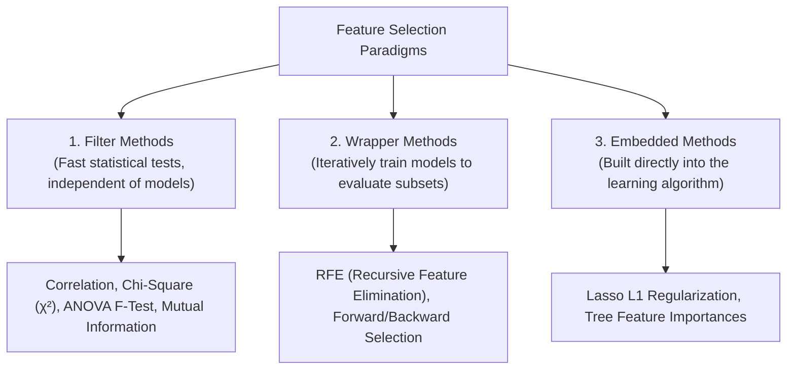

<div class="pixel-banner">
  <div class="pixel-hud-row">
    <div class="pixel-tag"><span class="pixel-indicator"></span>ML_SYS // TENSOR_CORE</div>
    <div class="pixel-meta-right">LVL_09 // FEATURE_SYNTHESIS</div>
  </div>
  <div class="pixel-main-content">
    <div class="pixel-avatar">⚙️</div>
    <div class="pixel-headings">
      <div class="pixel-title-badge">LEVEL 09 // FEATURE ENGINEERING</div>
      <div class="pixel-subtitle">INTERACTIONS • POLYNOMIALS • VIF • RFE • EMBEDDED FEATURE SELECTION</div>
    </div>
    <div class="pixel-sparklines">
      <div class="pixel-bar" style="--h: 60%"></div>
      <div class="pixel-bar" style="--h: 80%"></div>
      <div class="pixel-bar" style="--h: 70%"></div>
      <div class="pixel-bar" style="--h: 90%"></div>
      <div class="pixel-bar" style="--h: 85%"></div>
      <div class="pixel-bar" style="--h: 100%"></div>
    </div>
  </div>
  <div class="pixel-footer-row">
    <span class="pixel-coord">SYS_ID: #09_FEATURES // VIF_THRESHOLD: &lt; 5.0 // SELECTED_DIMS: OPTIMIZED</span>
    <span class="pixel-status-text">[ ACTIVE ]</span>
  </div>
</div>

# Level 9: Feature Engineering & Selection

<div class="notion-callout">
  <div class="notion-callout-icon">💡</div>
  <div class="notion-callout-content">
    "Coming up with features is difficult, time-consuming, and requires expert knowledge. Applied machine learning is basically feature engineering." — Andrew Ng. Feature engineering crafts the mathematical representations that expose clear predictive signals, while feature selection eliminates redundant noise to prevent overfitting.
  </div>
</div>

<div class="notion-card-meta" style="margin-bottom: 2rem;">
  <span class="notion-tag notion-tag-blue">Level 9</span>
  <span class="notion-tag notion-tag-gray">Signal Engineering</span>
  <span class="notion-tag notion-tag-purple">Feature Selection</span>
</div>

---

## 29. Feature Engineering

Feature engineering is the deliberate process of transforming raw domain variables into representations that align with algorithmic assumptions.



---

### Core Engineering Techniques

#### 1. Domain Feature Creation
* **Why we use it:** Raw numbers often hold indirect signals. For example, in real estate, `Total_Square_Feet` and `Number_of_Rooms` are useful, but `Average_Room_Size` ($\frac{\text{Total Area}}{\text{Rooms}}$) directly captures spaciousness.
* **Temporal Extractions:** A raw timestamp like `'2026-10-01 08:30:00'` is hard for a model to learn from. Decomposing it into `Hour_of_Day` ($8$), `Day_of_Week` ($3$), and `Is_Weekend` ($0$) exposes cyclical human behaviors.

```python
import pandas as pd
import numpy as np

# Domain ratio creation
df['room_size_ratio'] = df['living_area'] / df['num_bedrooms']

# Temporal feature decomposition
df['datetime'] = pd.to_datetime(df['timestamp'])
df['hour'] = df['datetime'].dt.hour
df['day_of_week'] = df['datetime'].dt.dayofweek
df['is_weekend'] = df['day_of_week'].isin([5, 6]).astype(int)
```

---

#### 2. Interaction Features & Polynomial Expansions
* **Why we use them:** Linear models evaluate each feature independently ($w_1 x_1 + w_2 x_2$). They cannot naturally capture synergies where the effect of $x_1$ depends on $x_2$.
* **Example:** In physical kinetic energy $E = \frac{1}{2} m v^2$, mass ($m$) and velocity ($v$) interact multiplicatively. Creating explicit interaction features ($m \cdot v$ and $v^2$) enables linear models to learn physical laws.

```python
from sklearn.preprocessing import PolynomialFeatures

# Generate pairwise interactions (x1 * x2) without bias term
poly = PolynomialFeatures(degree=2, interaction_only=True, include_bias=False)
X_interactions = poly.fit_transform(X)
```

---

#### 3. Binning (Discretization)
* **Why we use it:** Continuous variables sometimes exhibit non-linear step-function behaviors (e.g. income tax brackets, or age where risk stays low until age 65 and then jumps).
* Discretizing continuous data into categorical buckets prevents models from overfitting to small numeric fluctuations.

```python
# Discretize continuous age into 4 demographic buckets
df['age_group'] = pd.cut(
    df['age'], 
    bins=[0, 18, 35, 60, 100], 
    labels=['Minor', 'Young_Adult', 'Middle_Aged', 'Senior']
)
```

---

## 30. Feature Selection

Feeding too many features into a model introduces the **Curse of Dimensionality**, increases training latency, and causes models to learn spurious correlations from noise. Feature selection isolates the most informative subset.



---

### Comparison of Feature Selection Methods

| Method | How it Works | Advantages | Disadvantages |
| :--- | :--- | :--- | :--- |
| **Filter Methods** | Computes statistical scores between each feature and the target independently (e.g. Pearson $r$, ANOVA $F$-test). | Ultra-fast; scales to millions of columns. | Ignores feature interactions (evaluates features in isolation). |
| **Wrapper Methods** | Uses a machine learning model as an evaluation engine, recursively adding or removing features based on validation scores. | Captures complex multi-feature interactions. | Computationally expensive; high risk of overfitting if test data is small. |
| **Embedded Methods** | Feature selection occurs natively during model optimization (e.g., Lasso driving weights to zero). | Balances accuracy and computation; considers interactions. | Specific to the chosen model architecture. |

---

### Recursive Feature Elimination (RFE) & Cross-Validation

RFE trains a model on the initial set of features, ranks them by importance (coefficients or tree importances), prunes the least important features, and repeats the process until the desired subset size is reached:

```python
from sklearn.feature_selection import RFECV
from sklearn.ensemble import RandomForestClassifier
from sklearn.model_selection import StratifiedKFold

# Recursive Feature Elimination with Cross-Validation
estimator = RandomForestClassifier(n_estimators=50, random_state=42)
cv = StratifiedKFold(5)

# Automatically finds the optimal number of features
rfecv = RFECV(estimator=estimator, step=1, cv=cv, scoring='accuracy')
rfecv.fit(X_train, y_train)

print(f"Optimal feature count: {rfecv.n_features_}")
print("Selected feature mask:", rfecv.support_)
```

---

### Correlation-Based Selection (Deduplication)

When two features share a correlation $|r| > 0.90$, they provide redundant information. Removing one of the paired features reduces dimensionality with zero performance loss:

```python
# Compute correlation matrix
corr_matrix = pd.DataFrame(X_train).corr().abs()

# Select upper triangle of correlation matrix
upper = corr_matrix.where(np.triu(np.ones(corr_matrix.shape), k=1).astype(bool))

# Identify features with correlation greater than 0.90
to_drop = [column for column in upper.columns if any(upper[column] > 0.90)]
print("Redundant collinear features to drop:", to_drop)
```

---

<div class="notion-callout">
  <div class="notion-callout-icon">🎯</div>
  <div class="notion-callout-content">
    <strong>Level 9 Key Takeaway:</strong> Feature engineering builds the domain bridges that make non-linear patterns accessible to models through ratios, temporal parts, interaction terms, and binning. Feature selection removes collinear noise using Filter tests, Wrapper searches (RFECV), and Embedded penalties.
  </div>
</div>
