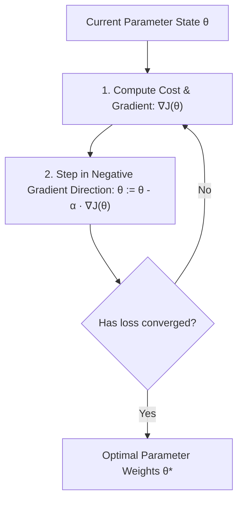
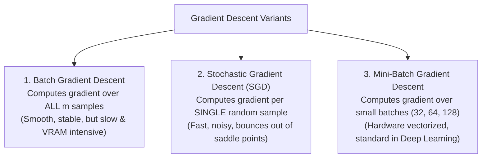
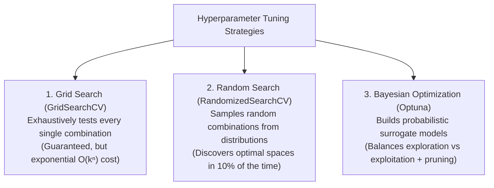

<div class="pixel-banner">
  <div class="pixel-hud-row">
    <div class="pixel-tag"><span class="pixel-indicator"></span>ML_SYS // TENSOR_CORE</div>
    <div class="pixel-meta-right">LVL_10 // TUNING_OPTIM</div>
  </div>
  <div class="pixel-main-content">
    <div class="pixel-avatar">⚡</div>
    <div class="pixel-headings">
      <div class="pixel-title-badge">LEVEL 10 // OPTIMIZATION & TUNING</div>
      <div class="pixel-subtitle">MINI-BATCH SGD • GRID SEARCH • RANDOM SEARCH • BAYESIAN OPTUNA</div>
    </div>
    <div class="pixel-sparklines">
      <div class="pixel-bar" style="--h: 30%"></div>
      <div class="pixel-bar" style="--h: 60%"></div>
      <div class="pixel-bar" style="--h: 85%"></div>
      <div class="pixel-bar" style="--h: 50%"></div>
      <div class="pixel-bar" style="--h: 90%"></div>
      <div class="pixel-bar" style="--h: 100%"></div>
    </div>
  </div>
  <div class="pixel-footer-row">
    <span class="pixel-coord">SYS_ID: #10_OPTIM // LEARNING_RATE: 0.001 // LOSS_MIN: 0.0012</span>
    <span class="pixel-status-text">[ CONVERGED ]</span>
  </div>
</div>

# Level 10: Optimization & Tuning

<div class="notion-callout">
  <div class="notion-callout-icon">💡</div>
  <div class="notion-callout-content">
    Optimization is the engine of machine learning: it updates internal model parameters to minimize loss. Hyperparameter tuning operates one level above optimization, systematically discovering the architectural configuration knobs (learning rates, regularization penalties, tree depths) that yield maximal generalization.
  </div>
</div>

<div class="notion-card-meta" style="margin-bottom: 2rem;">
  <span class="notion-tag notion-tag-yellow">Level 10</span>
  <span class="notion-tag notion-tag-gray">Mathematical Optimization</span>
  <span class="notion-tag notion-tag-red">Gradient Descent & Optuna</span>
</div>

---

## 31. Gradient Descent

Gradient descent is a first-order iterative optimization algorithm used to locate the minimum of an objective cost function $J(\theta)$.



---

### Key Concepts

* **Objective Function vs. Cost Function:**
  * An *Objective Function* is any function to be maximized or minimized.
  * A *Cost Function* $J(\theta)$ specifically measures the average penalty across all training samples (e.g. Mean Squared Error or Binary Cross-Entropy).
* **The Gradient ($\nabla J(\theta)$):** A vector of partial derivatives pointing in the direction of steepest ascent:
  
  $$\nabla J(\theta) = \left[ \frac{\partial J}{\partial w_1}, \frac{\partial J}{\partial w_2}, \dots, \frac{\partial J}{\partial b} \right]^T$$
  
  Subtracting the gradient moves parameters toward the steepest descent.
* **Learning Rate ($\alpha$):** Determines the step size:
  * *Too small:* Takes thousands of epochs, wastes compute, and risks getting trapped in flat plateaus.
  * *Too large:* Overshoots the global minimum and oscillates wildly or diverges to infinity ($\text{NaN}$).

---

### The Three Variants of Gradient Descent



| Variant | Samples per Update | Convergence Path | Hardware Efficiency |
| :--- | :--- | :--- | :--- |
| **Batch GD** | All $m$ samples in dataset. | Perfectly smooth straight line to minimum. | Low; cannot fit massive datasets into RAM. |
| **Stochastic GD** | Exactly $1$ random sample. | Highly erratic, noisy zig-zag path. | Low GPU parallelism; high CPU overhead per item. |
| **Mini-Batch GD** | Mini-batch of $B$ samples ($32, 64, 128$). | Controlled fluctuations; smooth convergence. | **Optimal**; fully saturates GPU SIMD tensor cores. |

---

## 32. Hyperparameter Tuning

Parameters (weights and biases) are learned automatically from data during training. **Hyperparameters** are structural configuration knobs set *before* training begins that control how the algorithm learns.



---

### Grid Search vs. Random Search

* **Grid Search (`GridSearchCV`):** Constructs a rigid Cartesian grid of candidate values. If you test 5 values for 4 hyperparameters across 5 cross-validation folds, you must train $5^4 \times 5 = 3,125$ models. It suffers heavily from the curse of dimensionality.
* **Random Search (`RandomizedSearchCV`):** As proven by Bergstra and Bengio, random search is significantly more efficient because not all hyperparameters are equally important. Randomly sampling explores unique values across every dimension rather than repeatedly testing identical coordinates.

---

### Bayesian Optimization & Optuna

Instead of blindly guessing combinations, **Bayesian Optimization** treats hyperparameter tuning as an optimization problem:
1. It fits a probabilistic surrogate model (such as a Tree-structured Parzen Estimator, TPE) to historical evaluation scores.
2. It uses an acquisition function to predict which hyperparameter region is most likely to yield an improvement (**Exploitation**) while sampling unexplored zones (**Exploration**).
3. **Automated Pruning:** Optuna monitors validation loss curves during early training epochs and immediately terminates unpromising trials, saving up to 80% of compute time.

```python
import optuna
from sklearn.ensemble import RandomForestClassifier
from sklearn.model_selection import cross_val_score

def objective(trial):
    # Define hyperparameter search space
    n_estimators = trial.suggest_int('n_estimators', 50, 300, step=50)
    max_depth = trial.suggest_int('max_depth', 3, 15)
    min_samples_split = trial.suggest_int('min_samples_split', 2, 10)
    
    clf = RandomForestClassifier(
        n_estimators=n_estimators,
        max_depth=max_depth,
        min_samples_split=min_samples_split,
        random_state=42
    )
    
    # 3-Fold Cross-Validation evaluation
    score = cross_val_score(clf, X_train, y_train, cv=3, scoring='accuracy').mean()
    return score

# Run 50 intelligent Bayesian optimization trials
study = optuna.create_study(direction='maximize')
study.optimize(objective, n_trials=50)

print("Best Parameters Found:", study.best_params)
print(f"Best CV Accuracy: {study.best_value * 100:.2f}%")
```

---

<div class="notion-callout">
  <div class="notion-callout-icon">🎯</div>
  <div class="notion-callout-content">
    <strong>Level 10 Key Takeaway:</strong> Mini-batch gradient descent is the standard optimization engine of modern machine learning, balancing stochastic noise with GPU vectorization. Hyperparameter tuning graduates from brute-force Grid Search to intelligent Bayesian optimization using Optuna's probabilistic pruning.
  </div>
</div>
