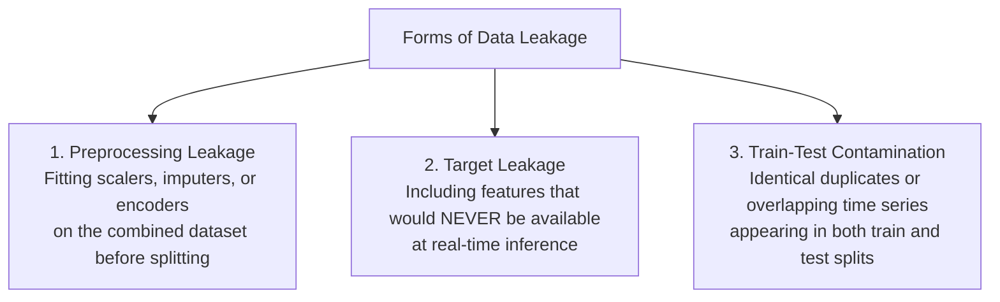
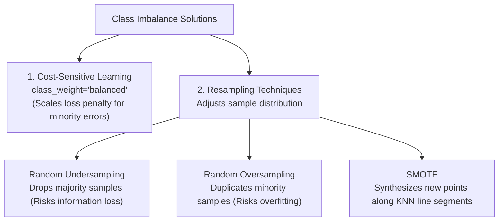
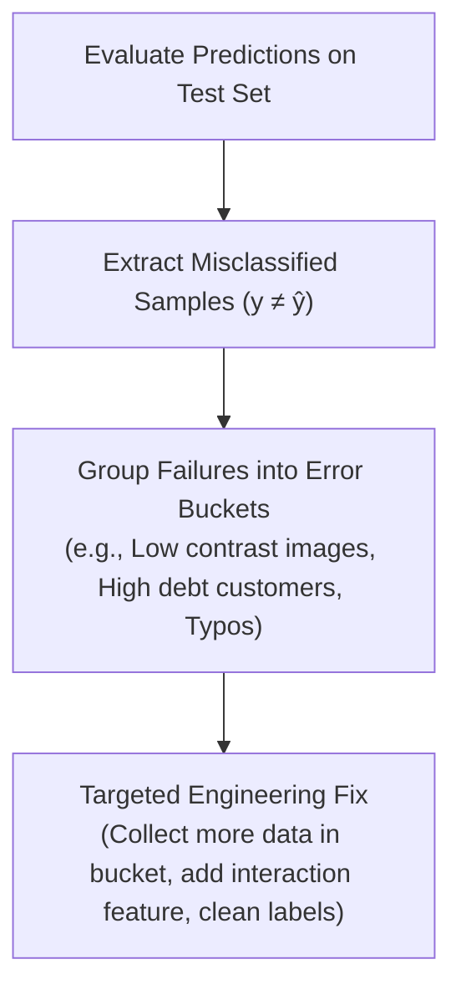

<div class="pixel-banner">
  <div class="pixel-hud-row">
    <div class="pixel-tag"><span class="pixel-indicator"></span>ML_SYS // TENSOR_CORE</div>
    <div class="pixel-meta-right">LVL_11 // MODEL_ANALYSIS</div>
  </div>
  <div class="pixel-main-content">
    <div class="pixel-avatar">🔬</div>
    <div class="pixel-headings">
      <div class="pixel-title-badge">LEVEL 11 // GENERALIZATION & ANALYSIS</div>
      <div class="pixel-subtitle">DATA LEAKAGE PREVENTION • CLASS IMBALANCE • SMOTE • ERROR ANALYSIS</div>
    </div>
    <div class="pixel-sparklines">
      <div class="pixel-bar" style="--h: 75%"></div>
      <div class="pixel-bar" style="--h: 80%"></div>
      <div class="pixel-bar" style="--h: 60%"></div>
      <div class="pixel-bar" style="--h: 90%"></div>
      <div class="pixel-bar" style="--h: 85%"></div>
      <div class="pixel-bar" style="--h: 95%"></div>
    </div>
  </div>
  <div class="pixel-footer-row">
    <span class="pixel-coord">SYS_ID: #11_GENERALIZE // IMBALANCE_RATIO: BALANCED // LEAKAGE: 0.00%</span>
    <span class="pixel-status-text">[ VERIFIED ]</span>
  </div>
</div>

# Level 11: Generalization & Model Analysis

<div class="notion-callout">
  <div class="notion-callout-icon">💡</div>
  <div class="notion-callout-content">
    A model that scores 99% accuracy in a notebook can completely fail in production if data leakage contaminated the validation sets, if severe class imbalance masked minority failures, or if systematic error patterns went undiagnosed. Generalization engineering ensures reliable real-world performance.
  </div>
</div>

<div class="notion-card-meta" style="margin-bottom: 2rem;">
  <span class="notion-tag notion-tag-red">Level 11</span>
  <span class="notion-tag notion-tag-gray">Reliability Engineering</span>
  <span class="notion-tag notion-tag-yellow">Leakage, Imbalance & Errors</span>
</div>

---

## 33. Data Leakage

Data leakage occurs when information from outside the training dataset (such as ground-truth target data or future test statistics) is inadvertently fed into the model during training.



---

### Diagnosing Forms of Leakage

* **Target Leakage:** Occurs when a feature incorporates data created *after* the event you are trying to predict.
  * *Example:* In a model predicting whether a hospital patient has pneumonia, including `Antibiotics_Prescribed_Bool` as a feature is target leakage: doctors only prescribe antibiotics *after* diagnosing the pneumonia. In production, this feature is unavailable at initial triage.
* **Train-Test Contamination:** Occurs when duplicate samples or related temporal sequences appear across both partitions.
  * *Example:* Slicing video frames randomly into train and test sets creates near-identical consecutive frames ($t$ in train, $t + 0.03\text{s}$ in test). The model simply memorizes the background rather than learning object features.
* **Mitigation:**
  1. Always perform train-test splits before applying any transformation.
  2. Use chronological time-series splitting for temporal records.
  3. Wrap all preprocessing and estimators inside Scikit-Learn `Pipeline` objects.

---

## 34. Class Imbalance

In many high-stakes domains—such as medical diagnostics, fraud detection, and defect inspection—the class of interest is extremely rare (often $< 1\%$ of all records).



---

### Solution 1: Cost-Sensitive Learning (`class_weight='balanced'`)

Instead of altering the dataset, we alter the loss function:

$$L_{\text{weighted}} = - \left[ w_1 \cdot y \log(\hat{y}) + w_0 \cdot (1 - y) \log(1 - \hat{y}) \right]$$

By setting $w_1 = \frac{N_{\text{total}}}{2 \cdot N_{\text{positive}}}$, the penalty for missing a rare positive case is scaled up proportionally, forcing gradient descent to treat both classes with equal gravity without duplicating data.

---

### Solution 2: SMOTE (Synthetic Minority Over-sampling Technique)

Simple oversampling duplicates existing minority records, causing decision trees to memorize individual points. **SMOTE** synthesizes brand-new plausible observations:

1. For each minority sample $x$, find its $k$ nearest minority neighbors in feature space.
2. Select one random neighbor $x_{\text{zi}}$.
3. Generate a new synthetic sample along the line segment between them:
   
   $$x_{\text{new}} = x + \lambda \cdot (x_{\text{zi}} - x), \quad \text{where } \lambda \in [0, 1]$$

```python
from imblearn.over_sampling import SMOTE
from sklearn.ensemble import RandomForestClassifier

# 1. Cost-Sensitive approach (Zero data alteration)
clf_weighted = RandomForestClassifier(class_weight='balanced', random_state=42)
clf_weighted.fit(X_train, y_train)

# 2. SMOTE Resampling approach (Synthesizes minority samples)
# NOTE: Apply SMOTE ONLY to X_train, NEVER to X_test!
smote = SMOTE(random_state=42)
X_train_resampled, y_train_resampled = smote.fit_resample(X_train, y_train)
```

---

## 35. Systematic Error Analysis

Error analysis inspects model failures to guide targeted engineering improvements, moving beyond single scalar metrics (like 88% F1) to understand *how* and *why* a model fails.



---

### The Error Analysis Process

1. **Confusion Matrix Inspection:** Differentiate between False Positives (over-detection) and False Negatives (misses).
2. **Confidence Margin Auditing:** Identify samples where the model was confidently wrong ($P(\text{Class}) > 0.95$, but true label was $0$). These frequently expose mislabeled ground-truth records or severe data corruption.
3. **Subgroup Performance Slicing:** Disaggregate performance metrics across demographic, geographic, or environmental cohorts (e.g. evaluating daytime vs nighttime accuracy in computer vision).
4. **Iterative Data Improvement:** Rather than blindly changing model architectures, update preprocessing rules or collect targeted training data to patch the identified failure modes.

```python
import pandas as pd
import numpy as np

# Identify high-confidence failure cases
predictions = model.predict(X_test)
probabilities = model.predict_proba(X_test)[:, 1]

# Create error analysis DataFrame
error_df = pd.DataFrame(X_test, columns=feature_names)
error_df['Actual'] = y_test
error_df['Predicted'] = predictions
error_df['Confidence'] = probabilities

# Filter false negatives where model was confident it was negative
confident_failures = error_df[(error_df['Actual'] == 1) & (error_df['Predicted'] == 0)]
print(f"Detected {len(confident_failures)} high-confidence failure cases for manual audit.")
```

---

<div class="notion-callout">
  <div class="notion-callout-icon">🎯</div>
  <div class="notion-callout-content">
    <strong>Level 11 Key Takeaway:</strong> High training metrics are meaningless without rigorous generalization checks. Prevent data leakage by isolating test sets before transformations, neutralize class imbalance using balanced loss weighting or SMOTE, and perform systematic error analysis to discover exactly where and why your model fails.
  </div>
</div>
