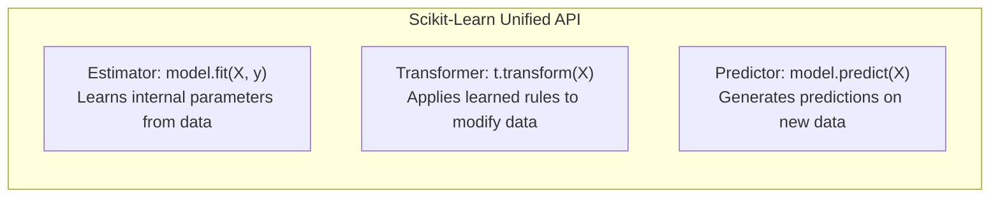
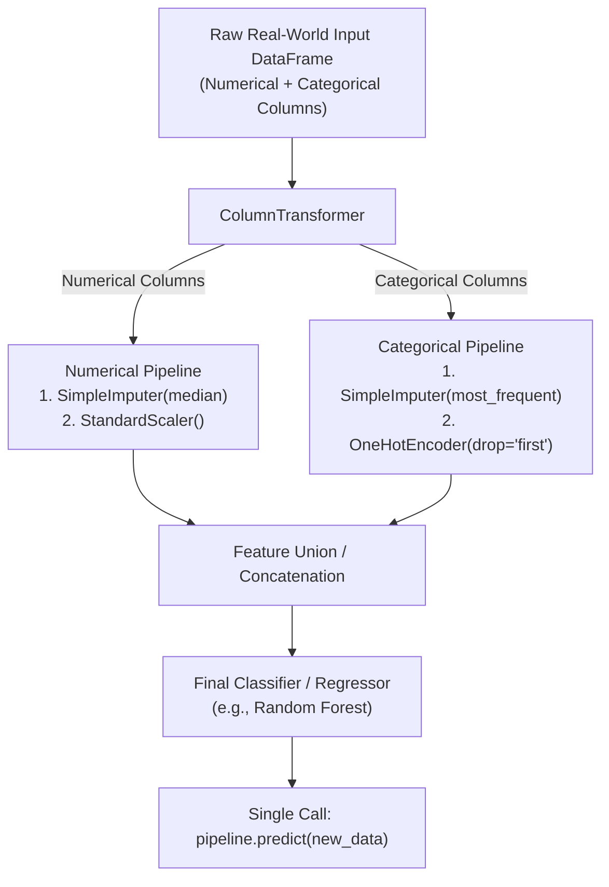
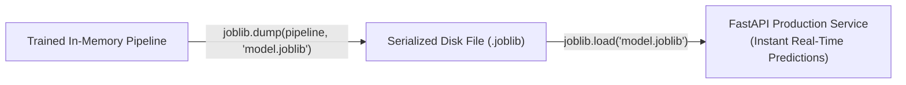

<div class="pixel-banner">
  <div class="pixel-hud-row">
    <div class="pixel-tag"><span class="pixel-indicator"></span>ML_SYS // TENSOR_CORE</div>
    <div class="pixel-meta-right">LVL_12 // PRODUCTION_ML</div>
  </div>
  <div class="pixel-main-content">
    <div class="pixel-avatar">🚀</div>
    <div class="pixel-headings">
      <div class="pixel-title-badge">LEVEL 12 // PRACTICAL ML SYSTEMS</div>
      <div class="pixel-subtitle">SKLEARN PIPELINES • COLUMNTRANSFORMER • SERIALIZATION • SERVING LATENCY</div>
    </div>
    <div class="pixel-sparklines">
      <div class="pixel-bar" style="--h: 50%"></div>
      <div class="pixel-bar" style="--h: 70%"></div>
      <div class="pixel-bar" style="--h: 85%"></div>
      <div class="pixel-bar" style="--h: 90%"></div>
      <div class="pixel-bar" style="--h: 95%"></div>
      <div class="pixel-bar" style="--h: 100%"></div>
    </div>
  </div>
  <div class="pixel-footer-row">
    <span class="pixel-coord">SYS_ID: #12_PRODUCTION // PIPELINE: DEPLOYED // JOBLIB_EXPORT: OK</span>
    <span class="pixel-status-text">[ PRODUCTION ]</span>
  </div>
</div>

# Level 12: Practical Machine Learning & Pipelines

<div class="notion-callout">
  <div class="notion-callout-icon">💡</div>
  <div class="notion-callout-content">
    In production software engineering, a model is not just a trained algorithm—it is an end-to-end pipeline. From imputing missing values and scaling numbers to encoding text categories and producing calibrated probabilities, Scikit-Learn Pipelines bundle the entire workflow into a single, deployable artifact that guarantees zero data leakage.
  </div>
</div>

<div class="notion-card-meta" style="margin-bottom: 2rem;">
  <span class="notion-tag notion-tag-green">Level 12</span>
  <span class="notion-tag notion-tag-gray">Production ML</span>
  <span class="notion-tag notion-tag-blue">Pipelines & Persistence</span>
</div>

---

## 36. Scikit-Learn Architecture

Scikit-Learn provides a clean, unified object-oriented design across all machine learning algorithms:



* **Estimator:** Any object that learns from data via `.fit(X, y)`.
* **Transformer:** An estimator that also transforms data via `.transform(X)` (or combined `.fit_transform(X)`).
* **Predictor:** An estimator capable of generating predictions via `.predict(X)` and `.predict_proba(X)`.

---

## 37. Production ML Pipelines & `ColumnTransformer`

In real-world applications, raw data contains a mixture of numerical and categorical columns that require distinct preprocessing steps:



---

### Why use `Pipeline` and `ColumnTransformer`?

1. **Zero Data Leakage:** When running cross-validation, Scikit-Learn automatically re-fits the transformers *strictly on each training fold*, completely eliminating data leakage.
2. **Simplified Production Deployment:** In production, rather than manually applying scalers, encoders, and imputers step-by-step to incoming JSON payloads, you call a single method: `pipeline.predict(json_data)`.
3. **Hyperparameter Tuning the Entire Stack:** You can use Grid Search or Optuna to tune preprocessing hyperparameters (e.g. testing median vs mean imputation) simultaneously with model hyperparameters.

---

### Complete Production Pipeline Implementation

```python
import numpy as np
import pandas as pd
from sklearn.model_selection import train_test_split
from sklearn.compose import ColumnTransformer
from sklearn.pipeline import Pipeline
from sklearn.impute import SimpleImputer
from sklearn.preprocessing import StandardScaler, OneHotEncoder
from sklearn.ensemble import RandomForestClassifier
from sklearn.metrics import classification_report

# 1. Create realistic mixed-type dataset
data = pd.DataFrame({
    'age': [25, 32, 47, np.nan, 55, 23, 40, 62],
    'income': [50000, 75000, np.nan, 120000, 110000, 32000, 85000, 95000],
    'department': ['IT', 'HR', 'Finance', 'IT', 'Finance', 'HR', 'IT', np.nan],
    'purchased': [0, 1, 1, 1, 1, 0, 0, 1]  # Target label
})

X = data.drop(columns=['purchased'])
y = data['purchased']

# Define feature subsets
numeric_features = ['age', 'income']
categorical_features = ['department']

# 2. Build sub-pipelines for each data type
numeric_transformer = Pipeline(steps=[
    ('imputer', SimpleImputer(strategy='median')),
    ('scaler', StandardScaler())
])

categorical_transformer = Pipeline(steps=[
    ('imputer', SimpleImputer(strategy='most_frequent')),
    ('encoder', OneHotEncoder(drop='first', handle_unknown='ignore'))
])

# 3. Combine into a ColumnTransformer
preprocessor = ColumnTransformer(
    transformers=[
        ('num', numeric_transformer, numeric_features),
        ('cat', categorical_transformer, categorical_features)
    ]
)

# 4. Assemble the full end-to-end pipeline
full_pipeline = Pipeline(steps=[
    ('preprocessor', preprocessor),
    ('classifier', RandomForestClassifier(n_estimators=100, random_state=42))
])

# 5. Split and train
X_train, X_test, y_train, y_test = train_test_split(X, y, test_size=0.25, random_state=42)

# Training fits both the transformers AND the model in one line!
full_pipeline.fit(X_train, y_train)

# Inference runs full preprocessing and prediction automatically
predictions = full_pipeline.predict(X_test)
print("Pipeline trained and evaluated successfully!")
```

---

## 38. Model Persistence: Joblib vs. Pickle

Once a pipeline is trained, it must be persisted to disk so serving microservices (such as FastAPI or Docker containers) can load it into memory for real-time inference without retraining.



---

### Why use `joblib` over `pickle`?
While Python's built-in `pickle` module can serialize arbitrary Python objects, machine learning pipelines contain massive multi-gigabyte NumPy array buffers (model weights). `joblib` is optimized specifically to serialize large NumPy arrays using memory mapping, saving disk space and loading up to **3x to 5x faster**.

```python
import joblib

# 1. Save the complete pipeline (preprocessor + model weights)
joblib.dump(full_pipeline, 'production_pipeline.joblib')
print("Model saved to production_pipeline.joblib")

# 2. Load in a separate production service
loaded_pipeline = joblib.load('production_pipeline.joblib')

# 3. Run predictions on raw incoming dictionary / DataFrame
new_customer = pd.DataFrame([{
    'age': 29,
    'income': 68000,
    'department': 'IT'
}])

prediction = loaded_pipeline.predict(new_customer)
probability = loaded_pipeline.predict_proba(new_customer)

print(f"Predicted class: {prediction[0]}, Probability: {probability[0][1]:.3f}")
```

---

<div class="notion-callout">
  <div class="notion-callout-icon">🎯</div>
  <div class="notion-callout-content">
    <strong>Level 12 Key Takeaway:</strong> Professional machine learning systems bundle transformers and models into unified Scikit-Learn Pipelines via `ColumnTransformer`. This eliminates data leakage during cross-validation and allows the entire inference stack to be persisted to disk with `joblib` and served as a reliable production microservice.
  </div>
</div>
