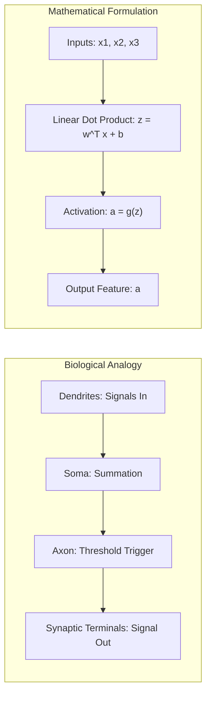
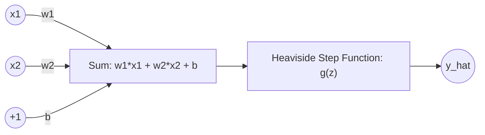
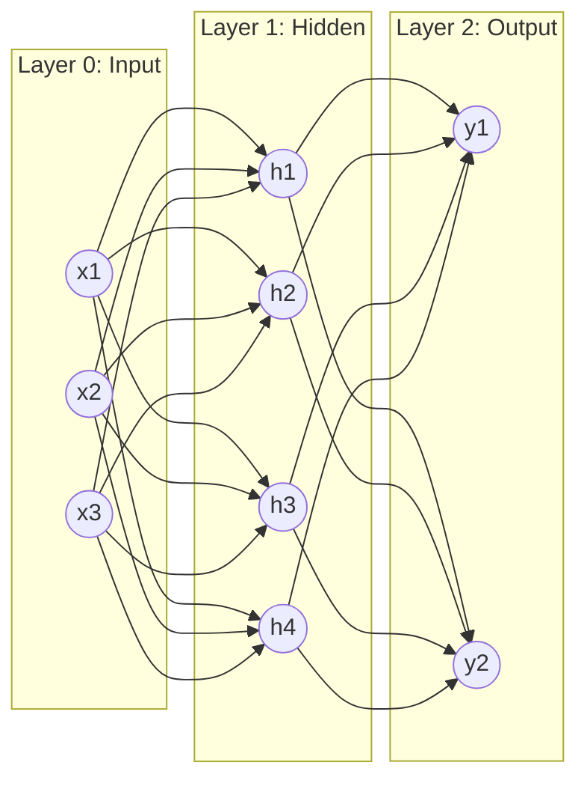

<div class="pixel-banner">
  <div class="pixel-hud-row">
    <div class="pixel-tag"><span class="pixel-indicator"></span>NEURAL_CORE // DL_FOUNDATIONS</div>
    <div class="pixel-meta-right">LVL_01 // REPRESENTATION_LEARNING</div>
  </div>
  <div class="pixel-main-content">
    <div class="pixel-avatar">🧠</div>
    <div class="pixel-headings">
      <div class="pixel-title-badge">LEVEL 01 // DEEP LEARNING FUNDAMENTALS</div>
      <div class="pixel-subtitle">ARTIFICIAL NEURONS • HIERARCHICAL REPRESENTATIONS • PERCEPTRONS • ACTIVATION DYNAMICS</div>
    </div>
    <div class="pixel-sparklines">
      <div class="pixel-bar" style="--h: 30%"></div>
      <div class="pixel-bar" style="--h: 55%"></div>
      <div class="pixel-bar" style="--h: 75%"></div>
      <div class="pixel-bar" style="--h: 60%"></div>
      <div class="pixel-bar" style="--h: 90%"></div>
      <div class="pixel-bar" style="--h: 100%"></div>
    </div>
  </div>
  <div class="pixel-footer-row">
    <span class="pixel-coord">SYS_ID: #01_DL_INTRO // NON_LINEARITY: ENABLED // PARADIGM: END_TO_END</span>
    <span class="pixel-status-text">[ ACTIVE ]</span>
  </div>
</div>

# Level 1: Deep Learning Fundamentals

<div class="notion-callout">
  <div class="notion-callout-icon">💡</div>
  <div class="notion-callout-content">
    Deep Learning replaces brittle, manual feature engineering with <strong>hierarchical representation learning</strong>. By stacking non-linear processing layers, deep neural networks automatically discover composite mathematical features—progressing from raw pixel gradients to semantic spatial concepts.
  </div>
</div>

<div class="notion-card-meta" style="margin-bottom: 2rem;">
  <span class="notion-tag notion-tag-purple">Level 1</span>
  <span class="notion-tag notion-tag-blue">Foundational Neural Theory</span>
  <span class="notion-tag notion-tag-green">Representation Learning</span>
</div>

---

## 1. Introduction to Deep Learning

### What is Deep Learning?
**Deep Learning (DL)** is a specialized subfield of Machine Learning centered around artificial neural networks with multiple stacked transformation layers (*depth* $\ge 2$ hidden layers). 

While classical machine learning algorithms (like Linear Regression, SVMs, or Random Forests) map pre-calculated tabular features to target variables, deep learning takes raw, unstructured high-dimensional signals (such as 2D pixel grids $H \times W \times C$, raw 1D audio waveforms, or text token sequences) and simultaneously learns both the **optimal feature representations** and the **predictive decision boundaries**.

```mermaid
graph TD
    subgraph Classical_ML ["Classical ML Pipeline"]
        A1["Raw Input Data: Image/Audio"] --> B1["Manual Feature Extraction: SIFT / HOG"]
        B1 --> C1["Shallow Classifier: SVM / Logistic Regression"]
        C1 --> D1["Final Output Prediction"]
    end

    subgraph Deep_Learning ["Deep Learning Pipeline"]
        A2["Raw Input Data: Raw Pixel Matrix"] --> B2["Layer 1: Low-Level Edges and Gradients"]
        B2 --> C2["Layer 2: Mid-Level Textures and Corners"]
        C2 --> D2["Layer 3: High-Level Semantic Parts"]
        D2 --> E2["Classification Head: Output Prediction"]
    end
```



### Machine Learning vs Deep Learning

The fundamental divide between classical ML and DL lies in how domain complexity is bridged:

| Dimension | Classical Machine Learning | Deep Learning |
| :--- | :--- | :--- |
| **Feature Extraction** | Manually engineered by human domain experts (e.g., Haralick textures, SIFT keypoints). | Learned automatically through parameterized end-to-end gradient backpropagation. |
| **Data Scalability** | Performance plateaus early once sample size grows beyond tabular capacity. | Performance scales monotonically with massive datasets (ImageNet, LAION, OpenImages). |
| **Hardware Dependency** | Runs efficiently on commodity multicore CPUs; modest RAM requirements. | Requires highly parallelized matrix hardware (NVIDIA Tensor Core GPUs, Google TPUs). |
| **Interpretability** | High; feature coefficients and decision splits can be inspected directly. | Low to Moderate; representations exist as dense distributed latent vectors in $\mathbb{R}^d$. |
| **Training Time** | Seconds to hours on tabular datasets. | Days to weeks across multi-GPU distributed clusters for vision models. |

### Neural Networks & Artificial Neurons
A **neural network** is a directed graph of interconnected computational units called artificial neurons. An artificial neuron computes a parameterized affine transformation of its inputs followed by a scalar non-linear activation:

$$z = \sum_{i=1}^n w_i x_i + b = \mathbf{w}^T \mathbf{x} + b$$

$$a = g(z) = g(\mathbf{w}^T \mathbf{x} + b)$$

Where:
* $\mathbf{x} \in \mathbb{R}^n$ is the input vector.
* $\mathbf{w} \in \mathbb{R}^n$ represents the learnable synaptic weights determining input sensitivity.
* $b \in \mathbb{R}$ is the learnable scalar bias shifting the activation threshold away from the origin.
* $z \in \mathbb{R}$ is the pre-activation logit.
* $g(\cdot)$ is a non-linear activation function yielding the output activation $a \in \mathbb{R}$.

### Biological Neuron — Basic Intuition
The artificial neuron was conceptually inspired by the neurobiology of the mammalian cortex:

* **Dendrites $\rightarrow$ Input Features ($\mathbf{x}$):** Branch-like fibers that collect biochemical electrical impulses from neighboring cells.
* **Synapses $\rightarrow$ Learnable Weights ($\mathbf{w}$):** Chemical junctions whose conductance modulates the strength of passing signals. In DL, gradient descent strengthens or suppresses synaptic weights.
* **Cell Body (Soma) $\rightarrow$ Accumulation ($\sum \mathbf{w}^T \mathbf{x} + b$):** Integrates incoming ionic charge across time and space.
* **Axon & Action Potential $\rightarrow$ Non-Linear Activation ($g(z)$):** If the voltage differential across the cell membrane breaches a physiological threshold (approx $-55\text{ mV}$), the neuron fires an all-or-nothing action potential down the axon to downstream neurons.



### Features and Representations
The core power of deep models in computer vision is **hierarchical feature composition**:
1. **Low-level features (Early Layers):** Tiny spatial receptive fields compute spatial derivatives, detecting oriented edge kernels, color gradients, and phase frequencies.
2. **Mid-level features (Intermediate Layers):** Convolutions combine intersecting edges into textures, motifs, corners, circles, and primitive shapes.
3. **High-level semantic features (Deep Layers):** Abstract receptive fields encompass broad spatial contexts, assembling motifs into object components (eyes, noses, wheels, engine bays) and entire visual classes.

### Forward Propagation vs Inference
* **Forward Propagation:** The deterministic pass of activations from the input layer through every successive hidden transformation to generate a predicted output $\hat{\mathbf{y}}$ and calculate the scalar loss $\mathcal{L}(\hat{\mathbf{y}}, \mathbf{y})$. During training, intermediate activations must be retained in GPU VRAM to compute analytical gradients during backward propagation.
* **Inference (Evaluation):** Running the forward pass on unseen inputs strictly to obtain predictions. All gradient calculation graphs are disabled (`torch.no_grad()` or `torch.inference_mode()`), freeing significant VRAM and compute cycles.

---

## 2. Neural Network Fundamentals

### The Perceptron
Invented by Frank Rosenblatt in 1957, the **Perceptron** is the simplest supervised binary classification unit. It computes a linear combination and passes it through a discontinuous Heaviside step activation:

$$\hat{y} = g(\mathbf{w}^T \mathbf{x} + b) = \begin{cases} 1 & \text{if } \mathbf{w}^T \mathbf{x} + b \ge 0 \\ 0 & \text{if } \mathbf{w}^T \mathbf{x} + b < 0 \end{cases}$$



#### The Linear Separability Crisis & The XOR Failure
A single perceptron can only define a flat $(d-1)$-dimensional hyperplane as its decision boundary. Consequently, it can easily solve linearly separable boolean operators like **AND** and **OR**, but **strictly fails** on the non-linear **XOR (Exclusive OR)** function:

```
  AND Problem (Linearly Separable)           XOR Problem (Non-Linear)
  x₂                                         x₂
  1 |      (0)            (1)                1 |      (1)            (0)
    |                                          |
    |  Decision Boundary: w₁x₁ + w₂x₂ + b = 0   |    Cannot separate with a
  0 |      (0)            (0)                0 |      (0)            (1)
    +------------------------- x₁              +------------------------- x₁
           0              1                           0              1
```

In 1969, Marvin Minsky and Seymour Papert proved that a single-layer perceptron could never separate XOR patterns. Overcoming this limitation requires **hidden layers** with continuous non-linear activations—allowing multi-layer networks to bend, twist, and fold space to isolate non-linear decision regions.

### Multi-Layer Neural Networks (MLP Architecture)
A **Multilayer Perceptron (MLP)** or Fully Connected Network (FCN) consists of:
1. **Input Layer:** Directly buffers input features $\mathbf{x} \in \mathbb{R}^{d_{in}}$. It performs no mathematical transformation.
2. **Hidden Layers:** One or more intermediate layers that transform spatial coordinates into latent feature spaces $\mathbf{h}^{(l)} \in \mathbb{R}^{d_l}$.
3. **Output Layer:** Projects latent activations into target predictions $\hat{\mathbf{y}} \in \mathbb{R}^{d_{out}}$ (logits for classification, continuous numbers for regression).



### Parameters vs Activations
* **Parameters (Weights $\mathbf{W}$ & Biases $\mathbf{b}$):** Learnable state matrices optimized by gradient descent.

    $$\text{Total Parameters} = \sum_{l=1}^L \left( d_{l-1} \times d_l + d_l \right)$$

    *(where $d_{l-1} \times d_l$ counts the weights and $+ d_l$ counts the biases).*
* **Activations ($\mathbf{a}^{(l)}$):** Dynamic intermediate vectors generated during forward propagation for a given input batch. They are transient and vary per sample.

---

## 3. Activation Functions

### Why Non-Linear Activations Are Mandatory
If every layer in a deep network used purely linear transformations $g(z) = z$, then a network of arbitrary depth $L$ collapses into a single trivial linear regression model:

$$\mathbf{h}^{(1)} = \mathbf{W}_1 \mathbf{x} + \mathbf{b}_1$$

$$\mathbf{h}^{(2)} = \mathbf{W}_2 \mathbf{h}^{(1)} + \mathbf{b}_2 = \mathbf{W}_2 (\mathbf{W}_1 \mathbf{x} + \mathbf{b}_1) + \mathbf{b}_2 = (\mathbf{W}_2 \mathbf{W}_1) \mathbf{x} + (\mathbf{W}_2 \mathbf{b}_1 + \mathbf{b}_2)$$

$$\mathbf{h}^{(2)} = \mathbf{W}' \mathbf{x} + \mathbf{b}'$$

Without non-linear activations, stacking 100 layers provides **zero additional expressive capacity** over a single linear layer. Non-linearities allow the network to act as a **Universal Approximator** capable of approximating any continuous function on compact subsets of $\mathbb{R}^n$.

---

### Comparative Activation Landscape

```python
import torch
import torch.nn as nn
import matplotlib.pyplot as plt

# Mathematical definitions of foundational activations
x = torch.linspace(-5.0, 5.0, 200, requires_grad=True)

activations = {
    "Sigmoid": torch.sigmoid(x),
    "Tanh": torch.tanh(x),
    "ReLU": torch.relu(x),
    "LeakyReLU": nn.functional.leaky_relu(x, negative_slope=0.1),
    "ELU": nn.functional.elu(x, alpha=1.0),
    "GELU": nn.functional.gelu(x)
}
```

#### 1. Sigmoid Function
$$\sigma(z) = \frac{1}{1 + e^{-z}}, \quad \frac{d\sigma}{dz} = \sigma(z)(1 - \sigma(z))$$

* **Output Range:** $(0, 1)$.
* **Primary Use Case:** Binary classification output layer.
* **Failure Mode (Vanishing Gradient):** As $|z| > 3$, the curve saturates horizontally. The analytical derivative $\sigma'(z) \le 0.25$. When backpropagating through multiple saturated sigmoid layers, gradients decay exponentially ($0.25^L \rightarrow 0$), halting early layer updates entirely.
* **Non-Zero Centered:** Outputs are strictly positive, causing zig-zag gradient dynamics during weight updates.

#### 2. Hyperbolic Tangent (Tanh)
$$\tanh(z) = \frac{e^z - e^{-z}}{e^z + e^{-z}} = 2\sigma(2z) - 1, \quad \frac{d\tanh}{dz} = 1 - \tanh^2(z)$$

* **Output Range:** $(-1, 1)$.
* **Advantages over Sigmoid:** Zero-centered output prevents systematic directional bias in gradient updates.
* **Failure Mode:** Still suffers from saturation and vanishing gradients at the positive and negative extremes ($|z| > 3$).

#### 3. Rectified Linear Unit (ReLU)
$$\text{ReLU}(z) = \max(0, z), \quad \frac{d\text{ReLU}}{dz} = \begin{cases} 1 & \text{if } z > 0 \\ 0 & \text{if } z < 0 \end{cases}$$

* **Output Range:** $[0, \infty)$.
* **Advantages:** Extremely fast to compute ($O(1)$ max gate). Constant derivative of $1.0$ for $z > 0$ completely eliminates vanishing gradients in positive activation paths. Induces biological-like sparsity (neurons with $z < 0$ output 0).
* **Failure Mode ("Dying ReLU"):** If a large gradient pushes weights such that a neuron outputs $z < 0$ for all samples in the dataset, its gradient is permanently $0$. The neuron becomes inactive ("dead") and never recovers.

#### 4. Leaky ReLU
$$\text{LeakyReLU}(z) = \max(\alpha z, z) = \begin{cases} z & \text{if } z > 0 \\ \alpha z & \text{if } z \le 0 \end{cases} \quad (\text{typically } \alpha = 0.01)$$

* **Motivation:** Solves the dying ReLU problem by maintaining a small, non-zero slope $\alpha$ in the negative regime, guaranteeing gradient flow even when unactivated.

#### 5. Exponential Linear Unit (ELU)
$$\text{ELU}(z) = \begin{cases} z & \text{if } z > 0 \\ \alpha (e^z - 1) & \text{if } z \le 0 \end{cases}$$

* **Advantages:** Smoothly saturates to $-\alpha$ for negative values, making the mean activation closer to zero while offering robustness against noise.
* **Trade-off:** Computationally more expensive due to exponential computation $\exp(z)$.

#### 6. Gaussian Error Linear Unit (GELU)
$$\text{GELU}(z) = z \cdot \Phi(z) = z \cdot P(X \le z) \quad \text{where } X \sim \mathcal{N}(0, 1)$$

$$\text{Approximation: } \text{GELU}(z) \approx 0.5z \left(1 + \tanh\left(\sqrt{\frac{2}{\pi}} \left(z + 0.044715 z^3\right)\right)\right)$$

* **Why it is used:** Standard activation in Vision Transformers (ViT), Swin, BERT, and GPT architectures. Instead of deterministic gating based on sign (like ReLU), GELU weights inputs by their percentile value under a standard normal distribution, providing smooth probabilistic non-linearity.

#### 7. Softmax (Multi-Class Probability Normalization)
Given a vector of $K$ unnormalized logits $\mathbf{z} \in \mathbb{R}^K$:

$$\text{Softmax}(\mathbf{z})_i = \frac{e^{z_i}}{\sum_{j=1}^K e^{z_j}} \quad \text{for } i = 1, \dots, K$$

* **Properties:** All outputs are strictly positive ($\in (0, 1)$) and sum exactly to $1.0$ ($\sum_i p_i = 1$).
* **Numerical Stability Trick:** Directly computing $e^{z_i}$ causes floating-point overflow if $z_i > 709$ in IEEE-754 float64 (or $> 88$ in float32). To prevent overflow, subtract the maximum logit before exponentiation:

    $$\text{Softmax}(\mathbf{z})_i = \frac{e^{z_i - \max(\mathbf{z})}}{\sum_{j=1}^K e^{z_j - \max(\mathbf{z})}}$$

---

### Python & PyTorch: From-Scratch Activation Benchmark

```python
import torch
import torch.nn as nn

class ActivationShowcase(nn.Module):
    """
    Demonstrates forward computation and gradient properties
    of contemporary neural activation functions.
    """
    def __init__(self):
        super().__init__()
        self.relu = nn.ReLU()
        self.leaky_relu = nn.LeakyReLU(negative_slope=0.02)
        self.gelu = nn.GELU()
        self.sigmoid = nn.Sigmoid()

    def forward(self, logits: torch.Tensor) -> dict:
        return {
            "relu_out": self.relu(logits),
            "leaky_out": self.leaky_relu(logits),
            "gelu_out": self.gelu(logits),
            "prob_out": torch.softmax(logits, dim=-1)
        }

if __name__ == "__main__":
    # Test batch of 4 samples, 3 classes
    sample_logits = torch.tensor([
        [2.5, -1.2, 0.0],
        [-10.0, 50.0, 12.0],
        [0.0, 0.0, 0.0],
        [-3.4, -0.1, 4.2]
    ], requires_grad=True)

    model = ActivationShowcase()
    outputs = model(sample_logits)
    
    print("Softmax Normalized Class Probabilities:")
    print(outputs["prob_out"].detach().numpy().round(4))
    
    # Backpropagation verification
    loss = outputs["gelu_out"].sum()
    loss.backward()
    print("\nLogit Gradients via GELU:")
    print(sample_logits.grad)
```
