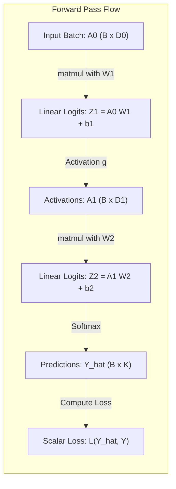
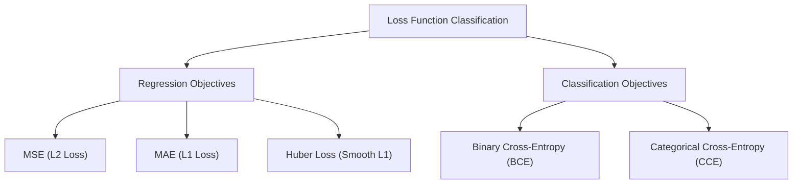
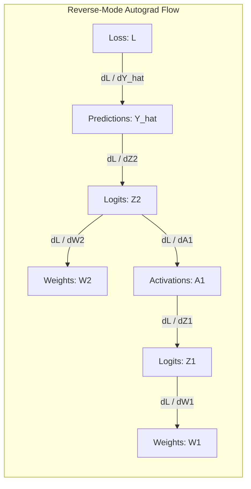
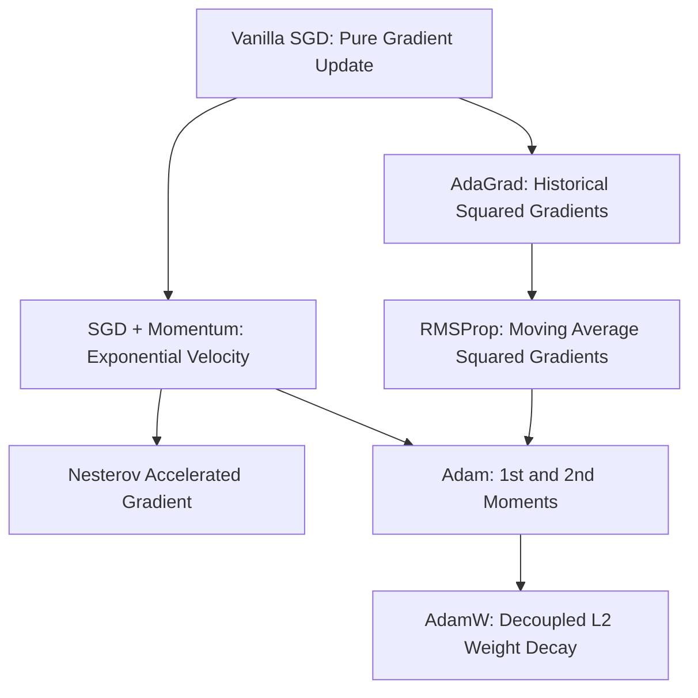

<div class="pixel-banner">
  <div class="pixel-hud-row">
    <div class="pixel-tag"><span class="pixel-indicator"></span>NEURAL_CORE // TRAINING_ENGINE</div>
    <div class="pixel-meta-right">LVL_02 // BACKPROP_OPTIMIZATION</div>
  </div>
  <div class="pixel-main-content">
    <div class="pixel-avatar">⚙️</div>
    <div class="pixel-headings">
      <div class="pixel-title-badge">LEVEL 02 // NEURAL NETWORK TRAINING</div>
      <div class="pixel-subtitle">FORWARD PROPAGATION • LOSS FUNCTIONS • AUTOGRAD CHAIN RULE • ADAMW OPTIMIZATION</div>
    </div>
    <div class="pixel-sparklines">
      <div class="pixel-bar" style="--h: 90%"></div>
      <div class="pixel-bar" style="--h: 75%"></div>
      <div class="pixel-bar" style="--h: 55%"></div>
      <div class="pixel-bar" style="--h: 40%"></div>
      <div class="pixel-bar" style="--h: 25%"></div>
      <div class="pixel-bar" style="--h: 12%"></div>
    </div>
  </div>
  <div class="pixel-footer-row">
    <span class="pixel-coord">SYS_ID: #02_TRAIN // LOSS_GRAD: EVALUATED // OPTIMIZER: ADAMW</span>
    <span class="pixel-status-text">[ CONVERGING ]</span>
  </div>
</div>

# Level 2: Neural Network Training

<div class="notion-callout">
  <div class="notion-callout-icon">💡</div>
  <div class="notion-callout-content">
    Neural network training is a non-convex numerical optimization problem. Forward propagation evaluates a directed computational graph to calculate prediction error, while <strong>Reverse-Mode Automatic Differentiation (Backpropagation)</strong> applies the multivariate chain rule to calculate exact loss gradients for optimizer parameter updates.
  </div>
</div>

<div class="notion-card-meta" style="margin-bottom: 2rem;">
  <span class="notion-tag notion-tag-purple">Level 2</span>
  <span class="notion-tag notion-tag-blue">Calculus & Gradients</span>
  <span class="notion-tag notion-tag-green">Optimization Dynamics</span>
</div>

---

## 4. Forward Propagation & Computational Graphs

### Layer Computation & Matrix Multiplication
In deep learning frameworks, training samples are batched together into 2D tensors of shape $(B, D_{in})$, where $B$ is the batch size and $D_{in}$ is the feature dimensionality. 

For a fully connected layer $l$ receiving input activations $\mathbf{A}^{(l-1)} \in \mathbb{R}^{B \times D_{l-1}}$:
1. **Affine Transformation:** The input matrix is multiplied by the weight parameter tensor $\mathbf{W}^{(l)} \in \mathbb{R}^{D_{l-1} \times D_l}$ and shifted by the broadcasted bias vector $\mathbf{b}^{(l)} \in \mathbb{R}^{D_l}$:
   $$\mathbf{Z}^{(l)} = \mathbf{A}^{(l-1)} \mathbf{W}^{(l)} + \mathbf{b}^{(l)}$$
2. **Non-Linear Activation:** An element-wise non-linear activation function $g^{(l)}(\cdot)$ is evaluated:
   $$\mathbf{A}^{(l)} = g^{(l)}\left(\mathbf{Z}^{(l)}\right)$$



### The Computational Graph
A **computational graph** is a directed acyclic graph (DAG) where nodes represent input variables or mathematical operators (`matmul`, `add`, `relu`), and directed edges represent the flow of multi-dimensional tensors.

```
       x ────┐
             ▼ (matmul) ────> z ────> (ReLU) ────> a ────> (Loss) ────> ℒ
       W ────┘
```

* **Dynamic Computational Graphs (PyTorch):** Constructed eagerly on-the-fly during execution (*Define-by-Run*). Enables standard Python control flow (`if`, `for`, `while`) directly within neural network architectures.
* **Activation Stash Requirement:** Every intermediate tensor $\mathbf{A}^{(l)}$ and $\mathbf{Z}^{(l)}$ required by the analytical derivative of an operator must be cached in memory during forward propagation. This is why deep architectures consume massive GPU VRAM during training compared to inference.

---

## 5. Loss Functions

A **loss function** $\mathcal{L}(\hat{\mathbf{y}}, \mathbf{y})$ quantifies the numerical penalty incurred when the model's prediction $\hat{\mathbf{y}}$ deviates from the ground truth label $\mathbf{y}$.



### 1. Mean Squared Error (MSE / L2 Loss)
$$\mathcal{L}_{\text{MSE}}(\hat{\mathbf{y}}, \mathbf{y}) = \frac{1}{B} \sum_{i=1}^B (y_i - \hat{y}_i)^2$$

* **Target Domain:** Continuous real numbers $\mathbb{R}$ (Regression).
* **Behavior:** Quadratic penalty heavily penalizes large errors. Highly sensitive to outliers.
* **Gradient:** $\frac{\partial \mathcal{L}}{\partial \hat{y}_i} = -\frac{2}{B}(y_i - \hat{y}_i)$. Gradients shrink to zero as error approaches zero (natural deceleration).

### 2. Mean Absolute Error (MAE / L1 Loss)
$$\mathcal{L}_{\text{MAE}}(\hat{\mathbf{y}}, \mathbf{y}) = \frac{1}{B} \sum_{i=1}^B |y_i - \hat{y}_i|$$

* **Target Domain:** Continuous values with severe outlier contamination.
* **Behavior:** Robust against extreme outliers because error penalties grow linearly, not quadratically.
* **Gradient:** $\frac{\partial \mathcal{L}}{\partial \hat{y}_i} = -\frac{1}{B} \text{sign}(y_i - \hat{y}_i)$. Discontinuous at $y_i = \hat{y}_i$; requires gradient clipping or sub-gradient techniques.

### 3. Binary Cross-Entropy (BCE)
$$\mathcal{L}_{\text{BCE}}(\hat{y}, y) = -\frac{1}{B} \sum_{i=1}^B \Big( y_i \log(\hat{y}_i) + (1 - y_i) \log(1 - \hat{y}_i) \Big)$$

* **Target Domain:** Binary labels $y \in \{0, 1\}$ paired with predicted sigmoid probabilities $\hat{y} = \sigma(z) \in (0, 1)$.
* **Probabilistic Basis:** Derived directly from the Maximum Likelihood Estimation (MLE) of a Bernoulli distribution.
* **Numerical Warning:** If $\hat{y}_i \rightarrow 0$ when $y_i = 1$, $\log(0) \rightarrow -\infty$ producing `NaN`. PyTorch solves this via `nn.BCEWithLogitsLoss()`, which fuses the sigmoid and log-loss into a single numerically stable formulation using the log-sum-exp trick:
  $$\mathcal{L}(z, y) = \max(z, 0) - z \cdot y + \log(1 + e^{-|z|})$$

### 4. Categorical Cross-Entropy (CCE)
Given multi-class targets encoded as one-hot vectors $\mathbf{y} \in \{0, 1\}^K$ and softmax outputs $\hat{\mathbf{y}} \in (0, 1)^K$:

$$\mathcal{L}_{\text{CCE}}(\hat{\mathbf{y}}, \mathbf{y}) = -\frac{1}{B} \sum_{i=1}^B \sum_{k=1}^K y_{i,k} \log(\hat{y}_{i,k})$$

Because only the true class index $c$ has $y_{i,c} = 1$ while all other class entries are $0$, CCE simplifies directly to the **Negative Log-Likelihood (NLL)** of the correct class:

$$\mathcal{L}(\hat{\mathbf{y}}, \mathbf{y}) = -\log(\hat{y}_c) = -\log\left(\frac{e^{z_c}}{\sum_{j=1}^K e^{z_j}}\right) = -z_c + \log\left(\sum_{j=1}^K e^{z_j}\right)$$

---

## 6. Backpropagation & The Multivariate Chain Rule

### The Backpropagation Mechanism
Backpropagation is the efficient computation of partial derivatives $\frac{\partial \mathcal{L}}{\partial \mathbf{W}^{(l)}}$ and $\frac{\partial \mathcal{L}}{\partial \mathbf{b}^{(l)}}$ across all layers using **Reverse-Mode Automatic Differentiation**.

Instead of computing forward sensitivities individually for each parameter ($O(P)$ forward passes), backpropagation computes the loss sensitivity with respect to *all* $P$ parameters in a **single backward sweep** ($O(1)$ backward pass).



### Mathematical Derivation of Backpropagation
Consider a 2-layer network with loss $\mathcal{L}$:
$$\mathbf{Z}^{(1)} = \mathbf{X} \mathbf{W}^{(1)} + \mathbf{b}^{(1)}, \quad \mathbf{A}^{(1)} = g(\mathbf{Z}^{(1)})$$
$$\mathbf{Z}^{(2)} = \mathbf{A}^{(1)} \mathbf{W}^{(2)} + \mathbf{b}^{(2)}, \quad \hat{\mathbf{Y}} = \text{Softmax}(\mathbf{Z}^{(2)})$$

1. **Output Layer Error Vector ($\boldsymbol{\delta}^{(2)}$):**
   Using cross-entropy loss with softmax activation, the partial derivative simplifies with elegance:
   $$\boldsymbol{\delta}^{(2)} = \frac{\partial \mathcal{L}}{\partial \mathbf{Z}^{(2)}} = \hat{\mathbf{Y}} - \mathbf{Y}$$
2. **Output Parameter Gradients:**
   $$\frac{\partial \mathcal{L}}{\partial \mathbf{W}^{(2)}} = (\mathbf{A}^{(1)})^T \boldsymbol{\delta}^{(2)}$$
   $$\frac{\partial \mathcal{L}}{\partial \mathbf{b}^{(2)}} = \sum_{i=1}^B \boldsymbol{\delta}^{(2)}_{i,:}$$
3. **Hidden Layer Error Vector ($\boldsymbol{\delta}^{(1)}$):**
   Backpropagating the error gradient across the weight matrix $\mathbf{W}^{(2)}$ and through the activation derivative $g'(\cdot)$:
   $$\boldsymbol{\delta}^{(1)} = \frac{\partial \mathcal{L}}{\partial \mathbf{Z}^{(1)}} = \left( \boldsymbol{\delta}^{(2)} (\mathbf{W}^{(2)})^T \right) \odot g'(\mathbf{Z}^{(1)})$$
   *(where $\odot$ represents the element-wise Hadamard product).*
4. **Hidden Parameter Gradients:**
   $$\frac{\partial \mathcal{L}}{\partial \mathbf{W}^{(1)}} = \mathbf{X}^T \boldsymbol{\delta}^{(1)}$$
   $$\frac{\partial \mathcal{L}}{\partial \mathbf{b}^{(1)}} = \sum_{i=1}^B \boldsymbol{\delta}^{(1)}_{i,:}$$

---

## 7. Gradient Descent Variants

Parameter updates proceed in the direction of steepest descent along the loss manifold:

$$\mathbf{W}_{t+1} = \mathbf{W}_t - \eta \nabla_{\mathbf{W}} \mathcal{L}$$

Where $\eta > 0$ is the **learning rate**.

| Variant | Batch Size | Update Frequency | Convergence Characteristics |
| :--- | :--- | :--- | :--- |
| **Batch GD** | All $N$ samples | Once per epoch | Smooth, monotonic loss descent; computationally intractable for large datasets; high memory footprint. |
| **Stochastic GD (SGD)** | 1 sample | After every sample | High variance gradient estimates; extreme zig-zag oscillations; escapes shallow local minima but struggles to settle. |
| **Mini-Batch GD** | $B \in [32, 512]$ | After every mini-batch | **Standard in modern deep learning**. Harnesses GPU SIMD tensor vectorization while injecting healthy gradient noise to generalize. |

### Learning Rate Schedules
A static learning rate $\eta$ is sub-optimal: large $\eta$ enables fast early progress but causes oscillations around the minimum late in training. Modern regimes apply dynamic schedules:

1. **Step Decay:** Reduces $\eta$ by a factor $\gamma$ (e.g., $0.1$) at fixed epoch milestones.
2. **Cosine Annealing:** Smoothly decays $\eta$ following a half-cosine curve:
   $$\eta_t = \eta_{min} + \frac{1}{2}(\eta_{max} - \eta_{min})\left(1 + \cos\left(\frac{t}{T_{max}}\pi\right)\right)$$
3. **Warmup Schedules:** Linearly increases $\eta$ from 0 to $\eta_{max}$ during the first few epochs to stabilize random initialization gradients before initiating decay.

---

## 8. Optimizers: SGD, Momentum, Adam, and AdamW



### 1. SGD with Classical Momentum
Vanilla SGD struggles in ravines (surfaces that curve much more steeply in one dimension than in another). **Momentum** introduces an accumulated velocity vector $\mathbf{v}_t$:

$$\mathbf{v}_t = \beta \mathbf{v}_{t-1} + (1 - \beta) \mathbf{g}_t \quad (\text{typically } \beta = 0.9)$$

$$\mathbf{W}_{t+1} = \mathbf{W}_t - \eta \mathbf{v}_t$$

* **Physical Analogy:** A heavy ball rolling down a hill accelerates in directions of persistent gradient descent while dampening high-frequency oscillations across steep ravine walls.

### 2. RMSProp (Root Mean Square Propagation)
Maintains an exponential moving average of squared gradients to scale coordinates inversely by their historical update magnitude:

$$\mathbf{s}_t = \rho \mathbf{s}_{t-1} + (1 - \rho) \mathbf{g}_t^2 \quad (\text{typically } \rho = 0.99)$$

$$\mathbf{W}_{t+1} = \mathbf{W}_t - \frac{\eta}{\sqrt{\mathbf{s}_t + \epsilon}} \odot \mathbf{g}_t$$

Where $\epsilon \approx 10^{-8}$ prevents division by zero. Parameters receiving huge, frequent gradients are dampened; dormant parameters receiving infrequent gradients are amplified.

### 3. Adam (Adaptive Moment Estimation)
Adam combines the first moment (momentum) with the second uncentered moment (RMSProp), accompanied by **bias correction** terms for initialization at zero:

$$\mathbf{m}_t = \beta_1 \mathbf{m}_{t-1} + (1 - \beta_1) \mathbf{g}_t \quad (\beta_1 = 0.9)$$

$$\mathbf{v}_t = \beta_2 \mathbf{v}_{t-1} + (1 - \beta_2) \mathbf{g}_t^2 \quad (\beta_2 = 0.999)$$

$$\hat{\mathbf{m}}_t = \frac{\mathbf{m}_t}{1 - \beta_1^t}, \quad \hat{\mathbf{v}}_t = \frac{\mathbf{v}_t}{1 - \beta_2^t}$$

$$\mathbf{W}_{t+1} = \mathbf{W}_t - \frac{\eta}{\sqrt{\hat{\mathbf{v}}_t} + \epsilon} \hat{\mathbf{m}}_t$$

### 4. AdamW: Decoupled Weight Decay
In standard Adam, adding an $L_2$ regularization penalty $\frac{1}{2} \lambda \|\mathbf{W}\|^2$ to the loss function alters the gradient $\mathbf{g}_t \leftarrow \mathbf{g}_t + \lambda \mathbf{W}_t$. Because the weight magnitude is scaled by the second-moment denominator $\sqrt{\hat{\mathbf{v}}_t}$, weights with large historical gradients are regularized *less* than weights with small gradients.

**AdamW (Loshchilov & Hutter, 2017)** decouples weight decay entirely from the gradient-based moment updates:

$$\mathbf{W}_{t+1} = \mathbf{W}_t - \eta \lambda \mathbf{W}_t - \frac{\eta}{\sqrt{\hat{\mathbf{v}}_t} + \epsilon} \hat{\mathbf{m}}_t$$

AdamW is the default gold-standard optimizer for Vision Transformers (ViT), ConvNeXt, YOLO backbones, and Large Language Models.

---

### Python Implementation: Complete From-Scratch Training Engine

```python
import torch
import torch.nn as nn

class TrainingDynamicsDemo(nn.Module):
    """
    Demonstrates forward pass, autograd backprop,
    and parameter updates using PyTorch.
    """
    def __init__(self, in_features: int, hidden_dim: int, out_classes: int):
        super().__init__()
        self.net = nn.Sequential(
            nn.Linear(in_features, hidden_dim),
            nn.ReLU(),
            nn.Linear(hidden_dim, out_classes)
        )

    def forward(self, x: torch.Tensor) -> torch.Tensor:
        return self.net(x)

if __name__ == "__main__":
    # 1. Synthetic Vision Feature Batch (Batch=8, Features=16, Classes=3)
    torch.manual_seed(42)
    inputs = torch.randn(8, 16)
    labels = torch.tensor([0, 2, 1, 1, 0, 2, 2, 1])

    # 2. Instantiate Model, Loss Function, and Decoupled Optimizer
    model = TrainingDynamicsDemo(in_features=16, hidden_dim=32, out_classes=3)
    criterion = nn.CrossEntropyLoss()
    optimizer = torch.optim.AdamW(model.parameters(), lr=1e-3, weight_decay=1e-2)

    # 3. Execution of One Training Step
    model.train()
    optimizer.zero_grad(set_to_none=True) # Optimal memory reuse
    
    # Forward Pass
    logits = model(inputs)
    loss = criterion(logits, labels)
    
    # Backward Pass (Reverse-mode autograd)
    loss.backward()
    
    # Inspect Parameter Gradients
    print(f"Step Loss: {loss.item():.4f}")
    sample_grad = model.net[0].weight.grad
    print(f"Layer 1 Weight Gradient Shape: {sample_grad.shape}")
    print(f"Layer 1 Mean Gradient Norm: {sample_grad.norm().item():.6f}")

    # Optimizer Step
    optimizer.step()
    print("Parameters updated via AdamW successfully.")
```
