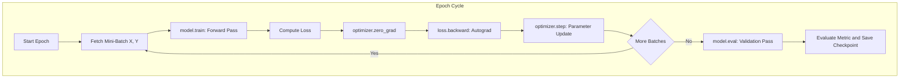
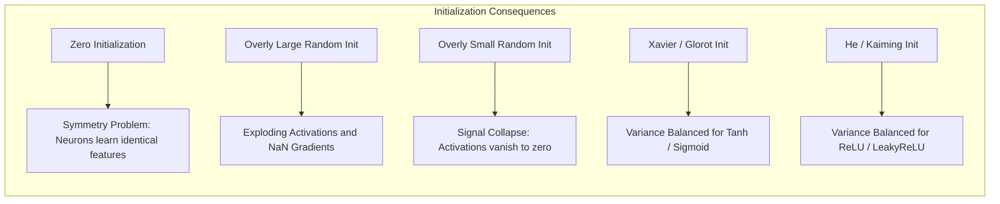
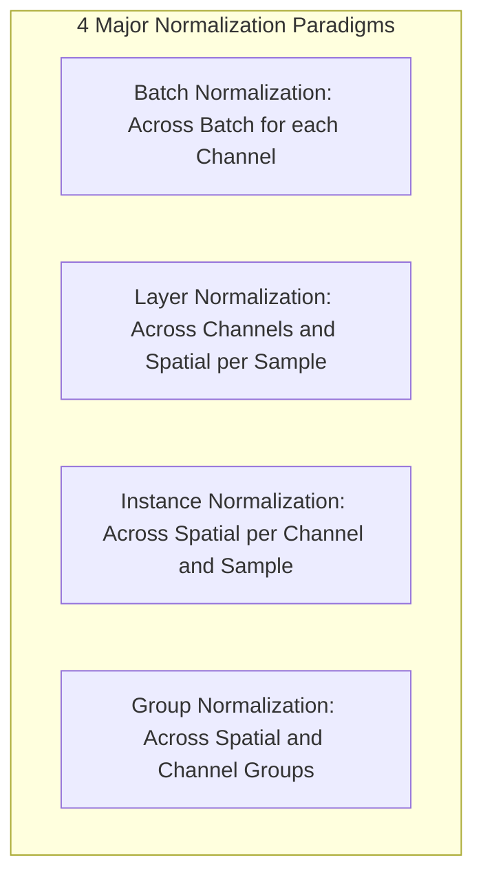

<div class="pixel-banner">
  <div class="pixel-hud-row">
    <div class="pixel-tag"><span class="pixel-indicator"></span>NEURAL_CORE // ARCHITECTURE_ENGINE</div>
    <div class="pixel-meta-right">LVL_03 // LAYER_NORMALIZATION</div>
  </div>
  <div class="pixel-main-content">
    <div class="pixel-avatar">🏗️</div>
    <div class="pixel-headings">
      <div class="pixel-title-badge">LEVEL 03 // BUILDING NEURAL NETWORKS</div>
      <div class="pixel-subtitle">DEPTH VS WIDTH • TRAINING LOOPS • HE/KAIMING INITIALIZATION • BATCHNORM VS LAYERNORM</div>
    </div>
    <div class="pixel-sparklines">
      <div class="pixel-bar" style="--h: 40%"></div>
      <div class="pixel-bar" style="--h: 65%"></div>
      <div class="pixel-bar" style="--h: 80%"></div>
      <div class="pixel-bar" style="--h: 60%"></div>
      <div class="pixel-bar" style="--h: 90%"></div>
      <div class="pixel-bar" style="--h: 100%"></div>
    </div>
  </div>
  <div class="pixel-footer-row">
    <span class="pixel-coord">SYS_ID: #03_BUILD // WEIGHT_INIT: KAIMING_NORMAL // NORM: BATCHNORM2D</span>
    <span class="pixel-status-text">[ INITIALIZED ]</span>
  </div>
</div>

# Level 3: Building Neural Networks

<div class="notion-callout">
  <div class="notion-callout-icon">💡</div>
  <div class="notion-callout-content">
    Constructing deep architectures requires balancing <strong>depth vs width</strong>, establishing variance-preserving <strong>weight initialization</strong> (He/Kaiming) to prevent activation collapse, and deploying <strong>normalization layers</strong> to stabilize intermediate distributions and smooth the loss landscape.
  </div>
</div>

<div class="notion-card-meta" style="margin-bottom: 2rem;">
  <span class="notion-tag notion-tag-purple">Level 3</span>
  <span class="notion-tag notion-tag-blue">Structural Design</span>
  <span class="notion-tag notion-tag-green">Variance Normalization</span>
</div>

---

## 9. Neural Network Architecture

### Fully Connected Layers & Model Capacity
A fully connected layer performs a dense affine projection from an input dimension $D_{in}$ to an output dimension $D_{out}$. The learnable parameter budget is:

$$\text{Params} = (D_{in} \times D_{out}) + D_{out} \quad \text{[Weights + Biases]}$$

**Model Capacity** defines the volume of functions a network can theoretically represent:
* **Under-parameterized Models:** Lack the degrees of freedom to capture non-linear patterns, yielding persistent high training error (high bias).
* **Over-parameterized Models:** Possess far more parameters than training samples ($P \gg N$). While classical statistical theory warned of catastrophic overfitting, modern deep learning demonstrates that heavily over-parameterized networks optimized by SGD often achieve superior generalization due to implicit inductive regularization.

### Depth vs Width Trade-offs

```
  Deep & Narrow Network              Shallow & Wide Network
  Layer 1: [8 neurons]               Layer 1: [2048 neurons]
  Layer 2: [8 neurons]               Layer 2: [Output]
  Layer 3: [8 neurons]
  Layer 4: [8 neurons]
  Layer 5: [Output]
```

* **The Power of Depth:** Stacking layers creates compositional, hierarchical representations. A network of depth $L$ can partition input space into an exponentially large number of linear regions ($\mathcal{O}(2^L)$), allowing deep networks to approximate complex compositional functions with exponentially fewer total parameters than a single wide hidden layer.
* **The Power of Width:** Wide layers are highly parallelizable across GPU threads (SIMD architectures) and avoid informational bottlenecks, but lack hierarchical compositionality.

---

## 10. The Deep Learning Training Process

### Terminology: Epoch, Batch, and Iteration
* **Epoch:** Exactly one complete pass through the entire training dataset ($N$ total samples).
* **Batch Size ($B$):** The number of training samples processed simultaneously in a single forward/backward pass.
* **Iteration (Step):** A single parameter update step.
  $$\text{Iterations per Epoch} = \left\lceil \frac{N}{B} \right\rceil$$

### Canonical PyTorch Training & Validation Loop



### Model Checkpointing & Serialization
```python
import torch

# Complete checkpoint saving dictionary
checkpoint = {
    'epoch': current_epoch,
    'model_state_dict': model.state_dict(),
    'optimizer_state_dict': optimizer.state_dict(),
    'scheduler_state_dict': scheduler.state_dict(),
    'best_val_loss': best_loss,
}
torch.save(checkpoint, 'checkpoints/model_epoch_50.pth')

# Resuming training seamlessly
checkpoint = torch.load('checkpoints/model_epoch_50.pth', map_location='cuda:0')
model.load_state_dict(checkpoint['model_state_dict'])
optimizer.load_state_dict(checkpoint['optimizer_state_dict'])
start_epoch = checkpoint['epoch'] + 1
```

---

## 11. Weight Initialization

Proper initialization ensures that signal variances neither explode exponentially towards infinity nor collapse to zero across $L$ successive layers.



### 1. The Zero Initialization Failure (Symmetry Trap)
If all weights are initialized to zero ($W_{i,j} = 0$), then every hidden neuron computes identical forward outputs ($z_j = b$) and receives identical backpropagation gradients ($\frac{\partial \mathcal{L}}{\partial w_j}$). Consequently, symmetry is never broken—a 1000-neuron layer behaves as if it had only a single neuron.

### 2. Xavier / Glorot Initialization (Glorot & Bengio, 2010)
Designed for symmetric, zero-centered activations (e.g., Tanh, Sigmoid). It sets the parameter variance to equalize the variance of input activations and output gradients:

$$\text{Var}(W) = \frac{2}{n_{in} + n_{out}}$$

* **Uniform:** $W \sim \mathcal{U}\left(-\sqrt{\frac{6}{n_{in} + n_{out}}}, +\sqrt{\frac{6}{n_{in} + n_{out}}}\right)$
* **Normal:** $W \sim \mathcal{N}\left(0, \sqrt{\frac{2}{n_{in} + n_{out}}}\right)$

### 3. He / Kaiming Initialization (He et al., 2015)
ReLU zeroes out approximately 50% of incoming signals ($\text{ReLU}(z) = 0$ for $z < 0$), halving the forward signal variance. Xavier initialization underestimates this attenuation, causing deep ReLU networks to suffer from signal dissipation.

Kaiming initialization compensates by doubling the variance:

$$\text{Var}(W) = \frac{2}{n_{in}}$$

* **Normal Distribution:** $W \sim \mathcal{N}\left(0, \sqrt{\frac{2}{n_{in}}}\right)$

```python
# Applying Kaiming Normal initialization in PyTorch
for m in model.modules():
    if isinstance(m, (nn.Linear, nn.Conv2d)):
        nn.init.kaiming_normal_(m.weight, mode='fan_in', nonlinearity='relu')
        if m.bias is not None:
            nn.init.zeros_(m.bias)
```

---

## 12. Normalization Methods

Normalization shifts and scales intermediate feature representations, stabilizing training, allowing dramatically higher learning rates, and smoothing the loss optimization landscape.

Given a feature tensor $\mathbf{X}$ with shape $(B, C, H, W)$:

$$\hat{x} = \frac{x - \mu}{\sqrt{\sigma^2 + \epsilon}}, \quad y = \gamma \hat{x} + \beta$$

Where $\gamma$ (learnable scale) and $\beta$ (learnable shift) restore the expressive capacity of the network.



### Comparative Analysis of Normalization Layers

| Method | Normalization Dimensions | Dependency on Batch Size | Primary Use Case |
| :--- | :--- | :--- | :--- |
| **Batch Normalization (BN)** | Normalized over $(B, H, W)$ for each channel $C$ | **High:** Fails when batch size $B < 16$ | Standard CNNs, ResNets, YOLO backbones. |
| **Layer Normalization (LN)** | Normalized over $(C, H, W)$ for each sample $B$ | **Zero:** Completely independent of $B$ | Transformers (BERT, GPT), Vision Transformers (ViT). |
| **Instance Normalization (IN)** | Normalized over $(H, W)$ per sample $B$ and channel $C$ | **Zero** | Real-time Style Transfer, Image-to-Image GANs (CycleGAN). |
| **Group Normalization (GN)** | Normalized over channel groups $(G, H, W)$ per sample | **Zero:** Stable across any batch size | High-resolution Object Detection & Segmentation (Mask R-CNN). |

#### Batch Normalization: Training vs Evaluation Dynamics
* **During Training:** Uses the mini-batch mean $\mu_B$ and variance $\sigma^2_B$. Simultaneously updates running exponential moving averages:
  $$\mu_{\text{running}} = (1 - m)\mu_{\text{running}} + m \mu_B \quad (m = 0.1)$$
* **During Evaluation (`model.eval()`):** Mini-batch statistics are frozen. Normalization applies the cached $\mu_{\text{running}}$ and $\sigma^2_{\text{running}}$, guaranteeing deterministic predictions independent of batch composition.

---

### Python Implementation: Complete Architecture Showcase

```python
import torch
import torch.nn as nn

class ResNetBlock(nn.Module):
    """
    Production-ready residual block featuring He/Kaiming initialization
    and Batch Normalization.
    """
    def __init__(self, channels: int):
        super().__init__()
        self.conv1 = nn.Conv2d(channels, channels, kernel_size=3, padding=1, bias=False)
        self.bn1 = nn.BatchNorm2d(channels)
        self.relu = nn.ReLU(inplace=True)
        self.conv2 = nn.Conv2d(channels, channels, kernel_size=3, padding=1, bias=False)
        self.bn2 = nn.BatchNorm2d(channels)
        
        self._initialize_weights()

    def _initialize_weights(self):
        for m in self.modules():
            if isinstance(m, nn.Conv2d):
                nn.init.kaiming_normal_(m.weight, mode='fan_out', nonlinearity='relu')
            elif isinstance(m, nn.BatchNorm2d):
                nn.init.ones_(m.weight)
                nn.init.zeros_(m.bias)

    def forward(self, x: torch.Tensor) -> torch.Tensor:
        residual = x
        out = self.relu(self.bn1(self.conv1(x)))
        out = self.bn2(self.conv2(out))
        out += residual
        return self.relu(out)

if __name__ == "__main__":
    # Batch=4, Channels=64, Height=32, Width=32
    sample_tensor = torch.randn(4, 64, 32, 32)
    block = ResNetBlock(channels=64)
    
    # Train mode
    block.train()
    out_train = block(sample_tensor)
    print(f"Training Output Shape: {out_train.shape}")
    
    # Eval mode
    block.eval()
    with torch.no_grad():
        out_eval = block(sample_tensor)
    print(f"Inference Output Shape: {out_eval.shape}")
```
