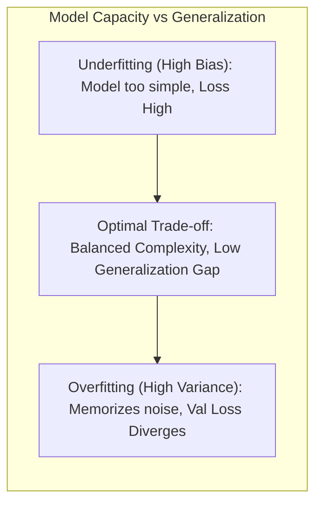
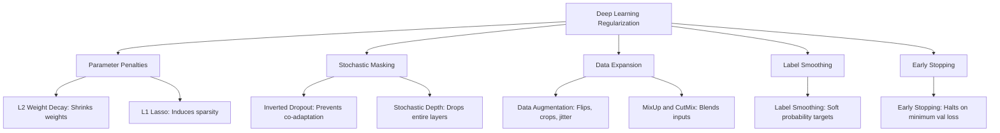

<div class="pixel-banner">
  <div class="pixel-hud-row">
    <div class="pixel-tag"><span class="pixel-indicator"></span>NEURAL_CORE // GENERALIZATION_ENGINE</div>
    <div class="pixel-meta-right">LVL_04 // REGULARIZATION_SYSTEMS</div>
  </div>
  <div class="pixel-main-content">
    <div class="pixel-avatar">🛡️</div>
    <div class="pixel-headings">
      <div class="pixel-title-badge">LEVEL 04 // GENERALIZATION & REGULARIZATION</div>
      <div class="pixel-subtitle">WEIGHT DECAY • INVERTED DROPOUT • EARLY STOPPING • LABEL SMOOTHING • LOSS DIAGNOSTICS</div>
    </div>
    <div class="pixel-sparklines">
      <div class="pixel-bar" style="--h: 80%"></div>
      <div class="pixel-bar" style="--h: 60%"></div>
      <div class="pixel-bar" style="--h: 45%"></div>
      <div class="pixel-bar" style="--h: 30%"></div>
      <div class="pixel-bar" style="--h: 22%"></div>
      <div class="pixel-bar" style="--h: 18%"></div>
    </div>
  </div>
  <div class="pixel-footer-row">
    <span class="pixel-coord">SYS_ID: #04_REGUL // DROPOUT_P: 0.20 // WEIGHT_DECAY: 1e-4 // GAP: 0.015</span>
    <span class="pixel-status-text">[ STABILIZED ]</span>
  </div>
</div>

# Level 4: Generalization & Regularization

<div class="notion-callout">
  <div class="notion-callout-icon">💡</div>
  <div class="notion-callout-content">
    A model that merely memorizes training data fails in production. <strong>Generalization</strong> is the mathematical property enabling a neural network to perform accurately on novel, out-of-distribution inputs. Regularization techniques constrain parameter complexity, prevent co-adaptation, and calibrate predictive confidence.
  </div>
</div>

<div class="notion-card-meta" style="margin-bottom: 2rem;">
  <span class="notion-tag notion-tag-purple">Level 4</span>
  <span class="notion-tag notion-tag-blue">Complexity Control</span>
  <span class="notion-tag notion-tag-green">Empirical Diagnostics</span>
</div>

---

## 13. The Mechanics of Overfitting & Underfitting



### The Generalization Gap
The core metric monitored across training epochs is the **Generalization Gap** $\Delta_{\text{gen}}$:

$$\Delta_{\text{gen}} = \mathcal{L}_{\text{validation}} - \mathcal{L}_{\text{training}}$$

* **Regime 1: Healthy Convergence ($\Delta_{\text{gen}} \approx 0$):** Both training and validation losses decrease synchronously.
* **Regime 2: Underfitting:** Training loss plateaus at an unacceptably high error floor early in training. Caused by insufficient model capacity, overly aggressive regularization, or a dead learning rate.
* **Regime 3: Overfitting ($\Delta_{\text{gen}} \gg 0$):** Training loss monotonically decays toward zero while validation loss halts and sharply curves upward. The model has shifted from learning universal latent manifolds to memorizing sample-specific noise.

---

## 14. Deep Regularization Techniques



### 1. L2 Regularization & Weight Decay
Penalizes the squared Euclidean norm of parameter tensors, discouraging individual weights from exploding:

$$\mathcal{L}_{\text{total}}(\mathbf{w}) = \mathcal{L}_{\text{task}}(\mathbf{w}) + \frac{1}{2} \lambda \|\mathbf{w}\|_2^2 = \mathcal{L}_{\text{task}}(\mathbf{w}) + \frac{1}{2} \lambda \sum_{j} w_j^2$$

During gradient descent, the parameter update includes an intrinsic shrinkage factor $(1 - \eta \lambda)$:

$$\mathbf{w}_{t+1} = \mathbf{w}_t - \eta \left( \nabla \mathcal{L} + \lambda \mathbf{w}_t \right) = (1 - \eta \lambda)\mathbf{w}_t - \eta \nabla \mathcal{L}$$

* **Geometric Intuition:** Constrains the parameters inside a hypersphere, suppressing high-frequency oscillations and preventing the network from assigning excessive sensitivity to any single input feature.

### 2. Inverted Dropout (Srivastava et al., 2014)
During each training forward pass, each hidden neuron activation is independently zeroed out with probability $p \in (0, 1)$ according to a Bernoulli random variable:

$$m_j \sim \text{Bernoulli}(1 - p)$$

$$\tilde{a}_j = \frac{m_j \cdot a_j}{1 - p}$$

#### Why "Inverted" Dropout is Crucial:
If we simply zeroed out activations by $m_j \cdot a_j$ during training, the expected sum of activations arriving at the subsequent layer would drop to $(1 - p) \mathbb{E}[a]$. At inference time (when dropout is disabled), the subsequent layer would receive signals that are $\frac{1}{1-p}$ times larger than what it was trained on.

**Inverted Dropout** scales active units by $\frac{1}{1 - p}$ *during the training phase*. Consequently, the expected activation magnitude is perfectly preserved:

$$\mathbb{E}[\tilde{a}] = \frac{(1 - p) a}{1 - p} = a$$

At inference time (`model.eval()`), the dropout layer becomes a zero-overhead identity operation $\tilde{a} = a$, requiring **zero post-scaling or arithmetic modification**.

### 3. Early Stopping
Monitors validation loss at the end of each epoch. If validation loss fails to improve by at least $\delta_{\min}$ across a designated `patience` window of $K$ consecutive epochs, training terminates and the model state is reverted to the historical checkpoint with the minimum validation loss.

```python
class EarlyStopping:
    def __init__(self, patience: int = 7, min_delta: float = 1e-4):
        self.patience = patience
        self.min_delta = min_delta
        self.counter = 0
        self.best_loss = float('inf')
        self.early_stop = False

    def __call__(self, val_loss: float) -> bool:
        if val_loss < (self.best_loss - self.min_delta):
            self.best_loss = val_loss
            self.counter = 0
        else:
            self.counter += 1
            if self.counter >= self.patience:
                self.early_stop = True
        return self.early_stop
```

### 4. Label Smoothing
Standard cross-entropy uses "hard" one-hot targets ($\mathbf{y} = [0, 1, 0]$), which forces the model to produce infinite pre-softmax logits ($z_c \rightarrow \infty$) to achieve zero loss:

$$\text{Softmax}(\mathbf{z})_c = 1.0 \iff z_c - z_{j \ne c} \rightarrow \infty$$

This encourages overconfidence and brittle representations. **Label Smoothing (Szegedy et al., 2016)** blends the one-hot target with a uniform distribution across $K$ classes:

$$y_k^{\text{smooth}} = (1 - \alpha) y_k + \frac{\alpha}{K} \quad (\text{typically } \alpha = 0.1)$$

For a 3-class problem with $\alpha = 0.1$, the target $[0, 1, 0]$ transforms into $[0.033, 0.933, 0.033]$. This bounds logit magnitudes and improves calibration in classification networks.

---

## 15. Training Diagnostics & Learning Rate Behavior

```
1. Divergent (LR Too High)          2. Stagnant (LR Too Low)          3. Optimal Descent
Loss                              Loss                              Loss
 │                                 │                                 │
 │  ╱╲   ╱╲  (NaN)                 │───-                             │╲
 │ ╱  ╲ ╱  ╲                       │   └───-                         │ ╲
 │╱    V                           │        └───- (Plateau)          │  └───- (Smooth Convex)
 └───────────────── Epoch          └───────────────── Epoch          └───────────────── Epoch
```

### Interpreting Diagnostic Loss Curves

| Empirical Curve Pattern | Root Cause | Engineering Remedy |
| :--- | :--- | :--- |
| **Train Loss jumps to `NaN` / `Inf`** | Exploding gradients; learning rate $\eta$ too high. | Reduce learning rate by $10\times$; apply `torch.nn.utils.clip_grad_norm_`. |
| **Train Loss plateaus early at high error** | Model underfitting; learning rate too low; dead ReLUs. | Increase capacity (more layers/channels); switch to GELU/LeakyReLU; raise $\eta$. |
| **Train Loss decreases, Val Loss explodes** | Classic overfitting; generalization gap widening. | Add Weight Decay (AdamW); add Dropout ($p=0.2$); introduce Data Augmentation. |
| **Val Loss lower than Train Loss** | Regularization active during train but off during val; val set too easy. | Expected when using heavy Dropout / Data Augmentation, as training is deliberately harder. |

---

### Python Implementation: Complete Regularized Module

```python
import torch
import torch.nn as nn

class RegularizedVisionClassifier(nn.Module):
    """
    Demonstrates Inverted Dropout, Weight Decay integration,
    and Label Smoothing Cross-Entropy.
    """
    def __init__(self, in_features: int = 512, num_classes: int = 10, dropout_p: float = 0.3):
        super().__init__()
        self.classifier = nn.Sequential(
            nn.Linear(in_features, 256),
            nn.BatchNorm1d(256),
            nn.ReLU(inplace=True),
            nn.Dropout(p=dropout_p), # Inverted dropout
            nn.Linear(256, 128),
            nn.BatchNorm1d(128),
            nn.ReLU(inplace=True),
            nn.Dropout(p=dropout_p),
            nn.Linear(128, num_classes)
        )

    def forward(self, x: torch.Tensor) -> torch.Tensor:
        return self.classifier(x)

if __name__ == "__main__":
    # Test batch of 16 feature vectors, 10 output classes
    features = torch.randn(16, 512)
    labels = torch.randint(0, 10, (16,))

    model = RegularizedVisionClassifier()
    
    # 1. Label Smoothing Cross-Entropy Loss
    criterion = nn.CrossEntropyLoss(label_smoothing=0.1)
    
    # 2. Decoupled AdamW Weight Decay
    optimizer = torch.optim.AdamW(model.parameters(), lr=1e-3, weight_decay=1e-3)
    
    # Training step
    model.train()
    optimizer.zero_grad()
    logits = model(features)
    loss = criterion(logits, labels)
    loss.backward()
    optimizer.step()
    
    print(f"Regularized Training Loss: {loss.item():.4f}")
    
    # Validation step (Dropout deactivated automatically)
    model.eval()
    with torch.no_grad():
        val_logits = model(features)
    print(f"Validation Logits Shape: {val_logits.shape}")
```
