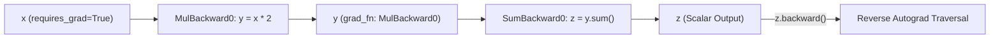
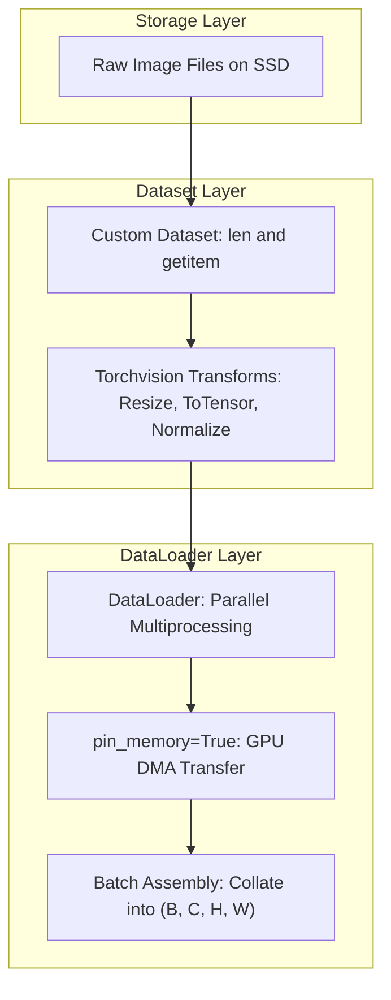

<div class="pixel-banner">
  <div class="pixel-hud-row">
    <div class="pixel-tag"><span class="pixel-indicator"></span>NEURAL_CORE // PYTORCH_FRAMEWORK</div>
    <div class="pixel-meta-right">LVL_05 // AUTOGRAD_ENGINE</div>
  </div>
  <div class="pixel-main-content">
    <div class="pixel-avatar">🔥</div>
    <div class="pixel-headings">
      <div class="pixel-title-badge">LEVEL 05 // PYTORCH CORE SYSTEMS</div>
      <div class="pixel-subtitle">TENSOR MEMORY • DYNAMIC AUTOGRAD • NN.MODULE • CUSTOM DATALOADERS • STATE_DICT</div>
    </div>
    <div class="pixel-sparklines">
      <div class="pixel-bar" style="--h: 50%"></div>
      <div class="pixel-bar" style="--h: 75%"></div>
      <div class="pixel-bar" style="--h: 90%"></div>
      <div class="pixel-bar" style="--h: 80%"></div>
      <div class="pixel-bar" style="--h: 95%"></div>
      <div class="pixel-bar" style="--h: 100%"></div>
    </div>
  </div>
  <div class="pixel-footer-row">
    <span class="pixel-coord">SYS_ID: #05_PYTORCH // ACCELERATOR: CUDA // PIN_MEMORY: TRUE</span>
    <span class="pixel-status-text">[ GPU_READY ]</span>
  </div>
</div>

# Level 5: PyTorch Core

<div class="notion-callout">
  <div class="notion-callout-icon">💡</div>
  <div class="notion-callout-content">
    <strong>PyTorch</strong> is the preeminent deep learning research and deployment framework. Its success stems from two core pillars: (1) a multi-dimensional <strong>Tensor</strong> engine that maps directly to GPU hardware acceleration via CUDA, and (2) an eager-mode <strong>Autograd</strong> tape-based differentiation system that records operations dynamically as Python executes.
  </div>
</div>

<div class="notion-card-meta" style="margin-bottom: 2rem;">
  <span class="notion-tag notion-tag-purple">Level 5</span>
  <span class="notion-tag notion-tag-blue">PyTorch Internals</span>
  <span class="notion-tag notion-tag-green">GPU Acceleration</span>
</div>

---

## 16. PyTorch Fundamentals: Tensors & Memory Layout

A `torch.Tensor` is a view over a contiguous chunk of physical memory called a **`Storage`** instance. A tensor is characterized by its **Shape**, **Stride**, and **Data Type (dtype)**.

```
Logical 2D Tensor (Shape: [3, 4]):
[[0,  1,  2,  3],
 [4,  5,  6,  7],
 [8,  9, 10, 11]]

Physical 1D Memory Storage (Contiguous C-Order):
[0, 1, 2, 3, 4, 5, 6, 7, 8, 9, 10, 11]
Stride: (4, 1) -> Moving down 1 row jumps 4 memory elements; moving right 1 col jumps 1.
```

### Stride & Contiguity
Operations like `.transpose()` or `.permute()` do not copy data in memory; they merely return a new tensor view with altered **strides**. Calling `.view()` on a non-contiguous tensor raises a runtime error—it must first be made contiguous in memory via `.contiguous()`, or replaced with `.reshape()`, which creates a contiguous memory copy automatically if required.

### Hardware Device Management: Host-to-Device Transfer
```python
# Establishing hardware acceleration safely
device = torch.device("cuda" if torch.cuda.is_available() else "mps" if torch.backends.mps.is_available() else "cpu")

# Non-blocking transfer utilizing page-locked (pinned) host memory
tensor_gpu = tensor_cpu.to(device, non_blocking=True)
```

---

## 17. Autograd: Dynamic Reverse-Mode Differentiation

PyTorch autograd constructs a directed acyclic graph (DAG) of `Node` (function) objects during the forward pass. Every tensor with `requires_grad=True` maintains a `.grad_fn` attribute referencing the mathematical operator that generated it.



### Disabling Autograd for Inference: `no_grad` vs `inference_mode`
During validation and inference, tracking gradient history is wasteful:
* `torch.no_grad()`: Disables gradient recording, reducing memory consumption.
* `torch.inference_mode()`: **Recommended for production**. Goes further than `no_grad` by completely disabling version tracking and view tracking metadata, yielding maximum throughput and minimum latency.

---

## 18. Neural Network API: `nn.Module` & Sequential Models

The base class for all neural models is `nn.Module`. It provides automatic parameter tracking, recursive device allocation (`.to(device)`), and state dict serialization.

```python
import torch
import torch.nn as nn

class CustomVisionBackbone(nn.Module):
    """
    Modular neural network class with custom forward routing.
    """
    def __init__(self, in_channels: int = 3, num_classes: int = 10):
        super().__init__()
        self.features = nn.Sequential(
            nn.Conv2d(in_channels, 32, kernel_size=3, padding=1),
            nn.BatchNorm2d(32),
            nn.ReLU(inplace=True),
            nn.MaxPool2d(kernel_size=2, stride=2)
        )
        self.classifier = nn.Sequential(
            nn.AdaptiveAvgPool2d((1, 1)),
            nn.Flatten(),
            nn.Linear(32, num_classes)
        )

    def forward(self, x: torch.Tensor) -> torch.Tensor:
        x = self.features(x)
        logits = self.classifier(x)
        return logits
```

---

## 19. Dataset & DataLoader Architecture

Modern deep learning isolates data extraction (`Dataset`) from mini-batch assembly and parallelization (`DataLoader`).



### Custom Vision Dataset Implementation
```python
from torch.utils.data import Dataset, DataLoader
from PIL import Image

class DirectoryImageDataset(Dataset):
    def __init__(self, image_paths: list[str], labels: list[int], transform=None):
        self.image_paths = image_paths
        self.labels = labels
        self.transform = transform

    def __len__(self) -> int:
        return len(self.image_paths)

    def __getitem__(self, idx: int) -> tuple[torch.Tensor, int]:
        # Lazy loading prevents out-of-memory errors on large datasets
        image = Image.open(self.image_paths[idx]).convert("RGB")
        label = self.labels[idx]

        if self.transform is not None:
            image = self.transform(image)

        return image, label
```

---

## 20. End-to-End PyTorch Training Engine

```python
import torch
import torch.nn as nn
from torch.utils.data import DataLoader

def train_epoch(
    model: nn.Module, 
    loader: DataLoader, 
    criterion: nn.Module, 
    optimizer: torch.optim.Optimizer, 
    device: torch.device
) -> tuple[float, float]:
    model.train() # Enable Dropout and BatchNorm training statistics
    running_loss = 0.0
    correct = 0
    total = 0

    for inputs, targets in loader:
        inputs = inputs.to(device, non_blocking=True)
        targets = targets.to(device, non_blocking=True)

        optimizer.zero_grad(set_to_none=True) # More efficient than zeroing tensors
        outputs = model(inputs)
        loss = criterion(outputs, targets)
        loss.backward()
        optimizer.step()

        running_loss += loss.item() * inputs.size(0)
        _, preds = outputs.max(1)
        correct += preds.eq(targets).sum().item()
        total += targets.size(0)

    return running_loss / total, correct / total

def validate(
    model: nn.Module, 
    loader: DataLoader, 
    criterion: nn.Module, 
    device: torch.device
) -> tuple[float, float]:
    model.eval() # Freeze BatchNorm running stats and disable Dropout
    running_loss = 0.0
    correct = 0
    total = 0

    with torch.inference_mode(): # Maximum throughput for evaluation
        for inputs, targets in loader:
            inputs = inputs.to(device, non_blocking=True)
            targets = targets.to(device, non_blocking=True)

            outputs = model(inputs)
            loss = criterion(outputs, targets)

            running_loss += loss.item() * inputs.size(0)
            _, preds = outputs.max(1)
            correct += preds.eq(targets).sum().item()
            total += targets.size(0)

    return running_loss / total, correct / total
```

---

## 21. Model Management & Checkpointing

A model's `state_dict` is an `OrderedDict` mapping parameter and persistent buffer names to their underlying PyTorch tensor data.

### Robust Checkpointing Routine
```python
def save_model_checkpoint(model: nn.Module, optimizer: torch.optim.Optimizer, epoch: int, filepath: str):
    checkpoint = {
        'epoch': epoch,
        'model_state': model.state_dict(),
        'optimizer_state': optimizer.state_dict(),
    }
    torch.save(checkpoint, filepath)

def load_model_checkpoint(filepath: str, model: nn.Module, optimizer: torch.optim.Optimizer = None) -> int:
    checkpoint = torch.load(filepath, map_location='cpu')
    model.load_state_dict(checkpoint['model_state'])
    if optimizer is not None:
        optimizer.load_state_dict(checkpoint['optimizer_state'])
    return checkpoint['epoch']
```
