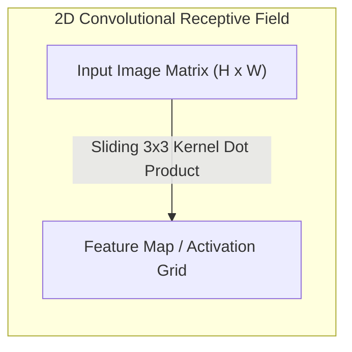
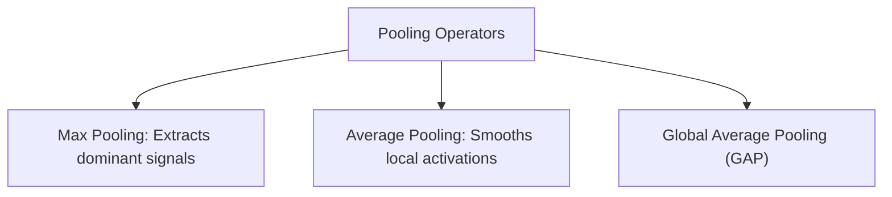

<div class="pixel-banner">
  <div class="pixel-hud-row">
    <div class="pixel-tag"><span class="pixel-indicator"></span>NEURAL_CORE // VISION_CONV_ENGINE</div>
    <div class="pixel-meta-right">LVL_06 // SPATIAL_CONVOLUTIONS</div>
  </div>
  <div class="pixel-main-content">
    <div class="pixel-avatar">🖼️</div>
    <div class="pixel-headings">
      <div class="pixel-title-badge">LEVEL 06 // CONVOLUTIONAL NEURAL NETWORKS</div>
      <div class="pixel-subtitle">FEATURE MAPS • STRIDE/PADDING MATH • RECEPTIVE FIELDS • VGG • RESNET • MOBILENET</div>
    </div>
    <div class="pixel-sparklines">
      <div class="pixel-bar" style="--h: 40%"></div>
      <div class="pixel-bar" style="--h: 65%"></div>
      <div class="pixel-bar" style="--h: 85%"></div>
      <div class="pixel-bar" style="--h: 70%"></div>
      <div class="pixel-bar" style="--h: 95%"></div>
      <div class="pixel-bar" style="--h: 100%"></div>
    </div>
  </div>
  <div class="pixel-footer-row">
    <span class="pixel-coord">SYS_ID: #06_CNN // KERNEL: 3x3 // STRIDE: 1 // PADDING: SAME</span>
    <span class="pixel-status-text">[ CONV_ACTIVE ]</span>
  </div>
</div>

# Level 6: Convolutional Neural Networks (CNNs)

<div class="notion-callout">
  <div class="notion-callout-icon">💡</div>
  <div class="notion-callout-content">
    Fully connected networks fail on high-resolution images due to catastrophic parameter explosion and a complete disregard for 2D spatial geometry. <strong>Convolutional Neural Networks (CNNs)</strong> enforce two fundamental inductive biases: <strong>Spatial Locality</strong> (correlations are clustered in local neighborhoods) and <strong>Translation Equivariance</strong> (a feature detector useful in the top-left is equally useful in the bottom-right).
  </div>
</div>

<div class="notion-card-meta" style="margin-bottom: 2rem;">
  <span class="notion-tag notion-tag-purple">Level 6</span>
  <span class="notion-tag notion-tag-blue">Spatial Processing</span>
  <span class="notion-tag notion-tag-green">Vision Architecture History</span>
</div>

---

## 22. CNN Fundamentals

### Why MLPs Collapse on Images: The Parameter Explosion
Consider a modest modern image of size $224 \times 224 \times 3 = 150,528$ values. 

Connecting this image to a single hidden layer with just $1,024$ neurons requires:

$$\text{Weights} = 150,528 \times 1,024 \approx \mathbf{154.1\text{ Million Parameters}}$$

For a single layer! The network would immediately overfit, exhaust GPU VRAM, and destroy the 2D grid structure by flattening spatial relationships into a 1D vector.

### The 2D Convolution Operation
In deep learning, the "convolution" operation is technically **discrete cross-correlation**: a small parameterized kernel $\mathbf{K} \in \mathbb{R}^{K_h \times K_w \times C_{in}}$ slides across an input feature map $\mathbf{X} \in \mathbb{R}^{H \times W \times C_{in}}$, computing local dot products:

$$(\mathbf{X} * \mathbf{K})_{i,j} = \sum_{c=1}^{C_{in}} \sum_{m=-k}^{k} \sum_{n=-k}^{k} \mathbf{X}_{i+m, j+n, c} \cdot \mathbf{K}_{m, n, c} + b$$



### Stride, Padding & Output Spatial Dimensions
The spatial dimensions of the output feature map $(H_{out}, W_{out})$ are governed by four discrete variables:
* **Input Dimension ($W_{in}$)**
* **Kernel Size ($K$)**
* **Padding ($P$):** Zero-pixels appended around the border.
  * *Valid Padding ($P=0$):* No padding; spatial size decreases monotonically.
  * *Same Padding ($P = \frac{K - 1}{2}$):* Output dimensions match input dimensions (when stride $S=1$).
* **Stride ($S$):** The step size of the sliding kernel across spatial axes.

$$\mathbf{W_{out} = \left\lfloor \frac{W_{in} - K + 2P}{S} \right\rfloor + 1}$$

### Receptive Field Dynamics
The **Effective Receptive Field (ERF)** of a neuron in layer $l$ is the spatial region in the raw input image that can mathematically influence that neuron's activation:

$$\text{RF}_l = \text{RF}_{l-1} + (K_l - 1) \cdot J_{l-1}$$

Where $J_{l-1} = \prod_{i=1}^{l-1} S_i$ represents the cumulative striding factor. As depth increases, the receptive field expands, allowing deep layers to capture global semantic context while early layers focus on fine edges.

---

## 23. Spatial Pooling Strategies

Pooling layers downsample feature maps, reducing spatial resolution, decreasing computational complexity, and providing spatial translation invariance.



### Max Pooling vs Global Average Pooling (GAP)
* **Max Pooling (`nn.MaxPool2d(2, 2)`):** Selects $\max$ across each $2 \times 2$ window. Halves spatial resolution while preserving strong edge responses. Has zero learnable parameters.
* **Global Average Pooling (`nn.AdaptiveAvgPool2d((1, 1))`):** Introduced in *Network in Network (Lin et al., 2013)*. Collapses spatial dimensions $(B, C, H, W) \rightarrow (B, C, 1, 1)$. Replaces traditional dense flatten layers, cutting millions of parameters and drastically reducing overfitting before classification heads.

---

## 24. Standard CNN Architectural Pattern

Modern vision backbones adhere to an overarching structural principle:

$$\text{Resolution Halves } (H, W \downarrow) \iff \text{Channel Capacity Doubles } (C \uparrow)$$

```
Input: [3, 224, 224]
  │
  ▼ ConvBlock 1: [64, 112, 112]  ─── Receptive Field: 3×3  (Edges & Gradients)
  │
  ▼ ConvBlock 2: [128, 56, 56]   ─── Receptive Field: 7×7  (Textures & Corners)
  │
  ▼ ConvBlock 3: [256, 28, 28]   ─── Receptive Field: 15×15 (Parts & Motifs)
  │
  ▼ ConvBlock 4: [512, 14, 14]   ─── Receptive Field: 31×31 (Semantic Objects)
  │
  ▼ Global Average Pooling: [512, 1, 1]
  │
  ▼ Linear Classifier: [Num_Classes]
```

---

## 25. The Evolution of Classic Vision Architectures


### 1. LeNet-5 (LeCun et al., 1998)
Pioneered the alternating Conv $\rightarrow$ AveragePool $\rightarrow$ Conv $\rightarrow$ Dense pipeline for USPS/MNIST digit recognition.

### 2. AlexNet (Krizhevsky et al., 2012)
Won the ImageNet Large Scale Visual Recognition Challenge (ILSVRC) by a massive 10.8% margin, initiating the modern Deep Learning revolution. First architecture to deploy **ReLU** (defeating vanishing gradients), **Dropout** ($p=0.5$), and split training across two NVIDIA GTX 580 GPUs.

### 3. VGG (Simonyan & Zisserman, 2014)
* **The $3 \times 3$ Factorization Principle:** Proved that stacking two $3 \times 3$ convolutions has an effective receptive field of a single $5 \times 5$ convolution, but requires significantly fewer parameters:
  $$\text{Two } 3 \times 3 \text{ layers:} \quad 2 \times (3^2 \cdot C^2) = \mathbf{18 C^2}$$
  $$\text{One } 5 \times 5 \text{ layer:} \quad 1 \times (5^2 \cdot C^2) = \mathbf{25 C^2}$$
  This yields a **28% parameter reduction** while introducing an extra non-linear activation layer.

### 4. ResNet (He et al., 2015)
* **The Degradation Problem:** Prior to ResNet, training deeper networks ($>20$ layers) caused training error to increase—not from overfitting, but because vanishing/exploding gradients made optimization intractable.
* **Residual Learning & Identity Shortcuts:**
  $$\mathbf{y} = \mathcal{F}(\mathbf{x}, \{W_i\}) + \mathbf{x}$$
  Instead of forcing stacked layers to fit an underlying mapping $\mathcal{H}(\mathbf{x})$, ResNet forces them to fit a **residual mapping** $\mathcal{F}(\mathbf{x}) = \mathcal{H}(\mathbf{x}) - \mathbf{x}$. If a layer is redundant, gradient descent can easily drive its weights toward zero ($\mathcal{F}(\mathbf{x}) \rightarrow 0$), leaving the identity mapping $\mathbf{y} = \mathbf{x}$. This enabled training networks with **152+ layers**.

### 5. MobileNet (Howard et al., 2017)
* **Depthwise Separable Convolutions:** Splits standard convolution into:
  1. *Depthwise Conv:* One $3 \times 3$ spatial kernel per input channel ($C_{in}$ operations).
  2. *Pointwise Conv:* A $1 \times 1$ convolution combining channel activations across depth.
  $$\text{Computational Cost Ratio} = \frac{K \cdot K \cdot C_{in} \cdot H \cdot W + C_{in} \cdot C_{out} \cdot H \cdot W}{K \cdot K \cdot C_{in} \cdot C_{out} \cdot H \cdot W} = \frac{1}{C_{out}} + \frac{1}{K^2} \approx \frac{1}{9}$$
  Achieves an **$8\times$ to $9\times$ reduction in computational operations (FLOPs)** with minimal accuracy loss, making modern computer vision feasible on smartphones and edge devices.

---

### Python Implementation: Complete Modular CNN Classifier

```python
import torch
import torch.nn as nn

class ConvBlock(nn.Module):
    def __init__(self, in_c: int, out_c: int):
        super().__init__()
        self.block = nn.Sequential(
            nn.Conv2d(in_c, out_c, kernel_size=3, padding=1, bias=False),
            nn.BatchNorm2d(out_c),
            nn.ReLU(inplace=True),
            nn.MaxPool2d(kernel_size=2, stride=2)
        )

    def forward(self, x: torch.Tensor) -> torch.Tensor:
        return self.block(x)

class ModernVisionClassifier(nn.Module):
    def __init__(self, num_classes: int = 1000):
        super().__init__()
        self.stage1 = ConvBlock(3, 64)    # [B, 64, 112, 112]
        self.stage2 = ConvBlock(64, 128)  # [B, 128, 56, 56]
        self.stage3 = ConvBlock(128, 256) # [B, 256, 28, 28]
        self.stage4 = ConvBlock(256, 512) # [B, 512, 14, 14]
        
        self.gap = nn.AdaptiveAvgPool2d((1, 1)) # [B, 512, 1, 1]
        self.head = nn.Linear(512, num_classes)

    def forward(self, x: torch.Tensor) -> torch.Tensor:
        x = self.stage1(x)
        x = self.stage2(x)
        x = self.stage3(x)
        x = self.stage4(x)
        x = self.gap(x)
        x = torch.flatten(x, 1)
        return self.head(x)

if __name__ == "__main__":
    # Test batch of 2 RGB images (Batch=2, Channels=3, Height=224, Width=224)
    images = torch.randn(2, 3, 224, 224)
    model = ModernVisionClassifier(num_classes=10)
    logits = model(images)
    print(f"Input Tensor Shape:  {images.shape}")
    print(f"Output Logits Shape: {logits.shape}")
```
