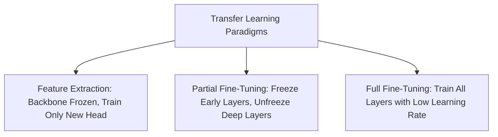
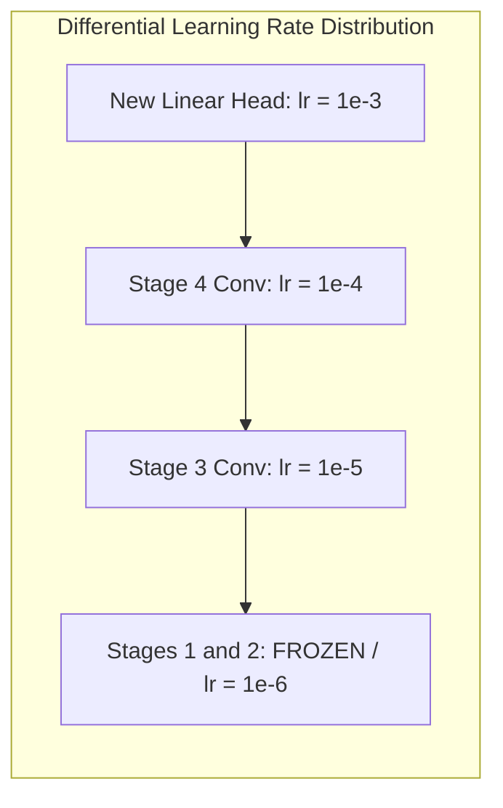

<div class="pixel-banner">
  <div class="pixel-hud-row">
    <div class="pixel-tag"><span class="pixel-indicator"></span>NEURAL_CORE // TRANSFER_ENGINE</div>
    <div class="pixel-meta-right">LVL_07 // DOMAIN_ADAPTATION</div>
  </div>
  <div class="pixel-main-content">
    <div class="pixel-avatar">🔄</div>
    <div class="pixel-headings">
      <div class="pixel-title-badge">LEVEL 07 // TRANSFER LEARNING & FINE-TUNING</div>
      <div class="pixel-subtitle">PRETRAINED BACKBONES • LAYER FREEZING • DIFFERENTIAL LEARNING RATES • DOMAIN MATRICES</div>
    </div>
    <div class="pixel-sparklines">
      <div class="pixel-bar" style="--h: 60%"></div>
      <div class="pixel-bar" style="--h: 80%"></div>
      <div class="pixel-bar" style="--h: 70%"></div>
      <div class="pixel-bar" style="--h: 90%"></div>
      <div class="pixel-bar" style="--h: 85%"></div>
      <div class="pixel-bar" style="--h: 100%"></div>
    </div>
  </div>
  <div class="pixel-footer-row">
    <span class="pixel-coord">SYS_ID: #07_TRANSFER // PRETRAINED: IMAGENET_1K // HEAD_LR: 1e-3 // BACKBONE_LR: 1e-5</span>
    <span class="pixel-status-text">[ ADAPTED ]</span>
  </div>
</div>

# Level 7: Transfer Learning

<div class="notion-callout">
  <div class="notion-callout-icon">💡</div>
  <div class="notion-callout-content">
    Training modern vision architectures from scratch requires millions of annotated images and weeks of GPU compute. <strong>Transfer Learning</strong> leverages generic representations (Gabor edges, textures, object motifs) learned from massive datasets like ImageNet, repurposing them for specialized downstream tasks with fraction of the data and compute.
  </div>
</div>

<div class="notion-card-meta" style="margin-bottom: 2rem;">
  <span class="notion-tag notion-tag-purple">Level 7</span>
  <span class="notion-tag notion-tag-blue">Representation Reuse</span>
  <span class="notion-tag notion-tag-green">Domain Adaptation</span>
</div>

---

## 26. Transfer Learning Paradigms



### 1. Feature Extraction vs Fine-Tuning
* **Feature Extraction:** The pretrained backbone is treated as an immutable feature extractor. All backbone parameters are frozen (`param.requires_grad = False`), and only the newly initialized final classification head is trained.
  * *Compute:* Extremely fast; no backpropagation through the deep convolutional backbone.
  * *Risk:* Zero risk of degrading the pretrained weights ("catastrophic forgetting").
* **Fine-Tuning:** The weights of the pretrained backbone are unfrozen and updated alongside the new classification head using a **significantly smaller learning rate** (typically $10\times$ to $100\times$ smaller than the head).

---

## 27. The Transfer Learning Decision Matrix

The optimal transfer strategy is dictated by two axes: **Target Dataset Size** and **Target Domain Similarity** to the pretraining source:

```
                      HIGH DOMAIN SIMILARITY
                               ▲
                               │
            Strategy 1:        │        Strategy 2:
      Feature Extraction       │    Full / Deep Fine-Tuning
      (Avoid Overfitting)      │     (Slight Weight Drift)
                               │
 SMALL DATASET ────────────────┼──────────────── LARGE DATASET
                               │
            Strategy 3:        │        Strategy 4:
     Extract from Mid-Layers   │     Train from Scratch /
      or Low-Rank Adapt        │      Full Fine-Tuning
                               │
                               ▼
                      LOW DOMAIN SIMILARITY
```

| Quadrant | Dataset Conditions | Recommended Engineering Strategy |
| :--- | :--- | :--- |
| **Small Size, High Similarity** | 500 images of dog breeds | **Freeze Backbone; Train Head Only.** Insufficient data to update 25M backbone weights without severe overfitting. ImageNet already contains rich canine features. |
| **Large Size, High Similarity** | 200,000 images of vehicles | **Fine-Tune All Layers.** Large dataset allows adjusting high-level representations to specific vehicle classes without overfitting. |
| **Small Size, Low Similarity** | 800 CT scan medical images | **Extract from Early/Mid Layers.** High-level ImageNet features (dog ears, cars) are useless for medical imaging, but low-level edges and textures remain useful. Use strong regularization. |
| **Large Size, Low Similarity** | 1,000,000 satellite tiles | **Full Fine-Tuning or Train from Scratch.** Sufficient data volume to adapt all filters to aerial perspectives. |

---

### Progressive Layer Unfreezing & Differential Learning Rates

When fine-tuning, applying a single global learning rate is disastrous: updating early layers with a large learning rate destroys universal edge filters, while updating the uninitialized head with a small learning rate causes painfully slow convergence.

**Differential (Discriminative) Learning Rates** assign progressively smaller learning rates to earlier layers:

$$\eta_{\text{early}} \approx 10^{-6} \ll \eta_{\text{mid}} \approx 10^{-5} \ll \eta_{\text{deep}} \approx 10^{-4} \ll \eta_{\text{head}} \approx 10^{-3}$$



---

### Python Implementation: Production Transfer Learning with ResNet-50

```python
import torch
import torch.nn as nn
import torchvision.models as models

def build_transfer_model(num_target_classes: int = 5, freeze_backbone: bool = True) -> nn.Module:
    # 1. Load Pretrained ResNet-50 from Torchvision
    weights = models.ResNet50_Weights.DEFAULT
    model = models.resnet50(weights=weights)

    # 2. Freeze Backbone Parameters if requested
    if freeze_backbone:
        for param in model.parameters():
            param.requires_grad = False

    # 3. Replace Original 1000-class Head with Custom Classifier
    in_features = model.fc.in_features
    model.fc = nn.Sequential(
        nn.Linear(in_features, 256),
        nn.BatchNorm1d(256),
        nn.ReLU(inplace=True),
        nn.Dropout(p=0.3),
        nn.Linear(256, num_target_classes)
    )
    return model

def create_differential_optimizer(model: nn.Module) -> torch.optim.Optimizer:
    # Separate parameters into distinct learning rate groups
    backbone_params = []
    head_params = []

    for name, param in model.named_parameters():
        if "fc" in name:
            head_params.append(param)
        else:
            if param.requires_grad:
                backbone_params.append(param)

    optimizer = torch.optim.AdamW([
        {'params': backbone_params, 'lr': 1e-5}, # Low learning rate for backbone
        {'params': head_params,     'lr': 1e-3}  # Aggressive rate for new head
    ], weight_decay=1e-4)
    return optimizer

if __name__ == "__main__":
    # Initialize model for 5 custom classes
    transfer_net = build_transfer_model(num_target_classes=5, freeze_backbone=False)
    
    # Freeze only stages 1 and 2, allow fine-tuning on stages 3, 4, and head
    for name, child in transfer_net.named_children():
        if name in ['conv1', 'bn1', 'layer1', 'layer2']:
            for param in child.parameters():
                param.requires_grad = False

    opt = create_differential_optimizer(transfer_net)
    print("Transfer Learning Model assembled with Differential Learning Rates.")
    
    # Test forward pass with dummy batch
    dummy_input = torch.randn(4, 3, 224, 224)
    logits = transfer_net(dummy_input)
    print(f"Output Predictions Shape: {logits.shape}")
```
