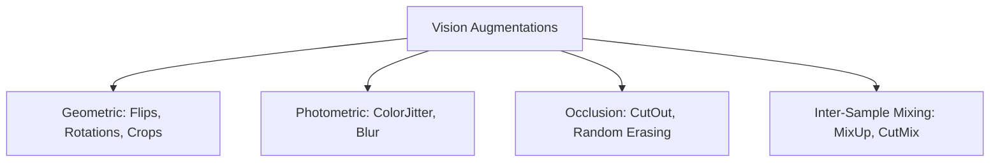

<div class="pixel-banner">
  <div class="pixel-hud-row">
    <div class="pixel-tag"><span class="pixel-indicator"></span>NEURAL_CORE // AUGMENTATION_ENGINE</div>
    <div class="pixel-meta-right">LVL_08 // MIXED_PRECISION</div>
  </div>
  <div class="pixel-main-content">
    <div class="pixel-avatar">⚡</div>
    <div class="pixel-headings">
      <div class="pixel-title-badge">LEVEL 08 // DATA & ADVANCED TRAINING TECHNIQUES</div>
      <div class="pixel-subtitle">MIXUP • CUTMIX • GRADIENT ACCUMULATION • AUTOMATIC MIXED PRECISION (AMP) • FP16/BF16</div>
    </div>
    <div class="pixel-sparklines">
      <div class="pixel-bar" style="--h: 50%"></div>
      <div class="pixel-bar" style="--h: 75%"></div>
      <div class="pixel-bar" style="--h: 90%"></div>
      <div class="pixel-bar" style="--h: 85%"></div>
      <div class="pixel-bar" style="--h: 95%"></div>
      <div class="pixel-bar" style="--h: 100%"></div>
    </div>
  </div>
  <div class="pixel-footer-row">
    <span class="pixel-coord">SYS_ID: #08_AMP // PRECISION: TORCH_FLOAT16 // GRAD_SCALER: ACTIVE // ACCUM_STEPS: 4</span>
    <span class="pixel-status-text">[ OPTIMIZED ]</span>
  </div>
</div>

# Level 8: Data & Training Techniques

<div class="notion-callout">
  <div class="notion-callout-icon">💡</div>
  <div class="notion-callout-content">
    State-of-the-art vision models require both aggressive data regularization and hardware-optimized training execution. Modern pipelines deploy <strong>inter-sample augmentations (MixUp, CutMix)</strong> to linearize manifold decision spaces and leverage <strong>Automatic Mixed Precision (AMP)</strong> with <strong>Gradient Accumulation</strong> to achieve maximum GPU Tensor Core throughput.
  </div>
</div>

<div class="notion-card-meta" style="margin-bottom: 2rem;">
  <span class="notion-tag notion-tag-purple">Level 8</span>
  <span class="notion-tag notion-tag-blue">Data Augmentation</span>
  <span class="notion-tag notion-tag-green">Hardware Acceleration</span>
</div>

---

## 28. Advanced Data Augmentation

Data augmentation artificially expands the training manifold, encoding geometric and photometric invariances directly into the loss landscape.



### 1. Classical Single-Sample Augmentations
* **Random Resized Crop:** Crops a random region (area scale $0.08$ to $1.0$) and scales it back to target size $224 \times 224$. Teaches scale and composition invariance.
* **Random Horizontal Flip ($p=0.5$):** Reflects image across the vertical axis. Ideal for general natural objects (dogs, cars), but prohibited for oriented text (OCR) or asymmetric medical scans.
* **ColorJitter:** Randomly shifts Brightness, Contrast, Saturation, and Hue to ensure robustness against differing sensor white balances.

### 2. Random Erasing & CutOut (Zhong et al., 2020)
Randomly selects a rectangular region of area $S_e$ and replaces its pixels with random Gaussian noise or the dataset channel mean. Forces the network to use distributed cues across the entire object rather than over-relying on a single distinctive feature (e.g., forcing a dog classifier to recognize paws and body shape instead of only the snout).

### 3. MixUp: Convex Manifold Interpolation (Zhang et al., 2017)
Given two random training pairs $(\mathbf{x}_i, \mathbf{y}_i)$ and $(\mathbf{x}_j, \mathbf{y}_j)$, MixUp forms a synthetic convex combination:

$$\lambda \sim \text{Beta}(\alpha, \alpha) \quad \text{for } \alpha \in (0, 1)$$

$$\tilde{\mathbf{x}} = \lambda \mathbf{x}_i + (1 - \lambda) \mathbf{x}_j$$

$$\tilde{\mathbf{y}} = \lambda \mathbf{y}_i + (1 - \lambda) \mathbf{y}_j$$

* **Theoretical Rationale:** Standard networks behave erratically in regions between training clusters. MixUp enforces **linear behavior between training samples**, dramatically suppressing overfitting to corrupt labels and calibrating predicted probabilities.

### 4. CutMix: Regional Spatial Replacement (Yun et al., 2019)
Overcomes the perceptual ghosting of MixUp by replacing a physical rectangular patch of image $\mathbf{x}_i$ with pixels from $\mathbf{x}_j$:

```
┌──────────────┐       ┌──────────────┐       ┌──────────────┐
│   Image A    │   +   │   Image B    │   =   │   Image A    │
│    (Dog)     │       │    (Cat)     │       │  ┌────────┐  │
│              │       │              │       │  │ (Cat)  │  │
└──────────────┘       └──────────────┘       └──┴────────┴──┘
```

The target label is weighted by the bounding box area proportion:

$$\lambda = 1 - \frac{W_{\text{box}} \times H_{\text{box}}}{W \times H}$$

$$\tilde{\mathbf{y}} = \lambda \mathbf{y}_A + (1 - \lambda) \mathbf{y}_B$$

---

## 29. Dataset Preparation & Formats

### Vision Annotation Formats

| Format | Structure | Coordinate System | Primary Domain |
| :--- | :--- | :--- | :--- |
| **ImageFolder (Classification)** | `dataset/train/class_name/img_001.jpg` | N/A | Image Classification |
| **COCO (Detection/Segmentation)** | Central JSON file containing `images`, `annotations`, `categories` | Absolute pixel coordinates $[x_{\min}, y_{\min}, w, h]$ | Standard Benchmark Evaluation |
| **YOLO (Real-Time Detection)** | Individual `.txt` per image: `<class_id> <x_center> <y_center> <w> <h>` | Normalized floats $\in [0.0, 1.0]$ | Production Edge Object Detection |

---

## 30. High-Performance Training Techniques

### 1. Automatic Mixed Precision (AMP: FP16 / BF16)
Standard deep learning evaluates operations in 32-bit single-precision float (`float32`). Modern GPU Tensor Cores (NVIDIA Volta, Ampere, Ada Lovelace, Hopper) execute 16-bit half-precision floating-point arithmetic at **$3\times$ to $5\times$ higher throughput** while cutting memory bandwidth by $50\%$.

#### The Gradient Underflow Problem & GradScaler
In FP16, exponent ranges are constrained to $[-14, 15]$. Very small gradients ($< 2^{-14} \approx 6.1 \times 10^{-5}$) underflow to absolute zero.

**`torch.cuda.amp.GradScaler`** multiplies the loss by a large scale factor $S = 2^{16}$ before backpropagation, pushing gradients into the representable FP16 range. Gradients are then unscaled prior to the optimizer parameter update:

$$\mathcal{L}_{\text{scaled}} = S \cdot \mathcal{L}, \quad \nabla_{\mathbf{w}} \mathcal{L} = \frac{1}{S} \nabla_{\mathbf{w}} \mathcal{L}_{\text{scaled}}$$

```python
scaler = torch.cuda.amp.GradScaler()

for inputs, targets in loader:
    optimizer.zero_grad(set_to_none=True)
    
    # 1. Forward pass under mixed precision autocast
    with torch.autocast(device_type='cuda', dtype=torch.float16):
        outputs = model(inputs)
        loss = criterion(outputs, targets)

    # 2. Backward pass with scaled gradients
    scaler.scale(loss).backward()
    
    # 3. Unscale and update weights safely
    scaler.step(optimizer)
    scaler.update()
```

### 2. Gradient Accumulation
When training large vision architectures (e.g., ViT-Large or high-resolution YOLOv8), GPU VRAM constraints may limit the physical batch size to $B=8$. However, small batch sizes cause noisy gradients and unstable batch norm statistics.

**Gradient Accumulation** computes gradients over multiple sub-steps without updating weights, simulating an effective batch size $B_{\text{effective}} = B \times K$:

```python
effective_batch_multiplier = 4 # Simulates batch size = 8 * 4 = 32

optimizer.zero_grad(set_to_none=True)
for step, (inputs, targets) in enumerate(loader):
    with torch.autocast(device_type='cuda', dtype=torch.float16):
        outputs = model(inputs)
        loss = criterion(outputs, targets)
        loss = loss / effective_batch_multiplier # Scale loss proportionally

    scaler.scale(loss).backward()

    # Step optimizer only after accumulating K mini-batches
    if (step + 1) % effective_batch_multiplier == 0:
        scaler.step(optimizer)
        scaler.update()
        optimizer.zero_grad(set_to_none=True)
```

### 3. Gradient Norm Clipping
Prevents exploding gradients in deep networks by scaling the gradient vector whenever its $L_2$ norm exceeds a threshold $c$:

$$\mathbf{g} \leftarrow \mathbf{g} \cdot \frac{c}{\max(c, \|\mathbf{g}\|_2)}$$

```python
# Unscale gradients before clipping when using AMP
scaler.unscale_(optimizer)
torch.nn.utils.clip_grad_norm_(model.parameters(), max_norm=1.0)
```
