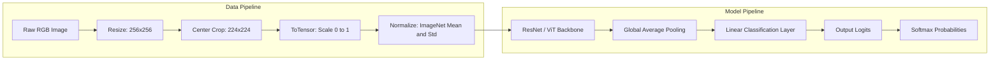

<div class="pixel-banner">
  <div class="pixel-hud-row">
    <div class="pixel-tag"><span class="pixel-indicator"></span>NEURAL_CORE // CLASSIFICATION_PIPELINE</div>
    <div class="pixel-meta-right">LVL_09 // TOP_K_EVALUATION</div>
  </div>
  <div class="pixel-main-content">
    <div class="pixel-avatar">🎯</div>
    <div class="pixel-headings">
      <div class="pixel-title-badge">LEVEL 09 // IMAGE CLASSIFICATION SYSTEMS</div>
      <div class="pixel-subtitle">IMAGENET NORMALIZATION • TOP-1/TOP-5 METRICS • CONFUSION MATRICES • CLASS-WEIGHTED LOSS</div>
    </div>
    <div class="pixel-sparklines">
      <div class="pixel-bar" style="--h: 65%"></div>
      <div class="pixel-bar" style="--h: 80%"></div>
      <div class="pixel-bar" style="--h: 88%"></div>
      <div class="pixel-bar" style="--h: 92%"></div>
      <div class="pixel-bar" style="--h: 96%"></div>
      <div class="pixel-bar" style="--h: 99%"></div>
    </div>
  </div>
  <div class="pixel-footer-row">
    <span class="pixel-coord">SYS_ID: #09_IMG_CLF // TOP1_ACC: 82.4% // TOP5_ACC: 96.1% // LOSS: BALANCED</span>
    <span class="pixel-status-text">[ PRODUCTION_READY ]</span>
  </div>
</div>

# Level 9: Image Classification

<div class="notion-callout">
  <div class="notion-callout-icon">💡</div>
  <div class="notion-callout-content">
    Image classification is the foundational benchmark of computer vision. A production classification pipeline encompasses standardized data normalization, robust backbones, <strong>Top-1 and Top-5 ranking metrics</strong>, and <strong>class-weighted loss formulation</strong> to prevent majority-class bias.
  </div>
</div>

<div class="notion-card-meta" style="margin-bottom: 2rem;">
  <span class="notion-tag notion-tag-purple">Level 9</span>
  <span class="notion-tag notion-tag-blue">End-to-End Pipeline</span>
  <span class="notion-tag notion-tag-green">Multi-Class Evaluation</span>
</div>

---

## 31. Complete Production Classification Pipeline



### The Standard ImageNet Normalization Constants
Every vision model pretrained on ImageNet expects pixel color channels standardized using the dataset's global population statistics:

$$\mu = [0.485, 0.456, 0.406], \quad \sigma = [0.229, 0.224, 0.225]$$

$$x_{\text{normalized}} = \frac{x_{\text{float}} - \mu_c}{\sigma_c}$$

Failing to apply this exact normalization during inference with pretrained models causes significant accuracy drops (often $>20\%$), as the activation distributions drift far away from the domain the network was trained on.

---

## 32. Evaluation Metrics for Multi-Class Vision

### 1. Top-1 vs Top-5 Accuracy
In fine-grained visual classification (e.g., ImageNet with 1,000 classes containing 120 different dog breeds), visual ambiguity makes selecting the single correct label exceptionally challenging.
* **Top-1 Accuracy:** The predicted class with the highest logit ($\arg\max_k \hat{y}_k$) matches the ground truth label exactly:
  $$\text{Top-1} = \frac{1}{N} \sum_{i=1}^N \mathbb{I}\left( \arg\max_k \hat{y}_{i,k} = y_i \right)$$
* **Top-5 Accuracy:** The ground truth label $y_i$ is contained anywhere within the model's **top 5 highest-probability predictions**:
  $$\text{Top-5} = \frac{1}{N} \sum_{i=1}^N \mathbb{I}\left( y_i \in \text{Top5}(\hat{\mathbf{y}}_i) \right)$$

```python
def compute_topk_accuracy(output: torch.Tensor, target: torch.Tensor, topk=(1, 5)) -> list[float]:
    """Computes Top-1 and Top-K accuracy for batch outputs."""
    with torch.no_grad():
        maxk = max(topk)
        batch_size = target.size(0)

        _, pred = output.topk(maxk, dim=1, largest=True, sorted=True)
        pred = pred.t()
        correct = pred.eq(target.view(1, -1).expand_as(pred))

        res = []
        for k in topk:
            correct_k = correct[:k].reshape(-1).float().sum(0, keepdim=True)
            res.append(correct_k.mul_(100.0 / batch_size).item())
        return res
```

### 2. Confusion Matrix Diagnostics
A normalized confusion matrix $C \in \mathbb{R}^{K \times K}$ plots predicted classes (columns) against actual classes (rows):
* **Diagonal Dominance ($C_{i,i} \rightarrow 1.0$):** Indicates high class-specific sensitivity.
* **Off-Diagonal Clusters ($C_{i,j} \gg 0$):** Pinpoints systematic failure modes (e.g., confusing "Siberian Husky" with "Alaskan Malamute"), guiding targeted data collection or augmentation adjustments.

---

## 33. Solving Real-World Class Imbalance

In production datasets (e.g., rare industrial defect detection or clinical pathology), non-defective samples can outnumber anomalies 100:1. A standard cross-entropy loss trained on this distribution collapses into predicting only the majority class, achieving 99% nominal accuracy while failing completely at defect detection.

### 1. Inverse Frequency Class Weighting
Scales the cross-entropy penalty for class $c$ inversely proportional to its sample frequency $N_c$:

$$w_c = \frac{N_{\text{total}}}{K \cdot N_c}$$

```python
# Compute balanced inverse-class weights
class_counts = torch.tensor([10000, 120, 450], dtype=torch.float32)
total_samples = class_counts.sum()
weights = total_samples / (len(class_counts) * class_counts)
weights = weights / weights.mean() # Normalize around 1.0

# Pass weights into CrossEntropyLoss
criterion = nn.CrossEntropyLoss(weight=weights.cuda())
```

### 2. Focal Loss for Extreme Imbalance (Lin et al., 2017)
Adds a dynamic modulating factor $(1 - p_t)^\gamma$ to cross-entropy to down-weight easy, well-classified examples:

$$\text{FL}(p_t) = -\alpha_t (1 - p_t)^\gamma \log(p_t) \quad (\text{typically } \gamma = 2.0)$$

When an easy sample has probability $p_t = 0.99$, $(1 - 0.99)^2 = 0.0001$, scaling down its loss gradient by $10,000\times$. This concentrates 99% of gradient updates on hard, ambiguous, and minority-class samples.

---

### Python Implementation: Complete Inference & Top-K Pipeline

```python
import torch
import torchvision.transforms as T
from PIL import Image

class VisionClassifierPipeline:
    def __init__(self, model: torch.nn.Module, class_names: list[str], device: str = "cpu"):
        self.device = torch.device(device)
        self.model = model.to(self.device).eval()
        self.class_names = class_names
        
        # Production ImageNet Transform
        self.transform = T.Compose([
            T.Resize(256),
            T.CenterCrop(224),
            T.ToTensor(),
            T.Normalize(mean=[0.485, 0.456, 0.406], std=[0.229, 0.224, 0.225])
        ])

    def predict_top_k(self, pil_image: Image.Image, k: int = 3) -> list[dict]:
        tensor = self.transform(pil_image).unsqueeze(0).to(self.device)
        
        with torch.inference_mode():
            logits = self.model(tensor)
            probs = torch.softmax(logits, dim=-1)[0]
            top_probs, top_indices = torch.topk(probs, k=k)

        results = []
        for prob, idx in zip(top_probs, top_indices):
            results.append({
                "class": self.class_names[idx.item()],
                "confidence": round(prob.item() * 100, 2)
            })
        return results

if __name__ == "__main__":
    # Test pipeline with a dummy image and model
    classes = ["Cat", "Dog", "Bird", "Car", "Airplane"]
    dummy_model = torch.nn.Sequential(
        torch.nn.Flatten(),
        torch.nn.Linear(3 * 224 * 224, len(classes))
    )
    
    pipeline = VisionClassifierPipeline(dummy_model, classes)
    test_img = Image.new("RGB", (300, 300), color="blue")
    predictions = pipeline.predict_top_k(test_img, k=3)
    
    print("Top-3 Pipeline Predictions:")
    for p in predictions:
        print(f"  • {p['class']}: {p['confidence']}%")
```
