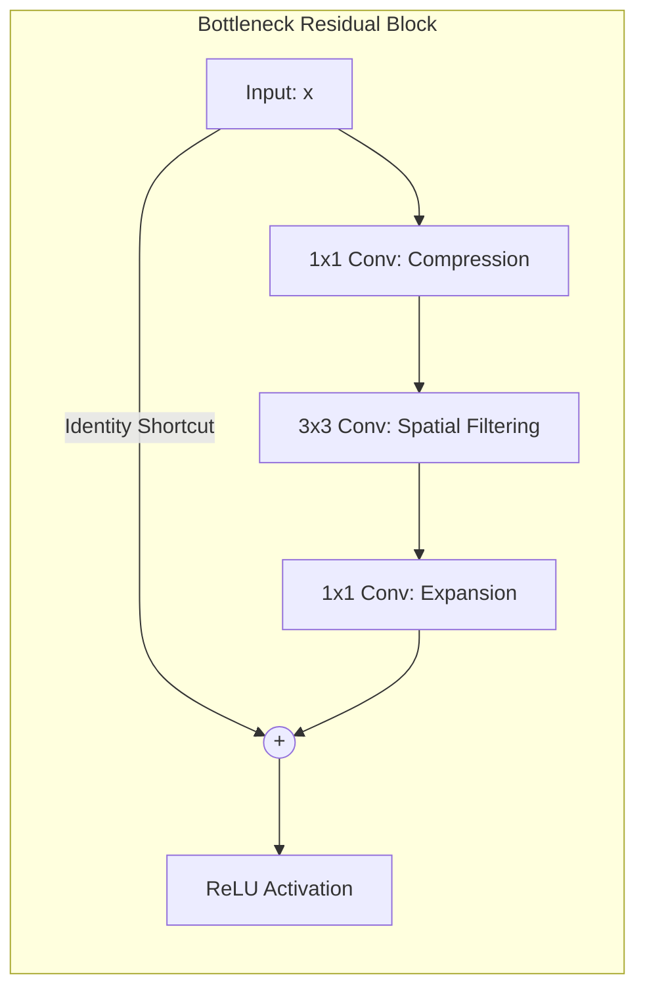
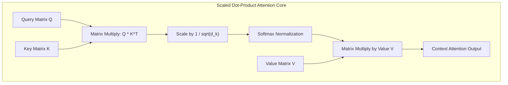

<div class="pixel-banner">
  <div class="pixel-hud-row">
    <div class="pixel-tag"><span class="pixel-indicator"></span>NEURAL_CORE // SOTA_ARCHITECTURES</div>
    <div class="pixel-meta-right">LVL_10 // ATTENTION_TRANSFORMERS</div>
  </div>
  <div class="pixel-main-content">
    <div class="pixel-avatar">💎</div>
    <div class="pixel-headings">
      <div class="pixel-title-badge">LEVEL 10 // ADVANCED ARCHITECTURES & TRANSFORMERS</div>
      <div class="pixel-subtitle">RESIDUAL HIGHWAYS • MULTI-HEAD ATTENTION • VISION TRANSFORMER (ViT) • SWIN • CONVNEXT</div>
    </div>
    <div class="pixel-sparklines">
      <div class="pixel-bar" style="--h: 70%"></div>
      <div class="pixel-bar" style="--h: 85%"></div>
      <div class="pixel-bar" style="--h: 92%"></div>
      <div class="pixel-bar" style="--h: 88%"></div>
      <div class="pixel-bar" style="--h: 98%"></div>
      <div class="pixel-bar" style="--h: 100%"></div>
    </div>
  </div>
  <div class="pixel-footer-row">
    <span class="pixel-coord">SYS_ID: #10_TRANSFORMER // PATCH_SIZE: 16x16 // HEADS: 12 // ATTN: SCALED_DOT</span>
    <span class="pixel-status-text">[ SOTA_ACTIVE ]</span>
  </div>
</div>

# Level 10: Advanced Architectures

<div class="notion-callout">
  <div class="notion-callout-icon">💡</div>
  <div class="notion-callout-content">
    Modern computer vision has transcended classical convolutions. By unifying <strong>residual gradient highways</strong> with <strong>multi-head self-attention</strong>, models dynamically attend to global spatial relationships without fixed receptive fields—powering state-of-the-art <strong>Vision Transformers (ViT)</strong>, <strong>Swin</strong>, and modernized <strong>ConvNeXt</strong> architectures.
  </div>
</div>

<div class="notion-card-meta" style="margin-bottom: 2rem;">
  <span class="notion-tag notion-tag-purple">Level 10</span>
  <span class="notion-tag notion-tag-blue">Attention Mechanisms</span>
  <span class="notion-tag notion-tag-green">Vision Transformers</span>
</div>

---

## 34. Deep Residual Networks: Mathematical Foundations

### The Gradient Highway Theorem
Given a sequence of residual units with identity shortcuts:

$$\mathbf{x}_{l+1} = \mathbf{x}_l + \mathcal{F}(\mathbf{x}_l, \mathcal{W}_l)$$

Recursively expanding for any deeper layer $L$:

$$\mathbf{x}_L = \mathbf{x}_l + \sum_{i=l}^{L-1} \mathcal{F}(\mathbf{x}_i, \mathcal{W}_i)$$

By the chain rule of calculus, the gradient of the loss $\mathcal{L}$ with respect to activation $\mathbf{x}_l$ is:

$$\frac{\partial \mathcal{L}}{\partial \mathbf{x}_l} = \frac{\partial \mathcal{L}}{\partial \mathbf{x}_L} \cdot \frac{\partial \mathbf{x}_L}{\partial \mathbf{x}_l} = \frac{\partial \mathcal{L}}{\partial \mathbf{x}_L} \left( \mathbf{I} + \frac{\partial}{\partial \mathbf{x}_l} \sum_{i=l}^{L-1} \mathcal{F}(\mathbf{x}_i, \mathcal{W}_i) \right)$$

* **Why ResNets Never Suffer from Vanishing Gradients:** The term $\mathbf{I}$ (the identity matrix) ensures that gradients from the loss $\frac{\partial \mathcal{L}}{\partial \mathbf{x}_L}$ propagate directly backwards to any arbitrary early layer $\mathbf{x}_l$ **unimpeded**, even if the residual branch weights are near zero ($\frac{\partial \mathcal{F}}{\partial \mathbf{x}_l} \approx 0$).



---

## 35. Scaled Dot-Product Attention: Query, Key, and Value

Self-attention computes dynamic, content-dependent weights connecting every token to every other token in a sequence.



### The Mathematical Formulation
Given an input sequence of tokens projected into Query $\mathbf{Q}$, Key $\mathbf{K}$, and Value $\mathbf{V}$ matrices of dimension $d_k$:

$$\text{Attention}(\mathbf{Q}, \mathbf{K}, \mathbf{V}) = \text{Softmax}\left( \frac{\mathbf{Q} \mathbf{K}^T}{\sqrt{d_k}} \right) \mathbf{V}$$

* **Query ($\mathbf{Q}$):** What a token is searching for.
* **Key ($\mathbf{K}$):** What a token contains / offers.
* **Value ($\mathbf{V}$):** The actual informational content to extract if a Query matches a Key.
* **Why Scale by $\frac{1}{\sqrt{d_k}}$?** For large projection dimensions $d_k$, the dot product $\mathbf{q} \cdot \mathbf{k} = \sum_{i=1}^{d_k} q_i k_i$ grows in variance ($\text{Var} = d_k$). Large dot products push the softmax function into regions of near-zero gradients ($\frac{d\sigma}{dz} \approx 0$). Scaling by $\sqrt{d_k}$ preserves a unit variance distribution ($\text{Var} = 1.0$), ensuring stable gradient flow.

---

## 36. Vision Transformers (ViT: Dosovitskiy et al., 2020)

Vision Transformers eliminate convolutions entirely, adapting the pure NLP Transformer encoder directly to image patches.


### ViT Core Components
1. **Patch Partitioning:** An image $H \times W \times C$ is divided into non-overlapping grid patches of size $P \times P$. The sequence length is:
   $$N = \frac{H \cdot W}{P^2} \quad \left(\text{For } 224 \times 224 \text{ with } P=16, N = 14 \times 14 = \mathbf{196\text{ Tokens}}\right)$$
2. **Linear Patch Projection:** Implemented with optimal GPU efficiency as a single 2D convolution:
   ```python
   self.patch_embed = nn.Conv2d(in_channels=3, out_channels=768, kernel_size=16, stride=16)
   ```
3. **The `[CLS]` Token:** A learnable vector $\mathbf{x}_{\text{class}} \in \mathbb{R}^{1 \times D}$ prepended to the sequence. Since self-attention allows all tokens to communicate globally, the `[CLS]` token aggregates information across all 196 patches to serve as the unified representation for the classification head.
4. **Inductive Bias vs Data Scale:** CNNs have built-in inductive biases (translation equivariance, locality). ViTs have **almost zero spatial inductive bias**—they must *learn* 2D geometry from data. Consequently, ViT underperforms ResNet when trained on small datasets (ImageNet-1K from scratch), but drastically outperforms CNNs when pretrained on massive datasets (JFT-300M, LAION-5B).

---

## 37. Swin Transformer & ConvNeXt

### 1. Swin Transformer: Hierarchical Shifted Windows (Liu et al., 2021)
Standard ViT computes global self-attention across all $N$ tokens, resulting in **quadratic computational complexity** $\mathcal{O}(N^2) = \mathcal{O}(H^2 W^2)$, making dense high-resolution vision tasks (segmentation, detection) computationally prohibitive.

**Swin (Shifted Window) Transformer** introduces:
* **Local Window Self-Attention:** Attention is computed only within local $M \times M$ windows ($M=7$), achieving **linear complexity** $\mathcal{O}(M^2 \cdot N) = \mathcal{O}(N)$.
* **Shifted Window Partitioning:** Alternates window coordinates between successive layers, enabling cross-window communication across the entire image.
* **Hierarchical Multiscale Feature Maps:** Merges patches as depth increases, outputting feature maps at $\frac{1}{4}, \frac{1}{8}, \frac{1}{16}, \frac{1}{32}$ resolutions—enabling drop-in replacement for CNNs in YOLO and Mask R-CNN backbones.

### 2. ConvNeXt: Modernizing Convolutions (Liu et al., 2022)
ConvNeXt systematically re-engineered a standard ResNet-50 using design principles discovered in Vision Transformers:
1. **Macro Design:** Altered stage compute ratios ($3:3:9:3$) and patchified the stem layer with a $4 \times 4$ stride-4 convolution.
2. **Inverted Bottleneck:** Placed a large channel dimension inside the block (expanding by $4\times$) and small dimensions outside.
3. **Large Receptive Field:** Replaced $3 \times 3$ standard kernels with **$7 \times 7$ depthwise convolutions**.
4. **Micro Design:** Replaced BatchNorm with **LayerNorm**, switched from ReLU to **GELU**, and drastically reduced the number of activation and normalization layers.

* **Result:** ConvNeXt achieved ViT-level accuracy while retaining the high inference throughput, hardware simplicity, and linear complexity of pure convolutions.

---

### Python Implementation: Complete Vision Transformer Patch Embedding & Attention Block

```python
import torch
import torch.nn as nn

class MultiHeadSelfAttention(nn.Module):
    def __init__(self, embed_dim: int = 768, num_heads: int = 12):
        super().__init__()
        self.num_heads = num_heads
        self.head_dim = embed_dim // num_heads
        self.scale = 1.0 / (self.head_dim ** 0.5)

        self.qkv = nn.Linear(embed_dim, embed_dim * 3)
        self.proj = nn.Linear(embed_dim, embed_dim)

    def forward(self, x: torch.Tensor) -> torch.Tensor:
        B, N, C = x.shape
        # Project and reshape into [B, N, 3, num_heads, head_dim]
        qkv = self.qkv(x).reshape(B, N, 3, self.num_heads, self.head_dim).permute(2, 0, 3, 1, 4)
        q, k, v = qkv[0], qkv[1], qkv[2] # Each shape: [B, num_heads, N, head_dim]

        # Scaled Dot-Product Attention
        attn = (q @ k.transpose(-2, -1)) * self.scale
        attn = torch.softmax(attn, dim=-1)

        # Context aggregation and linear projection
        out = (attn @ v).transpose(1, 2).reshape(B, N, C)
        return self.proj(out)

class ViTBlock(nn.Module):
    def __init__(self, embed_dim: int = 768, num_heads: int = 12, mlp_ratio: float = 4.0):
        super().__init__()
        self.norm1 = nn.LayerNorm(embed_dim)
        self.attn = MultiHeadSelfAttention(embed_dim, num_heads)
        self.norm2 = nn.LayerNorm(embed_dim)
        self.mlp = nn.Sequential(
            nn.Linear(embed_dim, int(embed_dim * mlp_ratio)),
            nn.GELU(),
            nn.Linear(int(embed_dim * mlp_ratio), embed_dim)
        )

    def forward(self, x: torch.Tensor) -> torch.Tensor:
        # Pre-LN residual connections
        x = x + self.attn(self.norm1(x))
        x = x + self.mlp(self.norm2(x))
        return x

if __name__ == "__main__":
    # Test batch of 2 image patch sequences (Batch=2, Sequence=197 tokens, Dim=768)
    token_sequence = torch.randn(2, 197, 768)
    vit_layer = ViTBlock(embed_dim=768, num_heads=12)
    output_tokens = vit_layer(token_sequence)
    print(f"Input Token Shape:  {token_sequence.shape}")
    print(f"Output Token Shape: {output_tokens.shape}")
```
