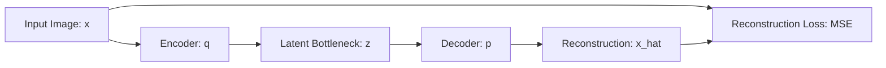
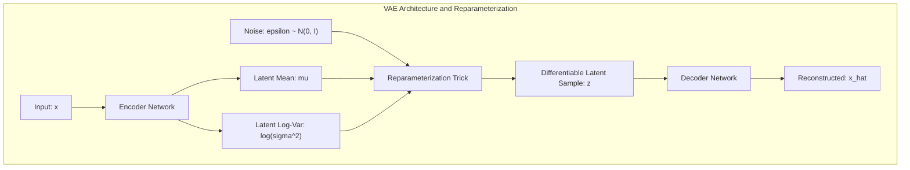
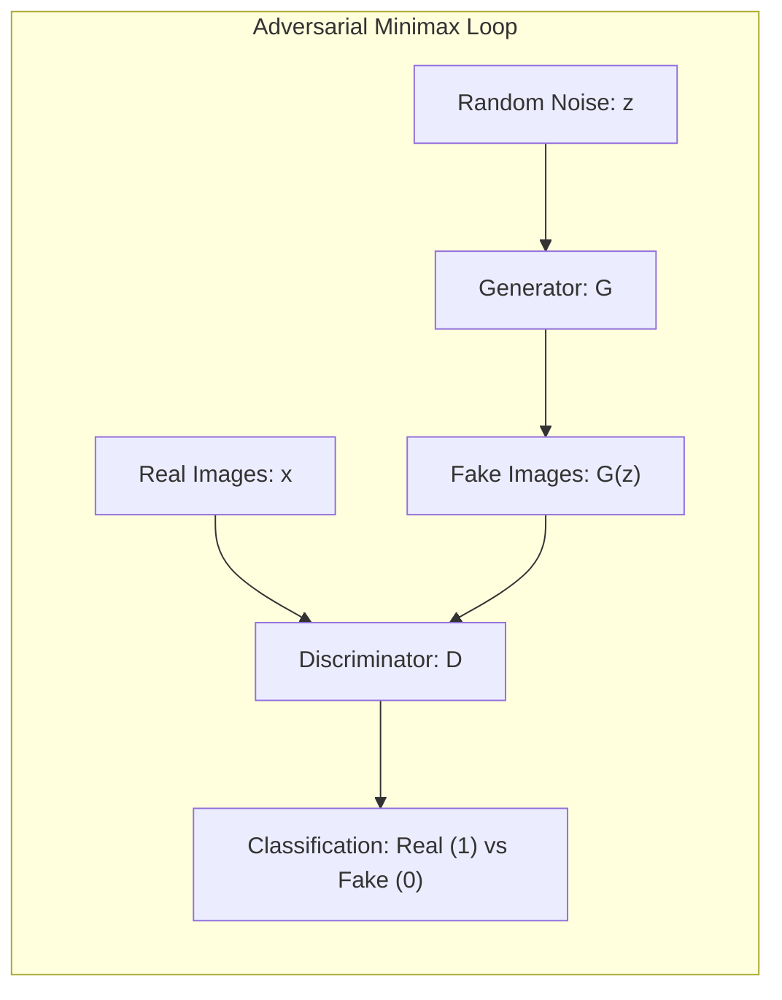
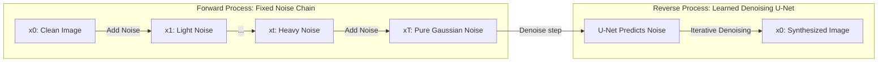

<div class="pixel-banner">
  <div class="pixel-hud-row">
    <div class="pixel-tag"><span class="pixel-indicator"></span>NEURAL_CORE // GENERATIVE_ENGINE</div>
    <div class="pixel-meta-right">LVL_11 // LATENT_DIFFUSION</div>
  </div>
  <div class="pixel-main-content">
    <div class="pixel-avatar">🎨</div>
    <div class="pixel-headings">
      <div class="pixel-title-badge">LEVEL 11 // GENERATIVE DEEP LEARNING</div>
      <div class="pixel-subtitle">LATENT BOTTLENECK • REPARAMETERIZATION TRICK • GAN MINIMAX • DDPM REVERSE DENOISING</div>
    </div>
    <div class="pixel-sparklines">
      <div class="pixel-bar" style="--h: 30%"></div>
      <div class="pixel-bar" style="--h: 60%"></div>
      <div class="pixel-bar" style="--h: 80%"></div>
      <div class="pixel-bar" style="--h: 70%"></div>
      <div class="pixel-bar" style="--h: 90%"></div>
      <div class="pixel-bar" style="--h: 100%"></div>
    </div>
  </div>
  <div class="pixel-footer-row">
    <span class="pixel-coord">SYS_ID: #11_GEN // DDPM_TIMESTEPS: 1000 // NOISE_SCHED: COSINE // SAMPLER: DDIM</span>
    <span class="pixel-status-text">[ SYNTHESIZING ]</span>
  </div>
</div>

# Level 11: Generative Deep Learning

<div class="notion-callout">
  <div class="notion-callout-icon">💡</div>
  <div class="notion-callout-content">
    While discriminative models learn the conditional distribution $P(Y|X)$, <strong>generative deep learning</strong> models the high-dimensional data distribution $P(X)$. By mastering the underlying density manifold, generative models can reconstruct corrupted signals, interpolate across latent geometries, and synthesize photorealistic imagery via <strong>Variational Autoencoders</strong>, <strong>Adversarial Networks</strong>, and <strong>Denoising Diffusion Models</strong>.
  </div>
</div>

<div class="notion-card-meta" style="margin-bottom: 2rem;">
  <span class="notion-tag notion-tag-purple">Level 11</span>
  <span class="notion-tag notion-tag-blue">Probabilistic Modeling</span>
  <span class="notion-tag notion-tag-green">Generative Vision</span>
</div>

---

## 39. Autoencoders (AE) & Denoising Autoencoders (DAE)

An Autoencoder enforces an informational bottleneck, forcing the network to compress inputs into a low-dimensional latent code $\mathbf{z} \in \mathbb{R}^d$ before reconstructing them.



* **Denoising Autoencoders (DAE):** Standard autoencoders can cheat by memorizing an identity mapping if the bottleneck is too wide. DAEs corrupt the input with Gaussian noise or random zero-masking $\tilde{\mathbf{x}} \sim q(\tilde{\mathbf{x}}|\mathbf{x})$ and force the network to reconstruct the *clean* original $\mathbf{x}$. This requires the model to project arbitrary off-manifold noise vectors back onto the true data manifold.

---

## 40. Variational Autoencoders (VAE: Kingma & Welling, 2013)

Standard autoencoders map samples to discrete points in latent space, leaving "holes" where sampling produces meaningless garbage. **Variational Autoencoders (VAEs)** map inputs to the statistical parameters of a continuous probability distribution: **mean ($\boldsymbol{\mu}$)** and **log-variance ($\log \boldsymbol{\sigma}^2$)**.



### 1. The Reparameterization Trick
Backpropagation cannot compute gradients through stochastic sampling operations ($z \sim \mathcal{N}(\boldsymbol{\mu}, \boldsymbol{\sigma}^2)$). The **reparameterization trick** isolates the non-differentiable stochasticity into an auxiliary independent random noise vector $\boldsymbol{\epsilon} \sim \mathcal{N}(\mathbf{0}, \mathbf{I})$:

$$\mathbf{z} = \boldsymbol{\mu} + \boldsymbol{\sigma} \odot \boldsymbol{\epsilon} = \boldsymbol{\mu} + \exp\left(\frac{1}{2} \log \boldsymbol{\sigma}^2\right) \odot \boldsymbol{\epsilon}$$

This reformulation makes $\mathbf{z}$ a deterministic, differentiable function of $\boldsymbol{\mu}$ and $\boldsymbol{\sigma}$, enabling direct end-to-end backpropagation.

### 2. The ELBO Objective (Evidence Lower Bound)
$$\mathcal{L}_{\text{VAE}} = \mathcal{L}_{\text{reconstruction}}(\mathbf{x}, \hat{\mathbf{x}}) + \mathcal{L}_{\text{KL}}(q_\phi(\mathbf{z}|\mathbf{x}) \,\|\, p(\mathbf{z}))$$

* **Reconstruction Loss:** Ensures high-fidelity image reproduction (MSE or BCE).
* **Kullback-Leibler (KL) Divergence Penalty:** Forces the encoder's predicted latent distributions to match a standard multivariate Gaussian prior $\mathcal{N}(\mathbf{0}, \mathbf{I})$, ensuring the latent space is continuous, smooth, and easily sampleable:

    $$\mathcal{L}_{\text{KL}} = -\frac{1}{2} \sum_{j=1}^d \left( 1 + \log(\sigma_j^2) - \mu_j^2 - \sigma_j^2 \right)$$

---

## 41. Generative Adversarial Networks (GANs: Goodfellow et al., 2014)

GANs cast generative modeling as a **two-player zero-sum minimax game** between two competing networks:
1. **The Generator ($G$):** Takes a random noise vector $\mathbf{z} \sim p_z(\mathbf{z})$ and attempts to synthesize realistic images $G(\mathbf{z})$ that fool the Discriminator.
2. **The Discriminator ($D$):** A binary classifier trained to distinguish real images $\mathbf{x} \sim p_{\text{data}}$ from synthetic counterfeits $G(\mathbf{z})$.

$$\min_G \max_D V(D, G) = \mathbb{E}_{\mathbf{x} \sim p_{\text{data}}}[\log D(\mathbf{x})] + \mathbb{E}_{\mathbf{z} \sim p_z}[\log(1 - D(G(\mathbf{z})))]$$



### Classic GAN Failure Modes
* **Mode Collapse:** The generator discovers a single output sample that reliably fools the discriminator and produces only that image repeatedly, collapsing generative diversity.
* **Vanishing Gradients for $G$:** If the discriminator becomes too proficient too early ($D(\mathbf{x}) \rightarrow 1, D(G(\mathbf{z})) \rightarrow 0$), the generator's gradient saturates to zero. In practice, generators are trained with the non-saturating objective: $\max_G \mathbb{E}[\log D(G(\mathbf{z}))]$.

---

## 42. Denoising Diffusion Probabilistic Models (DDPM: Ho et al., 2020)

Diffusion models have superseded GANs as the state-of-the-art generative paradigm (powering Stable Diffusion, Midjourney, and DALL-E 3) due to their superior training stability and coverage of diverse modes.



### 1. The Forward Process (Noise Addition)
Gradually adds Gaussian noise over $T=1000$ discrete timesteps according to a scheduled variance schedule $\beta_1, \dots, \beta_T$:

$$q(\mathbf{x}_t | \mathbf{x}_{t-1}) = \mathcal{N}\left(\mathbf{x}_t; \sqrt{1 - \beta_t}\mathbf{x}_{t-1}, \beta_t \mathbf{I}\right)$$

Using the reparameterization shortcut, $\mathbf{x}_t$ at any arbitrary timestep $t$ can be sampled **in a single step** directly from $\mathbf{x}_0$:

$$\alpha_t = 1 - \beta_t, \quad \bar{\alpha}_t = \prod_{s=1}^t \alpha_s$$

$$\mathbf{x}_t = \sqrt{\bar{\alpha}_t} \mathbf{x}_0 + \sqrt{1 - \bar{\alpha}_t} \boldsymbol{\epsilon} \quad \text{where } \boldsymbol{\epsilon} \sim \mathcal{N}(\mathbf{0}, \mathbf{I})$$

### 2. The Reverse Process & The Simplified Training Objective
A time-conditioned **U-Net architecture** with cross-attention predicts the exact Gaussian noise vector $\boldsymbol{\epsilon}$ added to $\mathbf{x}_t$:

$$\mathcal{L}_{\text{simple}}(\theta) = \mathbb{E}_{t, \mathbf{x}_0, \boldsymbol{\epsilon}} \left[ \left\| \boldsymbol{\epsilon} - \boldsymbol{\epsilon}_\theta(\mathbf{x}_t, t) \right\|^2 \right]$$

During inference, sampling begins with pure isotropic noise $\mathbf{x}_T \sim \mathcal{N}(\mathbf{0}, \mathbf{I})$ and progressively subtracts predicted noise over $T$ steps, gradually revealing a clean synthetic image $\mathbf{x}_0$.

---

### Python Implementation: Complete Variational Autoencoder (VAE) Module

```python
import torch
import torch.nn as nn

class VariationalAutoencoder(nn.Module):
    def __init__(self, in_features: int = 784, latent_dim: int = 32):
        super().__init__()
        # Encoder
        self.encoder = nn.Sequential(
            nn.Linear(in_features, 256),
            nn.ReLU(inplace=True),
            nn.Linear(256, 128),
            nn.ReLU(inplace=True)
        )
        self.fc_mu = nn.Linear(128, latent_dim)
        self.fc_logvar = nn.Linear(128, latent_dim)

        # Decoder
        self.decoder = nn.Sequential(
            nn.Linear(latent_dim, 128),
            nn.ReLU(inplace=True),
            nn.Linear(128, 256),
            nn.ReLU(inplace=True),
            nn.Linear(256, in_features),
            nn.Sigmoid() # Scale outputs to [0, 1]
        )

    def reparameterize(self, mu: torch.Tensor, logvar: torch.Tensor) -> torch.Tensor:
        std = torch.exp(0.5 * logvar)
        eps = torch.randn_like(std)
        return mu + eps * std

    def forward(self, x: torch.Tensor) -> tuple[torch.Tensor, torch.Tensor, torch.Tensor]:
        h = self.encoder(x)
        mu = self.fc_mu(h)
        logvar = self.fc_logvar(h)
        z = self.reparameterize(mu, logvar)
        reconstruction = self.decoder(z)
        return reconstruction, mu, logvar

def vae_loss_function(recon_x: torch.Tensor, x: torch.Tensor, mu: torch.Tensor, logvar: torch.Tensor) -> torch.Tensor:
    # 1. Reconstruction Loss (Binary Cross Entropy)
    recon_loss = nn.functional.binary_cross_entropy(recon_x, x, reduction='sum')
    # 2. Analytical KL Divergence to Standard Normal
    kl_divergence = -0.5 * torch.sum(1 + logvar - mu.pow(2) - logvar.exp())
    return recon_loss + kl_divergence

if __name__ == "__main__":
    # Test batch of 4 flattened images (e.g., MNIST 28x28 = 784)
    dummy_images = torch.rand(4, 784)
    vae = VariationalAutoencoder()
    recon, mu, logvar = vae(dummy_images)
    total_loss = vae_loss_function(recon, dummy_images, mu, logvar)
    print(f"Reconstructed Tensor Shape: {recon.shape}")
    print(f"Latent Mean Vector Shape:   {mu.shape}")
    print(f"Total VAE Loss (ELBO):      {total_loss.item():.2f}")
```
