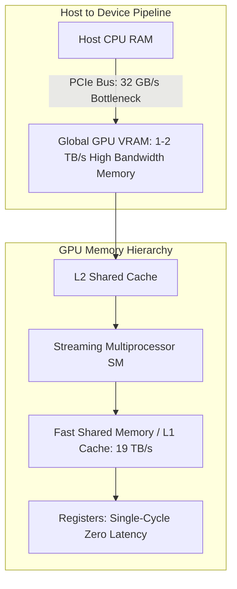
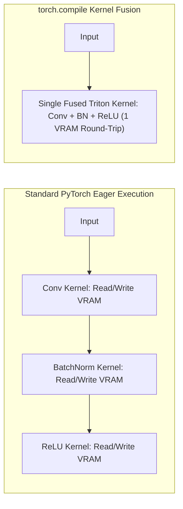
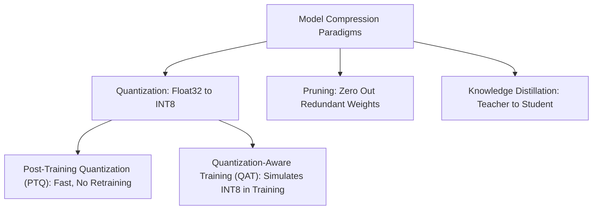
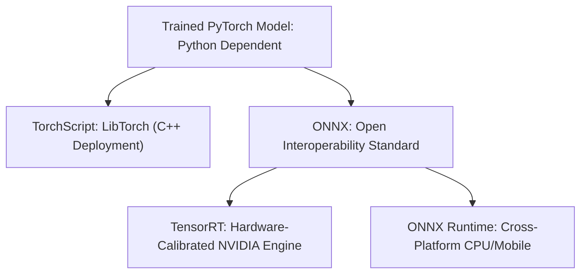

<div class="pixel-banner">
  <div class="pixel-hud-row">
    <div class="pixel-tag"><span class="pixel-indicator"></span>NEURAL_CORE // INFERENCE_ENGINE</div>
    <div class="pixel-meta-right">LVL_12 // PRODUCTION_COMPRESSION</div>
  </div>
  <div class="pixel-main-content">
    <div class="pixel-avatar">⚡</div>
    <div class="pixel-headings">
      <div class="pixel-title-badge">LEVEL 12 // DEEP LEARNING ENGINEERING</div>
      <div class="pixel-subtitle">CUDA MEMORY • TORCH.COMPILE • INT8 QUANTIZATION • KNOWLEDGE DISTILLATION • ONNX / TENSORRT</div>
    </div>
    <div class="pixel-sparklines">
      <div class="pixel-bar" style="--h: 60%"></div>
      <div class="pixel-bar" style="--h: 80%"></div>
      <div class="pixel-bar" style="--h: 95%"></div>
      <div class="pixel-bar" style="--h: 70%"></div>
      <div class="pixel-bar" style="--h: 90%"></div>
      <div class="pixel-bar" style="--h: 100%"></div>
    </div>
  </div>
  <div class="pixel-footer-row">
    <span class="pixel-coord">SYS_ID: #12_DL_ENG // QUANT: INT8_PTQ // RUNTIME: ONNX_RUNTIME // LATENCY: 2.1ms</span>
    <span class="pixel-status-text">[ COMPILED ]</span>
  </div>
</div>

# Level 12: Deep Learning Engineering

<div class="notion-callout">
  <div class="notion-callout-icon">💡</div>
  <div class="notion-callout-content">
    Designing state-of-the-art vision models is only half the battle. <strong>Deep Learning Engineering</strong> bridges theoretical architectures to production systems by optimizing <strong>CUDA memory transfers</strong>, fusing GPU computational kernels with <strong><code>torch.compile</code></strong>, compressing weights via <strong>INT8 Quantization</strong>, and serializing models into universal runtimes (<strong>TorchScript, ONNX, TensorRT</strong>).
  </div>
</div>

<div class="notion-card-meta" style="margin-bottom: 2rem;">
  <span class="notion-tag notion-tag-purple">Level 12</span>
  <span class="notion-tag notion-tag-blue">GPU Systems</span>
  <span class="notion-tag notion-tag-green">Edge Compression</span>
</div>

---

## 43. GPU Architecture & CUDA Memory Hierarchy

A GPU consists of multiple **Streaming Multiprocessors (SMs)** executing thousands of arithmetic threads in lockstep via **Single Instruction, Multiple Data (SIMD)** architectures.



### The Host-to-Device Memory Transfer Bottleneck
The PCIe bus (e.g., PCIe Gen 4 at $32\text{ GB/s}$) is orders of magnitude slower than on-chip GPU HBM memory ($>1000\text{ GB/s}$). If training is memory-bound due to slow host disk I/O, the GPU SMs sit idle ($0\%\text{ GPU-util}$ in `nvidia-smi`).
* **Page-Locked (Pinned) Memory:** Allocates CPU tensors in non-swappable physical RAM (`pin_memory=True` in DataLoader). Allows the GPU's Direct Memory Access (DMA) controller to stream tensors directly into VRAM without CPU intervention.
* **Non-Blocking Copies:** `tensor.to(device, non_blocking=True)` overlaps host-to-device transfers with active GPU kernel computation.

---

## 44. PyTorch Performance Optimization: `torch.compile`

Introduced in PyTorch 2.0, `torch.compile(model)` uses a JIT compiler (TorchDynamo and the Inductor backend) to generate optimized Triton GPU kernels.



* **Vertical Kernel Fusion:** Instead of writing intermediate activations back to high-bandwidth VRAM between successive operations, fused kernels hold intermediate tensors directly in high-speed GPU registers/L1 cache, eliminating redundant memory round-trips.

```python
# One-line 20-30% speedup on modern GPUs (Ampere / Ada / Hopper)
optimized_model = torch.compile(model, mode="reduce-overhead")
```

---

## 45. Model Compression: Quantization & Knowledge Distillation



### 1. Post-Training Quantization (PTQ) vs QAT
Quantization maps 32-bit floating-point parameters ($W \in \mathbb{R}$) to 8-bit integers ($q \in [-128, 127]$):

$$q = \text{round}\left( \frac{x}{S} \right) + Z$$

$$x \approx S \cdot (q - Z)$$

Where $S$ is a floating-point **Scale Factor** and $Z$ is the integer **Zero-Point**.

* **Memory Savings:** Reduces model memory footprint by exactly **$4\times$** (e.g., a 100MB model shrinks to 25MB).
* **Throughput:** INT8 integer vector matrix operations run on dedicated Tensor Core DP4A / INT8 engines at up to **$2\times$ to $4\times$ higher FPS**.
* **Quantization-Aware Training (QAT):** Inserts fake-quantization operators during the forward pass of training to model rounding noise, allowing the network to adapt its weights to prevent precision loss.

### 2. Knowledge Distillation (Hinton et al., 2015)
Compresses a massive, highly accurate "Teacher" network (e.g., ViT-Large) into a lightweight "Student" network (e.g., MobileNet). The student is trained on two simultaneous objectives:

$$\mathcal{L}_{\text{distill}} = (1 - \alpha) \mathcal{L}_{\text{CE}}(\mathbf{z}_s, \mathbf{y}) + \alpha T^2 \mathcal{L}_{\text{KL}}\left( \text{Softmax}\left(\frac{\mathbf{z}_s}{T}\right) \,\Big\|\, \text{Softmax}\left(\frac{\mathbf{z}_t}{T}\right) \right)$$

* **The Temperature Parameter ($T > 1$):** Softens the probability distribution. Instead of hard predictions, the student learns "dark knowledge"—the subtle relative probabilities assigned by the teacher to incorrect classes (e.g., that an image of a dog resembles a cat far more than it resembles a freight truck).

---

## 46. Model Serialization & Export Formats



### 1. TorchScript (`torch.jit.trace`)
Exports the PyTorch graph into an intermediate representation runnable in pure C++ (`libtorch`) environments without requiring a Python interpreter.
```python
model.eval()
dummy_input = torch.randn(1, 3, 224, 224)
traced_model = torch.jit.trace(model, dummy_input)
traced_model.save("model_traced.pt")
```

### 2. Open Neural Network Exchange (ONNX)
ONNX is the industry open standard for machine learning interoperability, allowing models trained in PyTorch to be served on ONNX Runtime, OpenVINO, Apple CoreML, or compiled into **NVIDIA TensorRT** execution engines.

```python
import torch

def export_onnx_model(model: torch.nn.Module, export_path: str = "vision_model.onnx"):
    model.eval()
    dummy_input = torch.randn(1, 3, 224, 224)
    
    torch.onnx.export(
        model,
        dummy_input,
        export_path,
        export_params=True,
        opset_version=17,
        do_constant_folding=True,
        input_names=["input"],
        output_names=["output"],
        dynamic_axes={
            "input": {0: "batch_size"}, # Allow dynamic batch sizes
            "output": {0: "batch_size"}
        }
    )
    print(f"Model exported successfully to {export_path}")
```
