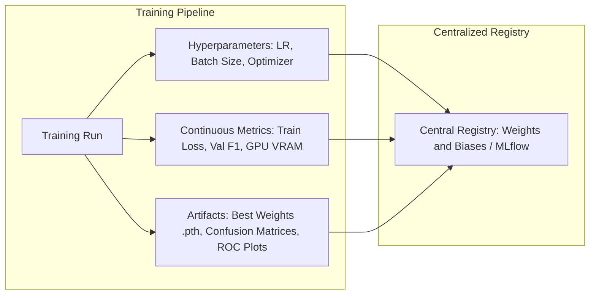
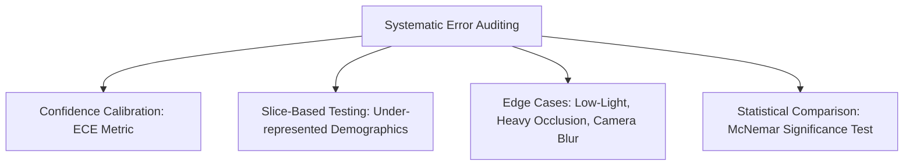
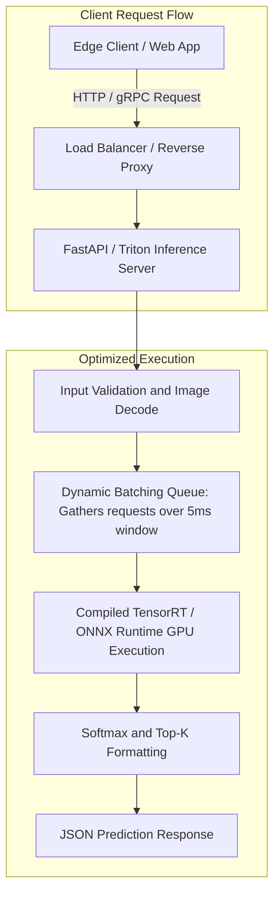

<div class="pixel-banner">
  <div class="pixel-hud-row">
    <div class="pixel-tag"><span class="pixel-indicator"></span>NEURAL_CORE // PRODUCTION_SYSTEMS</div>
    <div class="pixel-meta-right">LVL_13 // SERVING_MONITORING</div>
  </div>
  <div class="pixel-main-content">
    <div class="pixel-avatar">🚀</div>
    <div class="pixel-headings">
      <div class="pixel-title-badge">LEVEL 13 // EXPERIMENTATION & PRODUCTION SYSTEMS</div>
      <div class="pixel-subtitle">MLFLOW / WANDB • DETERMINISTIC REPRODUCIBILITY • TRITON SERVING • DOCKER GPU • DRIFT DETECTION</div>
    </div>
    <div class="pixel-sparklines">
      <div class="pixel-bar" style="--h: 60%"></div>
      <div class="pixel-bar" style="--h: 75%"></div>
      <div class="pixel-bar" style="--h: 90%"></div>
      <div class="pixel-bar" style="--h: 85%"></div>
      <div class="pixel-bar" style="--h: 95%"></div>
      <div class="pixel-bar" style="--h: 100%"></div>
    </div>
  </div>
  <div class="pixel-footer-row">
    <span class="pixel-coord">SYS_ID: #13_PROD // SERVER: FASTAPI_TRITON // DRIFT_METRIC: PSI // SLA: P99 < 15ms</span>
    <span class="pixel-status-text">[ LIVE_SERVING ]</span>
  </div>
</div>

# Level 13: Experimentation & Production

<div class="notion-callout">
  <div class="notion-callout-icon">💡</div>
  <div class="notion-callout-content">
    The final frontier of deep learning is the transition from local Jupyter notebooks to reliable, automated production services. <strong>Production ML (MLOps)</strong> enforces strict <strong>experiment reproducibility</strong>, systematic <strong>error auditing</strong>, low-latency <strong>containerized model serving</strong>, and real-time <strong>data drift monitoring</strong>.
  </div>
</div>

<div class="notion-card-meta" style="margin-bottom: 2rem;">
  <span class="notion-tag notion-tag-purple">Level 13</span>
  <span class="notion-tag notion-tag-blue">MLOps Systems</span>
  <span class="notion-tag notion-tag-green">Cloud & Edge Deployment</span>
</div>

---

## 47. Experiment Tracking & Artifact Registries

Modern deep learning projects test hundreds of permutations across learning rates, architectures, augmentations, and optimizers. Tracking runs manually via text logs is brittle and unsustainable.



### Production Experiment Logging with Weights & Biases (wandb)
```python
import wandb

# 1. Initialize run and log configuration hyperparameter dictionary
wandb.init(
    project="cv-perception-classification",
    config={
        "architecture": "ResNet-50",
        "dataset": "CustomVision-v2",
        "epochs": 100,
        "batch_size": 64,
        "learning_rate": 1e-4,
        "optimizer": "AdamW",
        "weight_decay": 1e-2
    }
)

# 2. Inside training loop: log scalar metrics and visual artifacts
wandb.log({
    "train/loss": loss.item(),
    "val/accuracy_top1": top1_acc,
    "val/accuracy_top5": top5_acc,
    "system/epoch": epoch
})

# 3. Save best model artifact to registry
artifact = wandb.Artifact('best-model-checkpoint', type='model')
artifact.add_file('best_model.pth')
wandb.log_artifact(artifact)
wandb.finish()
```

---

## 48. Reproducibility & Deterministic Execution

Deep learning algorithms are inherently stochastic: pseudo-random number generators (PRNGs) control weight initialization, DataLoader shuffling, dropout masks, and augmentation parameters. Furthermore, cuDNN CUDA algorithms choose non-deterministic floating-point accumulation routines for maximum speed.

### Canonical Seed Locking Routine
```python
import os
import random
import numpy as np
import torch

def enforce_full_reproducibility(seed: int = 42):
    """Guarantees bit-level identical outputs across identical hardware."""
    random.seed(seed)
    os.environ['PYTHONHASHSEED'] = str(seed)
    np.random.seed(seed)
    torch.manual_seed(seed)
    torch.cuda.manual_seed(seed)
    torch.cuda.manual_seed_all(seed) # Multi-GPU

    # Enforce deterministic CUDA convolution algorithms
    torch.backends.cudnn.deterministic = True
    torch.backends.cudnn.benchmark = False
    
    # Restrict PyTorch to deterministic primitives (may throw error on unsupported ops)
    torch.use_deterministic_algorithms(True)
    print(f"Global deterministic seed locked to: {seed}")
```

---

## 49. Model Evaluation & Systematic Error Auditing

Global metrics (like 95% Top-1 Accuracy) obscure catastrophic slice-level failures. Rigorous evaluation breaks down errors into actionable subsets:



### 1. Confidence Calibration & Expected Calibration Error (ECE)
A model that predicts 80% confidence should be correct exactly 80% of the time. Uncalibrated deep networks often exhibit extreme overconfidence (predicting 99.9% probability on samples they misclassify).

$$\text{ECE} = \sum_{m=1}^M \frac{|B_m|}{N} \Big| \text{acc}(B_m) - \text{conf}(B_m) \Big|$$

Calibration can be restored post-hoc on validation logits via **Temperature Scaling**:

$$\hat{p}_i = \max_k \text{Softmax}\left(\frac{\mathbf{z}_i}{T}\right)$$

### 2. Slice-Based Evaluation
Partitions the test dataset into critical domain slices (e.g., daytime vs nighttime driving, rain vs clear weather, close vs distant objects) to verify that performance remains within acceptable safety thresholds across all operational domains.

---

## 50. Production Deployment: Real-Time vs Batch Serving



### Containerization: Production Dockerfile with NVIDIA CUDA Runtime
```dockerfile
# Base image with optimized CUDA 12.1 runtime
FROM nvidia/cuda:12.1.1-runtime-ubuntu22.04

# Install system dependencies and Python 3.11
RUN apt-get update && apt-get install -y --no-install-recommends \
    python3.11 \
    python3-pip \
    libgl1 \
    libglib2.0-0 \
    && rm -rf /var/lib/apt/lists/*

WORKDIR /app

# Install pinned Python dependencies
COPY requirements.txt .
RUN pip install --no-cache-dir -r requirements.txt

# Copy serialized model weights and application server
COPY exported_models/ ./exported_models/
COPY app.py .

EXPOSE 8000

# Start high-performance Uvicorn ASGI server with Gunicorn workers
CMD ["uvicorn", "app:app", "--host", "0.0.0.0", "--port", "8000", "--workers", "4"]
```

### Real-Time FastAPI Serving Implementation
```python
import io
import torch
import torchvision.transforms as T
from PIL import Image
from fastapi import FastAPI, File, UploadFile, HTTPException

app = FastAPI(title="Vision Inference Microservice", version="1.0.0")

# Load model onto GPU once at startup
device = torch.device("cuda" if torch.cuda.is_available() else "cpu")
model = torch.jit.load("exported_models/model_traced.pt", map_location=device)
model.eval()

transform = T.Compose([
    T.Resize(256),
    T.CenterCrop(224),
    T.ToTensor(),
    T.Normalize(mean=[0.485, 0.456, 0.406], std=[0.229, 0.224, 0.225])
])

CLASSES = ["Defect_A", "Defect_B", "Acceptable"]

@app.post("/predict")
async def predict_image(file: UploadFile = File(...)):
    if not file.content_type.startswith("image/"):
        raise HTTPException(status_code=400, detail="Uploaded file is not an image.")

    # Asynchronous read and non-blocking transformation
    image_bytes = await file.read()
    image = Image.open(io.BytesIO(image_bytes)).convert("RGB")
    tensor = transform(image).unsqueeze(0).to(device, non_blocking=True)

    with torch.inference_mode():
        logits = model(tensor)
        probs = torch.softmax(logits, dim=-1)[0]
        conf, pred_idx = torch.max(probs, dim=-1)

    return {
        "predicted_class": CLASSES[pred_idx.item()],
        "confidence": float(round(conf.item(), 4)),
        "device": str(device)
    }
```
