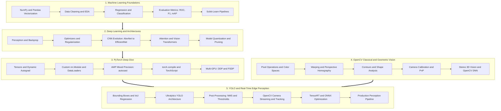

  

    
PERCEPTION_ENGINE // PRODUCTION_KNOWLEDGE_BASE

    
5 CURRICULA // 68 LEVELS // 241 TOPICS

  

  

    
🛰️

    

      
COMPUTER VISION & PERCEPTION ENGINEERING

      
MATHEMATICAL FOUNDATIONS • NEURAL DYNAMICS • PYTORCH CORE • OPENCV • REAL-TIME YOLO

    

    

      

      

      

      

      

      

    

  

  

    SYS_ID: #CV_MASTER // PRODUCTION_READY: TRUE // HARDWARE_ACCELERATED: CUDA_TENSORRT
    [ ONLINE ]
  

# Computer Vision & Perception Engineering

  
💡

  

    <strong>Welcome to the Master Knowledge Base!</strong> This repository houses rigorous, production-grade engineering documentation covering the entire continuum of modern Computer Vision: from statistical machine learning fundamentals to real-time YOLO object detection and edge deployment.
  

<!-- Quick Metrics Ribbon -->

  

    
5

    
Core Curricula

  

  

    
68

    
Engineering Levels

  

  

    
241

    
Technical Topics

  

  

    
100%

    
Production Code

  

---

## 🧭 The End-to-End Perception Learning Pipeline

Follow the unified path from first-principles linear algebra to hardware-accelerated autonomous vision:

  

    STAGE 01
    ML Foundations
    Vectorization, EDA, statistical loss functions & classical algorithms.
  

  

    STAGE 02
    Deep Learning
    Computational graphs, backprop calculus, SOTA CNNs & Vision Transformers.
  

  

    STAGE 03
    PyTorch Engine
    Custom Autograd, CUDA streams, mixed precision AMP & torch.compile.
  

  

    STAGE 04
    OpenCV Vision
    Spatial filters, homography warps, camera calibration & 3D stereo.
  

  

    STAGE 05
    YOLO Perception
    Real-time detection, segmentation, tracking & TensorRT INT8 deployment.
  

---

## 🗂️ Core Technology Tracks

Explore the five fundamental pillars derived from our curriculum roadmaps:

  <!-- Card 1: Machine Learning Foundations -->
  <a href="01-machine-learning-foundations/" class="pixel-card pixel-card-ml">
    

      

        

          
          TRACK 01 // FOUNDATIONS
        

        LVL 12 • 38 TOPICS
      

      

        
📊

        

          <h3 class="pixel-card-title">1. ML FOUNDATIONS</h3>
          NUMPY • PANDAS • SCIKIT-LEARN • EDA
        

      

      

        Mathematical foundations, NumPy & Pandas vectorization, exploratory data analysis, classical algorithms, and Scikit-Learn pipelines.
      

      

        NUMPY
        PANDAS
        SCIKIT-LEARN
        SCIPY
        OPTIMIZERS
      

    

    

      [ FOUNDATIONAL_CORE ]
      EXPLORE TRACK ▸
    

  </a>

  <!-- Card 2: Deep Learning -->
  <a href="02-deep-learning/" class="pixel-card pixel-card-dl">
    

      

        

          
          TRACK 02 // NEURAL_DYNAMICS
        

        LVL 13 • 50 TOPICS
      

      

        
🧠

        

          <h3 class="pixel-card-title">2. DEEP LEARNING</h3>
          AUTOGRAD • CNNS • VIT • GENERATIVE
        

      

      

        Perceptrons to backpropagation, modern CNN architectures (ResNet, ConvNeXt), Vision Transformers (ViT), and generative models.
      

      

        BACKPROP
        RESNET
        VIT
        DIFFUSION
        ONNX
      

    

    

      [ NEURAL_ENGINE ]
      EXPLORE TRACK ▸
    

  </a>

  <!-- Card 3: PyTorch -->
  <a href="03-pytorch/" class="pixel-card pixel-card-pytorch">
    

      

        

          
          TRACK 03 // FRAMEWORK_ENGINE
        

        LVL 14 • 54 TOPICS
      

      

        
🔥

        

          <h3 class="pixel-card-title">3. PYTORCH MASTERY</h3>
          CUDA • AMP • TORCH.COMPILE • DDP
        

      

      

        Tensors, Autograd computational graphs, custom layers, CUDA optimization, AMP mixed precision, DDP/FSDP distributed training, and ONNX export.
      

      

        AUTOGRAD
        CUDA
        AMP
        TORCH.COMPILE
        DDP
      

    

    

      [ COMPUTE_CORE ]
      EXPLORE TRACK ▸
    

  </a>

  <!-- Card 4: OpenCV -->
  <a href="04-opencv/" class="pixel-card pixel-card-opencv">
    

      

        

          
          TRACK 04 // GEOMETRIC_VISION
        

        LVL 15 • 55 TOPICS
      

      

        
👁️

        

          <h3 class="pixel-card-title">4. OPENCV VISION</h3>
          HOMOGRAPHY • CONTOURS • 3D STEREO
        

      

      

        Image filtering, affine/perspective transforms, contours, feature matching (SIFT/ORB), camera calibration, 3D stereo vision, and OpenCV DNN.
      

      

        HOMOGRAPHY
        CONTOURS
        SIFT/ORB
        CAMERA PNP
        3D STEREO
      

    

    

      [ GEOMETRIC_CORE ]
      EXPLORE TRACK ▸
    

  </a>

  <!-- Card 5: YOLO & Perception -->
  <a href="05-yolo-perception/" class="pixel-card pixel-card-yolo">
    

      

        

          
          TRACK 05 // REALTIME_PERCEPTION
        

        LVL 14 • 44 TOPICS
      

      

        
⚡

        

          <h3 class="pixel-card-title">5. YOLO & PERCEPTION</h3>
          ULTRALYTICS • TENSORRT • EDGE_AI
        

      

      

        Real-time object detection, Ultralytics workflows, multi-task segmentation & pose, TensorRT FP16/INT8 acceleration, and 5 capstone projects.
      

      

        YOLOV8/V11
        NMS
        MAP@50:95
        TENSORRT
        DEEPSTREAM
      

    

    

      [ SOTA_DETECTION ]
      EXPLORE TRACK ▸
    

  </a>

---

## ⚡ Core Engineering Tenets

  

    01 // FIRST PRINCIPLES
    <h4 class="pixel-triad-title">Mathematically Rigorous</h4>
    

      Every architecture is anchored with exact analytical formulations, matrix dimensions, loss functions, and multivariate backprop derivations.
    

  

  

    02 // SCRIPTED IMPLEMENTATIONS
    <h4 class="pixel-triad-title">Zero Placeholder Code</h4>
    

      No hand-waving or pseudocode. Every concept includes end-to-end executable Python scripts using clean PyTorch, NumPy, or OpenCV idioms.
    

  

  

    03 // REAL-WORLD RUNTIMES
    <h4 class="pixel-triad-title">Hardware Acceleration</h4>
    

      Engineered for real GPUs: page-locked pinned memory, mixed precision (FP16/BF16), INT8 quantization, and TensorRT deployment.
    

  

---

## 🗺️ Master Curriculum Roadmap

---

## 📚 Curriculum Breakdown at a Glance

=== "1. ML Foundations"
    | Level | Focus Area | Key Highlights |
    | :--- | :--- | :--- |
    | **L1** | ML Fundamentals | Supervised, Unsupervised, Reinforcement, Datasets, Splits |
    | **L2** | Data Handling | NumPy vectorization, Pandas DataFrames, indexing & slicing |
    | **L3** | Data Preprocessing | Cleaning, One-Hot / Ordinal Encoding, Scaling, Leakage prevention |
    | **L4** | EDA & Statistics | Descriptive stats (IQR, percentiles), correlation heatmaps |
    | **L5** | Regression | Linear, Polynomial, Regularization (Ridge, Lasso, ElasticNet) |
    | **L6** | Classification | Logistic Regression, KNN, Decision Trees, Random Forest, SVM, Naive Bayes |
    | **L7** | Model Evaluation | MAE, RMSE, R², Confusion Matrix, ROC-AUC, Stratified K-Fold |
    | **L8** | Unsupervised | K-Means, Hierarchical, DBSCAN, PCA Dimensionality Reduction |
    | **L9** | Feature Engineering | Interaction features, Polynomial features, RFE, Filter/Wrapper methods |
    | **L10** | Optimization | Batch/Mini-batch SGD, Grid Search, Random Search, Optuna |
    | **L11** | Generalization | Class Imbalance (SMOTE, Class Weights), Systematic Error Analysis |
    | **L12** | Practical ML | Scikit-Learn `Pipeline`, `ColumnTransformer`, Model persistence |

=== "2. Deep Learning"
    | Level | Focus Area | Key Highlights |
    | :--- | :--- | :--- |
    | **L1** | DL Fundamentals | Perceptrons, Multi-layer Perceptrons, Non-linear Activations (ReLU, GELU) |
    | **L2** | NN Training | Forward pass, Backpropagation (Chain Rule), Losses (BCE, CE), Optimizers (AdamW) |
    | **L3** | Building Networks | Hidden layers, Model capacity, Weight initialization (He, Xavier), BatchNorm |
    | **L4** | Regularization | Overfitting, Dropout, Early stopping, Data augmentation, Diagnostics |
    | **L5** | PyTorch Core | Tensors, Autograd, `nn.Module`, `DataLoader`, GPU training loops |
    | **L6** | CNNs | Convolution math, Receptive fields, VGG, Inception, ResNet, MobileNet, EfficientNet |
    | **L7** | Transfer Learning | Pretrained feature extractors, Fine-tuning, Differential learning rates |
    | **L8** | Data & Training | Augmentations (MixUp, CutMix), AMP (FP16), Gradient clipping & accumulation |
    | **L9** | Classification | Top-1 & Top-5 accuracy, Class imbalance, Error diagnostics |
    | **L10** | Advanced Architectures | Skip connections, Multi-Head Attention, Vision Transformers (ViT), Swin, ConvNeXt |
    | **L11** | Generative DL | Autoencoders, VAEs, GANs (DCGAN), Diffusion Models (Forward/Reverse Denoising) |
    | **L12** | DL Engineering | CUDA memory, Mixed precision, Quantization, Pruning, TorchScript, ONNX |
    | **L13** | Production | Experiment tracking (W&B / MLflow), Reproducibility, API serving & Docker |

=== "3. PyTorch Mastery"
    | Level | Focus Area | Key Highlights |
    | :--- | :--- | :--- |
    | **L1** | Fundamentals | Tensors, shapes, views, broadcasting, device transfers (`cpu` vs `cuda`) |
    | **L2** | Autograd | Computational graphs, leaf tensors, `requires_grad`, `.backward()`, `torch.no_grad()` |
    | **L3** | Neural Network API | `nn.Module`, `nn.Linear`, `nn.Conv2d`, `nn.Sequential`, parameter management |
    | **L4** | Data Pipelines | `Dataset`, `DataLoader`, `pin_memory`, `num_workers`, custom `collate_fn` |
    | **L5** | Training Models | Loss functions, Optimizers (AdamW, SGD), Training/Validation loops, evaluation mode |
    | **L6** | Model Management | `state_dict`, saving/loading checkpoints, resuming training, train vs eval modes |
    | **L7** | Transforms | `torchvision.transforms.v2`, custom transform classes, data pipelines |
    | **L8** | CNNs with PyTorch | Implementing custom CNNs, transfer learning with `torchvision.models` |
    | **L9** | Advanced Training | LR Schedulers (`CosineAnnealing`, `OneCycleLR`), AMP (`autocast`, `GradScaler`) |
    | **L10** | GPU & Performance | CUDA synchronization, memory pinning, PyTorch Profiler bottleneck analysis |
    | **L11** | Advanced PyTorch | Custom autograd functions, forward/backward hooks, `torch.einsum` |
    | **L12** | Modern PyTorch | `torch.compile`, Inductor graph capture, TorchScript, DDP, FSDP |
    | **L13** | Optimization & Serve | Dynamic & Static Quantization, Pruning, Knowledge Distillation, ONNX export |
    | **L14** | Ecosystem | `TorchMetrics`, TensorBoard, MLflow, Weights & Biases, reproducibility seeds |

=== "4. OpenCV Classical Vision"
    | Level | Focus Area | Key Highlights |
    | :--- | :--- | :--- |
    | **L1** | Fundamentals | NumPy array image representation, ROI slicing, reading/writing/displaying |
    | **L2** | Color & Ops | BGR, HSV, LAB color spaces, color thresholding masks, drawing primitives |
    | **L3** | Geometry | Affine transformations, 4-point perspective warp, Homography |
    | **L4** | Image Processing | Gaussian/Bilateral blur, CLAHE contrast enhancement, Otsu threshold, Canny edges |
    | **L5** | Contours & Shapes | `findContours`, hierarchy, area, perimeter, bounding boxes, convex hulls |
    | **L6** | Features & Matching | Corners (Harris, Shi-Tomasi), Descriptors (SIFT, ORB), BFMatcher, FLANN, ratio test |
    | **L7** | Video Processing | `VideoCapture`, `VideoWriter`, FPS calculation, MOG2 background subtraction, Optical Flow |
    | **L8** | Object Tracking | Single-object trackers (CSRT, KCF, MOSSE), Multi-object tracking (SORT) |
    | **L9** | Camera & Calibration | Pinhole model, Chessboard calibration, Intrinsic/Extrinsics, `solvePnP` pose |
    | **L10** | 3D Vision | Stereo rectification, disparity maps, disparity-to-depth, 3D point cloud triangulation |
    | **L11** | Advanced Ops | Hough Lines & Circles, Image pyramids, Template matching, Watershed segmentation |
    | **L12** | OCR & Docs | Document scanner pipeline, perspective rectification, Tesseract / EasyOCR integration |
    | **L13** | OpenCV DNN | `cv2.dnn.readNet`, `blobFromImage`, ONNX / Darknet inference, NMS post-processing |
    | **L14** | Performance | ROI vectorization, multi-threaded pipelines, OpenCV CUDA module, FPS optimization |
    | **L15** | Integrations | Zero-copy NumPy ↔ PyTorch tensors, OpenCV + ONNX Runtime, OpenCV + TensorRT |

=== "5. YOLO & Perception"
    | Level | Focus Area | Key Highlights |
    | :--- | :--- | :--- |
    | **L1** | Detection Basics | Bounding box formats (XYXY, XYWH, normalized), IoU calculation & thresholds |
    | **L2** | YOLO Fundamentals | One-stage architecture, Backbone (CSP/Darknet), Neck (PANet), Detection Head |
    | **L3** | YOLO Datasets | Annotation formats (YOLO txt, COCO, VOC), directory layout, `data.yaml` config |
    | **L4** | Training Workflow | Pretrained weights, fine-tuning, Mosaic & MixUp augmentations, hyperparameters |
    | **L5** | Loss Mechanics | Bounding box losses (GIoU, DIoU, CIoU), Classification BCE, Objectness loss |
    | **L6** | Post-Processing | Non-Maximum Suppression (NMS, class-aware vs agnostic), Confidence vs IoU tuning |
    | **L7** | Evaluation | Precision, Recall, F1, PR curves, **mAP@50**, **mAP@50:95**, failure analysis |
    | **L8** | Ultralytics Engine | Python API & CLI workflows, training, validation, inference, and model export |
    | **L9** | Advanced Detection | SAHI image tiling for small objects, crowded object detection, Nano → XLarge models |
    | **L10** | Multi-Task YOLO | Object Detection, Instance Segmentation (masks), Pose (skeletons), Multi-Object Tracking |
    | **L11** | YOLO + OpenCV | Real-time webcam pipeline, bounding-box overlays, live FPS counter, latency profiling |
    | **L12** | Edge Deployment | Export to ONNX, TensorRT engine compilation (FP16/INT8), throughput optimization |
    | **L13** | Production Pipeline | FastAPI endpoints, Docker containers, model versioning, confidence drift monitoring |
    | **L14** | Capstone Projects | 5 progressive portfolio projects (Webcam Detector → Edge AI Perception System) |

---

  
🚀

  

    <strong>Ready to dive in?</strong> Click on any of the technology cards above or navigate using the top tabs to begin reading and writing notes.
  

